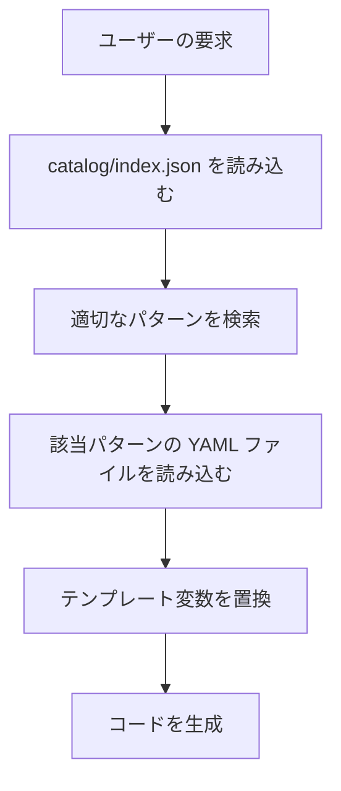

# Pattern Catalog Implementation Summary

このドキュメントは、AI参照用のパターンカタログ実装の概要です。

---

## 🎯 実装の目的

このプロジェクトを「AIが参照する業務アプリ開発カタログ」として機能させるため、以下の改良を実施しました:

1. **機械可読なパターン定義（YAML形式）**
2. **パターンカタログの索引（JSON形式）**
3. **プロジェクト側の採用結果マニフェスト（JSON形式）**
4. **AI向けの利用ガイド**
5. **Pattern Scaffolder CLI ツール（PoC）**
6. **CI/CD統合**

---

## 📁 作成されたファイル

### 1. カタログ定義（catalog/）

```
catalog/
├── index.json                        # パターンカタログの索引
├── README.md                         # カタログの使い方
├── AI_USAGE_GUIDE.md                 # AI向けの詳細ガイド
└── patterns/                         # 個別パターン定義（YAML）
    ├── validation-behavior.yaml      # 入力検証パターン
    ├── transaction-behavior.yaml     # トランザクション管理パターン
    ├── authorization-behavior.yaml   # 認可チェックパターン
    ├── logging-behavior.yaml         # ログ出力パターン
    ├── metrics-behavior.yaml         # メトリクス収集パターン
    ├── idempotency-behavior.yaml     # 冪等性保証パターン
    ├── query-get-list.yaml           # 全件取得クエリパターン
    └── command-create.yaml           # 新規作成コマンドパターン
```

### 2. マニフェストとスキーマ（ルート）

```
├── patterns.manifest.json            # プロジェクトの採用結果
├── patterns.manifest.schema.json     # マニフェストのJSONスキーマ
```

### 3. ツールとスクリプト（scripts/）

```
scripts/
├── pattern-scaffolder.ps1            # Pattern Scaffolder CLI（PoC）
└── validate-catalog.ps1              # カタログ検証スクリプト
```

### 4. CI/CD統合（.github/workflows/）

```
.github/workflows/
└── validate-patterns.yml             # GitHub Actions ワークフロー
```

---

## 🔍 各ファイルの役割

### catalog/index.json

パターンカタログの**単一情報源**。すべてのパターンの索引を提供します。

```json
{
  "version": "v2025.11.0",
  "patterns": [
    {
      "id": "validation-behavior",
      "name": "ValidationBehavior",
      "category": "pipeline-behavior",
      "version": "1.3.0",
      "order_hint": 100,
      "file": "patterns/validation-behavior.yaml",
      "intent": "FluentValidation による入力検証",
      "stability": "stable"
    }
  ]
}
```

### catalog/patterns/*.yaml

各パターンの詳細定義。以下の情報を含みます:

- **基本情報**: id, version, name, category, intent
- **配線情報**: wiring (DI登録、NuGet依存関係)
- **前提条件**: preconditions
- **実装テンプレート**: implementation.template
- **使用例**: example_usage
- **テストケース**: tests (Given-When-Then形式)
- **AI向けガイダンス**: ai_guidance (when_to_use, common_mistakes)
- **エビデンス**: evidence (実装例へのファイルパス)

### patterns.manifest.json

プロジェクトで**採用したパターンの結果**を記録。

```json
{
  "catalog_index": "github:akiramei/blazor-enterprise-architecture-poc/catalog/index.json@v2025.11",
  "selected_patterns": [
    {
      "id": "validation-behavior",
      "version": "1.3.0",
      "mode": "package"
    }
  ],
  "assembly_order": ["Metrics", "Validation", "Authorization", "Transaction", "Logging"]
}
```

### scripts/pattern-scaffolder.ps1

Pattern Scaffolder CLI（PoC版）。以下の機能を提供:

- `validate`: マニフェストの検証
- `list`: 選択されたパターンの一覧表示
- `apply`: パターンの適用（PoC版は未実装）

### catalog/AI_USAGE_GUIDE.md

AI（Claude、ChatGPT等）向けの詳細な利用ガイド。以下を含みます:

- AIの参照フロー
- パターン定義の読み方
- テンプレート変数の置換方法
- common_mistakes の活用方法
- エビデンスのトレーサビリティ

---

## 🤖 AIによる利用方法

### 1. 初回アクセス時



### 2. 推奨プロンプト

ユーザーがAIにこのカタログを使わせる場合:

```
このプロジェクトには catalog/ ディレクトリにパターンカタログがあります。
新機能を実装する際は、必ず以下の手順で進めてください:

1. catalog/index.json を読み込み、適切なパターンを検索
2. 該当パターンの YAML ファイルを読み込み
3. テンプレート変数を置換してコードを生成
4. ai_guidance の common_mistakes を確認
5. evidence のファイルパスを提示

必ず catalog/ を参照し、既存のパターンに従ってコードを生成してください。
```

---

## 📊 パターンの統計

現在実装されているパターン:

- **Pipeline Behaviors**: 6個（Metrics, Validation, Authorization, Idempotency, Transaction, Logging）
- **Query Patterns**: 1個（GetList）
- **Command Patterns**: 1個（Create）

---

## 🔄 バージョン管理

### セマンティックバージョニング

- **Major**: 破壊的変更
- **Minor**: 後方互換性のある機能追加
- **Patch**: バグ修正

### タグ固定

カタログを参照する際は、必ずタグを固定:

```json
{
  "catalog_index": "github:akiramei/blazor-enterprise-architecture-poc/catalog/index.json@v2025.11"
}
```

これにより:
- **再現性**: 同じバージョンのパターンを常に取得
- **安定性**: カタログの更新による影響を受けない
- **トレーサビリティ**: どのバージョンのパターンを使ったかが明確

---

## 🧪 検証方法

### ローカルでの検証

```powershell
# カタログ全体の検証
./scripts/validate-catalog.ps1

# マニフェストの検証
./scripts/pattern-scaffolder.ps1 -Command validate

# 選択されたパターンの一覧表示
./scripts/pattern-scaffolder.ps1 -Command list
```

### CI/CD統合

GitHub Actions で自動検証:

- `.github/workflows/validate-patterns.yml`
- `patterns.manifest.json` または `catalog/**` の変更時に自動実行

---

## 🚀 今後の拡張

### 短期（1-2週間）

1. **追加パターンの実装**
   - query-search（検索・フィルタリング・ページング）
   - command-update（更新）
   - command-delete（削除）
   - command-bulk-operation（一括処理）

2. **Pattern Scaffolder の完全実装**
   - NuGet パッケージの追加
   - テンプレートのコピー
   - DI 配線の自動生成

3. **UI Patterns の追加**
   - Store パターン
   - PageActions パターン
   - Component パターン

### 中期（1-3ヶ月）

1. **Domain Patterns の追加**
   - AggregateRoot パターン
   - ValueObject パターン
   - DomainEvent パターン

2. **dotnet tool 化**
   - `dotnet pattern apply` コマンド
   - `dotnet pattern list` コマンド
   - `dotnet pattern search` コマンド

3. **NuGet パッケージ化**
   - `EnterpriseArchitecture.Patterns.Validation`
   - `EnterpriseArchitecture.Patterns.Transaction`

### 長期（3-6ヶ月）

1. **Visual Studio 拡張**
   - パターン選択UI
   - コード生成ウィザード

2. **AI統合の強化**
   - Claude Code / Copilot との統合
   - プロンプトテンプレートの自動生成

---

## 📄 関連ドキュメント

- **catalog/README.md**: カタログの使い方
- **catalog/AI_USAGE_GUIDE.md**: AI向けの詳細ガイド
- **docs/blazor-guide-package/**: 既存のドキュメント

---

## 🤝 コントリビューション

新しいパターンを追加する場合:

1. `catalog/patterns/` に YAML ファイルを作成
2. `catalog/index.json` にパターンを登録
3. `./scripts/validate-catalog.ps1` で検証
4. プルリクエストを作成

### パターン作成のガイドライン

- **id**: kebab-case（例: `validation-behavior`）
- **version**: セマンティックバージョニング
- **ai_guidance**: AI向けの詳細なガイダンスを含める
- **evidence**: 実装例へのファイルパスを明示
- **tests**: Given-When-Then形式で記述

---

## 📞 サポート

- **GitHub Issues**: https://github.com/akiramei/blazor-enterprise-architecture-poc/issues

---

**実装日: 2025-11-05**
**カタログバージョン: v2025.11.0**
**実装者: Claude Code with Sonnet 4.5**
