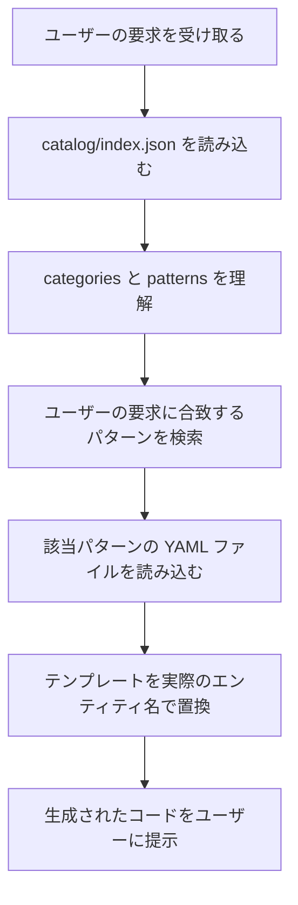

# AI Usage Guide - Pattern Catalog

このドキュメントは、AI（Claude、ChatGPT等）がこのカタログを参照して業務アプリケーションを実装する際のガイドラインです。

---

## 🔧 ランタイム要件（RUNTIME REQUIREMENTS）

> **重要**: このカタログは特定の .NET バージョンを前提としています。
> AIはこのバージョンを**必ず使用**し、勝手に別バージョンを選択しないでください。

| 項目 | 値 |
|------|-----|
| **ターゲットフレームワーク** | `net10.0` |
| **必要なSDKバージョン** | `10.0.100` 以上 |
| **サポート期限** | 2028年11月14日（LTS） |

### プロジェクト作成コマンド

```bash
# Blazor プロジェクト作成
dotnet new blazor --framework net10.0 -n MyApp

# クラスライブラリ作成
dotnet new classlib --framework net10.0 -n MyLib
```

### パッケージバージョン選択

```xml
<!-- ✅ 正しい: .NET 10 対応バージョンを使用 -->
<PackageReference Include="Microsoft.EntityFrameworkCore" Version="10.0.0" />
<PackageReference Include="Microsoft.AspNetCore.Components.Web" Version="10.0.0" />

<!-- ❌ 誤り: 古いバージョンを使用 -->
<PackageReference Include="Microsoft.EntityFrameworkCore" Version="8.0.11" />
```

### AIへの注意事項

```
⚠️ 禁止事項:
- 「デフォルトの .NET バージョンを使用する」という判断
- 「ユーザーの環境に合わせて net8.0 を使用する」という判断
- パッケージバージョンを確認せずに古いバージョンを使用

✅ 必須事項:
- 常に net10.0 を使用
- パッケージは 10.x バージョンを選択
- バージョン情報は catalog/index.json の runtime_requirements を参照
```

---

## 🚨 実装前に必ず読むこと（MUST READ）

**独自実装による手戻りを防ぐため、以下の手順を必ず実行してください。**

> **⚠️ まず [COMMON_MISTAKES.md](COMMON_MISTAKES.md) を読んでください**
>
> 頻出する実装ミス（SaveChangesAsync重複、Value Object比較、Boundary判定など）がまとまっています。

### なぜカタログ参照が必須なのか

このプロジェクトは MediatR + FluentValidation + Pipeline Behaviors を使用しています。
カタログを参照せずに実装すると、以下の問題が発生します：

| よくある失敗 | 原因 | 結果 |
|-------------|------|------|
| 独自CQRS実装 | MediatRの存在を知らない | 全面的な書き直し |
| DIライフタイム不一致 | Singleton/Scoped混在 | 実行時エラー |
| HandleAsyncメソッド名 | MediatRはHandle | コンパイルエラー |
| SaveChangesAsync呼び出し | TransactionBehaviorが自動実行 | 二重保存 |

### 実装前チェックリスト

```
□ catalog/index.json を読んだか？
□ 該当パターンの YAML を読んだか？
□ wiring セクションの依存パッケージを確認したか？
□ ai_guidance.common_mistakes を確認したか？
```

**このチェックリストをスキップすると、独自実装→修正の手戻りが発生します。**

---

## ✅ 実装前スキャン順序（運用ガードレール）

AIは実装/計画を開始する前に、必ず以下の順序で要求文をスキャンしてください。

1. **unsupported_intents を最初にスキャン**
   - 要求文に「通知/メール/リマインダー/バッチ/定期実行/PDF/帳票」等のキーワードがあれば、
     primary 選択より先に `catalog/index.json` の `unsupported_intents` を確認する。
   - 該当したら **止まってユーザーに前提（インフラ/ライブラリ/運用）を確認**する。
2. その後 `ai_decision_matrix` で primary を選択する。

詳細な順序は `catalog/index.json` の `ai_bootstrap.scan_order` を正本とする。

---

## 🚨 計画フェーズの必読パターン（CRITICAL）

**UIがある機能を計画する前に、以下のパターンを必ず読んでください。**

### なぜ必読なのか

```
【AIの学習バイアス問題】
古典的DDDはUIを対象外とするため、AIは「Boundaryをモデリングする」という
発想を持ちません。高レベルガイドだけ読んで計画を立てると、Boundaryが欠落します。

これは「Boundaryが重要」という説明では解決できません。
パターンYAMLを実際に読んで、構造を理解する必要があります。
```

### 条件別の必読パターン

| 条件 | 必読パターン | 理由 |
|------|-------------|------|
| **UIがある** | `boundary-pattern.yaml` | 操作可否判定、Intent定義 |
| 状態遷移がある | `domain-state-machine.yaml` | 状態遷移の制約 |
| 重複チェックが必要 | `domain-validation-service.yaml` | ビジネスルール検証 |
| 時間枠を扱う | `domain-timeslot.yaml` | 時間枠の抽象化 |
| 予約・在庫を扱う | `concurrency-control.yaml` | 同時実行制御 |

### 計画フェーズのセルフチェックリスト

**計画を提出する前に、以下を確認すること：**

#### Boundaryモデリング（UIがある場合は必須）

```
□ boundary-pattern.yaml を読んだか？
□ 全ユースケースに Boundary セクションがあるか？
□ Intent（ユーザーの意図）を列挙したか？
□ 各Intentに対応する Entity.CanXxx() を設計したか？
□ BoundaryDecision を返す設計になっているか？
```

#### ドメインモデル

```
□ 業務ルールの if 文が BoundaryService に入っていないか？
□ Entity に CanXxx() メソッドがあるか？
□ BoundaryService は委譲のみか？
```

### 計画が不合格となる条件

以下のいずれかに該当する場合、計画は不完全です：

| 条件 | 判定 |
|-----|------|
| UIがあるのに Boundary セクションがない | ❌ 不合格 |
| Intent が定義されていない | ❌ 不合格 |
| Entity.CanXxx() の設計がない | ❌ 不合格 |
| 「後から Boundary を追加する」という計画 | ❌ 不合格 |
| boundary-pattern.yaml を読まずに計画を立てた | ❌ 不合格 |

### 正しい計画の構造

```markdown
## 機能名: 図書貸出

### 1. Boundary（★必須・最初に設計）
- Intent: Borrow, Return, Extend, Reserve
- Entity.CanXxx():
  - Book.CanBorrow() → 貸出可否判定
  - Book.CanReturn() → 返却可否判定

### 2. Domain Model
- Book（Entity）: CanBorrow(), CanReturn() を持つ
- Loan（Entity）

### 3. Application
- BorrowBookCommand
- ReturnBookCommand

### 4. UI
- BorrowBook.razor（Boundary結果を表示するだけ）
```

**重要**: Boundaryは「最初に設計する」ものであり、「後から追加する」ものではありません。

---

## 🎨 UI-IR（UI中間表現）によるUI生成

> **参照**: `catalog/scaffolds/ui-ir-template.yaml`

**ICONIXのBoundaryから高品質なUIを生成するための中間表現です。**

### なぜUI-IRが必要か

Boundaryは「正しいが無機質」であり、AIには以下の情報が不足しています：

| 不足している情報 | 結果 |
|-----------------|------|
| 情報の「優先度」 | 画面がフラットで重要度不明 |
| 操作の「頻度」 | 毎日使う操作と年1回操作が同列 |
| 操作の「重さ」 | 確認ダイアログが過剰/不足 |
| 非機能UX制約 | 反応速度への配慮がない |

### UI生成ワークフロー（4ステップ）

```
1. UI-IR作成
   ICONIX Boundary（Intent, Entity.CanXxx()）からUI-IRを記述
   ↓
2. ワイヤーフレーム生成
   UI-IR の rules セクションと ux_review セクションを厳守してテキストワイヤーフレームを出力
   ↓
3. UX自己評価
   ux_review.mandatory_checks を満たすか検査。違反があれば修正
   ↓
4. MudBlazor実装
   component_mapping に従って Razor コンポーネントを生成
```

### spec-kit 統合ワークフロー

spec-kit を使用する場合、UI-IR は以下のフェーズで生成・参照されます：

```
/speckit.plan
  ├── Phase 0.5: Catalog Pattern Selection
  ├── Phase 1: Design & Contracts
  ├── Phase 1.4: UI-IR Generation ← UI-IR 生成
  │     ├── UI-IR スキーマ填充
  │     ├── Derivation Rules 適用
  │     ├── UX 自己評価
  │     └── 出力: plan.md 要約 + .ui-ir.yaml
  ├── Phase 1.5: Design-Level COMMON_MISTAKES Check
  └── Phase 1.75: Spec/Plan Consistency Check

/speckit.implement
  ├── Step 0.4: Load UI-IR ← UI-IR 参照
  │     └── component_mapping, confirmation_level 参照
  ├── Phase 1: Implementation Plan
  ├── Phase 2: Implementation
  └── Phase 3: vsa-ui-enhancer (オプション)
```

**出力形式**:
- **plan.md に要約**: UI-IR Summary セクション
- **別ファイルに詳細**: `specs/{feature}/{slice}.ui-ir.yaml`

### UI 出力思想

> **重要**: UI は「完成品」ではなく「組み替え可能な構造」として出力する。

| AI の責務 | 人間の責務 |
|----------|----------|
| 必要な入力項目が漏れていない | 配置の好み |
| 操作がユースケースを完全にカバー | 情緒的な分かりやすさ |
| 状態遷移とUIが矛盾しない | 強調・省略のバランス |
| エラーケースが露出している | 組織文化への適合 |

レイアウト指定は「推奨」であり「強制」ではない。

### UI-IRの主要セクション

| セクション | 目的 |
|-----------|------|
| `enums` | 列挙値の定義（AIのブレ防止） |
| `component_mapping` | MudBlazorコンポーネントへの直接マッピング |
| `rules` | 確認レベル自動計算、配置ルール |
| `ux_review` | 自己評価チェックリスト |
| `schema` | 画面定義テンプレート |
| `examples` | ProductSearchの使用例 |

### confirmation_level 自動計算（★重要）

**AIはこのルールを厳守すること：**

```python
if error_cost in [Negligible, Low] and reversibility == Reversible:
  confirmation_level = None
elif error_cost == Medium:
  confirmation_level = Simple
elif error_cost == High:
  confirmation_level = Detailed
elif error_cost == Critical or reversibility == Irreversible:
  confirmation_level = DoubleConfirm
```

### UX必須チェックリスト

**基本チェック（v0.1）**:
```
□ UX-001: Primary アクションは画面に1つのみか
□ UX-002: Irreversible または error_cost>=High のアクションに確認があるか
□ UX-003: Critical importance の情報がファーストビューに表示されるか
□ UX-004: Entity.CanXxx() がUIのdisabled等に反映されているか
□ UX-005: VeryHigh/High の操作が1クリック以内で到達できるか
```

**成熟度チェック（vNext）**:
```
□ UX-006: maturity.level に対して allowed_widgets が適切か
□ UX-007: view レベルの場合、stability が設定されているか
□ UX-008: exclusivity=true の concern が複数ある場合、exclusive-switch が許可されているか
□ UX-009: comparability がある concern に comparison affordance があるか
□ UX-010: 全ての information_blocks が concerns から参照されているか
```

---

### UI Maturity Assessment（vNext）

> **参照**: `catalog/scaffolds/ui-ir-schema.yaml`, `catalog/scaffolds/ui-ir-lint-rules.yaml`

**設計思想**: モデルが語っていないことを、UI が先取りしてはいけない。

#### なぜ成熟度が必要か

| 問題 | 原因 | 結果 |
|------|------|------|
| Boundary に Intent しかないのに Tab を決める | 関心事の分割根拠がない | 後で全面作り直し |
| 属性未確定なのに Data Grid を使う | 列定義できない | フラットなリストに戻す |
| concerns が安定していないのに Master-Detail | 責務が変わる | レイアウト崩壊 |

#### 成熟度レベル（3段階）

| Level | 説明 | 許可される Widget |
|-------|------|------------------|
| **boundary** | Intent中心・曖昧 | inline-sections, card, list, flow, simple-list |
| **entity** | Entity属性・操作明確 | + accordion, data-grid, grouping |
| **view** | View確定・責務明確 | + tab, master-detail, stepper |

#### 成熟度判定アルゴリズム

```
if 属性未確定:
  level = boundary
elif concerns 未安定:
  level = entity
elif stability.concerns_unchanged_since != null:
  level = view
else:
  level = entity
```

#### ゲート条件

| Gate | 条件 | チェック項目 |
|------|------|-------------|
| boundary→entity | Entity 属性確定 | data-model.md に属性定義あり |
| boundary→entity | 入力項目確定 | form_fields が埋まっている |
| entity→view | 関心領域安定 | concerns が前回 plan から変更なし |
| entity→view | 状態遷移確定 | Entity.CanXxx() が全操作に対応 |

#### structure セクション

concerns（関心領域）を定義し、information_blocks と紐付け：

```yaml
structure:
  subject: "Book"                    # Aggregate Root
  concerns:
    - id: overview
      name: "基本情報"
      blocks: [blk-book-core]
      exclusivity: false
    - id: lending
      name: "貸出履歴"
      blocks: [blk-lending-history]
      exclusivity: true
      comparability:
        mode: rows                   # rows | columns | time
        key: loanDate
```

- **exclusivity**: true の場合、他の排他的 concern と同時表示しない
- **comparability**: 比較表示が必要な場合に定義

#### uiPolicy（UI語彙制限）

成熟度に応じて自動設定される：

```yaml
# entity レベルの例
uiPolicy:
  allowed_widgets: [inline-sections, card, list, flow, simple-list, accordion, data-grid, grouping]
  denied_widgets: [tab, master-detail, stepper]
  allowed_affordances: [navigation, comparison, bulk-action]
```

#### uiPolicyOverrides（例外承認）

成熟度制約を超えた Widget を使用する場合は、承認が必要：

```yaml
uiPolicyOverrides:
  - allow_widget: tab
    reason: "concerns が 4 つあり縦スクロールが過大"
    approved_by: "UX"
    approved_at: "2025-12-13"
    violation_id: "MATURITY-001"
    scope: screen
```

#### Lint ルール

CEL ベースの Lint ルールで自動検証：

| ID | 名称 | Severity |
|----|------|----------|
| MATURITY-001 | 成熟度超過 | error |
| MATURITY-002 | 安定性未達で view | error |
| STRUCTURE-001 | 排他性違反 | error |
| STRUCTURE-002 | 比較性違反 | warning |
| BLOCK-001 | 孤立ブロック | warning |
| BLOCK-002 | 参照切れ | error |

#### 成熟度別パターンカタログ

> **参照**: `catalog/patterns/ui-maturity/`

| パターン | boundary | entity | view |
|---------|----------|--------|------|
| **concern-switch** | inline-sections | accordion | tab |
| **collection-browse** | simple-list | data-grid | master-detail |

---

### クイックスタート

1. **まず `catalog/index.json` を読む**
2. **該当パターンの YAML を読む**（例: `catalog/patterns/command-create.yaml`）
3. **`wiring` セクションを確認** → 必要なNuGetパッケージとDI登録
4. **`ai_guidance.common_mistakes` を確認** → 陥りやすいミスを回避

---

## 🏗️ アーキテクチャ全体像

このプロジェクトのパターン間連携を理解するための概念図です。

```
┌─────────────────────────────────────────────────────────────────────┐
│                           UI Layer                                   │
│  ┌────────────┐    ┌──────────────┐    ┌────────────────────┐      │
│  │ Component  │───▶│ PageActions  │───▶│      Store         │      │
│  │  (View)    │◀───│  (UI手順)    │◀───│  (状態管理+I/O)    │      │
│  └────────────┘    └──────────────┘    └─────────┬──────────┘      │
└──────────────────────────────────────────────────┼──────────────────┘
                                                   │ IMediator.Send()
┌──────────────────────────────────────────────────▼──────────────────┐
│                        MediatR Pipeline                              │
│  ┌────────────────────────────────────────────────────────────────┐ │
│  │                    Pipeline Behaviors                           │ │
│  │  ┌─────────┐   ┌─────────────┐   ┌─────────────┐   ┌────────┐ │ │
│  │  │Metrics  │──▶│ Validation  │──▶│Transaction  │──▶│Handler │ │ │
│  │  │Behavior │   │  Behavior   │   │  Behavior   │   │        │ │ │
│  │  │ (50)    │   │   (100)     │   │   (400)     │   │        │ │ │
│  │  └─────────┘   └─────────────┘   └─────────────┘   └────────┘ │ │
│  └────────────────────────────────────────────────────────────────┘ │
│                                                                      │
│  Features/                                                           │
│  ├── CreateProduct/   ─┐                                            │
│  ├── UpdateProduct/    │ 各Featureは独立した垂直スライス            │
│  ├── GetProducts/      │ Command/Query + Handler + Validator        │
│  └── SearchProducts/  ─┘                                            │
└──────────────────────────────────────────────────┬──────────────────┘
                                                   │
┌──────────────────────────────────────────────────▼──────────────────┐
│                         Domain Layer                                 │
│  src/Domain/{BoundedContext}/                                       │
│  ├── Entities      (Product, PurchaseRequest)                       │
│  ├── Value Objects (Money, ProductId)                               │
│  ├── Enums         (ProductStatus, ApprovalStatus)                  │
│  └── Domain Events (ProductCreatedEvent)                            │
└─────────────────────────────────────────────────────────────────────┘
```

### データフローの説明

1. **UI → Application**: `IMediator.Send()` でCommand/Queryを送信
2. **Pipeline Behaviors**: 自動的に検証・トランザクション・ロギングを適用
3. **Handler → Domain**: ビジネスロジックはDomain層で実行
4. **Domain → Infrastructure**: Repository経由でデータ永続化

### 重要なポイント

- **Handler内でSaveChangesAsyncを呼ばない** → TransactionBehaviorが自動実行
- **すべてのサービスはScopedで登録** → MediatRがScopedのため
- **Command/QueryはResult<T>を返す** → 例外ではなく明示的なエラー伝播

---

## 📁 UI配置ルール

> **詳細は `catalog/scaffolds/project-structure.yaml` を参照**

VSA では機能フォルダに UI も Command も Handler も**同列に**まとめて見通しを良くします。

### 配置判断フローチャート

```
Q1: この.razorは特定の1機能でのみ使うか？
    │
    ├─ Yes → Features/{Feature}/ に .cs と同列配置
    │        例: Features/CreateBooking/CreateBooking.razor
    │
    └─ No → Q2へ
         │
         Q2: @page ディレクティブがあるか？
         │
         ├─ Yes → Components/Pages/
         │        例: Home.razor, Dashboard.razor
         │
         └─ No → Components/Shared/
                 例: ErrorDisplay.razor
```

### 配置ルール早見表

| 条件 | 配置場所 | 例 |
|-----|---------|-----|
| **機能固有UI** | `Features/{Feature}/` に同列配置 | CreateBooking.razor |
| **複数機能で使う基盤ページ** | `Components/Pages/` | Home.razor |
| **BC横断の共有コンポーネント** | `Components/Shared/` | ErrorDisplay.razor |
| **フレームワーク必須** | `Components/Layout/` | MainLayout.razor |

### 具体例

#### 例1: 予約作成機能

予約作成画面は CreateBooking 機能専用 → **Features 内に同列配置**

```
Features/
└── CreateBooking/
    ├── CreateBookingCommand.cs
    ├── CreateBookingCommandHandler.cs
    ├── CreateBookingCommandValidator.cs
    └── CreateBooking.razor      # ★ 同列配置（UI/サブフォルダは作らない）
```

#### 例2: ホーム画面

ホーム画面は特定機能に属さない → **Components/Pages に配置**

```
Components/
└── Pages/
    └── Home.razor
```

### 禁止事項

| 禁止パターン | 理由 |
|-------------|------|
| `Features/{Feature}/UI/` サブフォルダ | 不要な階層。同列配置が正しい |
| `Shared/{BC}/` フォルダ | SharedプロジェクトにBC混入禁止 |

---

## 📚 カタログの構造

```
catalog/
├── index.json                        # パターンカタログの索引（必ず最初に読む）
├── patterns/                         # 個別パターン定義（YAML形式）
│   ├── validation-behavior.yaml
│   ├── transaction-behavior.yaml
│   ├── authorization-behavior.yaml
│   ├── logging-behavior.yaml
│   ├── metrics-behavior.yaml
│   ├── idempotency-behavior.yaml
│   ├── query-get-list.yaml
│   └── command-create.yaml
└── AI_USAGE_GUIDE.md                 # このファイル
```

---

## 🤖 AI の参照フロー

### 1. 初回アクセス時



### 2. パターン検索の優先順位

1. **ユーザーの要求を分類する**
   - データ取得? → `query-pattern` カテゴリを検索
   - データ変更? → `command-pattern` カテゴリを検索
   - 横断的関心事? → `pipeline-behavior` カテゴリを検索
   - UI実装? → `ui-pattern` カテゴリを検索

2. **intent フィールドで絞り込む**
   - `catalog/index.json` の各パターンの `intent` を確認
   - ユーザーの要求に最も近い `intent` を持つパターンを選択

3. **tags で追加検索**
   - `tags` フィールドで技術スタックを確認
   - 例: `["dapper", "cache"]` → Dapper と キャッシュを使った実装

---

## 📖 パターン定義の読み方

各パターンの YAML ファイルは以下の構造になっています:

```yaml
id: validation-behavior              # 一意のパターンID
version: 1.3.0                        # セマンティックバージョニング
name: ValidationBehavior              # パターン名
category: pipeline-behavior           # カテゴリ
intent: "FluentValidation による..."  # このパターンの目的（AI検索用）
order_hint: 100                       # 実行順序（Behaviorの場合）

wiring:                               # DI登録とNuGet依存関係
  service_registrations:
    - "services.AddScoped(...)"
  dependencies:
    nuget:
      - FluentValidation: "^11.0.0"

preconditions:                        # 前提条件
  - "FluentValidation がインストールされている"

implementation:                       # 実装テンプレート
  file_path: "src/{BoundedContext}/..."
  template: |
    public sealed class ValidationBehavior<TRequest, TResponse>
    {
      // ...
    }

example_usage: |                     # 使用例
  public sealed record CreateProductCommand(...);

tests:                                # テストケース
  - name: "未入力で検証エラー"
    given: "Name が空文字列"
    when: "CreateProductCommand を実行"
    then: "Result.IsSuccess == false"
    expect: "検証エラー"

ai_guidance:                          # AI向けガイダンス
  when_to_use:
    - "Command の入力検証が必要な場合"
  when_not_to_use:
    - "ドメインロジック内のビジネスルール検証"
  common_mistakes:
    - mistake: "Validator を DI 登録し忘れる"
      solution: "services.AddValidatorsFromAssembly()"

changelog:                            # 変更履歴
  - version: 1.3.0
    date: 2025-11-05
    changes:
      - "Result 型への対応を強化"

evidence:                             # エビデンス（実装例）
  implementation_file: "src/ProductCatalog/..."
  test_file: "tests/..."
```

---

## 🎯 AIが実装を生成する手順

### ステップ1: パターンの選択

```
ユーザーの要求: "商品を作成する機能を追加してください"

→ AI の判断:
  1. データ変更なので `command-pattern` カテゴリ
  2. 新規作成なので `command-create` パターンが適切
  3. catalog/patterns/command-create.yaml を読み込む
```

### ステップ2: テンプレート変数の置換

```yaml
# command-create.yaml のテンプレート
template: |
  public sealed record Create{Entity}Command(
      string Name,
      decimal Price
  ) : ICommand<Result<Guid>>
```

→ 置換後:

```csharp
public sealed record CreateProductCommand(
    string Name,
    decimal Price
) : ICommand<Result<Guid>>
```

**テンプレート変数:**
- `{Entity}` → `Product` (PascalCase) - エンティティ名
- `{entity}` → `product` (camelCase) - エンティティ名
- `{BoundedContext}` → `ProductCatalog` (PascalCase) - 境界コンテキスト名

### ステップ3: 依存パターンの確認

```yaml
dependencies:
  patterns:
    - validation-behavior
    - transaction-behavior
    - idempotency-behavior
```

→ これらのパターンも読み込み、必要に応じて生成する

### ステップ4: 配置場所の決定

```yaml
implementation:
  file_path: "src/{BoundedContext}/Features/Create{Entity}/Create{Entity}Command.cs"
```

→ 実際のパス:
```
src/Application/Features/CreateProduct/CreateProductCommand.cs
```

### ステップ4.5: API/DTO の事前確認（★ 重要）

**UIを実装する前に、使用するAPI（Query/Command）とDTOの定義を必ず確認してください。**

```
【確認すべき項目】
□ Query/Command のコンストラクタ引数の順序と型
□ DTO のプロパティ名（Entity と異なる場合がある）
□ Repository メソッドの引数順序（オプション引数の有無）
□ 型の所在（namespace）
```

**なぜ必要か？**

| よくあるミス | 原因 | 結果 |
|------------|------|------|
| 引数順序の誤り | Query定義を確認せず推測 | ビルドエラー |
| プロパティ名の不一致 | DTO定義を確認せず推測 | ビルドエラー |
| using不足 | 型のnamespaceを確認せず | ビルドエラー |

**推奨プラクティス**:
- 名前付き引数を使用: `new GetBooksQuery(searchTerm: null, includeInactive: true)`
- IDE の補完機能を活用して DTO プロパティを確認
- 不明な型は定義元を検索してから使用

**詳細**: `COMMON_MISTAKES.md` の「ケアレスミス集」セクションを参照

### ステップ5: エビデンスの提示

```yaml
evidence:
  command: "src/Application/Features/CreateProduct/CreateProductCommand.cs"
  handler: "src/Application/Features/CreateProduct/CreateProductCommandHandler.cs"
```

→ AIはユーザーに対して:
```
実装例はこちらで確認できます:
- Command: src/Application/Features/CreateProduct/CreateProductCommand.cs
- Handler: src/Application/Features/CreateProduct/CreateProductCommandHandler.cs
```

### ステップ6: ドメインヒントの確認（★ 重要）

Feature Slice を選択したら、**必ず `domain_hints` を確認**してください。
ユーザーの要求に含まれるキーワードに基づいて、追加で適用すべきパターンが推奨されます。

```
ユーザーの要求: "会議室予約の作成機能を追加してください"

→ AI の判断:
  1. feature-create-entity を選択
  2. domain_hints を確認
  3. キーワード「予約」「会議室」にマッチ
  4. 「予約・スケジュール系」ドメインを特定
  5. recommended_patterns を追加適用:
     - domain-timeslot（時間枠の抽象化）
     - domain-typed-id（BookingId, RoomIdの型安全性）
     - domain-validation-service（重複チェック）
     - query-get-by-period（期間での検索）
     - concurrency-control（同時予約防止）
```

#### ドメインヒントの構造

```yaml
domain_hints:
  予約・スケジュール系:
    description: "会議室予約、シフト管理、イベント予約など"
    trigger_keywords:
      - "予約"
      - "会議室"
      - "シフト"
      - "スケジュール"
    recommended_patterns:
      - id: domain-timeslot
        reason: "開始/終了時刻を持つ時間枠の抽象化"
      - id: domain-typed-id
        reason: "BookingId, RoomId など集約IDの型安全性"
```

#### 対応ドメイン一覧

| ドメイン | トリガーキーワード | 推奨パターン |
|---------|------------------|-------------|
| 予約・スケジュール系 | 予約, 会議室, シフト, カレンダー | domain-timeslot, domain-typed-id, domain-validation-service, query-get-by-period, concurrency-control |
| 在庫・引当系 | 在庫, 引当, 残高, 割当 | domain-validation-service, concurrency-control, domain-typed-id |
| 承認・ワークフロー系 | 承認, 稟議, 申請, ワークフロー | domain-state-machine, domain-approval-history, boundary-pattern |
| マスタ・カタログ系 | マスタ, カタログ, 商品, 顧客 | domain-typed-id, caching-behavior |

**重要**: スライスだけを適用して終わらず、ドメインヒントで推奨されるパターンも確認・適用してください。

---

## 🧪 テストケースの活用

各パターンには `tests` フィールドがあります。AIはこれを参考に:

1. **期待される動作を理解する**
   ```yaml
   tests:
     - name: "未入力で検証エラー"
       given: "Name が空文字列"
       when: "CreateProductCommand を実行"
       then: "Result.IsSuccess == false"
   ```

2. **テストコードを生成する**
   ```csharp
   [Fact]
   public async Task 未入力で検証エラーが返される()
   {
       // Arrange
       var command = new CreateProductCommand(Name: "", ...);

       // Act
       var result = await _mediator.Send(command);

       // Assert
       Assert.False(result.IsSuccess);
       Assert.Contains("商品名は必須です", result.ErrorMessage);
   }
   ```

---

## ⚠️ AI が注意すべき点

### 1. common_mistakes を必ず確認

各パターンの `ai_guidance.common_mistakes` には、AIが陥りやすいミスと解決策が記載されています。

```yaml
ai_guidance:
  common_mistakes:
    - mistake: "SaveChangesAsync を呼び出す"
      solution: "TransactionBehavior が自動で SaveChangesAsync を呼ぶため不要"
```

→ AIはこれを読み、**意図的に SaveChangesAsync を生成しない** ように注意する

### 2. when_not_to_use を確認

```yaml
ai_guidance:
  when_not_to_use:
    - "大量データ（1000件以上）→ SearchQuery + Paging を使用"
```

→ AIは、ユーザーの要求が「大量データの取得」である場合、別のパターンを提案する

### 3. stability レベルを確認

```json
{
  "id": "idempotency-behavior",
  "stability": "beta"
}
```

→ `beta` の場合、AIはユーザーに「この機能はベータ版です」と明示する

---

## 📊 エビデンスのトレーサビリティ

各パターンの `evidence` フィールドには、実際の実装例のファイルパスが記載されています。

```yaml
evidence:
  implementation_file: "src/Application/Common/Behaviors/ValidationBehavior.cs"
  test_file: "未実装 - 今後の実装予定"
  example_command: "src/Application/Features/CreateProduct/CreateProductCommand.cs"
```

AIは、コード生成後にこれらのファイルパスをユーザーに提示することで:

1. **実装例を参照できる**
2. **テストコードを参照できる**
3. **実際に動作するコードを確認できる**

---

## 🚀 実践例: 商品作成機能の実装

### ユーザーの要求

```
「商品を作成する機能を追加してください」
```

### AI の処理フロー

1. **catalog/index.json を読み込む**
   ```json
   {
     "id": "command-create",
     "intent": "新規エンティティ作成コマンドのテンプレート"
   }
   ```

2. **catalog/patterns/command-create.yaml を読み込む**

3. **テンプレート変数を置換**
   - `{Entity}` → `Product`
   - `{BoundedContext}` → `ProductCatalog`

4. **依存パターンを確認**
   - `validation-behavior` が必要
   - `transaction-behavior` が必要
   - `idempotency-behavior` が必要

5. **ファイルを生成**
   - `CreateProductCommand.cs`
   - `CreateProductHandler.cs`
   - `CreateProductValidator.cs`

6. **エビデンスを提示**
   ```
   実装例:
   - Command: src/Application/Features/CreateProduct/CreateProductCommand.cs
   - Handler: src/Application/Features/CreateProduct/CreateProductCommandHandler.cs
   ```

7. **注意点を伝える**
   ```
   ⚠️ common_mistakes より:
   - SaveChangesAsync は TransactionBehavior が自動で呼ぶため不要です
   - IdempotencyKey は画面表示時に1回だけ生成してください
   ```

---

## 📝 AIへの推奨プロンプト

ユーザーが AI にこのカタログを使わせる場合の推奨プロンプト:

```
このプロジェクトには catalog/ ディレクトリにパターンカタログがあります。
新機能を実装する際は、必ず以下の手順で進めてください:

1. catalog/index.json を読み込み、適切なパターンを検索
2. 該当パターンの YAML ファイルを読み込み
3. テンプレート変数を置換してコードを生成
4. ai_guidance の common_mistakes を確認
5. evidence のファイルパスを提示

必ず catalog/ を参照し、既存のパターンに従ってコードを生成してください。
```

---

## 🔄 バージョン管理とタグ固定

AIがカタログを参照する際は、**必ずタグ固定**してください。

```json
{
  "catalog_index": "github:akiramei/blazor-enterprise-architecture-poc/catalog/index.json@v2025.11"
}
```

これにより:
- **再現性**: 同じバージョンのパターンを常に取得
- **安定性**: カタログの更新による影響を受けない
- **トレーサビリティ**: どのバージョンのパターンを使ったかが明確

---

## 📞 サポート

このカタログについて質問がある場合:
- GitHub Issues: https://github.com/akiramei/blazor-enterprise-architecture-poc/issues
- ドキュメント: docs/blazor-guide-package/

---

**最終更新: 2025-12-13**
**カタログバージョン: v2025.12.13.1**
**UI-IR バージョン: v0.2.0（Maturity-based constraints）**
