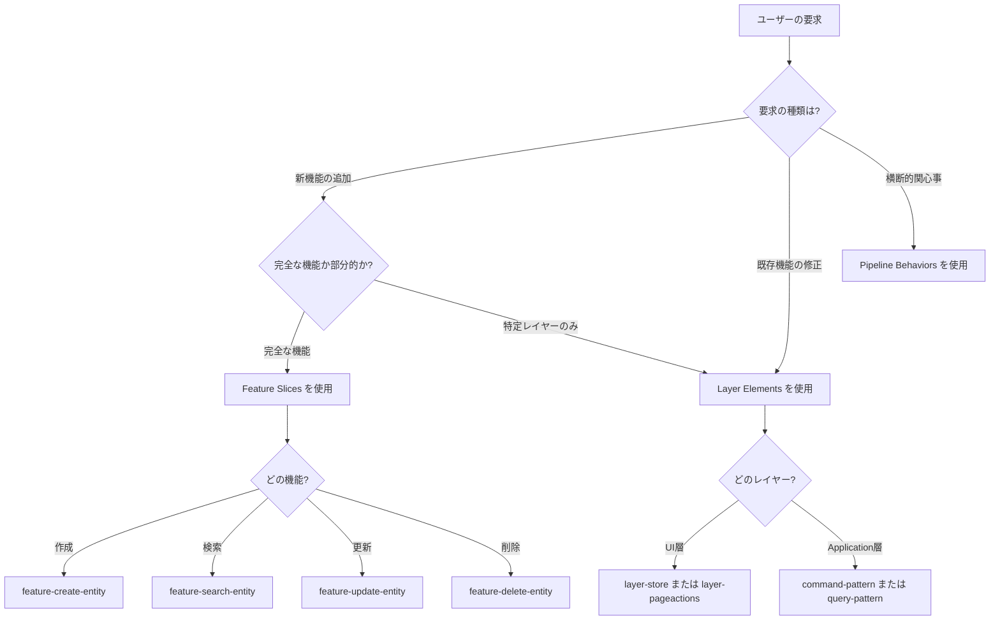

# Pattern Selection Guide for AI

AIが適切なパターンを選択するためのガイドです。

---

## 🎯 カタログの3層構造

カタログは以下の3層構造になっています:

```
catalog/
├── 1. 横断的関心事（Pipeline Behaviors）
│   ├── validation-behavior.yaml
│   ├── transaction-behavior.yaml
│   └── ...
│
├── 2. 機能スライス（Feature Slices）      ← 完全な垂直スライス
│   ├── feature-create-entity.yaml
│   ├── feature-search-entity.yaml
│   └── ...
│
└── 3. レイヤー要素（Layer Elements）      ← 個別レイヤーの要素
    ├── layers/layer-store.yaml
    ├── layers/layer-pageactions.yaml
    └── ...
```

---

## 📊 パターン選択フローチャート



---

## 🔍 ユーザー要求の分類

### 1. 完全な機能の追加 → **Feature Slices**

**ユーザーの要求例:**
- "商品を作成する機能を追加してください"
- "顧客を検索する機能を追加してください"
- "注文を編集する機能を追加してください"

**AIの判断:**
→ `category: feature-slice` を検索

**生成されるもの:**
- Application層: Command/Query + Handler + Validator
- UI層: Store + PageActions + Component
- API層: DTO + Endpoint

**パターン:**
- `feature-create-entity` - 作成機能
- `feature-search-entity` - 検索機能
- `feature-update-entity` - 更新機能
- `feature-delete-entity` - 削除機能

---

### 2. 特定レイヤーの要素のみ追加 → **Layer Elements**

**ユーザーの要求例:**
- "ProductEditStoreを追加してください"
- "商品削除のCommandだけ追加してください"
- "PageActionsを追加してください"

**AIの判断:**
→ `category: layer-element` を検索

**生成されるもの:**
- 単一レイヤーの個別ファイルのみ

**パターン:**
- `layer-store` - Store（状態管理+I/O）
- `layer-pageactions` - PageActions（UI手順）
- `layer-command` - Command
- `layer-query` - Query
- `layer-handler` - Handler

---

### 3. 横断的関心事の追加 → **Pipeline Behaviors**

**ユーザーの要求例:**
- "入力検証を追加してください"
- "トランザクション管理を追加してください"
- "認可チェックを追加してください"

**AIの判断:**
→ `category: pipeline-behavior` を検索

**生成されるもの:**
- Behavior クラス
- DI登録コード

**パターン:**
- `validation-behavior`
- `transaction-behavior`
- `authorization-behavior`

---

## 🎯 具体例: AIの判断フロー

### 例1: "商品を作成する機能を追加してください"

```
1. AIの分析:
   - "機能を追加" → 完全な機能
   - "作成" → Create操作

2. パターン検索:
   category: feature-slice
   intent: 含む("作成")

3. パターン決定:
   feature-create-entity

4. 生成するファイル:
   src/Application/Features/CreateProduct/
   ├── CreateProductCommand.cs
   └── CreateProductCommandHandler.cs

   src/Domain/ProductCatalog/Products/
   └── Product.cs (factory method)

   src/Application/Shared/ProductCatalog/UI/
   ├── Store/ProductsStore.cs
   └── Actions/ProductListActions.cs
```

### 例2: "ProductEditStoreだけ追加してください"

```
1. AIの分析:
   - "Store" → UI層の要素
   - "だけ" → 特定レイヤーのみ

2. パターン検索:
   category: layer-element
   layer: UI
   intent: 含む("Store")

3. パターン決定:
   layer-store

4. 生成するファイル:
   src/Application/Shared/ProductCatalog/UI/Store/
   ├── ProductsState.cs
   └── ProductsStore.cs
```

### 例3: "入力検証を追加してください"

```
1. AIの分析:
   - "入力検証" → 横断的関心事
   - すべてのCommandに適用される

2. パターン検索:
   category: pipeline-behavior
   intent: 含む("検証")

3. パターン決定:
   validation-behavior

4. 生成するファイル:
   src/Application/Common/Behaviors/
   └── ValidationBehavior.cs

   + DI登録コード
```

---

## 📝 AIの実装手順

### Feature Slices を使用する場合

```
1. catalog/index.json を読み込む
2. category: "feature-slice" で検索
3. intent フィールドでユーザーの要求に合致するものを選択
4. 該当する YAML ファイルを読み込む
5. implementation セクションの各テンプレートを取得:
   - command
   - handler
   - validator
   - store_state
   - store
   - page_actions
6. テンプレート変数を置換:
   - {Entity} → Product
   - {entity} → product
   - {BoundedContext} → ProductCatalog
7. すべてのファイルを生成
8. evidence のファイルパスを提示
```

### Layer Elements を使用する場合

```
1. catalog/index.json を読み込む
2. category: "layer-element" で検索
3. layer フィールドでレイヤーを絞り込む
4. 該当する YAML ファイルを読み込む
5. implementation セクションのテンプレートを取得
6. テンプレート変数を置換
7. 単一ファイルを生成
8. evidence のファイルパスを提示
```

---

## ⚠️ AIが注意すべき点

### 1. scope フィールドを確認

```yaml
# Feature Slices
scope: vertical-slice  # 複数レイヤーにまたがる

# Layer Elements
layer: UI  # 単一レイヤー
```

### 2. ユーザーの要求が曖昧な場合

**要求:** "商品機能を追加してください"

→ AIは質問で明確化:
```
「商品機能」について詳しく教えてください:
- 作成機能ですか？
- 検索機能ですか？
- 更新機能ですか？
- それとも全体（CRUD）ですか？
```

### 3. 依存パターンの確認

Feature Slices は依存パターンを持ちます:

```yaml
dependencies:
  patterns:
    - validation-behavior
    - transaction-behavior
    - idempotency-behavior
```

→ AIは依存パターンも確認し、必要に応じて追加を提案

---

## 📊 パターン選択の優先順位

1. **Feature Slices 優先**
   - ユーザーが「機能」「追加」と言った場合、まず Feature Slices を検討

2. **Layer Elements は部分的な場合のみ**
   - 「Storeだけ」「Commandだけ」など、明示的に部分的な要求の場合

3. **Pipeline Behaviors は明示的な場合のみ**
   - 「入力検証を追加」「トランザクション管理を追加」など

---

## 📁 UI配置ルール（要約）

> **詳細は [AI_USAGE_GUIDE.md](AI_USAGE_GUIDE.md#-ui配置ルール) を参照**

### 判断基準

| 条件 | 配置場所 | 例 |
|-----|---------|-----|
| **単一機能専用ページ** | `Features/{Feature}/UI/` | Login.razor |
| **複数機能で使う/基盤ページ** | `Components/Pages/` | Home.razor |
| **BC横断の共有部品** | `Components/Shared/` | ErrorPage.razor |
| **BC内で共有するStore/Actions** | `Shared/{BC}/UI/` | ProductsStore.cs |
| **フレームワーク必須** | `Components/Layout/` | MainLayout.razor |

### クイック判断フロー

```
その画面/コンポーネントは1つの機能でしか使わない？
├─ Yes → Features/{Feature}/UI/
└─ No  → Components/Pages/ または Shared/{BC}/UI/
```

---

## 🔄 パターンの組み合わせ

複数のパターンを組み合わせることもあります:

**要求:** "商品のCRUD機能を全部追加してください"

→ AIの判断:
```
1. feature-create-entity を使用 → 作成機能
2. feature-search-entity を使用 → 検索機能
3. feature-update-entity を使用 → 更新機能
4. feature-delete-entity を使用 → 削除機能
```

---

**最終更新: 2025-11-24**
**カタログバージョン: v2025.11.24**
