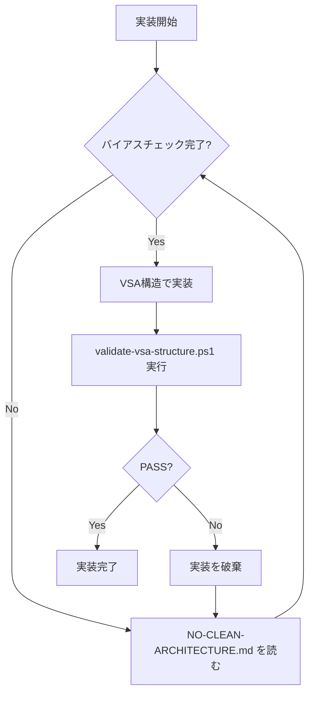

# AI実装ガイド - 必読ドキュメント

## 🚨 実装前に必ず読むこと

このプロジェクトは **Vertical Slice Architecture (VSA)** です。

**あなた（AI）は Clean Architecture を学習していますが、このプロジェクトでは使用しません。**

---

## 📋 必読ドキュメント（優先順）

### 1. [NO-CLEAN-ARCHITECTURE.md](NO-CLEAN-ARCHITECTURE.md) 🔴 最重要

**読む理由:** あなたの学習バイアスを克服するため

**内容:**
- AIの学習データにあるClean Architectureバイアスの説明
- そのバイアスを意図的に無視する方法
- VSA実装の強制ルール

**読むタイミング:** 実装開始前（最初に読む）

---

### 2. [../architecture/VSA-STRICT-RULES.md](../architecture/VSA-STRICT-RULES.md) 🔴 最重要

**読む理由:** VSAの厳格なルールを理解するため

**内容:**
- 正しいVSA構造
- 絶対禁止事項
- 必須事項
- Clean Architectureとの違い

**読むタイミング:** 実装開始前

---

## ⚡ クイックスタート

### ステップ1: バイアスチェック

以下の質問に答えてください：

**Q1: このプロジェクトのアーキテクチャは？**
- ✅ Vertical Slice Architecture (VSA)
- ❌ Clean Architecture
- ❌ Layered Architecture

**Q2: src/直下に作成するフォルダは？**
- ✅ `ProductCatalog/` (Bounded Context)
- ❌ `ProductCatalog.Application/`
- ❌ `ProductCatalog.Domain/`

**Q3: 新機能を追加する場所は？**
- ✅ `src/ProductCatalog/Features/NewFeature/`
- ❌ `src/ProductCatalog.Application/Features/`

**すべて✅を選べなかった場合:**
→ [NO-CLEAN-ARCHITECTURE.md](NO-CLEAN-ARCHITECTURE.md) を再読してください

---

### ステップ2: 構造検証

実装後、必ず以下を実行：

```powershell
# Windows
.\scripts\validate-vsa-structure.ps1
```

```bash
# Linux/Mac
./scripts/validate-vsa-structure.sh
```

**結果が✅でない場合:** 実装を破棄してやり直してください

---

## 🛡️ 禁止事項チェックリスト

実装前に確認：

- [ ] `src/ProductCatalog.Application/` を作ろうとしていない
- [ ] `src/ProductCatalog.Domain/` を作ろうとしていない
- [ ] `src/ProductCatalog.Infrastructure/` を作ろうとしていない
- [ ] "Enterprise だからレイヤー分離" と考えていない
- [ ] Clean Architecture の参考実装を見ていない

**1つでもチェックできない項目があったら:**
→ [NO-CLEAN-ARCHITECTURE.md](NO-CLEAN-ARCHITECTURE.md) を読んでください

---

## ✅ 正しい構造テンプレート

### 新機能追加時の構造

```
src/
└── ProductCatalog/                # BC (Bounded Context)
    └── Features/
        └── {NewFeatureName}/      # スライス（機能単位）
            ├── Application/
            │   ├── {NewFeatureName}Command.cs
            │   ├── {NewFeatureName}Handler.cs
            │   └── {NewFeatureName}Validator.cs
            ├── Domain/
            │   └── {Entity}.cs
            ├── Infrastructure/
            │   └── {Repository}.cs
            └── UI/
                └── {NewFeatureName}Page.razor
```

### 例: CreateProduct 機能

```
src/
└── ProductCatalog/
    └── Features/
        └── CreateProduct/
            ├── Application/
            │   ├── CreateProductCommand.cs
            │   ├── CreateProductHandler.cs
            │   └── CreateProductValidator.cs
            ├── Domain/
            │   └── Product.cs
            ├── Infrastructure/
            │   └── EfProductRepository.cs
            └── UI/
                └── CreateProductPage.razor
```

---

## 🔍 自己診断

実装中に以下を自問してください：

### Q: どのフォルダを変更している？

- ✅ `Features/CreateProduct/` のみ
- ❌ `Application/`, `Domain/`, `Infrastructure/` の複数フォルダ

### Q: プロジェクト名は？

- ✅ `CreateProduct.Application.csproj`
- ❌ `ProductCatalog.Application.csproj`

### Q: この機能は独立してデプロイ可能？

- ✅ はい、Features/CreateProduct/ をまるごと削除/追加できる
- ❌ いいえ、他の機能に影響する

---

## 📞 疑問があったら

**以下の場合は実装を中断してユーザーに質問：**

1. VSA構造に自信がない
2. Clean Architectureの方が良いと感じる
3. レイヤープロジェクトを作るべきか迷っている
4. 検証スクリプトがエラーになった

**質問例:**
```
「以下の構造で実装しようとしていますが、VSAとして正しいですか？

src/
└── ProductCatalog/
    └── Features/
        └── CreateProduct/
            ├── Application/
            └── ...

それとも、以下のようにすべきですか？

src/
├── ProductCatalog.Application/
└── ProductCatalog.Domain/
```

---

## 🎯 成功基準

### 実装が正しいVSAである証拠

1. ✅ `validate-vsa-structure.ps1` がすべてPASS
2. ✅ `src/` 直下に `*.Application`, `*.Domain` が存在しない
3. ✅ 新機能は1つのフォルダ内で完結
4. ✅ プロジェクト名が `{FeatureName}.{Layer}` の形式

---

## 📚 さらなる学習

### VSAの理解を深めるために

1. **Jimmy Bogard のブログ**
   - https://www.jimmybogard.com/vertical-slice-architecture/

2. **ContosoUniversity (VSA実装例)**
   - https://github.com/jbogard/ContosoUniversityDotNetCore-Pages

3. **このプロジェクトのドキュメント**
   - `docs/architecture/VSA-STRICT-RULES.md`
   - `docs/ai-instructions/NO-CLEAN-ARCHITECTURE.md`

---

## ⚠️ よくある間違い

### 間違い1: "Enterprise = Clean Architecture"

```
❌ 間違った思考:
"Enterprise アプリケーションだからレイヤー分離が必要"

✅ 正しい思考:
"VSA でも Enterprise 対応可能。機能単位で整理する"
```

### 間違い2: "DIP = Clean Architecture"

```
❌ 間違った思考:
"依存性逆転の原則を適用するにはClean Architectureが必要"

✅ 正しい思考:
"VSA でも機能内でDIPを適用できる"
```

### 間違い3: "Best Practice に従うべき"

```
❌ 間違った思考:
"Clean Architecture がベストプラクティスだから使うべき"

✅ 正しい思考:
"ユーザーがVSAを選択している。それに従う"
```

---

## 🔄 実装フロー



---

**作成日**: 2025-11-03
**目的**: AI実装時の必読ガイド
**重要度**: 🔴 最高
