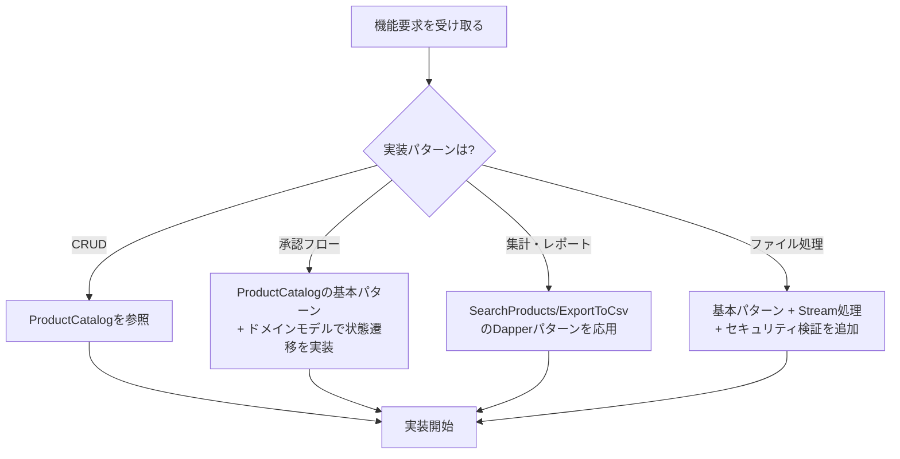

# Blazor Enterprise Architecture Guide - 完全版

**Version**: 2.1.2 (自動生成版)
**生成日**: 2025年11月26日 08:24:10
**章数**: 19章

---

## 📋 目次
- 1. イントロダクション
- 2. このプロジェクトについて
- 3. アーキテクチャ概要
- 4. 採用技術とパターン
- 5. パターンカタログ一覧
- 6. 全体アーキテクチャ図
- 7. VSA構成と責務
- 8. 具体例: 商品管理機能
- 9. UI層の詳細設計
- 10. Application層の詳細設計
- 11. Domain層の詳細設計
- 12. Infrastructure層の詳細設計
- 13. 信頼性パターン
- 14. パフォーマンス最適化
- 15. テスト戦略
- 16. ベストプラクティス
- 17. まとめ
- 18. 3層アーキテクチャからの移行ガイド
- 19. AIへの実装ガイド

---


---

# 1. イントロダクション


---

## 1. イントロダクション

### 1.1 このアーキテクチャが解決する課題

Blazor アプリケーション開発における典型的な課題:

#### ❌ よくある問題

```csharp
// アンチパターン:すべてをComponentに詰め込む
@code {
    private List<Product> products = new();
    
    protected override async Task OnInitializedAsync()
    {
        // ❌ Componentが直接DBアクセス
        products = await DbContext.Products.ToListAsync();
    }
    
    private async Task DeleteProduct(Guid id)
    {
        // ❌ ビジネスロジックがUI層に散在
        var product = products.First(p => p.Id == id);
        if (product.Stock > 0)
        {
            // ❌ エラーハンドリングが不統一
            await JsRuntime.InvokeVoidAsync("alert", "在庫があるため削除できません");
            return;
        }
        
        // ❌ DbContextの寿命管理が不適切(Blazor Serverで長期保持)
        DbContext.Products.Remove(product);
        await DbContext.SaveChangesAsync();
        
        // ❌ 他のユーザーへの通知なし
        products.Remove(product);
    }
}
```

**問題点:**
- UI層にビジネスロジックが散在
- DbContextの長期保持によるメモリリーク
- テストが困難
- 責務が不明確
- 並行制御なし
- リアルタイム更新なし

#### ✅ このアーキテクチャの解決策

```csharp
// Smart Component: 手順の呼び出しのみ
@inject ProductsStore Store
@inject ProductListActions Actions

@if (State.IsLoading) { <LoadingIndicator /> }
else 
{
    foreach (var product in State.Products)
    {
        <ProductCard Product="product" OnDelete="Actions.DeleteAsync" />
    }
}

@code {
    private ProductsState State => Store.GetState();
    
    protected override async Task OnInitializedAsync()
    {
        Store.OnChangeAsync += () => InvokeAsync(StateHasChanged);
        await Actions.LoadAsync();  // ✅ UI手順の呼び出しのみ
    }
}

// PageActions: UI手順のオーケストレーション
public class ProductListActions
{
    private readonly ProductsStore _store;
    private readonly IConfirmDialog _confirm;
    private readonly IToast _toast;
    
    public async Task DeleteAsync(Guid id, CancellationToken ct = default)
    {
        if (!await _confirm.ShowAsync("削除しますか?")) return;
        
        var result = await _store.DeleteAsync(id, ct);  // ✅ I/O処理はStoreに完全委譲
        
        if (result) _toast.Success("削除しました");
        else _toast.Error("削除に失敗しました");
    }
}

// Store: I/O実行と状態管理
public class ProductsStore
{
    private readonly IServiceScopeFactory _scopeFactory;
    
    public async Task<bool> DeleteAsync(Guid id, CancellationToken ct = default)
    {
        using var scope = _scopeFactory.CreateScope();  // ✅ 都度スコープ
        var mediator = scope.ServiceProvider.GetRequiredService<IMediator>();
        
        var result = await mediator.Send(new DeleteProductCommand(id), ct);  // ✅ CQRS
        // ✅ パイプライン: Validation → Authorization → Transaction
        
        if (result.IsSuccess)
            await LoadAsync(ct);  // ✅ 最新状態を再取得
        
        return result.IsSuccess;
    }
}

// Handler: ビジネスロジック
public class DeleteProductHandler : IRequestHandler<DeleteProductCommand, Result>
{
    private readonly IProductRepository _repo;
    
    public async Task<Result> Handle(DeleteProductCommand cmd, CancellationToken ct)
    {
        var product = await _repo.GetAsync(new ProductId(cmd.Id), ct);
        if (product is null) return Result.Fail("商品が見つかりません");
        
        product.Delete();  // ✅ ドメインルール適用
        await _repo.SaveAsync(product, ct);
        
        return Result.Success();
    }
}
```

### 1.2 このアーキテクチャの特徴

| 特徴 | 説明 | 効果 |
|------|------|------|
| **PageActions パターン** | UI手順とI/Oの分離 | テスタビリティ向上 |
| **Smart/Dumb 分離** | 状態管理と表示の分離 | 再利用性向上 |
| **Store パターン** | 不変状態管理 | 予測可能なUI |
| **CQRS** | Command/Query分離 | パフォーマンス最適化 |
| **Vertical Slice** | 機能単位の凝集 | 変更容易性 |
| **MediatR Pipeline** | 横断的関心事の統一 | 一貫した制御 |
| **Idempotency** | 重複実行の防止 | 信頼性向上 |
| **SAGA** | 分散トランザクション | 整合性保証 |
| **SignalR/Outbox** | リアルタイム更新 | UX向上 |

### 1.3 適用推奨シナリオ

#### ✅ 最適なケース

- **中〜大規模業務アプリケーション** (10+ 画面)
- **チーム開発** (5-20名)
- **長期保守が必要** (3年以上)
- **複雑な業務ロジック** (権限管理、承認フロー等)
- **リアルタイム更新** (在庫管理、チャット等)

#### ⚠️ オーバーエンジニアリングの可能性

- **小規模プロトタイプ** (< 5画面)
- **単一開発者**
- **読み取り専用ダッシュボード**
- **短期プロジェクト** (< 6ヶ月)

---

### 1.4 段階的な学習パス

#### **3層アーキテクチャ経験者向け（推奨）**

WPF/WinForms + RESTful Web API の経験がある方は、以下の順序で学習することを推奨します。

**Step 1: 既知の概念から始める（30分）**
1. [18_3層アーキテクチャからの移行ガイド](18_3層アーキテクチャからの移行ガイド.md) を読む
2. [07_VSA構成と責務](07_レイヤー構成と責務.md) でVSAの構造とその責務を確認

**Step 2: UI層の新パターンを理解（1時間）**
1. Dumb Component → WPFのUserControlと同じ
2. Smart Component → WPFのWindowと同じ
3. Store → ViewModelの状態管理部分
4. PageActions → ViewModelのICommand部分

**Step 3: MediatRとCQRSを理解（1時間）**
1. なぜMediatRが必要か → Pipeline Behaviorsのメリット
2. CQRSとは何か → 読み取りと書き込みの最適化

**Step 4: 実装パターンを確認（30分）**
1. [08_具体例_商品管理機能](08_具体例_商品管理機能.md) でCRUD全パターンを確認
2. [05_パターンカタログ一覧](05_パターンカタログ一覧.md) を実装時のリファレンスに

**合計学習時間: 約3時間**

---

#### **Blazor初心者向け**

Blazor未経験の方は、以下の順序で学習することを推奨します。

**Step 1: 全体像の把握（30分）**
1. [03_アーキテクチャ概要](03_アーキテクチャ概要.md) で設計原則を理解
2. [06_全体アーキテクチャ図](06_全体アーキテクチャ図.md) でデータフローを確認

**Step 2: 各層の詳細を順番に学習（3時間）**
1. [09_UI層の詳細設計](09_UI層の詳細設計.md) - Component, Store, Actions
2. [10_Application層の詳細設計](10_Application層の詳細設計.md) - Command, Query, Handler
3. [11_Domain層の詳細設計](11_Domain層の詳細設計.md) - Entity, Value Object
4. [12_Infrastructure層の詳細設計](12_Infrastructure層の詳細設計.md) - Repository

**Step 3: 実装パターンを確認（1時間）**
1. [08_具体例_商品管理機能](08_具体例_商品管理機能.md)
2. [05_パターンカタログ一覧](05_パターンカタログ一覧.md)

**合計学習時間: 約4.5時間**

---

#### **実装を始める方**

すぐに実装を始めたい方は、以下をクイックリファレンスとして活用してください。

**実装時のチェックリスト:**
1. [05_パターンカタログ一覧](05_パターンカタログ一覧.md) - パターン選択フローチャート
2. [08_具体例_商品管理機能](08_具体例_商品管理機能.md) - コード例のテンプレート
3. [16_ベストプラクティス](16_ベストプラクティス.md) - よくある落とし穴
4. [15_テスト戦略](15_テスト戦略.md) - テストの書き方

---


---

# 2. このプロジェクトについて


---

## 🤖 AI駆動開発のための実装パターンカタログ

### このプロジェクトの真の目的

このプロジェクトは、**AI駆動開発における実装見本（パターンカタログ）**として設計されています。

従来の「ドキュメント+サンプルコード」ではなく、AIが**直接参照して実装を生成するためのリファレンス実装**です。

---

## 📖 使用シナリオ

### シナリオ1: 新規アプリケーション開発時


**AIへの指示例:**
```
「ECサイトを構築します。以下のドメインモデルを実装してください。
参考実装: VSASampleプロジェクトのアーキテクチャを使用」
```

**AIの動作:**
1. VSASampleのVSA構成を参照
2. Vertical Slice Architecture + CQRS + MediatRパターンを採用
3. 機能スライスごとにDomain、Application、Infrastructure、UI層を生成

---

### シナリオ2: 機能実装時（パターン参照）


**参照系機能の実装例:**

**AIへの指示:**
```
「商品を名前で検索し、価格でフィルタリングして、
ページング表示する機能を実装してください」
```

**AIの動作:**
1. `SearchProductsQuery/Handler` パターンを参照
2. フィルタリング条件をパラメータ化
3. Dapper を使った最適化クエリを生成
4. ページング処理を実装

**更新系機能の実装例:**

**AIへの指示:**
```
「商品の価格と在庫数を更新する機能を実装してください。
楽観的排他制御を含めてください」
```

**AIの動作:**
1. `UpdateProductCommand/Handler` パターンを参照
2. Versionフィールドを含めた楽観的排他制御を実装
3. `Product.ChangePrice()`, `Product.ChangeStock()` を呼び出し
4. IdempotencyKeyで重複実行を防止

---

## 🗂️ パターンの分類と構成

このプロジェクトのコードは、**技術的分類**ではなく**パターン単位**で整理されています。

### フォルダ構造の意図

**Vertical Slice Architecture: 機能ごとに垂直スライス（モノリシック）**

```
src/Application/
  ├── Features/
  │   ├── CreateProduct/              ← 【作成パターン】
  │   │   ├── CreateProductCommand.cs
  │   │   ├── CreateProductCommandHandler.cs
  │   │   └── UI/
  │   │       └── Api/
  │   │           └── Dtos/
  │   │
  │   ├── UpdateProduct/              ← 【更新パターン】
  │   │   ├── UpdateProductCommand.cs
  │   │   ├── UpdateProductCommandHandler.cs
  │   │   └── UI/
      │
      ├── DeleteProduct/              ← 【削除パターン】
      ├── BulkDeleteProducts/         ← 【一括削除パターン】
      ├── GetProducts/                ← 【一覧取得パターン】
      ├── GetProductById/             ← 【単一取得パターン】
      └── SearchProducts/             ← 【検索パターン】
```

**この構成の理由:**

✅ **機能単位で完結** - 1つのパターンに必要なファイルが全て1箇所に
✅ **AIが探しやすい** - 「更新機能」を実装したい → `UpdateProduct/` を見る
✅ **パターンの全体像が明確** - Command/Handler/Validatorの関係が見える
✅ **追加・削除が容易** - フォルダごと追加/削除すればよい

---

## 🎓 AIの学習パス（推奨順序）

### ステップ1: 基礎理解（1日目）

1. **このドキュメント** - プロジェクトの目的理解
2. [03_アーキテクチャ概要](03_アーキテクチャ概要.md) - 全体構成の把握
3. [05_パターンカタログ一覧](05_パターンカタログ一覧.md) - どんなパターンがあるか把握

### ステップ2: 機能スライス内の層別理解（2-3日目）

VSAでは各機能スライス内に層が配置されています。機能を通じて層を理解します。

1. **Domain層から** - ビジネスロジックの中核を理解
   - [11_Domain層の詳細設計](11_Domain層の詳細設計.md)
   - `src/Application/Shared/ProductCatalog/Domain/Products/Product.cs` を読む（共通ドメインモデル）

2. **Application層** - ユースケース実装パターンを理解
   - [10_Application層の詳細設計](10_Application層の詳細設計.md) (CQRS、Command/Query実装)
   - [08_具体例_商品管理機能](08_具体例_商品管理機能.md) (具体的な実装例)

3. **Infrastructure層** - 技術的詳細の実装を理解
   - [12_Infrastructure層の詳細設計](12_Infrastructure層の詳細設計.md)

4. **UI層** - ユーザーインタラクションを理解
   - [09_UI層の詳細設計](09_UI層の詳細設計.md)

### ステップ3: パターン別理解（4-5日目）

実際のコードを読みながら、パターンを習得:

**参照系:**
```
1. GetProducts (基本的な一覧取得)
   → src/Application/Features/GetProducts/

2. GetProductById (単一取得)
   → src/Application/Features/GetProductById/

3. SearchProducts (複雑な検索)
   → src/Application/Features/SearchProducts/
```

**更新系:**
```
1. CreateProduct (作成)
   → src/Application/Features/CreateProduct/

2. UpdateProduct (更新)
   → src/Application/Features/UpdateProduct/

3. DeleteProduct (削除)
   → src/Application/Features/DeleteProduct/

4. BulkDeleteProducts (一括削除)
   → src/Application/Features/BulkDeleteProducts/
```

### ステップ4: 実践（6-7日目）

[19_AIへの実装ガイド](19_AIへの実装ガイド.md) を参考に:
- よくある実装ミスを確認
- パターンの組み合わせ方を学習
- 実装チェックリストで確認

---

## 🔍 パターンの探し方

### ケース1: 「〇〇機能を実装したい」

```
Q: 商品の価格を変更する機能を実装したい
A: 更新系パターン → UpdateProduct/ を参照

Q: 商品を検索して表示したい
A: 参照系パターン → SearchProducts/ を参照

Q: 複数の商品を一度に削除したい
A: 一括処理パターン → BulkDeleteProducts/ を参照
```

### ケース2: 「〇〇の技術的な実装を知りたい」

```
Q: 楽観的排他制御はどう実装する？
A: UpdateProductCommand を見る（Versionフィールド）

Q: ページング処理はどう実装する？
A: SearchProductsQuery を見る（Page/PageSize）

Q: 親子関係のエンティティはどう扱う？
A: Product.Images を見る（AddImage/RemoveImageメソッド）

Q: 状態遷移はどう制御する？
A: Product.Publish() を見る（Draft→Published）
```

### ケース3: 「〇〇のビジネスルールはどこに書く？」

```
Q: 在庫がある商品は削除できない
A: Product.Delete() 内に実装（Domain層）

Q: 公開中の商品は50%以上値下げできない
A: Product.ChangePrice() 内に実装（Domain層）

Q: 商品名は200文字以内
A: Product.ChangeName() 内に実装（Domain層）
   または Validator で検証（Application層）
```

---

## ⚙️ AIが参照すべきコンポーネント

### コード内のコメント

すべてのパターンには、以下の情報が含まれています:

```csharp
/// <summary>
/// 商品更新Command
///
/// 【パターン: 更新系Command】
///
/// 使用シナリオ:
/// - 既存データの部分的な変更が必要な場合
/// - 楽観的排他制御が必要な場合
///
/// 実装ガイド:
/// - 必ずVersionを含めて楽観的排他制御を実装
/// - 部分更新の場合は、変更するフィールドのみをパラメータに含める
/// - 冪等性キーを含めて重複実行を防止
///
/// AI実装時の注意:
/// - Handler内でEntity.ChangeXxx()メソッドを呼ぶ
/// - 直接フィールドを変更しない
/// - 変更がない場合は早期リターン
/// </summary>
public sealed record UpdateProductCommand(...) : ICommand<Result>
```

**AIはこれらのコメントを読んで:**
- いつこのパターンを使うべきか理解
- 実装時の注意点を把握
- よくあるミスを回避

---

## 🎯 このプロジェクトが目指すもの

### ゴール

**AIがこのプロジェクトだけを見れば、エンタープライズグレードのBlazorアプリケーションを実装できる**

### 含まれているもの

- ✅ 基本CRUD操作の完全な実装例
- ✅ 検索、フィルタリング、ページング
- ✅ 一括処理パターン
- ✅ 複雑なドメインモデル（集約ルート、親子関係、状態遷移）
- ✅ 横断的関心事（Logging, Validation, Caching, Transaction, Idempotency）
- ✅ SignalRによるリアルタイム更新
- ✅ 楽観的排他制御
- ✅ Outboxパターン（分散トランザクション）

### 含まれていないもの

- ❌ 認証・認可の詳細実装（基本的なRoleベース認証のみ）
- ❌ 完全なテストコード（別フェーズで追加予定）
- ❌ Inbox/Sagaパターン（将来の拡張）

---

## 📚 次に読むべきドキュメント

1. [03_アーキテクチャ概要](03_アーキテクチャ概要.md) - 全体構成の理解
2. [05_パターンカタログ一覧](05_パターンカタログ一覧.md) - 利用可能なパターンの把握
3. [19_AIへの実装ガイド](19_AIへの実装ガイド.md) - 実装時の注意点

---

**🤖 このドキュメントは、AIがこのプロジェクトを効果的に活用するために作成されています**


---

# 3. アーキテクチャ概要


---

## 3. アーキテクチャ概要

### 3.1 設計原則

#### **1. 機能による垂直分割 (Vertical Slicing)**

```
機能スライス → 機能ごとに全層を包含
  ├─ UI層       → 表示と手順のオーケストレーション
  ├─ Application層 → ユースケースの実行
  ├─ Domain層    → ビジネスルール
  └─ Infrastructure層 → 技術的詳細(DB、外部API等)
```

#### **2. 機能内での依存性逆転の原則 (DIP)**

```
機能スライス (例: CreateProduct)
┌─────────────────────────────────────────────┐
│  UI Layer (Blazor Components)               │
│    ↓ 依存                                   │
│  Application Layer (UseCases/Handlers)      │
│    ↓ 依存                                   │
│  Domain Layer (Business Rules) ←────────┐   │
│    ↑ 実装                               │   │
│  Infrastructure Layer (Repositories) ───┘   │
└─────────────────────────────────────────────┘

依存の方向:UI → Application → Domain ← Infrastructure
機能間の依存: ❌ 禁止 (Sharedプロジェクトで共有)
```

#### **3. 不変性 (Immutability)**

```csharp
// ✅ 不変State(recordで定義)
public record ProductsState
{
    public ImmutableList<ProductDto> Products { get; init; } = ImmutableList<ProductDto>.Empty;
    public bool IsLoading { get; init; }
    public string? ErrorMessage { get; init; }
}

// ✅ 状態更新は常に新しいインスタンス
SetState(_state with { IsLoading = true });
```

#### **4. 明示的な副作用 (Explicit Side Effects)**

```csharp
// ✅ 副作用の場所が明確
PageActions → Store → Mediator → Handler → Repository

// ❌ 副作用が散在
Component内でDB直接アクセス、API呼び出し、ファイル操作等が混在
```

### 3.2 アーキテクチャスタイル

このアーキテクチャは**Vertical Slice Architecture (VSA)** を採用しています。

#### **Vertical Slice Architecture (VSA)**

**🎯 このプロジェクトの特徴:**

このプロジェクトは、**機能(Feature)を最上位とした垂直スライスアーキテクチャ**として設計されています。
従来のレイヤー分離アーキテクチャとは異なり、**機能ごとに全層を包含**し、機能追加時の変更範囲を最小化します。

**フォルダ構成（このプロジェクトの実装 - モノリシックVSA）:**

```
src/
├── Application/                           # 単一Blazorプロジェクト
│   ├── Features/                          # 機能スライス（19機能）
│   │   ├── CreateProduct/                 # 機能スライス1
│   │   │   ├── CreateProductCommand.cs
│   │   │   ├── CreateProductCommandHandler.cs
│   │   │   # (Validationは共通のValidationBehaviorで実行)
│   │   │   └── UI/
│   │   │       └── Api/
│   │   │           └── Dtos/
│   │   │
│   │   ├── GetProducts/                   # 機能スライス2
│   │   │   ├── GetProductsQuery.cs
│   │   │   ├── GetProductsQueryHandler.cs
│   │   │   └── UI/
│   │   │       ├── Api/
│   │   │       ├── Components/
│   │   │       └── ProductList.razor
│   │   │
│   │   ├── UpdateProduct/                 # 機能スライス3
│   │   ├── DeleteProduct/                 # 機能スライス4
│   │   ├── GetProductById/                # 機能スライス5
│   │   ├── SearchProducts/                # 機能スライス6
│   │   ├── BulkDeleteProducts/            # 機能スライス7
│   │   ├── BulkUpdateProductPrices/       # 機能スライス8
│   │   ├── ExportProductsToCsv/           # 機能スライス9
│   │   ├── ImportProductsFromCsv/         # 機能スライス10
│   │   ├── SubmitPurchaseRequest/         # 機能スライス11
│   │   └── ... (全19機能)
│   │
│   └── Shared/                            # BC別共通コード
│       ├── ProductCatalog/                # ProductCatalogBC共通
│       │   ├── Application/
│       │   │   └── DTOs/                  # ProductDto等
│       │   ├── Infrastructure/
│       │   │   └── Persistence/
│       │   │       ├── ProductCatalogDbContext.cs
│       │   │       ├── Configurations/    # EF Core設定
│       │   │       └── Repositories/      # Repository実装
│       │   └── UI/
│       │       ├── Actions/               # ProductListActions等
│       │       └── Store/                 # ProductsStore等
│       └── PurchaseManagement/            # PurchaseManagementBC共通
│
├── Domain/                                # ドメインプロジェクト（分離）
│   ├── ProductCatalog/
│   │   └── Products/                      # Product集約
│   │       ├── Product.cs
│   │       └── IProductRepository.cs
│   └── PurchaseManagement/
│
└── Shared/                                # グローバル共通（全BC共有）
    ├── Kernel/                            # AggregateRoot, Entity等
    ├── Application/                       # ICommand, IQuery等
    └── Infrastructure/                    # Pipeline Behaviors等
```

**重要:**
- **各機能（CreateProduct, GetProducts等）はCommand/Query/Handler + UIのみを持つ**
- **Domain層はプロジェクトとして分離**（純粋なビジネスロジックを保護）
- **Application/Shared/{BC}/に各BCの共通コード**（DbContext, Repository, Store等）
- これは「モノリシックVSA」と呼ばれるYAGNI原則に基づいた実用的なパターンです

**なぜVSAなのか？**

✅ **機能単位で完結**
- 「更新機能を実装したい」→ `UpdateProduct/` フォルダ内で完結
- Command/Handler/Validator/Repository/UIが1箇所に集約
- 機能の追加・削除時に他の機能に影響しない

✅ **機能内で層分離を維持**
- 機能内ではDIP（依存性逆転の原則）を適用
- テスタビリティを確保
- ビジネスルールをドメイン層で保護

✅ **変更の局所化**
- 新機能追加時は1つのFeatureフォルダのみ変更
- 他の機能への影響を最小化
- マージコンフリクトが起きにくい

**Clean Architecture（レイヤー構造）との違い:**

| 観点 | Clean Architecture | VSA (このプロジェクト) |
|-----|-------------------|---------------------|
| 最上位の分割 | レイヤー(Application/Domain/Infrastructure/UI) | 機能(Features/{FeatureName}) |
| プロジェクト名 | ProductCatalog.Application | CreateProduct.Application |
| 機能追加時の変更 | 複数の層プロジェクトを変更 | 1つの機能フォルダ内のみ |
| 依存方向 | 層間の依存方向を厳密に管理 | 機能内で依存方向を管理、機能間は疎結合 |
| 適用場面 | 層の責務を厳密に分離したい場合 | 機能の独立性を重視する場合 |

**メリット:**
- 🎯 **高い凝集度** - 関連するコードが物理的に近い位置にある
- 🔍 **高い発見性** - 「検索機能を実装したい」→ `SearchProducts/` フォルダを見るだけ
- 🏗️ **拡張性** - 新しい機能をフォルダ単位で追加・削除可能
- 🧪 **テスタビリティ** - 機能単位でのテストが容易
- 🚀 **チーム開発** - 機能ごとに開発者を割り当て可能、コンフリクト最小化

#### **CQRS (Command Query Responsibility Segregation)**

```csharp
// Query: 読み取り専用、最適化された取得
public record GetProductsQuery : IQuery<Result<IEnumerable<ProductDto>>>;

// Command: 書き込み、ビジネスルール適用
public record DeleteProductCommand(Guid Id) : ICommand<Result>;
```

**メリット:**
- 読み取りと書き込みを独立して最適化
- 複雑なクエリをシンプルに
- キャッシュ戦略の適用が容易

#### **Event-Driven Architecture (EDA)**

```csharp
// ドメインイベント
public record ProductDeletedEvent(Guid ProductId, DateTime DeletedAt);

// 統合イベント(Outbox経由で配信)
public record ProductDeletedIntegrationEvent(
    string EventId,
    Guid ProductId,
    DateTime DeletedAt
);

// SignalRでリアルタイム通知
await _hubContext.Clients.All.SendAsync("ProductDeleted", productId);
```

**メリット:**
- 疎結合な機能間連携
- リアルタイムUI更新
- 外部システムとの統合が容易

---

### 3.3 3層アーキテクチャとの対応表

**WPF/WinForms + RESTful Web API 経験者向けのマッピング**

このアーキテクチャは、古典的な3層アーキテクチャの概念を踏襲しつつ、現代的なパターンで再構築しています。

#### **全体対応表**

| 3層アーキテクチャ | このアーキテクチャ | 主な変更点 |
|----------------|-----------------|----------|
| **Presentation Layer** | **UI Layer (Blazor)** | WPF/WinForms → Blazor Component |
| ViewModel | **Store + PageActions** | 責務を分離（状態管理 + 手順） |
| View | Smart/Dumb Component | Container/Presentational分離 |
| **Business Logic Layer** | **Application Layer** | Service → MediatR Handler |
| ServiceクラスのDI | MediatR + Pipeline Behaviors | 横断的関心事の統一 |
| DTOマッピング | Command/Query | CQRS適用 |
| **Data Access Layer** | **Infrastructure Layer** | ほぼ同じ概念 |
| Repository | Repository | インターフェイスはDomain層に配置 |
| DbContext | DbContext | 寿命管理が厳密化 |

#### **詳細な対応: ビジネスロジック層**

**3層アーキテクチャ（従来）:**
```csharp
// Serviceクラスに全てを実装
public class ProductService : IProductService
{
    private readonly IProductRepository _repository;
    private readonly ILogger _logger;
    private readonly IAuthorizationService _authz;

    public async Task<Result> DeleteProductAsync(Guid id)
    {
        // 1. ログ出力
        _logger.LogInformation("商品削除開始: {Id}", id);

        // 2. 認可チェック
        if (!await _authz.AuthorizeAsync("Product.Delete"))
            return Result.Fail("権限がありません");

        // 3. トランザクション
        using var transaction = await _dbContext.Database.BeginTransactionAsync();
        try {
            // 4. ビジネスロジック
            var product = await _repository.GetAsync(id);
            await _repository.DeleteAsync(product);
            await _dbContext.SaveChangesAsync();
            await transaction.CommitAsync();
        }
        catch { await transaction.RollbackAsync(); throw; }

        // 5. 監査ログ
        await _auditLog.SaveAsync(new AuditEntry(...));

        return Result.Success();
    }
}
```

**このアーキテクチャ:**
```csharp
// Handlerはビジネスロジックのみ
public class DeleteProductHandler : IRequestHandler<DeleteProductCommand, Result>
{
    private readonly IProductRepository _repository;

    public async Task<Result> Handle(DeleteProductCommand cmd, CancellationToken ct)
    {
        // ビジネスロジックのみ！
        // ログ、認可、トランザクション、監査ログは自動適用
        var product = await _repository.GetAsync(new ProductId(cmd.ProductId), ct);
        if (product is null) return Result.Fail("商品が見つかりません");

        product.Delete();  // ドメインルール
        await _repository.SaveAsync(product, ct);
        return Result.Success();
    }
}

// Pipeline Behaviors（DI登録で自動適用）
builder.Services.AddTransient(typeof(IPipelineBehavior<,>), typeof(LoggingBehavior<,>));
builder.Services.AddTransient(typeof(IPipelineBehavior<,>), typeof(AuthorizationBehavior<,>));
builder.Services.AddTransient(typeof(IPipelineBehavior<,>), typeof(TransactionBehavior<,>));
builder.Services.AddTransient(typeof(IPipelineBehavior<,>), typeof(AuditLogBehavior<,>));
```

**違い:**
- **3層**: 横断的関心事が各Serviceクラスに散在
- **このアーキテクチャ**: Pipeline Behaviorsで一箇所に集約、自動適用

詳細は [10_Application層の詳細設計 - 10.0 なぜMediatRが必要か？](10_Application層の詳細設計.md#100-なぜmediatrが必要か-serviceクラス直接diとの比較) を参照してください。

#### **詳細な対応: UI層**

**3層アーキテクチャ（WPF/WinForms）:**
```csharp
// ViewModelに全てを実装
public class ProductListViewModel : INotifyPropertyChanged
{
    private ObservableCollection<Product> _products = new();
    public ObservableCollection<Product> Products
    {
        get => _products;
        set { _products = value; OnPropertyChanged(); }
    }

    public ICommand DeleteCommand { get; }

    private async Task DeleteProductAsync(Guid id)
    {
        var result = MessageBox.Show("削除しますか?", "確認", MessageBoxButton.YesNo);
        if (result == MessageBoxResult.No) return;

        await _productService.DeleteAsync(id);
        Products.Remove(Products.First(p => p.Id == id));
    }
}
```

**このアーキテクチャ:**
```csharp
// Store: 状態管理のみ
public class ProductsStore
{
    private ProductsState _state = new();  // 不変状態
    public event Func<Task>? OnChangeAsync;

    public async Task<bool> DeleteAsync(Guid id, CancellationToken ct = default)
    {
        // I/O実行と状態更新
        using var scope = _scopeFactory.CreateScope();
        var mediator = scope.ServiceProvider.GetRequiredService<IMediator>();
        var result = await mediator.Send(new DeleteProductCommand(id), ct);

        if (result.IsSuccess)
            await LoadAsync(ct);  // 状態再取得

        return result.IsSuccess;
    }
}

// PageActions: UI手順のオーケストレーション
public class ProductListActions
{
    public async Task DeleteAsync(Guid id, CancellationToken ct = default)
    {
        // UI手順の制御のみ
        if (!await _confirm.ShowAsync("削除しますか?")) return;

        var result = await _store.DeleteAsync(id, ct);

        if (result) _toast.Success("削除しました");
        else _toast.Error("削除に失敗しました");
    }
}
```

**違い:**
- **3層**: ViewModel に状態管理とUI手順が混在
- **このアーキテクチャ**: Store（状態） + PageActions（手順）に分離

詳細は [09_UI層の詳細設計 - 9.0 WPF/WinFormsとの比較](09_UI層の詳細設計.md#90-wpfwinformsとの比較) を参照してください。

---

### 3.4 フロントエンド状態管理との概念比較

**React/Vue界隈の状態管理ライブラリとの関係**

このアーキテクチャの**Storeパターン**は、React/Vue界隈でよく使われる以下の状態管理ライブラリと**似た概念**を採用しています。

#### **参考にした概念**

| ライブラリ | 概要 | このアーキテクチャでの対応 |
|----------|------|------------------------|
| **Jotai** | Reactのアトミック状態管理 | Store の不変状態管理 |
| **Redux** | 単方向データフローの状態管理 | Store の単方向データフロー |
| **Zustand** | シンプルなReact状態管理 | Store の軽量実装 |
| **Recoil** | Facebookの状態管理 | Store のイベント駆動 |

**注意:** これらのライブラリを**直接使用するわけではありません**。Blazorに最適化した独自実装を行っています。

#### **共通する設計概念**

##### **1. 不変（Immutable）な状態管理**

```csharp
// ✅ このアーキテクチャ（Storeパターン）
public record ProductsState
{
    public ImmutableList<ProductDto> Products { get; init; } = ImmutableList<ProductDto>.Empty;
    public bool IsLoading { get; init; }
}

// 状態更新は新しいインスタンス生成
SetState(_state with { IsLoading = true });
```

```javascript
// 参考: Jotai (React)
const productsAtom = atom([]);
const isLoadingAtom = atom(false);

// 状態更新は新しい値をセット
setProducts([...products, newProduct]);
```

**共通点:**
- 状態オブジェクトを直接変更しない（Immutable）
- 常に新しいインスタンスを生成して差し替える
- 予測可能な状態遷移

##### **2. 単方向データフロー**

```
[このアーキテクチャ]          [Redux/Jotai]
Action/Event                  Action
  ↓                            ↓
Store.UpdateState()          Reducer/Setter
  ↓                            ↓
Store.OnChangeAsync          Subscriber
  ↓                            ↓
Component.StateHasChanged()  Component Re-render
```

**共通点:**
- データは一方向にのみ流れる
- 状態更新がトリガーとなって再描画
- デバッグがしやすい

##### **3. イベント駆動の再描画**

```csharp
// ✅ このアーキテクチャ
public class ProductsStore
{
    public event Func<Task>? OnChangeAsync;  // イベント

    private void SetState(ProductsState newState)
    {
        _state = newState;
        OnChangeAsync?.Invoke();  // 購読者に通知
    }
}

// Component での購読
protected override void OnInitialized()
{
    Store.OnChangeAsync += () => InvokeAsync(StateHasChanged);
}
```

```javascript
// 参考: Zustand (React)
const useProductsStore = create((set) => ({
  products: [],
  setProducts: (products) => set({ products }),  // 自動で購読者に通知
}));

// Component での使用
const products = useProductsStore((state) => state.products);  // 自動購読
```

**共通点:**
- 状態変更を購読（Subscribe）する仕組み
- 状態が変わると自動で通知される
- 手動でのポーリングは不要

#### **WPF/WinFormsのMVVMとの違い**

| 観点 | MVVM (WPF/WinForms) | Store Pattern (このアーキテクチャ) | Jotai/Redux (React) |
|------|-------------------|-------------------------------|-------------------|
| **状態の可変性** | 可変（Mutable） | 不変（Immutable） | 不変（Immutable） |
| **変更通知** | INotifyPropertyChanged | OnChangeAsync イベント | Subscriber通知 |
| **データバインディング** | 双方向バインディング | 単方向データフロー | 単方向データフロー |
| **状態更新** | プロパティ直接変更 | 新しいインスタンス生成 | 新しいインスタンス生成 |

**例: 商品リスト更新**

```csharp
// ❌ MVVM (WPF) - 可変状態
Products.Add(newProduct);  // ObservableCollectionを直接変更

// ✅ Store Pattern - 不変状態
SetState(_state with {
    Products = _state.Products.Add(newProduct)  // 新しいリスト生成
});
```

**メリット:**
- **デバッグが容易**: 状態履歴をトレースしやすい
- **並行制御**: 不変なので競合が起きにくい
- **時間旅行デバッグ**: 状態のスナップショットを保存可能

詳細は [09_UI層の詳細設計 - 9.4 Store](09_UI層の詳細設計.md#94-store状態管理とio) を参照してください。

---


---

# 4. 採用技術とパターン


---

## 4. 採用技術とパターン

### 4.1 コア技術スタック

| 技術 | 用途 | 必須/推奨 |
|------|------|----------|
| **.NET 8+** | フレームワーク | 必須 |
| **Blazor Server / WASM** | UIフレームワーク | 必須 |
| **MediatR** | CQRS/Mediatorパターン | 必須 |
| **Entity Framework Core** | ORM(書き込み用) | 推奨 |
| **FluentValidation** | バリデーション | 推奨 |
| **SignalR** | リアルタイム通信 | 推奨 |
| **Dapper** | 軽量DBアクセス(読み取り最適化) | オプション |

### 4.2 採用パターン一覧

#### **UI層のパターン**

##### **1. PageActions パターン**

```csharp
// 役割: UI手順のオーケストレーション(I/Oは行わない)
public sealed class ProductListActions
{
    private readonly ProductsStore _store;
    private readonly IConfirmDialog _confirm;
    private readonly IToast _toast;
    
    public async Task DeleteAsync(Guid id, CancellationToken ct = default)
    {
        // 1. 確認ダイアログ
        if (!await _confirm.ShowAsync("削除しますか?")) return;
        
        // 2. I/OはStoreに委譲
        var success = await _store.DeleteAsync(id, ct);
        
        // 3. 結果に応じた通知
        if (success) _toast.Success("削除しました");
        else _toast.Error("削除に失敗しました");
    }
}
```

**メリット:**
- I/Oとオーケストレーションの分離
- モックなしでテスト可能
- 手順の可視化

##### **2. Smart/Dumb パターン**

```csharp
// Smart Component: 状態管理とイベントハンドリング
@inject ProductsStore Store
@inject ProductListActions Actions

@foreach (var product in State.Products)
{
    <ProductCard Product="product" OnDelete="Actions.DeleteAsync" />
}

// Dumb Component: 純粋な表示とイベント発火
<div class="product-card">
    <h3>@Product.Name</h3>
    <button @onclick="() => OnDelete.InvokeAsync(Product.Id)">削除</button>
</div>

@code {
    [Parameter, EditorRequired] public ProductDto Product { get; set; }
    [Parameter] public EventCallback<Guid> OnDelete { get; set; }
}
```

**メリット:**
- Dumbコンポーネントの再利用性
- テストが容易
- 責務の明確化

##### **3. Store パターン(Flux/Redux風)**

```csharp
public sealed class ProductsStore : IDisposable
{
    private ProductsState _state = ProductsState.Empty;
    public event Func<Task>? OnChangeAsync;
    
    public ProductsState GetState() => _state;
    
    private void SetState(ProductsState newState)
    {
        _state = newState;
        OnChangeAsync?.Invoke();  // 購読者に通知
    }
}
```

**メリット:**
- 単一の状態ソース
- 予測可能な状態変更
- Time-travel debugging可能

#### **Application層のパターン**

##### **4. Mediator パターン(MediatR)**

```csharp
// リクエスト定義
public record DeleteProductCommand(Guid Id) : IRequest<Result>;

// ハンドラー
public class DeleteProductHandler : IRequestHandler<DeleteProductCommand, Result>
{
    public async Task<Result> Handle(DeleteProductCommand cmd, CancellationToken ct)
    {
        // ビジネスロジック
    }
}

// 呼び出し側
var result = await _mediator.Send(new DeleteProductCommand(id), ct);
```

**メリット:**
- 疎結合
- パイプラインの適用
- テストが容易

##### **5. Pipeline パターン(Behaviors)**

```csharp
// 横断的関心事を順序制御
services.AddTransient(typeof(IPipelineBehavior<,>), typeof(LoggingBehavior<,>));
services.AddTransient(typeof(IPipelineBehavior<,>), typeof(ValidationBehavior<,>));
services.AddTransient(typeof(IPipelineBehavior<,>), typeof(AuthorizationBehavior<,>));
services.AddTransient(typeof(IPipelineBehavior<,>), typeof(TransactionBehavior<,>));

// 実行順序: Logging → Validation → Authorization → Transaction → Handler
```

**メリット:**
- DRY(重複排除)
- 一貫した制御
- 拡張が容易

##### **6. CQRS パターン**

```csharp
// Query: 読み取り専用
public record GetProductsQuery : IQuery<Result<IEnumerable<ProductDto>>>;

public class GetProductsHandler : IRequestHandler<GetProductsQuery, Result<IEnumerable<ProductDto>>>
{
    private readonly IProductReadDao _dao;  // 読み取り最適化
    
    public async Task<Result<IEnumerable<ProductDto>>> Handle(GetProductsQuery query, CancellationToken ct)
    {
        var products = await _dao.GetProductListAsync(ct);
        return Result.Success(products);
    }
}

// Command: 書き込み
public record DeleteProductCommand(Guid Id) : ICommand<Result>;

public class DeleteProductHandler : IRequestHandler<DeleteProductCommand, Result>
{
    private readonly IProductRepository _repo;  // 集約操作
    
    public async Task<Result> Handle(DeleteProductCommand cmd, CancellationToken ct)
    {
        var product = await _repo.GetAsync(new ProductId(cmd.Id), ct);
        product.Delete();  // ドメインロジック
        await _repo.SaveAsync(product, ct);
        return Result.Success();
    }
}
```

#### **Domain層のパターン**

##### **7. Aggregate パターン(DDD)**

```csharp
public sealed class Product  // 集約ルート
{
    private ProductId _id;
    private string _name;
    private Money _price;
    private readonly List<ProductImage> _images = new();  // 集約内エンティティ
    
    // ビジネス不変条件を保護
    public void ChangeName(string name)
    {
        if (string.IsNullOrWhiteSpace(name))
            throw new DomainException("商品名は必須です");
        
        _name = name;
        RaiseDomainEvent(new ProductNameChangedEvent(_id, name));
    }
    
    public void Delete()
    {
        if (_stock > 0)
            throw new DomainException("在庫がある商品は削除できません");
        
        RaiseDomainEvent(new ProductDeletedEvent(_id));
    }
}
```

**メリット:**
- ビジネスルールの集約
- 不変条件の保護
- トランザクション境界が明確

##### **8. Domain Event パターン**

```csharp
public abstract record DomainEvent
{
    public Guid EventId { get; } = Guid.NewGuid();
    public DateTime OccurredAt { get; } = DateTime.UtcNow;
}

public record ProductDeletedEvent(ProductId ProductId) : DomainEvent;

// 集約がイベントを発行
public abstract class AggregateRoot
{
    private readonly List<DomainEvent> _domainEvents = new();
    
    protected void RaiseDomainEvent(DomainEvent @event)
    {
        _domainEvents.Add(@event);
    }
    
    public IReadOnlyList<DomainEvent> GetDomainEvents() => _domainEvents;
}
```

#### **Infrastructure層のパターン**

##### **9. Repository パターン**

```csharp
public interface IProductRepository
{
    Task<Product?> GetAsync(ProductId id, CancellationToken ct = default);
    Task SaveAsync(Product product, CancellationToken ct = default);
}

public class EfProductRepository : IProductRepository
{
    private readonly AppDbContext _context;
    
    public async Task<Product?> GetAsync(ProductId id, CancellationToken ct)
    {
        return await _context.Products
            .Include(p => p.Images)  // 集約全体を取得
            .FirstOrDefaultAsync(p => p.Id == id, ct);
    }
}
```

##### **10. Unit of Work パターン**

```csharp
// TransactionBehaviorで自動管理
public class TransactionBehavior<TRequest, TResponse> : IPipelineBehavior<TRequest, TResponse>
    where TRequest : ICommand<TResponse>
{
    private readonly IUnitOfWork _unitOfWork;
    
    public async Task<TResponse> Handle(...)
    {
        await _unitOfWork.BeginTransactionAsync(ct);
        
        try
        {
            var response = await next();
            
            if (response.IsSuccess)
                await _unitOfWork.CommitAsync(ct);
            else
                await _unitOfWork.RollbackAsync(ct);
            
            return response;
        }
        catch
        {
            await _unitOfWork.RollbackAsync(ct);
            throw;
        }
    }
}
```

##### **11. Outbox パターン**

```csharp
// トランザクション内で統合イベントを記録
public class OutboxMessage
{
    public Guid Id { get; set; }
    public string EventType { get; set; }
    public string PayloadJson { get; set; }
    public DateTime CreatedAt { get; set; }
    public DateTime? PublishedAt { get; set; }
}

// バックグラウンドジョブで配信
public class OutboxDispatcher : BackgroundService
{
    protected override async Task ExecuteAsync(CancellationToken stoppingToken)
    {
        while (!stoppingToken.IsCancellationRequested)
        {
            var messages = await _repository.GetUnpublishedAsync();
            
            foreach (var message in messages)
            {
                await _eventBus.PublishAsync(message);
                await _repository.MarkAsPublishedAsync(message.Id);
            }
            
            await Task.Delay(TimeSpan.FromSeconds(5), stoppingToken);
        }
    }
}
```

### 4.3 信頼性パターン

##### **12. Idempotency パターン**

```csharp
public abstract record CommandBase : IRequest<Result>
{
    public string IdempotencyKey { get; init; } = Guid.NewGuid().ToString();
}

public class IdempotencyBehavior<TRequest, TResponse> : IPipelineBehavior<TRequest, TResponse>
{
    public async Task<TResponse> Handle(...)
    {
        var existing = await _store.GetAsync(request.IdempotencyKey);
        if (existing != null)
            return existing.GetResult<TResponse>();  // 既存結果を返す
        
        var response = await next();
        await _store.SaveAsync(request.IdempotencyKey, response);
        return response;
    }
}
```

##### **13. Inbox パターン**

```csharp
public class ProductDeletedEventHandler : INotificationHandler<ProductDeletedIntegrationEvent>
{
    public async Task Handle(ProductDeletedIntegrationEvent evt, CancellationToken ct)
    {
        // 重複チェック
        if (await _inboxStore.IsProcessedAsync(evt.EventId, ct))
            return;
        
        // ビジネスロジック実行
        await ProcessEventAsync(evt, ct);
        
        // 処理済みマーク
        await _inboxStore.MarkAsProcessedAsync(evt.EventId, ct);
    }
}
```

##### **14. SAGA パターン**

```csharp
public class OrderProcessSaga
{
    public async Task ExecuteAsync(Guid orderId)
    {
        try
        {
            // Step 1: 在庫引当
            var reserveResult = await ReserveInventoryAsync(orderId);
            
            // Step 2: 決済処理
            var paymentResult = await ProcessPaymentAsync(orderId);
            
            // Step 3: 配送手配
            var shippingResult = await ArrangeShippingAsync(orderId);
        }
        catch (Exception)
        {
            // 補償処理(ロールバック)
            await CompensateAsync(orderId);
            throw;
        }
    }
}
```

---


---

# 5. パターンカタログ一覧


---

> ## 🚨 AIエージェントへの重要な注意
>
> **パターン選択は `catalog/index.json` を参照してください。**
>
> このドキュメントは人間向けの解説です。カタログには最新のパターン定義、
> AI選択ヒント、実装テンプレートが含まれています。
>
> | 目的 | 参照先 |
> |-----|-------|
> | パターン索引・選択 | `catalog/index.json` |
> | パターン詳細 | `catalog/patterns/*.yaml`, `catalog/features/*.yaml` |
> | 意思決定フロー | `catalog/DECISION_FLOWCHART.md` |

---

## 📚 このプロジェクトで提供されるパターン

このドキュメントは、人間の開発者がパターンの概要を理解するための解説です。

---

## 🗂️ パターン分類

### 1. 参照系パターン（Query）

データを取得するための読み取り専用パターン。

| パターン名 | 使用シナリオ | 複雑度 | 実装場所 |
|-----------|------------|-------|---------|
| **GetProducts** | 全商品の一覧取得 | ⭐ 簡単 | `src/Application/Features/GetProducts/` |
| **GetProductById** | IDで単一商品を取得 | ⭐ 簡単 | `src/Application/Features/GetProductById/` |
| **SearchProducts** | 複雑な検索、フィルタリング、ページング | ⭐⭐⭐ 複雑 | `src/Application/Features/SearchProducts/` |
| **ExportProductsToCsv** | 検索結果のCSVエクスポート | ⭐⭐ 普通 | `src/Application/Features/ExportProductsToCsv/` |

#### GetProducts - 一覧取得パターン

**いつ使うか:**
- 全データを取得して表示したい場合
- フィルタリングやページングが不要な場合
- キャッシュを効かせたい場合

**特徴:**
```csharp
// ✅ シンプルなQuery
public sealed record GetProductsQuery() : IQuery<Result<IEnumerable<ProductDto>>>, ICacheableQuery
{
    public string GetCacheKey() => "products-all";
    public int CacheDurationMinutes => 5;
}

// ✅ Dapperで最適化されたクエリ
public async Task<IEnumerable<ProductDto>> Handle(GetProductsQuery query, CancellationToken ct)
{
    // Readモデル（Dapper）で高速取得
    var sql = "SELECT Id, Name, Description, Price, Stock, Status FROM Products WHERE IsDeleted = 0";
    return await _connection.QueryAsync<ProductDto>(sql);
}
```

**ファイル:**
- `GetProductsQuery.cs` - Query定義
- `GetProductsHandler.cs` - 取得ロジック

---

#### GetProductById - 単一取得パターン

**いつ使うか:**
- 詳細画面で単一のエンティティを表示したい場合
- 編集画面でデータをロードしたい場合

**特徴:**
```csharp
// ✅ IDで検索
public sealed record GetProductByIdQuery(Guid ProductId)
    : IQuery<Result<ProductDetailDto>>, ICacheableQuery
{
    public string GetCacheKey() => $"product_{ProductId}";
    public int CacheDurationMinutes => 10;
}

// ✅ 関連データも含めて取得
public async Task<ProductDetailDto> Handle(GetProductByIdQuery query, CancellationToken ct)
{
    // Repository経由で集約全体を取得
    var product = await _repository.GetAsync(new ProductId(query.ProductId), ct);

    // DTOに変換（画像も含む）
    return ProductDetailDto.FromDomain(product);
}
```

**ファイル:**
- `GetProductByIdQuery.cs`
- `GetProductByIdHandler.cs`
- `ProductDetailDto.cs` - 詳細情報用DTO

---

#### SearchProducts - 検索・フィルタリング・ページングパターン

**いつ使うか:**
- ユーザーが条件を指定してデータを検索する場合
- 大量データをページング表示する場合
- 複数の条件でフィルタリングする場合

**特徴:**
```csharp
// ✅ 柔軟な検索条件
public sealed record SearchProductsQuery(
    string? NameFilter = null,        // 名前で部分一致検索
    decimal? MinPrice = null,         // 最低価格
    decimal? MaxPrice = null,         // 最高価格
    ProductStatus? Status = null,     // ステータス
    int Page = 1,                     // ページ番号（1始まり）
    int PageSize = 20,                // ページサイズ
    string OrderBy = "Name",          // ソート項目
    bool IsDescending = false         // 降順か
) : IQuery<Result<PagedResult<ProductDto>>>, ICacheableQuery;

// ✅ 動的クエリ生成
public async Task<PagedResult<ProductDto>> Handle(SearchProductsQuery query, CancellationToken ct)
{
    var sql = new StringBuilder("SELECT * FROM Products WHERE IsDeleted = 0");
    var parameters = new DynamicParameters();

    // 条件に応じてWHERE句を追加
    if (!string.IsNullOrEmpty(query.NameFilter))
    {
        sql.Append(" AND Name LIKE @NameFilter");
        parameters.Add("NameFilter", $"%{query.NameFilter}%");
    }

    if (query.MinPrice.HasValue)
    {
        sql.Append(" AND Price >= @MinPrice");
        parameters.Add("MinPrice", query.MinPrice.Value);
    }

    // ソート、ページング処理...
}
```

**ファイル:**
- `SearchProductsQuery.cs`
- `SearchProductsHandler.cs`
- `PagedResult.cs` - ページング結果を表すDTO

---

#### ExportProductsToCsv - CSVエクスポートパターン

**いつ使うか:**
- 検索結果をCSVファイルでダウンロードしたい場合
- Excel等の外部ツールでデータ分析したい場合
- データバックアップやデータ移行の準備

**特徴:**
```csharp
// ✅ 検索条件を受け取り、CSVバイナリを返す
public sealed record ExportProductsToCsvQuery(
    string? NameFilter = null,
    decimal? MinPrice = null,
    decimal? MaxPrice = null,
    ProductStatus? Status = null
) : IQuery<Result<byte[]>>;  // バイナリデータを返す

// ✅ CsvHelperでCSV生成
public async Task<Result<byte[]>> Handle(ExportProductsToCsvQuery query, CancellationToken ct)
{
    // 1. 検索条件でデータ取得（上限10,000件）
    var products = await GetProductsByFilterAsync(query, maxResults: 10000, ct);

    // 2. MemoryStreamでCSV生成
    using var memoryStream = new MemoryStream();
    using var writer = new StreamWriter(memoryStream, new UTF8Encoding(true)); // BOM付きUTF-8
    using var csv = new CsvWriter(writer, CultureInfo.GetCultureInfo("ja-JP"));

    // 3. ヘッダー書き込み
    csv.WriteField("商品ID");
    csv.WriteField("商品名");
    csv.WriteField("価格");
    csv.WriteField("在庫");
    csv.NextRecord();

    // 4. データ書き込み
    foreach (var product in products)
    {
        csv.WriteField(product.Id);
        csv.WriteField(product.Name);
        csv.WriteField(product.Price);
        csv.WriteField(product.Stock);
        csv.NextRecord();
    }

    await writer.FlushAsync();
    return Result.Success(memoryStream.ToArray());
}
```

**UI側の使用例:**
```csharp
// PageActions
public async Task ExportToCsvAsync(CancellationToken ct = default)
{
    var query = new ExportProductsToCsvQuery(
        NameFilter: _store.GetState().SearchFilter.Name,
        MinPrice: _store.GetState().SearchFilter.MinPrice,
        MaxPrice: _store.GetState().SearchFilter.MaxPrice,
        Status: _store.GetState().SearchFilter.Status
    );

    var result = await _mediator.Send(query, ct);

    if (result.IsSuccess)
    {
        // ブラウザでダウンロード
        var fileName = $"products_{DateTime.Now:yyyyMMddHHmmss}.csv";
        await _jsRuntime.InvokeVoidAsync("downloadFile", fileName, "text/csv", result.Value);
        _toast.Success("CSVファイルをダウンロードしました");
    }
}
```

**ファイル:**
- `ExportProductsToCsvQuery.cs`
- `ExportProductsToCsvHandler.cs`

---

### 2. 更新系パターン（Command）

データを変更するための書き込みパターン。

| パターン名 | 使用シナリオ | 複雑度 | 実装場所 |
|-----------|------------|-------|---------|
| **CreateProduct** | 新規商品の作成 | ⭐⭐ 普通 | `src/Application/Features/CreateProduct/` |
| **UpdateProduct** | 既存商品の更新 | ⭐⭐⭐ 複雑 | `src/Application/Features/UpdateProduct/` |
| **DeleteProduct** | 単一商品の削除 | ⭐⭐ 普通 | `src/Application/Features/DeleteProduct/` |
| **BulkDeleteProducts** | 複数商品の一括削除 | ⭐⭐⭐ 複雑 | `src/Application/Features/BulkDeleteProducts/` |
| **BulkUpdateProductPrices** | 複数商品の価格一括更新 | ⭐⭐⭐ 複雑 | `src/Application/Features/BulkUpdateProductPrices/` |
| **ImportProductsFromCsv** | CSVファイルから一括インポート | ⭐⭐⭐⭐ 高度 | `src/Application/Features/ImportProductsFromCsv/` |

#### CreateProduct - 作成パターン

**いつ使うか:**
- 新しいエンティティを作成する場合
- ファクトリメソッドで初期化したい場合

**特徴:**
```csharp
// ✅ 必要な情報だけをパラメータに
public sealed record CreateProductCommand(
    string Name,
    string Description,
    decimal Price,
    int InitialStock
) : ICommand<Result<Guid>>  // 作成されたIDを返す
{
    public string IdempotencyKey { get; init; } = Guid.NewGuid().ToString();
}

// ✅ ファクトリメソッド経由で作成
public async Task<Result<Guid>> Handle(CreateProductCommand command, CancellationToken ct)
{
    // Domainのファクトリメソッドで作成
    var product = Product.Create(
        command.Name,
        command.Description,
        new Money(command.Price),
        command.InitialStock
    );

    await _repository.SaveAsync(product, ct);

    return Result.Success(product.Id.Value);
}
```

**ファイル:**
- `CreateProductCommand.cs`
- `CreateProductHandler.cs`
- `CreateProductValidator.cs` - 入力検証

---

#### UpdateProduct - 更新パターン

**いつ使うか:**
- 既存データの一部または全部を変更したい場合
- 楽観的排他制御が必要な場合

**特徴:**
```csharp
// ✅ Versionで楽観的排他制御
public sealed record UpdateProductCommand(
    Guid ProductId,
    string Name,
    string Description,
    decimal Price,
    int Stock,
    long Version  // 楽観的排他制御用
) : ICommand<Result>
{
    public string IdempotencyKey { get; init; } = Guid.NewGuid().ToString();
}

// ✅ エンティティのメソッド経由で変更
public async Task<Result> Handle(UpdateProductCommand command, CancellationToken ct)
{
    var product = await _repository.GetAsync(new ProductId(command.ProductId), ct);

    if (product is null)
        return Result.Fail("商品が見つかりません");

    // Versionチェック（楽観的排他制御）
    if (product.Version != command.Version)
        return Result.Fail("他のユーザーによって更新されています。最新データを取得してください。");

    // ドメインメソッド経由で変更
    product.ChangeName(command.Name);
    product.ChangeDescription(command.Description);
    product.ChangePrice(new Money(command.Price));
    product.ChangeStock(command.Stock);

    await _repository.SaveAsync(product, ct);

    return Result.Success();
}
```

**ファイル:**
- `UpdateProductCommand.cs`
- `UpdateProductHandler.cs`
- `UpdateProductValidator.cs`

---

#### DeleteProduct - 削除パターン

**いつ使うか:**
- 単一のエンティティを削除したい場合
- 削除前にビジネスルールを検証したい場合（在庫チェックなど）

**特徴:**
```csharp
// ✅ IDのみ指定
public sealed record DeleteProductCommand(Guid ProductId) : ICommand<Result>
{
    public string IdempotencyKey { get; init; } = Guid.NewGuid().ToString();
}

// ✅ ドメインロジックで検証
public async Task<Result> Handle(DeleteProductCommand command, CancellationToken ct)
{
    var product = await _repository.GetAsync(new ProductId(command.ProductId), ct);

    if (product is null)
        return Result.Fail("商品が見つかりません");

    try
    {
        // ドメインロジックで検証（在庫がある商品は削除不可など）
        product.Delete();
    }
    catch (DomainException ex)
    {
        return Result.Fail(ex.Message);
    }

    await _repository.SaveAsync(product, ct);

    return Result.Success();
}
```

**ファイル:**
- `DeleteProductCommand.cs`
- `DeleteProductHandler.cs`
- `DeleteProductValidator.cs`

---

#### BulkDeleteProducts - 一括削除パターン

**いつ使うか:**
- 複数のエンティティを一度に削除したい場合
- UI上でチェックボックスで複数選択して削除する場合

**特徴:**
```csharp
// ✅ 複数IDを受け取る
public sealed record BulkDeleteProductsCommand(
    IEnumerable<Guid> ProductIds
) : ICommand<Result<BulkOperationResult>>
{
    public string IdempotencyKey { get; init; } = Guid.NewGuid().ToString();
}

// ✅ 各削除は個別に検証
public async Task<Result<BulkOperationResult>> Handle(BulkDeleteProductsCommand command, CancellationToken ct)
{
    var succeeded = 0;
    var failed = 0;
    var errors = new List<string>();

    foreach (var productId in command.ProductIds)
    {
        var product = await _repository.GetAsync(new ProductId(productId), ct);

        if (product is null)
        {
            failed++;
            errors.Add($"商品 {productId} が見つかりません");
            continue;
        }

        try
        {
            product.Delete();  // 各削除はビジネスルール検証を通す
            await _repository.SaveAsync(product, ct);
            succeeded++;
        }
        catch (DomainException ex)
        {
            failed++;
            errors.Add($"商品 {productId}: {ex.Message}");
        }
    }

    return Result.Success(new BulkOperationResult(succeeded, failed, errors));
}
```

**ファイル:**
- `BulkDeleteProductsCommand.cs`
- `BulkDeleteProductsHandler.cs`
- `BulkOperationResult.cs`

---

#### BulkUpdateProductPrices - 一括価格更新パターン

**いつ使うか:**
- セール時に複数商品の価格を一括変更したい場合
- 価格改定を一括で適用したい場合
- 商品グループごとの価格調整

**特徴:**
```csharp
// ✅ ProductId、新価格、Versionのリストを受け取る
public sealed record BulkUpdateProductPricesCommand(
    IReadOnlyList<ProductPriceUpdate> Updates
) : ICommand<Result<BulkOperationResult>>
{
    public string IdempotencyKey { get; init; } = Guid.NewGuid().ToString();
}

public record ProductPriceUpdate(
    Guid ProductId,
    decimal NewPrice,
    int Version  // 楽観的排他制御
);

// ✅ 各商品のビジネスルールを個別に検証
public async Task<Result<BulkOperationResult>> Handle(
    BulkUpdateProductPricesCommand command,
    CancellationToken ct)
{
    // 上限チェック（例: 100件まで）
    if (command.Updates.Count > 100)
        return Result.Fail("一度に更新できる商品は100件までです");

    var succeeded = 0;
    var failed = 0;
    var errors = new List<string>();

    foreach (var update in command.Updates)
    {
        var product = await _repository.GetAsync(new ProductId(update.ProductId), ct);

        if (product is null)
        {
            failed++;
            errors.Add($"商品 {update.ProductId} が見つかりません");
            continue;
        }

        // Versionチェック
        if (product.Version != update.Version)
        {
            failed++;
            errors.Add($"商品 {update.ProductId} は他のユーザーによって更新されています");
            continue;
        }

        try
        {
            // ドメインメソッドで価格変更（50%以上の値下げ制限などのルールを適用）
            product.ChangePrice(new Money(update.NewPrice));
            await _repository.SaveAsync(product, ct);
            succeeded++;
        }
        catch (DomainException ex)
        {
            failed++;
            errors.Add($"商品 {update.ProductId}: {ex.Message}");
        }
    }

    return Result.Success(new BulkOperationResult(succeeded, failed, errors));
}
```

**ファイル:**
- `BulkUpdateProductPricesCommand.cs`
- `BulkUpdateProductPricesHandler.cs`
- `ProductPriceUpdate.cs`

---

#### ImportProductsFromCsv - CSVインポートパターン

**いつ使うか:**
- CSVファイルから商品データを一括登録したい場合
- 外部システムからのデータ移行
- バックアップデータの復元

**特徴:**
```csharp
// ✅ Streamで受け取る（メモリ効率）
public sealed record ImportProductsFromCsvCommand(
    Stream CsvStream
) : ICommand<Result<BulkOperationResult>>
{
    public string IdempotencyKey { get; init; } = Guid.NewGuid().ToString();
}

// ✅ ストリーム処理で大量データを効率的に処理
public async Task<Result<BulkOperationResult>> Handle(
    ImportProductsFromCsvCommand command,
    CancellationToken ct)
{
    // ファイルサイズチェック（例: 10MB まで）
    if (command.CsvStream.Length > 10 * 1024 * 1024)
        return Result.Fail("ファイルサイズは10MBまでです");

    var succeeded = 0;
    var failed = 0;
    var errors = new List<string>();
    var rowNumber = 1;

    using var reader = new StreamReader(command.CsvStream, Encoding.UTF8);
    using var csv = new CsvReader(reader, CultureInfo.GetCultureInfo("ja-JP"));

    // ヘッダー行を読み飛ばす
    await csv.ReadAsync();
    csv.ReadHeader();

    // 行ごとに処理（最大1,000件）
    while (await csv.ReadAsync() && rowNumber <= 1000)
    {
        rowNumber++;

        try
        {
            // CSV行をパース
            var name = csv.GetField<string>("商品名");
            var description = csv.GetField<string>("説明");
            var price = csv.GetField<decimal>("価格");
            var stock = csv.GetField<int>("在庫");

            // バリデーション
            if (string.IsNullOrEmpty(name))
            {
                failed++;
                errors.Add($"{rowNumber}行目: 商品名は必須です");
                continue;
            }

            // ドメインファクトリで作成
            var product = Product.Create(name, description, new Money(price), stock);
            await _repository.SaveAsync(product, ct);
            succeeded++;
        }
        catch (Exception ex)
        {
            failed++;
            errors.Add($"{rowNumber}行目: {ex.Message}");
        }
    }

    if (rowNumber > 1000)
        errors.Add("1,000件を超える行は無視されました");

    return Result.Success(new BulkOperationResult(succeeded, failed, errors));
}
```

**UI側の使用例:**
```csharp
// PageActions
public async Task ImportFromCsvAsync(IBrowserFile file, CancellationToken ct = default)
{
    // ファイルサイズチェック
    if (file.Size > 10 * 1024 * 1024)
    {
        _toast.Error("ファイルサイズは10MBまでです");
        return;
    }

    await using var stream = file.OpenReadStream(maxAllowedSize: 10 * 1024 * 1024);
    var command = new ImportProductsFromCsvCommand(stream);
    var result = await _mediator.Send(command, ct);

    if (result.IsSuccess)
    {
        var bulkResult = result.Value;
        _toast.Success($"{bulkResult.Succeeded}件インポートしました");

        if (bulkResult.Failed > 0)
        {
            // エラー詳細をダイアログ表示
            await _dialog.ShowAsync("インポート結果", string.Join("\n", bulkResult.Errors));
        }

        await _store.LoadAsync(ct);  // リスト再読み込み
    }
}
```

**ファイル:**
- `ImportProductsFromCsvCommand.cs`
- `ImportProductsFromCsvHandler.cs`

---

### 3. Domain層パターン

ビジネスロジックを実装するためのパターン。

| パターン名 | 使用シナリオ | 実装場所 |
|-----------|------------|---------|
| **AggregateRoot** | 集約ルートの基底クラス | `/Domain/Common/AggregateRoot.cs` |
| **親子関係** | Product-ProductImage | `/Domain/Products/Product.cs` |
| **状態遷移** | ProductStatus管理 | `/Domain/Products/Product.cs` |
| **複雑なビジネスルール** | 価格変更制限など | `/Domain/Products/Product.cs` |

詳細は [11_Domain層の詳細設計](11_Domain層の詳細設計.md) を参照。

---

### 4. 横断的関心事パターン

すべてのCommand/Queryに適用される共通機能。

| パターン名 | 役割 | 実装場所 |
|-----------|-----|---------|
| **MetricsBehavior** | パフォーマンス・ビジネスメトリクス収集 | `/Infrastructure/Behaviors/` |
| **LoggingBehavior** | リクエスト/レスポンスのロギング | `/Application/Common/Behaviors/` |
| **ValidationBehavior** | FluentValidationによる入力検証 | `/Application/Common/Behaviors/` |
| **AuthorizationBehavior** | ロールベース認可 | `/Infrastructure/Behaviors/` |
| **IdempotencyBehavior** | 冪等性保証 | `/Infrastructure/Behaviors/` |
| **CachingBehavior** | クエリ結果のキャッシュ | `/Infrastructure/Behaviors/` |
| **AuditLogBehavior** | ユーザーアクション・データ変更の監査記録 | `/Infrastructure/Behaviors/` |
| **TransactionBehavior** | トランザクション管理 | `/Infrastructure/Behaviors/` |

詳細は [10_Application層の詳細設計](10_Application層の詳細設計.md) の Pipeline Behaviors を参照。

---

### 5. UI層パターン（状態管理）

フロントエンドの状態管理は**システムレベル**と**ドメイン固有**に分離されます。

#### システムレベル状態管理（共通基盤）

すべてのプロジェクトで再利用可能な共通基盤。

| パターン名 | 役割 | 実装場所 | 詳細 |
|-----------|-----|---------|------|
| **SessionProvider** | 認証状態・ユーザー情報のCascadingValue | `/Infrastructure/Providers/` | [09_UI層の詳細設計](09_UI層の詳細設計.md#1-sessionprovider認証状態管理の使い方) |
| **ThemeProvider** | ダークモード切り替え・システム設定連携 | `/Infrastructure/Providers/` | [09_UI層の詳細設計](09_UI層の詳細設計.md#2-themeproviderダークモード切り替えの使い方) |
| **PreferencesStore** | 言語・タイムゾーン・日付フォーマット | `/Infrastructure/Stores/` | [09_UI層の詳細設計](09_UI層の詳細設計.md#3-preferencesstoreユーザー設定管理の使い方) |
| **LayoutStore** | サイドバー・ナビゲーション状態 | `/Infrastructure/Stores/` | [09_UI層の詳細設計](09_UI層の詳細設計.md#4-layoutstoreレイアウト状態管理の使い方) |
| **NotificationStore** | トースト・モーダル管理 | `/Infrastructure/Stores/` | [09_UI層の詳細設計](09_UI層の詳細設計.md#5-notificationstore通知管理の使い方) |

**いつ使うか:**
- ✅ すべてのプロジェクトで共通の機能
- ✅ 認証・認可、テーマ、言語設定
- ✅ UI全体に影響する状態
- ✅ LocalStorageに永続化したい設定

**特徴:**

```csharp
// ✅ CascadingValueで全コンポーネントから利用可能
[CascadingParameter]
private SessionProvider SessionProvider { get; set; } = default!;

// ロール判定
if (SessionProvider.State.IsInRole("Admin"))
{
    // 管理者専用処理
}

// ✅ DI経由で状態管理
@inject NotificationStore NotificationStore

await NotificationStore.ShowSuccessAsync("保存完了", "データを保存しました");
```

#### ドメイン固有状態管理（Features）

ビジネスロジック固有の状態管理。

| パターン名 | 役割 | 実装場所 | 詳細 |
|-----------|-----|---------|------|
| **ProductsStore** | 商品一覧の状態管理+I/O | `src/Application/Shared/ProductCatalog/UI/Store/` | [09_UI層の詳細設計](09_UI層の詳細設計.md#94-store状態管理とio) |
| **ProductDetailStore** | 商品詳細の状態管理+I/O | `src/Application/Shared/ProductCatalog/UI/Store/` | [09_UI層の詳細設計](09_UI層の詳細設計.md#94-store状態管理とio) |
| **ProductEditStore** | 商品編集の状態管理+I/O | `src/Application/Shared/ProductCatalog/UI/Store/` | [09_UI層の詳細設計](09_UI層の詳細設計.md#94-store状態管理とio) |
| **ProductSearchStore** | 商品検索の状態管理+I/O | `src/Application/Shared/ProductCatalog/UI/Store/` | [09_UI層の詳細設計](09_UI層の詳細設計.md#94-store状態管理とio) |
| **ProductListActions** | 商品一覧画面のUI手順 | `src/Application/Shared/ProductCatalog/UI/Actions/` | [09_UI層の詳細設計](09_UI層の詳細設計.md#93-pageactionsui手順オーケストレーション) |

**いつ使うか:**
- ✅ ビジネスロジック固有の機能
- ✅ 画面固有のデータ表示
- ✅ CRUD操作
- ✅ 検索・フィルタリング

**特徴:**

```csharp
// ✅ Store: 状態管理+I/O
public sealed class ProductsStore
{
    private ProductsState _state = ProductsState.Empty;
    public event Func<Task>? OnChangeAsync;

    public async Task LoadAsync(CancellationToken ct)
    {
        using var scope = _scopeFactory.CreateScope();
        var mediator = scope.ServiceProvider.GetRequiredService<IMediator>();
        var result = await mediator.Send(new GetProductsQuery(), ct);
        // ...
    }
}

// ✅ PageActions: UI手順のみ
public sealed class ProductListActions
{
    public async Task DeleteAsync(Guid id)
    {
        var confirmed = await _confirm.ShowAsync("削除しますか?");
        if (!confirmed) return;

        var success = await _store.DeleteAsync(id);
        if (success) _toast.Success("削除しました");
    }
}
```

#### Store + PageActions パターン

**WPF/WinFormsのViewModelとの対比:**

| WPF/WinForms | このアーキテクチャ | 責務 |
|-------------|------------------|------|
| ViewModel | **Store** | 状態管理+I/O |
| ICommand | **PageActions** | UI手順のみ |
| INotifyPropertyChanged | **OnChangeAsync イベント** | 状態変更通知 |

詳細は [09_UI層の詳細設計 - 状態管理の実践ガイド](09_UI層の詳細設計.md#906-状態管理の実践ガイド詳細) を参照。

---

## 🎯 パターン選択フローチャート


---

## 📖 次に読むべきドキュメント

### パターン別の詳細ガイド

- [08_具体例_商品管理機能](08_具体例_商品管理機能.md) - 具体的な実装例（Query/Command）
- [09_UI層の詳細設計](09_UI層の詳細設計.md) - Store, PageActions, Component、状態管理の実践ガイドの詳細
- [10_Application層の詳細設計](10_Application層の詳細設計.md) - Command/Query実装の詳細
- [11_Domain層の詳細設計](11_Domain層の詳細設計.md) - ドメインモデルの実装
- [19_AIへの実装ガイド](19_AIへの実装ガイド.md) - 実装時の注意点

---

## ⚠️ 注意: PurchaseManagement BCについて

**PurchaseManagement BC**には承認ワークフロー、ダッシュボード、ファイルアップロード等の実装が含まれていますが、現在以下の**重大な問題**があるため、参照カタログとしては**使用しないでください**：

### 確認された問題

1. **SQL/スキーマの不整合**
   - 存在しないテーブル名・列名を参照（`pm_PurchaseRequests`, `TotalAmount`, `IsPending`）
   - 計算プロパティをDB列として扱っている

2. **マルチテナント制御の欠如**
   - `GetPurchaseRequestById` でTenantIdチェックを迂回
   - 他テナントのデータが閲覧可能（セキュリティ脆弱性）

3. **認可制御の欠如**
   - 承認者かどうかの確認なし
   - 誰でも任意の申請を承認・却下可能（セキュリティ脆弱性）

4. **入力検証の欠如**
   - 商品ID入力で`Guid.Parse()`を直接実行（クラッシュリスク）

これらの問題が修正されるまで、**ProductCatalog BCのパターンのみを参照**してください。

---

**🤖 パターンを選択したら、該当するフォルダのコードを直接参照してください**


---

# 6. 全体アーキテクチャ図


---

## 6. 全体アーキテクチャ図

### 6.1 VSA構造図

**Vertical Slice Architecture: 機能ごとに垂直に分割**

```
┏━━━━━━━━━━━━━━━━━━━━━━━━━━━━━━━━━━━━━━━━━━━━━━━━━━━━━━━━┓
┃  Bounded Context: ProductCatalog                        ┃
┃                                                          ┃
┃  ┌─────────────────┐  ┌─────────────────┐  ┌────────┐  ┃
┃  │ CreateProduct   │  │ UpdateProduct   │  │  ...   │  ┃
┃  │  Feature Slice  │  │  Feature Slice  │  │ Slices │  ┃
┃  ├─────────────────┤  ├─────────────────┤  └────────┘  ┃
┃  │ UI              │  │ UI              │              ┃
┃  │ ┌─────────────┐ │  │ ┌─────────────┐ │              ┃
┃  │ │ Page.razor  │ │  │ │ Page.razor  │ │              ┃
┃  │ │ Store       │ │  │ │ Store       │ │              ┃
┃  │ │ Actions     │ │  │ │ Actions     │ │              ┃
┃  │ └─────────────┘ │  │ └─────────────┘ │              ┃
┃  │       ↓         │  │       ↓         │              ┃
┃  │ Application     │  │ Application     │              ┃
┃  │ ┌─────────────┐ │  │ ┌─────────────┐ │              ┃
┃  │ │ Command     │ │  │ │ Command     │ │              ┃
┃  │ │ Handler     │ │  │ │ Handler     │ │              ┃
┃  │ │ Validator   │ │  │ │ Validator   │ │              ┃
┃  │ └─────────────┘ │  │ └─────────────┘ │              ┃
┃  │       ↓         │  │       ↓         │              ┃
┃  │ Domain          │  │ Domain          │              ┃
┃  │ ┌─────────────┐ │  │ ┌─────────────┐ │              ┃
┃  │ │ Product.cs  │ │  │ │ Product.cs  │ │              ┃
┃  │ │ (Aggregate) │ │  │ │ (Aggregate) │ │              ┃
┃  │ └─────────────┘ │  │ └─────────────┘ │              ┃
┃  │       ↑         │  │       ↑         │              ┃
┃  │ Infrastructure  │  │ Infrastructure  │              ┃
┃  │ ┌─────────────┐ │  │ ┌─────────────┐ │              ┃
┃  │ │ Repository  │ │  │ │ Repository  │ │              ┃
┃  │ │ DbContext   │ │  │ │ DbContext   │ │              ┃
┃  │ └─────────────┘ │  │ └─────────────┘ │              ┃
┃  └─────────────────┘  └─────────────────┘              ┃
┃                                                          ┃
┃  ┌──────────────────────────────────────────────────┐   ┃
┃  │ Shared (機能間で共有する要素)                     │   ┃
┃  │ - Application (MediatR Behaviors)                │   ┃
┃  │ - Domain (AggregateRoot, ValueObject)            │   ┃
┃  │ - Infrastructure (DbContext, Outbox)             │   ┃
┃  └──────────────────────────────────────────────────┘   ┃
┗━━━━━━━━━━━━━━━━━━━━━━━━━━━━━━━━━━━━━━━━━━━━━━━━━━━━━━━━┛

特徴:
- 各機能スライスは独立したプロジェクト群
- 機能追加時は1つのスライスフォルダのみ変更
- 機能間の依存は禁止、Sharedで共有
```

### 6.2 処理フロー図(Command実行時)

```
┌─────────────┐
│   User      │
│ (クリック)   │
└──────┬──────┘
       │
       ▼
┌─────────────────────────────────────────────┐
│  1. Dumb Component                          │
│     EventCallback.InvokeAsync(id)           │
└──────┬──────────────────────────────────────┘
       │
       ▼
┌─────────────────────────────────────────────┐
│  2. Smart Component (Page)                  │
│     await Actions.DeleteAsync(id)           │
└──────┬──────────────────────────────────────┘
       │
       ▼
┌─────────────────────────────────────────────┐
│  3. PageActions                             │
│     ・確認ダイアログ表示                      │
│     ・await Store.DeleteAsync(id)           │
│     ・トースト通知                           │
└──────┬──────────────────────────────────────┘
       │
       ▼
┌─────────────────────────────────────────────┐
│  4. Store                                   │
│     ・SetState(IsLoading = true)            │
│     ・CreateScope()                         │
│     ・IMediator取得                          │
│     ・await mediator.Send(Command)          │
└──────┬──────────────────────────────────────┘
       │
       ▼ (新スコープ内)
┌─────────────────────────────────────────────┐
│  5. MediatR Pipeline                        │
│     ① LoggingBehavior                       │
│     ② ValidationBehavior                    │
│     ③ AuthorizationBehavior                 │
│     ④ IdempotencyBehavior                   │
│     ⑤ TransactionBehavior (Begin)           │
└──────┬──────────────────────────────────────┘
       │
       ▼
┌─────────────────────────────────────────────┐
│  6. Command Handler (UseCase)               │
│     ・Repository.GetAsync()                 │
│     ・Aggregate.Delete()                    │
│     ・Repository.SaveAsync()                │
└──────┬──────────────────────────────────────┘
       │
       ▼
┌─────────────────────────────────────────────┐
│  7. Domain Layer                            │
│     ・ビジネスルール検証                      │
│     ・RaiseDomainEvent()                    │
└──────┬──────────────────────────────────────┘
       │
       ▼
┌─────────────────────────────────────────────┐
│  8. Infrastructure                          │
│     ・EF Core: SaveChanges()                │
│     ・Outbox: 統合イベント記録               │
└──────┬──────────────────────────────────────┘
       │
       ▼
┌─────────────────────────────────────────────┐
│  9. Transaction Commit                      │
│     ・TransactionBehavior (Commit)          │
│     ・Outbox確定                            │
└──────┬──────────────────────────────────────┘
       │
       ▼
┌─────────────────────────────────────────────┐
│  10. Event Dispatch                         │
│     ・ドメインイベント同期処理                │
│     ・Outbox Dispatcher (非同期配信)         │
│     ・SignalR: Clients.All.SendAsync()      │
└──────┬──────────────────────────────────────┘
       │
       ▼
┌─────────────────────────────────────────────┐
│  11. Store (結果反映)                       │
│     ・SetState(IsLoading = false)           │
│     ・await LoadAsync() (再読み込み)         │
│     ・OnChangeAsync?.Invoke()               │
└──────┬──────────────────────────────────────┘
       │
       ▼
┌─────────────────────────────────────────────┐
│  12. UI Re-render                           │
│     ・InvokeAsync(StateHasChanged)          │
│     ・Smart/Dumb自動再描画                   │
└─────────────────────────────────────────────┘
```

---


---

# 7. VSA構成と責務


---

## 7. VSA構成と責務

### 7.1 フォルダ構造

**Vertical Slice Architecture: モノリシック単一プロジェクト**

```
/src
├── Application/                       # 単一Blazorプロジェクト
│   ├── Program.cs                     # エントリーポイント
│   ├── Features/                      # 機能スライス（19機能）
│   │   ├── CreateProduct/             # 機能スライス1
│   │   │   ├── CreateProductCommand.cs
│   │   │   ├── CreateProductCommandHandler.cs
│   │   │   └── UI/
│   │   │       └── Api/
│   │   │           └── Dtos/
│   │   │
│   │   ├── GetProducts/               # 機能スライス2
│   │   │   ├── GetProductsQuery.cs
│   │   │   ├── GetProductsQueryHandler.cs
│   │   │   └── UI/
│   │   │       ├── Api/
│   │   │       ├── Components/
│   │   │       └── ProductList.razor
│   │   │
│   │   ├── UpdateProduct/             # 機能スライス3
│   │   ├── DeleteProduct/             # 機能スライス4
│   │   ├── GetProductById/            # 機能スライス5
│   │   ├── SearchProducts/            # 機能スライス6
│   │   ├── BulkDeleteProducts/        # 機能スライス7
│   │   ├── BulkUpdateProductPrices/   # 機能スライス8
│   │   ├── ExportProductsToCsv/       # 機能スライス9
│   │   ├── ImportProductsFromCsv/     # 機能スライス10
│   │   └── ... (全19機能)
│   │
│   ├── Shared/                        # BC別共通コード
│   │   ├── ProductCatalog/            # ProductCatalogBC共通
│   │   │   ├── Application/
│   │   │   │   └── DTOs/              # ProductDto等
│   │   │   ├── Infrastructure/
│   │   │   │   └── Persistence/
│   │   │   │       ├── ProductCatalogDbContext.cs
│   │   │   │       ├── Configurations/
│   │   │   │       └── Repositories/
│   │   │   └── UI/
│   │   │       ├── Actions/           # ProductListActions等
│   │   │       └── Store/             # ProductsStore等
│   │   └── PurchaseManagement/        # PurchaseManagementBC共通
│   │
│   ├── Components/                    # Blazor共通コンポーネント
│   │   ├── Layout/
│   │   └── Pages/
│   ├── Hubs/                          # SignalR Hubs
│   └── Infrastructure/                # アプリケーション基盤
│
├── Domain/                            # ドメインプロジェクト（分離）
│   ├── ProductCatalog/
│   │   └── Products/                  # Product集約
│   │       ├── Product.cs
│   │       └── IProductRepository.cs
│   └── PurchaseManagement/
│
└── Shared/                            # グローバル共通（全BC共有）
    ├── Kernel/                        # AggregateRoot, Entity等
    ├── Application/                   # ICommand, IQuery等
    └── Infrastructure/                # Pipeline Behaviors等
```

**重要な構造の違い:**
- **単一Applicationプロジェクト**: すべての機能とインフラを1つのプロジェクトに集約
- **各機能（CreateProduct, GetProducts等）はCommand/Query/Handler + UIのみ**
- **Domain層はプロジェクトとして分離**（純粋なビジネスロジックを保護）
- **Application/Shared/{BC}/に各BCの共通コード**（DbContext, Repository, Store等）
- この構造は「共通ドメインパターン」と呼ばれ、VSAの実用的な変形です

### 7.2 各層の責務詳細（機能スライス内）

#### **UI層 (各機能の UI/)**

| コンポーネント | 責務 | 依存先 | 禁止事項 |
|---------------|------|--------|---------|
| **Dumb Component** | 表示のみ | なし | 状態管理、I/O、ビジネスロジック |
| **Smart Component** | イベント委譲、状態購読 | Actions, Store | I/O、ビジネスロジック |
| **PageActions** | UI手順のオーケストレーション | Store, Dialog, Toast | I/O(Storeに委譲) |
| **Store** | 状態管理、I/O実行 | IServiceScopeFactory, IMediator | ビジネスロジック |
| **State** | 画面状態の単一ソース | なし | ミューテーション |

#### **Application層 (各機能の Application/)**

| コンポーネント | 責務 | 依存先 | 禁止事項 |
|---------------|------|--------|---------|
| **Command** | 書き込み要求の定義 | なし | ロジック |
| **Query** | 読み取り要求の定義 | なし | ロジック |
| **Handler** | ユースケースの実行 | 機能内のRepository, Domain | 他の機能への依存 |
| **Validator** | 入力検証 | なし | ビジネスルール(Domainに委譲) |

#### **Domain層 (各機能の Domain/)**

| コンポーネント | 責務 | 依存先 | 禁止事項 |
|---------------|------|--------|---------|
| **Aggregate** | ビジネスルールの保護 | Value Object | Infrastructure依存、他機能依存 |
| **Entity** | 識別子を持つオブジェクト | Value Object | 直接DB操作 |
| **Value Object** | 不変な値 | なし | ミューテーション |
| **Domain Event** | ドメイン内の出来事 | なし | 外部システム依存 |
| **Repository Interface** | 永続化の抽象 | なし | 実装詳細 |

#### **Infrastructure層 (各機能の Infrastructure/)**

| コンポーネント | 責務 | 依存先 | 禁止事項 |
|---------------|------|--------|---------|
| **Repository** | 集約の永続化 | 機能内のDomain | ビジネスロジック、他機能依存 |
| **ReadDao** | 読み取り最適化 | Dapper/EF | 書き込み |
| **DbContext Configuration** | EF Coreの設定 | 機能内のDomain | 他機能のEntity設定 |

#### **Shared層 (機能間で共有)**

| コンポーネント | 責務 | 依存先 | 禁止事項 |
|---------------|------|--------|---------|
| **Behavior** | 横断的関心事 | 下流のHandler | 特定機能への依存 |
| **Base Classes** | 共通基底クラス | なし | 特定機能への依存 |
| **Outbox** | 統合イベント配信 | Message Broker | 同期処理 |

---

### 7.3 VSAの重要な原則

#### **機能の独立性**

```
✅ 正しい:
- 機能追加時は1つのFeatureフォルダ内のみ変更
- 機能間の直接参照は禁止
- 共通機能はSharedに配置

❌ 間違い:
- CreateProduct から UpdateProduct を直接参照
- 複数の機能フォルダをまたがる変更
```

#### **依存方向**

```
機能内の依存方向:
UI → Application → Domain ← Infrastructure

機能間の依存:
各機能 → Shared のみ許可
各機能 ↔ 他の機能 は禁止
```

---


---

# 8. 具体例: 商品管理機能


---

## 8. 具体例: 商品管理機能

### 8.1 ユースケース概要

**機能**: 商品一覧画面での削除処理

**要件**:
- 管理者のみが削除可能
- 在庫がある商品は削除不可
- 削除時に確認ダイアログを表示
- 削除成功時にトースト通知
- 他のユーザーの画面もリアルタイムで更新
- 二重クリック防止

### 8.2 処理フロー(削除ボタンクリック時)


### 8.3 関連クラス図

```
┌─────────────────────────────────────────────────────────────┐
│  UI Layer (Blazor Components)                               │
├─────────────────────────────────────────────────────────────┤
│                                                             │
│  ┌──────────────────┐         ┌──────────────────────┐     │
│  │ ProductCard      │         │ ProductList          │     │
│  │ (Dumb)           │───────▶ │ (Smart)              │     │
│  ├──────────────────┤         ├──────────────────────┤     │
│  │ + Product        │         │ - Store: ProductsStore│    │
│  │ + OnDelete       │         │ - Actions: Actions   │     │
│  └──────────────────┘         └────────┬─────────────┘     │
│                                         │                   │
│                          ┌──────────────▼───────────────┐   │
│                          │ ProductListActions           │   │
│                          ├──────────────────────────────┤   │
│                          │ - _store: ProductsStore      │   │
│                          │ - _confirm: IConfirmDialog   │   │
│                          │ - _toast: IToast             │   │
│                          ├──────────────────────────────┤   │
│                          │ + LoadAsync()                │   │
│                          │ + DeleteAsync(id)            │   │
│                          └──────────┬───────────────────┘   │
│                                     │                       │
│                          ┌──────────▼───────────────┐       │
│                          │ ProductsStore            │       │
│                          ├──────────────────────────┤       │
│                          │ - _state: ProductsState  │       │
│                          │ - _scopeFactory          │       │
│                          ├──────────────────────────┤       │
│                          │ + GetState()             │       │
│                          │ + LoadAsync()            │       │
│                          │ + DeleteAsync(id)        │       │
│                          │ + OnChangeAsync: event   │       │
│                          └──────────┬───────────────┘       │
│                                     │                       │
│                          ┌──────────▼───────────────┐       │
│                          │ ProductsState (record)   │       │
│                          ├──────────────────────────┤       │
│                          │ + Products: ImmutableList│       │
│                          │ + IsLoading: bool        │       │
│                          │ + ErrorMessage: string?  │       │
│                          └──────────────────────────┘       │
└─────────────────────────────────────────────────────────────┘

┌─────────────────────────────────────────────────────────────┐
│  Application Layer                                          │
├─────────────────────────────────────────────────────────────┤
│                                                             │
│  ┌──────────────────────────────────────────────┐          │
│  │ DeleteProductCommand (record)                │          │
│  ├──────────────────────────────────────────────┤          │
│  │ + ProductId: Guid                            │          │
│  │ + IdempotencyKey: string                     │          │
│  └────────────────┬─────────────────────────────┘          │
│                   │ implements ICommand<Result>            │
│                   │                                        │
│  ┌────────────────▼─────────────────────────────┐          │
│  │ DeleteProductHandler                         │          │
│  ├──────────────────────────────────────────────┤          │
│  │ - _repository: IProductRepository            │          │
│  ├──────────────────────────────────────────────┤          │
│  │ + Handle(command, ct): Task<Result>          │          │
│  └────────────────┬─────────────────────────────┘          │
│                   │                                        │
│  ┌────────────────▼─────────────────────────────┐          │
│  │ IPipelineBehavior<TRequest, TResponse>       │          │
│  ├──────────────────────────────────────────────┤          │
│  │ - LoggingBehavior                            │          │
│  │ - ValidationBehavior                         │          │
│  │ - AuthorizationBehavior                      │          │
│  │ - IdempotencyBehavior                        │          │
│  │ - TransactionBehavior                        │          │
│  └──────────────────────────────────────────────┘          │
└─────────────────────────────────────────────────────────────┘

┌─────────────────────────────────────────────────────────────┐
│  Domain Layer                                               │
├─────────────────────────────────────────────────────────────┤
│                                                             │
│  ┌──────────────────────────────────────────────┐          │
│  │ Product (Aggregate Root)                     │          │
│  ├──────────────────────────────────────────────┤          │
│  │ - _id: ProductId                             │          │
│  │ - _name: string                              │          │
│  │ - _price: Money                              │          │
│  │ - _stock: int                                │          │
│  │ - _domainEvents: List<DomainEvent>           │          │
│  ├──────────────────────────────────────────────┤          │
│  │ + Delete(): void                             │          │
│  │ + ChangeName(name): void                     │          │
│  │ - RaiseDomainEvent(event): void              │          │
│  └──────────────────────────────────────────────┘          │
│                                                             │
│  ┌──────────────────────────────────────────────┐          │
│  │ IProductRepository                           │          │
│  ├──────────────────────────────────────────────┤          │
│  │ + GetAsync(id, ct): Task<Product?>           │          │
│  │ + SaveAsync(product, ct): Task               │          │
│  └──────────────────────────────────────────────┘          │
└─────────────────────────────────────────────────────────────┘

┌─────────────────────────────────────────────────────────────┐
│  Infrastructure Layer                                       │
├─────────────────────────────────────────────────────────────┤
│                                                             │
│  ┌──────────────────────────────────────────────┐          │
│  │ EfProductRepository                          │          │
│  ├──────────────────────────────────────────────┤          │
│  │ - _context: AppDbContext                     │          │
│  ├──────────────────────────────────────────────┤          │
│  │ + GetAsync(id, ct): Task<Product?>           │          │
│  │ + SaveAsync(product, ct): Task               │          │
│  └──────────────────────────────────────────────┘          │
│                                                             │
│  ┌──────────────────────────────────────────────┐          │
│  │ AppDbContext                                 │          │
│  ├──────────────────────────────────────────────┤          │
│  │ + Products: DbSet<Product>                   │          │
│  │ + OutboxMessages: DbSet<OutboxMessage>       │          │
│  └──────────────────────────────────────────────┘          │
└─────────────────────────────────────────────────────────────┘
```

---


---

# 9. UI層の詳細設計


---

## 9. UI層の詳細設計

### 9.0 WPF/WinFormsとの比較

このセクションでは、WPF/WinForms経験者がBlazorのUI層をスムーズに理解できるよう、既知の概念との対応関係を説明します。

#### **全体的な対応表**

| WPF/WinForms | このアーキテクチャ（Blazor） | 主な違い |
|-------------|-------------------------|---------|
| **UserControl** | **Dumb Component** | ほぼ同じ概念。表示のみを担当 |
| **Window/Form** | **Smart Component** | イベントハンドリングのみ、I/Oは委譲 |
| **ViewModel** | **Store** + **PageActions** | 責務を2つに分離（後述） |
| **ICommand** | **PageActions のメソッド** | より明示的な命名 |
| **INotifyPropertyChanged** | **Store.OnChangeAsync イベント** | 不変状態 + イベント駆動 |
| **DataBinding** | **@State.Property** | 一方向バインディング（手動） |
| **DependencyProperty** | **[Parameter]** | Componentへのデータ渡し |
| **RoutedEvent** | **EventCallback** | 子→親へのイベント伝播 |

---

#### **ViewModelの分割: Store + PageActions**

**重要な違い**: WPFのViewModelは、このアーキテクチャでは**Store（状態管理）**と**PageActions（UI手順）**に分離されます。

**WPFのViewModel（従来）**

```csharp
// ViewModelがすべてを担当
public class ProductListViewModel : INotifyPropertyChanged
{
    // ===== 状態 =====
    private ObservableCollection<Product> _products = new();
    public ObservableCollection<Product> Products
    {
        get => _products;
        set { _products = value; OnPropertyChanged(); }
    }

    // ===== コマンド =====
    public ICommand DeleteCommand { get; }

    private async Task DeleteProductAsync(Guid id)
    {
        // ダイアログ表示
        var result = MessageBox.Show("削除しますか?", "確認", MessageBoxButton.YesNo);
        if (result != MessageBoxResult.Yes) return;

        // I/O処理
        await _productService.DeleteAsync(id);
        Products.Remove(Products.First(p => p.Id == id));
    }

    public event PropertyChangedEventHandler? PropertyChanged;
}
```

**このアーキテクチャ（Store + PageActions）**

```csharp
// ===== Store: 状態管理のみ =====
public class ProductsStore
{
    private ProductsState _state = new();
    public event Func<Task>? OnChangeAsync;  // INotifyPropertyChangedの代替

    public ProductsState GetState() => _state;

    public async Task<bool> DeleteAsync(Guid id, CancellationToken ct = default)
    {
        // I/O処理と状態更新
        using var scope = _scopeFactory.CreateScope();
        var mediator = scope.ServiceProvider.GetRequiredService<IMediator>();
        var result = await mediator.Send(new DeleteProductCommand(id), ct);

        if (result.IsSuccess)
            await LoadAsync(ct);

        return result.IsSuccess;
    }
}

// ===== 不変State（record） =====
public record ProductsState
{
    public ImmutableList<ProductDto> Products { get; init; } = ImmutableList<ProductDto>.Empty;
    public bool IsLoading { get; init; }
}

// ===== PageActions: UI手順のみ =====
public class ProductListActions
{
    private readonly ProductsStore _store;
    private readonly IConfirmDialog _confirm;  // MessageBoxの代替（テスト可能）

    public async Task DeleteAsync(Guid id, CancellationToken ct = default)
    {
        // 1. 確認ダイアログ
        if (!await _confirm.ShowAsync("削除しますか?")) return;

        // 2. I/O処理はStoreに完全委譲
        var result = await _store.DeleteAsync(id, ct);

        // 3. 結果表示
        if (result) _toast.Success("削除しました");
    }
}
```

**なぜ分割するのか？**

| 観点 | WPFのViewModel | Store + PageActions |
|------|---------------|---------------------|
| **テスタビリティ** | MessageBoxでテスト困難 | IConfirmDialogでモック可能 |
| **再利用性** | 1画面に1ViewModel | 複数コンポーネントで同じStoreを共有 |
| **単一責任** | 状態・UI手順・I/Oが混在 | 状態管理とUI手順を分離 |
| **並行制御** | ViewModelで個別管理 | Storeで一元管理 |

---

#### **DataBindingの違い**

**WPF（双方向バインディング）**

```xml
<!-- XAML -->
<TextBox Text="{Binding ProductName, Mode=TwoWay}" />
<Button Command="{Binding DeleteCommand}" />
```

```csharp
// ViewModel
public string ProductName
{
    get => _productName;
    set
    {
        _productName = value;
        OnPropertyChanged();  // 自動通知
    }
}
```

**Blazor（一方向バインディング + イベント）**

```csharp
@* Razor Component *@
<input @bind="productName" />
<button @onclick="Actions.DeleteAsync">削除</button>

@code {
    private string productName = "";

    // Storeの状態変更を購読
    protected override void OnInitialized()
    {
        Store.OnChangeAsync += () => InvokeAsync(StateHasChanged);  // 手動再描画
    }
}
```

**主な違い:**
- WPF: 双方向バインディング（自動）
- Blazor: 一方向バインディング + 手動再描画（`StateHasChanged`）

---

#### **ICommandとPageActionsの比較**

**WPF（ICommand）**

```csharp
public class ProductListViewModel
{
    public ICommand DeleteCommand { get; }

    public ProductListViewModel()
    {
        DeleteCommand = new RelayCommand<Guid>(
            execute: async id => await DeleteProductAsync(id),
            canExecute: id => id != Guid.Empty
        );
    }
}
```

**Blazor（PageActions）**

```csharp
public class ProductListActions
{
    // ICommandの代わりにメソッドを直接定義
    public async Task DeleteAsync(Guid id, CancellationToken ct = default)
    {
        // より明示的な命名が可能
        // ICommandの制約がないため柔軟
    }
}
```

**メリット:**
- より明示的な命名（`DeleteCommand` → `DeleteAsync`）
- `CanExecute`の代わりにメソッド内で条件分岐
- 非同期処理がより自然（`async Task`）

---

#### **移行のポイント**

1. **UserControl → Dumb Component**
   - ほぼそのまま移行可能
   - `DependencyProperty` → `[Parameter]`に変更

2. **ViewModel → Store + PageActions**
   - 状態管理部分 → `Store`
   - ICommand部分 → `PageActions`のメソッド
   - I/O処理 → `Store`に集約

3. **DataBinding → 手動バインディング**
   - `{Binding Property}` → `@State.Property`
   - `OnPropertyChanged` → `Store.OnChangeAsync`

4. **ICommand → PageActions メソッド**
   - `RelayCommand` → `public async Task`メソッド
   - より柔軟で明示的

---

### 9.0.5 状態管理の2つのレイヤー

このドキュメントでは主に**ドメイン固有の状態管理**（ProductsStore、ProductListActions等）を扱いますが、実際のアプリケーションでは**システムレベルの状態管理**も必要です。

#### **システムレベル vs ドメイン固有**

| 分類 | 責任範囲 | 実装場所 | 例 |
|------|---------|---------|-----|
| **システムレベル** | すべてのプロジェクトで共通 | `Infrastructure/` | セッション、テーマ、レイアウト、通知 |
| **ドメイン固有** | ビジネスロジック固有 | `Features/` | Products, Orders, Customers |

#### **システムレベル状態管理コンポーネント**

以下のコンポーネントはプロジェクトテンプレートとして再利用可能な共通基盤です：

1. **SessionProvider** - 認証状態管理（IAppContextのフロントエンド版）
2. **ThemeProvider** - ダークモード/ライトモード切り替え
3. **PreferencesStore** - ユーザー設定（言語、タイムゾーン、日付フォーマット）
4. **LayoutStore** - レイアウト状態（サイドバー、レスポンシブ対応）
5. **NotificationStore** - トースト通知・モーダルダイアログ管理

**📚 詳細ガイド**: これらのシステムレベルコンポーネントの使い方は **[9.0.6 状態管理の実践ガイド（詳細）](#906-状態管理の実践ガイド詳細)** を参照してください。

#### **このドキュメントで扱う内容**

以降のセクションでは、**ドメイン固有の状態管理**に焦点を当てて説明します：

- **Store**: ドメインエンティティ（Product、Order等）の状態管理
- **PageActions**: ドメイン固有のUI手順（商品削除、注文作成等）
- **Dumb/Smart Component**: ドメイン画面のコンポーネント設計

システムレベルとドメイン固有の状態管理を組み合わせることで、保守性の高いアプリケーションを構築できます。

---

### 9.0.6 状態管理の実践ガイド（詳細）

このセクションでは、システムレベルとドメイン固有の状態管理について、実際のコード例を交えて詳しく解説します。

#### **📦 システムレベル状態管理（Infrastructure）の実装**

以下の5つのコンポーネントが `src/Application/Infrastructure/` に実装されています。

##### **1. SessionProvider（認証状態管理）の使い方**

**セットアップ**

`Routes.razor` で既に設定済み：

```razor
<SessionProvider>
    <ThemeProvider>
        <Router AppAssembly="typeof(Program).Assembly">
            <!-- アプリケーションコンテンツ -->
        </Router>
    </ThemeProvider>
</SessionProvider>
```

**使用方法**

```razor
@page "/dashboard"

@code {
    [CascadingParameter]
    private SessionProvider SessionProvider { get; set; } = default!;

    protected override void OnInitialized()
    {
        var session = SessionProvider.State;

        if (session.IsAuthenticated)
        {
            var userId = session.UserId;
            var userName = session.UserName;
            var email = session.Email;

            // ロール判定
            if (session.IsInRole("Admin"))
            {
                // 管理者専用処理
            }

            // 複数ロール判定
            if (session.IsInAnyRole("Admin", "Manager"))
            {
                // 管理者またはマネージャー専用処理
            }
        }
    }
}
```

**ロールベース表示**

```razor
@if (SessionProvider.State.IsInRole("Admin"))
{
    <div class="admin-panel">
        <button @onclick="DeleteAllAsync">全削除（管理者のみ）</button>
    </div>
}
```

##### **2. ThemeProvider（ダークモード切り替え）の使い方**

```razor
@code {
    [CascadingParameter]
    private ThemeProvider ThemeProvider { get; set; } = default!;

    private async Task ToggleTheme()
    {
        await ThemeProvider.ToggleThemeAsync();
    }

    private async Task SetDarkMode()
    {
        await ThemeProvider.SetDarkModeAsync();
    }

    private async Task SetLightMode()
    {
        await ThemeProvider.SetLightModeAsync();
    }

    private bool IsDarkMode => ThemeProvider.State.Mode == ThemeMode.Dark;
}
```

**UI例**

```razor
<div class="theme-toggle">
    <button @onclick="ToggleTheme">
        @if (ThemeProvider.State.Mode == ThemeMode.Dark)
        {
            <span>🌙 ダークモード</span>
        }
        else
        {
            <span>☀️ ライトモード</span>
        }
    </button>
</div>
```

##### **3. PreferencesStore（ユーザー設定管理）の使い方**

**DI登録（Program.cs）**

```csharp
builder.Services.AddScoped<PreferencesStore>();
```

**使用方法**

```razor
@inject PreferencesStore PreferencesStore

@code {
    protected override async Task OnInitializedAsync()
    {
        // LocalStorageから設定を読み込み
        await PreferencesStore.InitializeAsync();

        // 状態変更を購読
        PreferencesStore.OnChangeAsync += StateHasChanged;
    }

    private async Task ChangeCulture(string culture)
    {
        await PreferencesStore.SetCultureAsync(culture);
    }

    private async Task ChangeTimeZone(string timeZoneId)
    {
        await PreferencesStore.SetTimeZoneAsync(timeZoneId);
    }

    private PreferencesState Prefs => PreferencesStore.GetState();
}
```

##### **4. LayoutStore（レイアウト状態管理）の使い方**

**DI登録（Program.cs）**

```csharp
builder.Services.AddScoped<LayoutStore>();
```

**使用方法**

```razor
@inject LayoutStore LayoutStore

@code {
    protected override async Task OnInitializedAsync()
    {
        await LayoutStore.InitializeAsync();
        LayoutStore.OnChangeAsync += StateHasChanged;
    }

    private async Task ToggleSidebar()
    {
        await LayoutStore.ToggleSidebarAsync();
    }

    private async Task ToggleSidebarPin()
    {
        await LayoutStore.ToggleSidebarPinAsync();
    }

    private LayoutState Layout => LayoutStore.GetState();
}
```

**レスポンシブレイアウトUI**

```razor
<div class="main-layout">
    <!-- サイドバー -->
    <aside class="sidebar @(Layout.IsSidebarOpen ? "open" : "closed")
                          @(Layout.IsSidebarPinned ? "pinned" : "")">
        <div class="sidebar-header">
            <button @onclick="ToggleSidebarPin">
                @if (Layout.IsSidebarPinned)
                {
                    <span>📌 ピン留め解除</span>
                }
                else
                {
                    <span>📍 ピン留め</span>
                }
            </button>
        </div>
        <nav>
            <!-- ナビゲーションメニュー -->
        </nav>
    </aside>

    <!-- メインコンテンツ -->
    <main class="main-content">
        <header>
            <button @onclick="ToggleSidebar">☰</button>
            <h1>@Title</h1>
        </header>
        <div class="content">
            @ChildContent
        </div>
    </main>
</div>

@code {
    [Parameter] public string Title { get; set; } = "";
    [Parameter] public RenderFragment? ChildContent { get; set; }
}
```

##### **5. NotificationStore（通知管理）の使い方**

**DI登録（Program.cs）**

```csharp
builder.Services.AddScoped<NotificationStore>();
```

**トースト通知**

```razor
@inject NotificationStore NotificationStore

@code {
    private async Task SaveAsync()
    {
        try
        {
            // 保存処理
            await SaveDataAsync();

            // 成功通知
            await NotificationStore.ShowSuccessAsync(
                "保存完了",
                "データを保存しました");
        }
        catch (Exception ex)
        {
            // エラー通知
            await NotificationStore.ShowErrorAsync(
                "保存失敗",
                $"データの保存に失敗しました: {ex.Message}");
        }
    }
}
```

**モーダルダイアログ**

```razor
@code {
    private async Task DeleteWithConfirm(Guid id)
    {
        await NotificationStore.ShowConfirmAsync(
            title: "削除確認",
            message: "本当に削除してもよろしいですか？",
            onConfirm: async () => await DeleteAsync(id),
            onCancel: async () => await Task.CompletedTask);
    }

    private async Task DeleteAsync(Guid id)
    {
        // 削除処理
        await Store.DeleteAsync(id);
        await NotificationStore.ShowSuccessAsync("削除完了", "データを削除しました");
    }
}
```

#### **🎨 ドメイン固有状態管理（Features）の実装**

ドメイン固有の状態管理は、**Store**（状態管理+I/O）と**PageActions**（UI手順）に分離します。

##### **ProductsStoreの例**

```csharp
/// <summary>
/// 商品一覧の状態管理（ドメイン固有）
/// </summary>
public sealed class ProductsStore : IDisposable
{
    private readonly IServiceScopeFactory _scopeFactory;
    private readonly SemaphoreSlim _gate = new(1, 1);
    private ProductsState _state = ProductsState.Empty;

    public event Func<Task>? OnChangeAsync;

    public ProductsState GetState() => _state;

    public async Task LoadAsync(CancellationToken ct = default)
    {
        await _gate.WaitAsync(ct);
        try
        {
            SetState(_state with { IsLoading = true });

            using var scope = _scopeFactory.CreateScope();
            var mediator = scope.ServiceProvider.GetRequiredService<IMediator>();

            var result = await mediator.Send(new GetProductsQuery(), ct);

            if (result.IsSuccess)
            {
                SetState(_state with
                {
                    IsLoading = false,
                    Products = result.Value.ToImmutableList()
                });
            }
        }
        finally
        {
            _gate.Release();
        }
    }

    private void SetState(ProductsState newState)
    {
        _state = newState;
        OnChangeAsync?.Invoke();
    }

    public void Dispose() => _gate.Dispose();
}
```

##### **ProductListActionsの例**

```csharp
/// <summary>
/// 商品一覧画面のUI手順（ドメイン固有）
/// </summary>
public sealed class ProductListActions
{
    private readonly ProductsStore _store;
    private readonly NotificationStore _notification;
    private readonly NavigationManager _navigation;

    public async Task LoadAsync()
    {
        await _store.LoadAsync();
    }

    public async Task DeleteAsync(Guid productId)
    {
        await _notification.ShowConfirmAsync(
            "削除確認",
            "この商品を削除してもよろしいですか？",
            onConfirm: async () =>
            {
                var success = await _store.DeleteAsync(productId);
                if (success)
                {
                    await _notification.ShowSuccessAsync("削除完了", "商品を削除しました");
                }
            });
    }

    public void EditAsync(Guid productId)
    {
        _navigation.NavigateTo($"/products/{productId}/edit");
    }
}
```

#### **🔄 システムレベルとドメイン固有の連携例**

**商品一覧画面での実践**

```razor
@page "/products"
@inject ProductsStore Store
@inject ProductListActions Actions
@inject NotificationStore NotificationStore
@implements IDisposable

@code {
    [CascadingParameter]
    private SessionProvider SessionProvider { get; set; } = default!;

    protected override async Task OnInitializedAsync()
    {
        // ドメイン固有Store購読
        Store.OnChangeAsync += StateHasChanged;

        // システムレベルStore購読
        NotificationStore.OnChangeAsync += StateHasChanged;

        // データロード
        await Actions.LoadAsync();
    }

    private bool CanDelete => SessionProvider.State.IsInRole("Admin");

    public void Dispose()
    {
        Store.OnChangeAsync -= StateHasChanged;
        NotificationStore.OnChangeAsync -= StateHasChanged;
    }
}
```

```razor
<div class="product-list">
    <h1>商品一覧</h1>

    @* システムレベル: ロールベース表示 *@
    @if (CanDelete)
    {
        <button class="btn btn-danger" @onclick="DeleteAllAsync">
            一括削除（管理者のみ）
        </button>
    }

    @* ドメイン固有: 商品リスト *@
    @if (Store.GetState().IsLoading)
    {
        <p>読み込み中...</p>
    }
    else
    {
        @foreach (var product in Store.GetState().Products)
        {
            <ProductCard
                Product="@product"
                OnEdit="Actions.EditAsync"
                OnDelete="@(CanDelete ? Actions.DeleteAsync : null)" />
        }
    }
</div>

@code {
    private async Task DeleteAllAsync()
    {
        await Actions.DeleteBatchAsync(
            Store.GetState().Products.Select(p => p.Id));
    }
}
```

#### **📋 使い分けガイド**

**システムレベル状態管理を使うべき場合**

✅ すべてのプロジェクトで共通の機能
✅ 認証・認可、テーマ、言語設定
✅ UI全体に影響する状態
✅ LocalStorageに永続化したい設定

**例:**
- ログイン状態の確認
- ダークモード切り替え
- 言語切り替え
- サイドバーの開閉
- トースト通知

**ドメイン固有状態管理を使うべき場合**

✅ ビジネスロジック固有の機能
✅ 画面固有のデータ表示
✅ CRUD操作
✅ 検索・フィルタリング

**例:**
- 商品一覧の表示
- 注文処理
- 在庫管理
- レポート生成

#### **🎓 ベストプラクティス**

**1. 状態の購読と解除**

```csharp
// ✅ GOOD
protected override void OnInitialized()
{
    Store.OnChangeAsync += StateHasChanged;
}

public void Dispose()
{
    Store.OnChangeAsync -= StateHasChanged;  // 必ず解除
}

// ❌ BAD: Disposeしない（メモリリーク）
protected override void OnInitialized()
{
    Store.OnChangeAsync += StateHasChanged;
}
```

**2. 並行制御の活用**

```csharp
// ✅ GOOD: Storeで並行制御
public async Task LoadAsync()
{
    await _gate.WaitAsync();
    try
    {
        // I/O処理
    }
    finally
    {
        _gate.Release();
    }
}
```

**3. 不変状態の更新**

```csharp
// ✅ GOOD: recordのwith式
SetState(_state with { IsLoading = true });

// ❌ BAD: 可変状態
_state.IsLoading = true;  // recordではコンパイルエラー
```

---

### 9.1 Dumb Component(純粋表示コンポーネント)

#### **設計原則**

- **Pure Presentation**: 表示のみを担当
- **No State**: 内部状態を持たない
- **Parameters + EventCallback**: 外部からデータを受け取り、イベントを発火

#### **実装例**

```csharp
@* ProductCard.razor *@
<div class="product-card">
    <div class="product-header">
        <h3>@Product.Name</h3>
        <span class="product-price">@Product.DisplayPrice</span>
    </div>
    
    <div class="product-body">
        <p>@Product.Description</p>
        <span class="product-stock">在庫: @Product.Stock</span>
    </div>
    
    <div class="product-actions">
        <button class="btn btn-primary" @onclick="HandleEdit">編集</button>
        <button class="btn btn-danger" @onclick="HandleDelete">削除</button>
    </div>
</div>

@code {
    /// <summary>
    /// 表示する商品データ
    /// </summary>
    [Parameter, EditorRequired]
    public ProductDto Product { get; set; } = default!;
    
    /// <summary>
    /// 編集ボタンクリック時のコールバック
    /// </summary>
    [Parameter]
    public EventCallback<Guid> OnEdit { get; set; }
    
    /// <summary>
    /// 削除ボタンクリック時のコールバック
    /// </summary>
    [Parameter]
    public EventCallback<Guid> OnDelete { get; set; }
    
    private Task HandleEdit() => OnEdit.InvokeAsync(Product.Id);
    private Task HandleDelete() => OnDelete.InvokeAsync(Product.Id);
}
```

#### **注意点**

```csharp
// ❌ Dumbコンポーネントで禁止されている操作

// 1. 内部状態の保持
private bool _isExpanded = false;  // NG

// 2. I/O操作
private async Task LoadDetails()
{
    await HttpClient.GetAsync(...);  // NG
}

// 3. ビジネスロジック
private bool CanDelete()
{
    return Product.Stock == 0;  // NG(親に委譲)
}

// 4. 直接のナビゲーション
private void NavigateToEdit()
{
    NavigationManager.NavigateTo(...);  // NG
}

// ✅ すべての操作はEventCallbackで親コンポーネントに委譲
[Parameter] public EventCallback<Guid> OnDelete { get; set; }
```

### 9.2 Smart Component(ページコンポーネント)

#### **設計原則**

- **Orchestration Only**: 手順の呼び出しのみ
- **State Subscription**: Storeの状態を購読
- **No I/O**: I/OはPageActionsに委譲

#### **実装例**

```csharp
@* ProductList.razor *@
@page "/products"
@inject ProductsStore Store
@inject ProductListActions Actions
@implements IDisposable

<PageTitle>商品一覧</PageTitle>

<div class="page-header">
    <h1>商品管理</h1>
    <button class="btn btn-success" @onclick="Actions.CreateAsync">新規作成</button>
</div>

@if (State.IsLoading)
{
    <LoadingIndicator Message="読み込み中..." />
}
else if (!string.IsNullOrEmpty(State.ErrorMessage))
{
    <ErrorAlert Message="@State.ErrorMessage" OnRetry="Actions.LoadAsync" />
}
else if (!State.Products.Any())
{
    <EmptyState Message="商品がありません" />
}
else
{
    <div class="product-grid">
        @foreach (var product in State.Products)
        {
            <ProductCard 
                Product="@product" 
                OnEdit="Actions.EditAsync"
                OnDelete="Actions.DeleteAsync" />
        }
    </div>
    
    @if (State.TotalCount > State.Products.Count)
    {
        <Pagination 
            CurrentPage="@State.CurrentPage"
            TotalPages="@State.TotalPages"
            OnPageChanged="Actions.LoadPageAsync" />
    }
}

@code {
    /// <summary>
    /// Storeから現在の状態を取得
    /// </summary>
    private ProductsState State => Store.GetState();
    
    protected override async Task OnInitializedAsync()
    {
        // 1. Storeの変更を購読
        Store.OnChangeAsync += HandleStateChanged;
        
        // 2. 初期データをロード(Actionsに委譲)
        await Actions.LoadAsync();
    }
    
    /// <summary>
    /// State変更時のハンドラー
    /// Blazor Serverの描画スレッドへマーシャリング
    /// </summary>
    private Task HandleStateChanged()
    {
        return InvokeAsync(StateHasChanged);
    }
    
    /// <summary>
    /// Dispose時にイベント購読を解除
    /// </summary>
    public void Dispose()
    {
        Store.OnChangeAsync -= HandleStateChanged;
    }
}
```

#### **ライフサイクルでの注意点**

```csharp
// ✅ 正しいライフサイクル管理

protected override async Task OnInitializedAsync()
{
    // 1. 最初にイベント購読(データロード前)
    Store.OnChangeAsync += HandleStateChanged;
    
    // 2. その後にデータロード
    await Actions.LoadAsync();
}

// ✅ 必ずDispose
public void Dispose()
{
    Store.OnChangeAsync -= HandleStateChanged;
}

// ❌ よくある間違い

// 間違い1: OnAfterRenderAsyncで購読
protected override async Task OnAfterRenderAsync(bool firstRender)
{
    if (firstRender)
    {
        Store.OnChangeAsync += HandleStateChanged;  // NG: 初回レンダリング後では遅い
    }
}

// 間違い2: Disposeしない
// メモリリークの原因!
```

### 9.3 PageActions(UI手順オーケストレーション)

#### **設計原則**

- **UI Flow Only**: UI手順のみを担当
- **No I/O**: I/OはStoreに完全委譲
- **User Interaction**: ダイアログ、トースト、ナビゲーション

#### **実装例**

```csharp
/// <summary>
/// 商品一覧画面のUI手順を管理
/// </summary>
public sealed class ProductListActions
{
    private readonly ProductsStore _store;
    private readonly IConfirmDialog _confirm;
    private readonly IToast _toast;
    private readonly NavigationManager _navigation;
    private readonly ILogger<ProductListActions> _logger;
    
    public ProductListActions(
        ProductsStore store,
        IConfirmDialog confirm,
        IToast toast,
        NavigationManager navigation,
        ILogger<ProductListActions> logger)
    {
        _store = store;
        _confirm = confirm;
        _toast = toast;
        _navigation = navigation;
        _logger = logger;
    }
    
    /// <summary>
    /// 一覧読み込み
    /// </summary>
    public async Task LoadAsync(CancellationToken ct = default)
    {
        try
        {
            await _store.LoadAsync(ct);
        }
        catch (Exception ex)
        {
            _logger.LogError(ex, "商品一覧の読み込みに失敗しました");
            _toast.Error("データの読み込みに失敗しました");
        }
    }
    
    /// <summary>
    /// ページ切り替え
    /// </summary>
    public async Task LoadPageAsync(int pageNumber, CancellationToken ct = default)
    {
        await _store.LoadPageAsync(pageNumber, ct);
    }
    
    /// <summary>
    /// 新規作成
    /// </summary>
    public void CreateAsync()
    {
        _navigation.NavigateTo("/products/create");
    }
    
    /// <summary>
    /// 編集
    /// </summary>
    public void EditAsync(Guid productId)
    {
        _navigation.NavigateTo($"/products/{productId}/edit");
    }
    
    /// <summary>
    /// 削除(確認ダイアログ付き)
    /// </summary>
    public async Task DeleteAsync(Guid productId, CancellationToken ct = default)
    {
        // 1. 確認ダイアログ
        var confirmed = await _confirm.ShowAsync(
            title: "削除確認",
            message: "この商品を削除してもよろしいですか?",
            confirmText: "削除",
            cancelText: "キャンセル");
        
        if (!confirmed)
        {
            _logger.LogInformation("商品削除がキャンセルされました: {ProductId}", productId);
            return;
        }
        
        // 2. I/O実行(Storeに委譲)
        var success = await _store.DeleteAsync(productId, ct);
        
        // 3. 結果通知
        if (success)
        {
            _toast.Success("商品を削除しました");
            _logger.LogInformation("商品を削除しました: {ProductId}", productId);
        }
        else
        {
            _toast.Error("商品の削除に失敗しました");
            _logger.LogWarning("商品削除に失敗しました: {ProductId}", productId);
        }
    }
    
    /// <summary>
    /// 一括削除
    /// </summary>
    public async Task DeleteBatchAsync(IEnumerable<Guid> productIds, CancellationToken ct = default)
    {
        var ids = productIds.ToList();
        
        if (!ids.Any())
        {
            _toast.Warning("削除する商品が選択されていません");
            return;
        }
        
        var confirmed = await _confirm.ShowAsync(
            title: "一括削除確認",
            message: $"{ids.Count}件の商品を削除してもよろしいですか?",
            confirmText: "削除",
            cancelText: "キャンセル");
        
        if (!confirmed) return;
        
        var result = await _store.DeleteBatchAsync(ids, ct);
        
        _toast.Info($"{result.SuccessCount}件削除、{result.FailureCount}件失敗");
    }
}
```

#### **テスタビリティ**

```csharp
// ✅ PageActionsはI/Oを持たないため、モックなしでテスト可能

public class ProductListActionsTests
{
    [Fact]
    public async Task DeleteAsync_ユーザーがキャンセル_Storeを呼ばない()
    {
        // Arrange
        var storeMock = new Mock<ProductsStore>();
        var confirmMock = new Mock<IConfirmDialog>();
        confirmMock.Setup(x => x.ShowAsync(It.IsAny<string>(), It.IsAny<string>(), It.IsAny<string>(), It.IsAny<string>()))
            .ReturnsAsync(false);  // キャンセル
        
        var actions = new ProductListActions(
            storeMock.Object,
            confirmMock.Object,
            Mock.Of<IToast>(),
            Mock.Of<NavigationManager>(),
            Mock.Of<ILogger<ProductListActions>>());
        
        // Act
        await actions.DeleteAsync(Guid.NewGuid());
        
        // Assert
        storeMock.Verify(x => x.DeleteAsync(It.IsAny<Guid>(), It.IsAny<CancellationToken>()), Times.Never);
    }
}
```

### 9.4 Store(状態管理とI/O)

#### **設計原則**

- **Single Source of Truth**: 状態の単一ソース
- **Immutable State**: 不変状態
- **Scope Management**: 都度スコープ作成
- **Concurrency Control**: 並行制御

#### **実装例**

```csharp
/// <summary>
/// 商品一覧の状態管理とI/O実行
/// Blazor Server: Circuit(接続)単位でScoped
/// </summary>
public sealed class ProductsStore : IDisposable
{
    private readonly IServiceScopeFactory _scopeFactory;
    private readonly ILogger<ProductsStore> _logger;
    
    // 並行制御用
    private readonly SemaphoreSlim _gate = new(1, 1);
    private CancellationTokenSource? _cts;
    
    // 状態(不変)
    private ProductsState _state = ProductsState.Empty;
    
    /// <summary>
    /// 状態変更イベント
    /// Smart Componentが購読
    /// </summary>
    public event Func<Task>? OnChangeAsync;
    
    public ProductsStore(
        IServiceScopeFactory scopeFactory,
        ILogger<ProductsStore> logger)
    {
        _scopeFactory = scopeFactory;
        _logger = logger;
    }
    
    /// <summary>
    /// 現在の状態を取得(読み取り専用)
    /// </summary>
    public ProductsState GetState() => _state;
    
    /// <summary>
    /// 商品一覧を読み込み
    /// </summary>
    public async Task LoadAsync(CancellationToken ct = default)
    {
        // 並行実行制御: 先行処理中は新規リクエストをブロック
        if (!await _gate.WaitAsync(0, ct))
        {
            _logger.LogDebug("LoadAsyncは既に実行中のためスキップされました");
            return;
        }
        
        // 既存の処理をキャンセル
        _cts?.Cancel();
        _cts = CancellationTokenSource.CreateLinkedTokenSource(ct);
        
        try
        {
            // 1. ローディング開始
            SetState(_state with { IsLoading = true, ErrorMessage = null });
            
            // 2. 新しいスコープでMediatorを取得(DbContextリーク防止)
            using var scope = _scopeFactory.CreateScope();
            var mediator = scope.ServiceProvider.GetRequiredService<IMediator>();
            
            // 3. Queryを実行(CQRS)
            var result = await mediator.Send(
                new GetProductsQuery(_state.CurrentPage, _state.PageSize), 
                _cts.Token);
            
            // 4. 結果を状態に反映
            if (result.IsSuccess)
            {
                SetState(_state with
                {
                    IsLoading = false,
                    Products = result.Value.Items.ToImmutableList(),
                    TotalCount = result.Value.TotalCount,
                    ErrorMessage = null
                });
            }
            else
            {
                SetState(_state with
                {
                    IsLoading = false,
                    ErrorMessage = result.Error
                });
            }
        }
        catch (OperationCanceledException)
        {
            _logger.LogDebug("LoadAsyncがキャンセルされました");
            SetState(_state with { IsLoading = false });
        }
        catch (Exception ex)
        {
            _logger.LogError(ex, "商品一覧の読み込みに失敗しました");
            SetState(_state with
            {
                IsLoading = false,
                ErrorMessage = "データの読み込みに失敗しました"
            });
        }
        finally
        {
            _gate.Release();
        }
    }
    
    /// <summary>
    /// ページ切り替え
    /// </summary>
    public async Task LoadPageAsync(int pageNumber, CancellationToken ct = default)
    {
        if (pageNumber < 1 || pageNumber > _state.TotalPages)
            return;
        
        SetState(_state with { CurrentPage = pageNumber });
        await LoadAsync(ct);
    }
    
    /// <summary>
    /// 商品を削除
    /// </summary>
    public async Task<bool> DeleteAsync(Guid productId, CancellationToken ct = default)
    {
        try
        {
            // 1. ローディング開始(部分的)
            SetState(_state with { ErrorMessage = null });
            
            // 2. 新しいスコープでCommandを実行
            using var scope = _scopeFactory.CreateScope();
            var mediator = scope.ServiceProvider.GetRequiredService<IMediator>();
            
            var command = new DeleteProductCommand(productId);
            var result = await mediator.Send(command, ct);
            
            if (!result.IsSuccess)
            {
                SetState(_state with { ErrorMessage = result.Error });
                return false;
            }
            
            // 3. 成功したら一覧を再読み込み
            await LoadAsync(ct);
            return true;
        }
        catch (Exception ex)
        {
            _logger.LogError(ex, "商品削除に失敗しました: {ProductId}", productId);
            SetState(_state with { ErrorMessage = "削除処理に失敗しました" });
            return false;
        }
    }
    
    /// <summary>
    /// 一括削除
    /// </summary>
    public async Task<(int SuccessCount, int FailureCount)> DeleteBatchAsync(
        IEnumerable<Guid> productIds, 
        CancellationToken ct = default)
    {
        var ids = productIds.ToList();
        var successCount = 0;
        var failureCount = 0;
        
        SetState(_state with { IsLoading = true, ErrorMessage = null });
        
        foreach (var id in ids)
        {
            try
            {
                using var scope = _scopeFactory.CreateScope();
                var mediator = scope.ServiceProvider.GetRequiredService<IMediator>();
                
                var result = await mediator.Send(new DeleteProductCommand(id), ct);
                
                if (result.IsSuccess) successCount++;
                else failureCount++;
            }
            catch
            {
                failureCount++;
            }
        }
        
        await LoadAsync(ct);
        return (successCount, failureCount);
    }
    
    /// <summary>
    /// 状態を更新し、購読者に通知
    /// </summary>
    private async void SetState(ProductsState newState)
    {
        _state = newState;
        
        if (OnChangeAsync is null) return;
        
        // すべての購読者に通知
        foreach (var handler in OnChangeAsync.GetInvocationList().Cast<Func<Task>>())
        {
            try
            {
                await handler();
            }
            catch (Exception ex)
            {
                _logger.LogError(ex, "状態変更通知中にエラーが発生しました");
            }
        }
    }
    
    public void Dispose()
    {
        _cts?.Cancel();
        _cts?.Dispose();
        _gate.Dispose();
    }
}
```

#### **State定義**

```csharp
/// <summary>
/// 商品一覧画面の状態
/// recordによる不変性の保証
/// </summary>
public sealed record ProductsState
{
    public static readonly ProductsState Empty = new();
    
    /// <summary>
    /// 表示中の商品リスト
    /// </summary>
    public ImmutableList<ProductDto> Products { get; init; } = ImmutableList<ProductDto>.Empty;
    
    /// <summary>
    /// ローディング中フラグ
    /// </summary>
    public bool IsLoading { get; init; }
    
    /// <summary>
    /// エラーメッセージ
    /// </summary>
    public string? ErrorMessage { get; init; }
    
    /// <summary>
    /// 現在のページ番号
    /// </summary>
    public int CurrentPage { get; init; } = 1;
    
    /// <summary>
    /// 1ページあたりの件数
    /// </summary>
    public int PageSize { get; init; } = 20;
    
    /// <summary>
    /// 総件数
    /// </summary>
    public int TotalCount { get; init; }
    
    /// <summary>
    /// 総ページ数(計算プロパティ)
    /// </summary>
    public int TotalPages => (int)Math.Ceiling((double)TotalCount / PageSize);
    
    /// <summary>
    /// 選択中の商品ID(一括操作用)
    /// </summary>
    public ImmutableHashSet<Guid> SelectedIds { get; init; } = ImmutableHashSet<Guid>.Empty;
}
```

#### **重要な注意点**

```csharp
// ✅ 都度スコープの重要性(Blazor Server)

// 間違い: Storeに直接DbContextをDI
public class ProductsStore
{
    private readonly AppDbContext _context;  // ❌ 禁止!
    
    public ProductsStore(AppDbContext context)
    {
        _context = context;  // Circuit寿命と同じになり、メモリリーク
    }
}

// 正しい: IServiceScopeFactoryで都度スコープ作成
public class ProductsStore
{
    private readonly IServiceScopeFactory _scopeFactory;  // ✅ 推奨
    
    public async Task LoadAsync(CancellationToken ct)
    {
        using var scope = _scopeFactory.CreateScope();  // ★ 新スコープ
        var mediator = scope.ServiceProvider.GetRequiredService<IMediator>();
        // Mediatorのパイプライン内でDbContextが解決される
        // スコープ終了時に自動的にDispose
    }
}
```

### 9.5 Store並行制御の高度なパターン (v2.1改善)

#### 9.5.1 single-flight パターン(同一キー合流)

**versioning + single-flight の組み合わせで重いQueryの多重起動を更に抑制**

```csharp
/// <summary>
/// versioning + single-flight の二段構え並行制御
/// </summary>
public sealed class ProductsStore : IDisposable
{
    private readonly IServiceScopeFactory _scopeFactory;
    private readonly ILogger<ProductsStore> _logger;
    
    // 並行制御用
    private readonly SemaphoreSlim _gate = new(1, 1);
    private readonly ConcurrentDictionary<string, Task> _inflightRequests = new();
    private CancellationTokenSource? _cts;
    
    // バージョン管理(連打対策)
    private long _version;
    
    // 状態(不変)
    private ProductsState _state = ProductsState.Empty;
    
    public event Func<Task>? OnChangeAsync;
    
    public ProductsStore(
        IServiceScopeFactory scopeFactory,
        ILogger<ProductsStore> logger)
    {
        _scopeFactory = scopeFactory;
        _logger = logger;
    }
    
    public ProductsState GetState() => _state;
    
    /// <summary>
    /// 同一キーの読み込みは合流し、結果を共有(single-flight)
    /// </summary>
    public Task LoadAsync(CancellationToken ct = default)
    {
        const string key = "products-load";  // 固有キー
        
        // ✅ single-flight: 同時リクエストは1つに合流
        return _inflightRequests.GetOrAdd(key, _ => LoadInternalAsync(ct))
            .ContinueWith(t =>
            {
                _inflightRequests.TryRemove(key, out _);  // クリーンアップ
                return t;
            }, ct, TaskContinuationOptions.None, TaskScheduler.Default)
            .Unwrap();
    }
    
    /// <summary>
    /// 実際の読み込み処理(versioning併用)
    /// </summary>
    private async Task LoadInternalAsync(CancellationToken ct)
    {
        // 現在の実行のバージョンを記録
        var currentVersion = Interlocked.Increment(ref _version);
        
        // 既存の処理をキャンセル
        _cts?.Cancel();
        _cts = CancellationTokenSource.CreateLinkedTokenSource(ct);
        
        await _gate.WaitAsync(_cts.Token);
        try
        {
            // ✅ versioning: 古い実行は結果を破棄
            if (currentVersion != _version)
            {
                _logger.LogDebug("古い実行をスキップ: Version {Current} != {Latest}", 
                    currentVersion, _version);
                return;
            }
            
            SetState(_state with { IsLoading = true, ErrorMessage = null });
            
            // 実際のDB読み込み(重い処理)
            using var scope = _scopeFactory.CreateScope();
            var mediator = scope.ServiceProvider.GetRequiredService<IMediator>();
            
            var result = await mediator.Send(
                new GetProductsQuery(_state.CurrentPage, _state.PageSize), 
                _cts.Token);
            
            // ✅ 最新版のみ反映
            if (currentVersion == _version && result.IsSuccess)
            {
                SetState(_state with
                {
                    IsLoading = false,
                    Products = result.Value.Items.ToImmutableList(),
                    TotalCount = result.Value.TotalCount,
                    ErrorMessage = null
                });
            }
            else if (currentVersion == _version)
            {
                SetState(_state with
                {
                    IsLoading = false,
                    ErrorMessage = result.Error
                });
            }
        }
        catch (OperationCanceledException)
        {
            if (currentVersion == _version)
            {
                _logger.LogDebug("LoadAsyncがキャンセルされました");
                SetState(_state with { IsLoading = false });
            }
        }
        catch (Exception ex)
        {
            if (currentVersion == _version)
            {
                _logger.LogError(ex, "商品一覧の読み込みに失敗しました");
                SetState(_state with
                {
                    IsLoading = false,
                    ErrorMessage = "データの読み込みに失敗しました"
                });
            }
        }
        finally
        {
            _gate.Release();
        }
    }
    
    private async void SetState(ProductsState newState)
    {
        // 差分がない場合は通知をスキップ(再描画抑制)
        if (_state.Equals(newState))
        {
            _logger.LogTrace("State has no changes, skipping notification");
            return;
        }
        
        _state = newState;
        
        if (OnChangeAsync is null) return;
        
        // 通知時の例外を飲み込まずログ
        foreach (var handler in OnChangeAsync.GetInvocationList().Cast<Func<Task>>())
        {
            try
            {
                await handler();
            }
            catch (Exception ex)
            {
                _logger.LogError(ex, "State change notification failed");
                // 例外を再スローせず、ログのみ記録
            }
        }
    }
    
    public void Dispose()
    {
        _cts?.Cancel();
        _cts?.Dispose();
        _gate?.Dispose();
    }
}
```

**効果の比較**:

| パターン | 連打10回 | DB負荷 | UI応答 |
|---------|---------|--------|--------|
| 制御なし | 10回実行 | 10回 | 遅い |
| versioningのみ | 10回実行→1回反映 | 10回 | 速い |
| versioning + single-flight | 1回実行→1回反映 | 1回 | 最速 |

**使い分けガイド**:

```csharp
// 軽いQuery(<100ms): versioningのみで十分
public Task LoadAsync(CancellationToken ct = default)
{
    var currentVersion = Interlocked.Increment(ref _version);
    // ... versioning処理のみ
}

// 重いQuery(>500ms): versioning + single-flight推奨
public Task LoadAsync(CancellationToken ct = default)
{
    return _inflightRequests.GetOrAdd("key", _ => LoadInternalAsync(ct))
        .ContinueWith(/* cleanup */)
        .Unwrap();
}

// 頻繁な更新画面: versioning + デバウンス
private readonly Timer _debounceTimer;
public void TriggerLoad()
{
    _debounceTimer.Change(TimeSpan.FromMilliseconds(300), Timeout.InfiniteTimeSpan);
}
```

#### 9.5.2 SignalR通知のコアレス&デバウンス(嵐対策)

**短時間の複数通知を1回の再読込にまとめる**

```csharp
/// <summary>
/// SignalR通知のデバウンス実装
/// </summary>
public sealed class ProductsStore : IDisposable
{
    private readonly IServiceScopeFactory _scopeFactory;
    private readonly ILogger<ProductsStore> _logger;
    private readonly IMemoryCache _memoryCache;
    private readonly IHubConnection _hubConnection;
    
    // デバウンス用
    private readonly Timer _debounceTimer;
    private readonly HashSet<string> _pendingInvalidations = new();
    private readonly object _invalidationLock = new();
    
    // ... 既存のフィールド
    
    public ProductsStore(
        IServiceScopeFactory scopeFactory,
        ILogger<ProductsStore> logger,
        IMemoryCache memoryCache,
        IHubConnection hubConnection)
    {
        _scopeFactory = scopeFactory;
        _logger = logger;
        _memoryCache = memoryCache;
        _hubConnection = hubConnection;
        
        // デバウンスタイマーの初期化
        _debounceTimer = new Timer(
            FlushInvalidations, 
            null, 
            Timeout.Infinite, 
            Timeout.Infinite);
        
        // ✅ SignalR Hubから通知を受信
        _hubConnection.On<string>("ProductInvalidated", OnProductInvalidated);
        _hubConnection.On<Guid>("ProductDeleted", OnProductDeleted);
        _hubConnection.On<Guid>("ProductUpdated", OnProductUpdated);
    }
    
    /// <summary>
    /// キャッシュ無効化通知の受信
    /// </summary>
    private void OnProductInvalidated(string cacheKey)
    {
        lock (_invalidationLock)
        {
            _pendingInvalidations.Add(cacheKey);
            
            // ✅ デバウンス: 500ms以内の通知はまとめる
            _debounceTimer.Change(
                TimeSpan.FromMilliseconds(500), 
                Timeout.InfiniteTimeSpan);
        }
    }
    
    private void OnProductDeleted(Guid productId)
    {
        // 細粒度のキャッシュ無効化
        OnProductInvalidated($"Product:{productId}");
        OnProductInvalidated("ProductList");  // 一覧も無効化
    }
    
    private void OnProductUpdated(Guid productId)
    {
        OnProductInvalidated($"Product:{productId}");
        OnProductInvalidated("ProductList");
    }
    
    /// <summary>
    /// 溜まった無効化通知を一括処理
    /// </summary>
    private async void FlushInvalidations(object? state)
    {
        HashSet<string> keysToInvalidate;
        
        lock (_invalidationLock)
        {
            if (_pendingInvalidations.Count == 0) return;
            
            keysToInvalidate = new HashSet<string>(_pendingInvalidations);
            _pendingInvalidations.Clear();
        }
        
        // ✅ コアレス: 複数のキーを一度に処理
        _logger.LogInformation(
            "Invalidating {Count} cache keys: {Keys}", 
            keysToInvalidate.Count, 
            string.Join(", ", keysToInvalidate));
        
        foreach (var key in keysToInvalidate)
        {
            _memoryCache.Remove(key);
        }
        
        // ✅ 該当する画面のみ再読込(全リロードではない)
        if (keysToInvalidate.Contains("ProductList"))
        {
            try
            {
                await LoadAsync();
            }
            catch (Exception ex)
            {
                _logger.LogError(ex, "SignalR通知後の再読込に失敗しました");
            }
        }
    }
    
    public void Dispose()
    {
        _debounceTimer?.Dispose();
        _cts?.Cancel();
        _cts?.Dispose();
        _gate?.Dispose();
    }
}
```

**無効化キーの規約(重要)**:

```csharp
// ✅ GOOD: 細粒度のキー(ユーザー固有)
var cacheKey = $"GetProductQuery:{currentUserId}:Product:{productId}";
await _hubConnection.SendAsync("ProductInvalidated", cacheKey);

// ❌ BAD: 粗いキー(全員に影響)
await _hubConnection.SendAsync("ProductInvalidated", "AllProducts");  // 全ユーザーに影響
```

**効果測定**:

| シナリオ | デバウンス前 | デバウンス後 |
|---------|------------|------------|
| 10件の連続更新通知 | 10回再描画 | 1回再描画 |
| 100msごとに5通知 | 5回再描画 | 1回再描画(500ms後) |
| 分散した通知 | N回再描画 | N回再描画(変化なし) |

**実装チェックリスト**:

- [ ] キャッシュキーにユーザーID/テナントIDを含める
- [ ] デバウンス時間は画面の更新頻度に応じて調整(300-1000ms)
- [ ] 細粒度の無効化キーを使用(全体キャッシュクリアは避ける)
- [ ] SignalR再接続時の再購読処理を実装
- [ ] 無効化ログを出力(トラブルシューティング用)

---

### 9.6 状態管理の運用ルール（重要）

このセクションでは、中長期運用で状態管理が破綻しないための**運用ルール**を明文化します。

#### **9.6.1 Store が唯一の真実 (Single Source of Truth)**

**原則**: Smart Component は `Store.GetState()` を読むだけ。Dumb Component は `[Parameter]` でもらうだけ。

**なぜ重要か:**

```csharp
// ❌ BAD: コンポーネント内で状態のコピーを保持
public class ProductList : ComponentBase
{
    [Inject] private ProductsStore Store { get; set; }

    private List<ProductDto> _localProducts = new();  // ❌ 状態のコピー

    protected override async Task OnInitializedAsync()
    {
        var state = Store.GetState();
        _localProducts = state.Products.ToList();  // ❌ コピーを作成
    }
}
```

**問題点:**
- Storeが更新されても `_localProducts` は古いまま
- 複数のコンポーネントで同じリストを表示すると、片方だけ古い表示になる
- 「ある画面だけ表示が古い」「選択状態だけが前のユーザーのものを引きずる」系バグの原因

**正しい実装:**

```csharp
// ✅ GOOD: Storeから直接読む
public class ProductList : ComponentBase
{
    [Inject] private ProductsStore Store { get; set; }

    // ローカル変数は持たず、毎回Storeから取得
    private ProductsState State => Store.GetState();

    protected override void OnInitialized()
    {
        Store.OnChangeAsync += StateHasChanged;  // 変更通知を購読
    }
}
```

```razor
@* 表示時も直接Storeから *@
@foreach (var product in State.Products)
{
    <ProductCard Product="@product" />
}
```

**メリット:**
- 状態のコピーが生まれない
- 複数のSmart Componentが同じリストを表示しても破綻しない
- 並行更新時の整合性が保証される

---

#### **9.6.2 Storeのスコープは「ユースケース単位」**

**原則**: Storeは「特定のユースケース（画面）単位」で分割してよい。無理に1つのStoreで全部を賄おうとしない。

**悪いパターン:**

```csharp
// ❌ BAD: 1つのStoreが複数の画面の状態を持つ
public sealed record ProductsState
{
    // 一覧画面用
    public ImmutableList<ProductDto> ListItems { get; init; }
    public int CurrentPage { get; init; }
    public ImmutableHashSet<Guid> SelectedIds { get; init; }

    // 詳細画面用
    public ProductDetailDto? DetailItem { get; init; }
    public ImmutableList<StockHistoryDto> StockHistory { get; init; }

    // 編集画面用
    public ProductEditDto? EditingItem { get; init; }
    public Dictionary<string, string> ValidationErrors { get; init; }

    // エクスポート画面用
    public ImmutableList<ProductExportDto> ExportData { get; init; }
}
```

**問題点:**
- Stateが肥大化して管理が困難
- 無関係な画面の状態が混在
- どの画面でどの状態を使うか不明瞭

**良いパターン:**

```csharp
// ✅ GOOD: ユースケースごとにStoreを分割

// 一覧画面用
public sealed class ProductsListStore
{
    private ProductsListState _state = ProductsListState.Empty;
    // ...
}

public sealed record ProductsListState
{
    public ImmutableList<ProductDto> Products { get; init; }
    public int CurrentPage { get; init; }
    public ImmutableHashSet<Guid> SelectedIds { get; init; }
}

// 詳細画面用
public sealed class ProductDetailStore
{
    private ProductDetailState _state = ProductDetailState.Empty;
    // ...
}

public sealed record ProductDetailState
{
    public ProductDetailDto? Product { get; init; }
    public ImmutableList<StockHistoryDto> StockHistory { get; init; }
}

// 編集画面用
public sealed class ProductEditStore
{
    private ProductEditState _state = ProductEditState.Empty;
    // ...
}

public sealed record ProductEditState
{
    public ProductEditDto? Product { get; init; }
    public Dictionary<string, string> ValidationErrors { get; init; }
}
```

**判断基準:**

| 状況 | 判断 |
|------|------|
| 一覧と詳細で必要な情報が大きく異なる | Store分割 |
| 一覧と詳細が同じ画面に同時表示される | Store統合 |
| Stateが10個以上のプロパティを持つ | 分割を検討 |
| 複数画面で状態が競合する | Store分割 |

---

#### **9.6.3 購読管理の安全化（メモリリーク防止）**

**原則**: `OnChangeAsync` の購読/解除を型で保証する。

**問題のあるパターン:**

```csharp
// ❌ BAD: 購読解除忘れでメモリリーク
protected override void OnInitialized()
{
    Store.OnChangeAsync += StateHasChanged;
    // Disposeで解除し忘れ → メモリリーク
}

// Disposeが実装されていない or 解除忘れ
```

**改善: Subscribeヘルパーの導入**

**Store側:**

```csharp
public sealed class ProductsStore : IDisposable
{
    public event Func<Task>? OnChangeAsync;

    /// <summary>
    /// 購読を安全に管理するヘルパー
    /// </summary>
    public IDisposable Subscribe(Func<Task> handler)
    {
        OnChangeAsync += handler;
        return new Subscription(this, handler);
    }

    private sealed class Subscription : IDisposable
    {
        private readonly ProductsStore _store;
        private readonly Func<Task> _handler;
        private bool _disposed;

        public Subscription(ProductsStore store, Func<Task> handler)
        {
            _store = store;
            _handler = handler;
        }

        public void Dispose()
        {
            if (_disposed) return;
            _disposed = true;
            _store.OnChangeAsync -= _handler;
        }
    }

    // ...
}
```

**Component側:**

```csharp
// ✅ GOOD: IDisposableで購読管理
public class ProductList : ComponentBase, IDisposable
{
    [Inject] private ProductsStore Store { get; set; }
    [Inject] private ProductListActions Actions { get; set; }

    private IDisposable? _subscription;

    protected override async Task OnInitializedAsync()
    {
        // Subscribeヘルパーを使用
        _subscription = Store.Subscribe(HandleStateChanged);
        await Actions.LoadAsync();
    }

    private Task HandleStateChanged()
    {
        return InvokeAsync(StateHasChanged);
    }

    public void Dispose()
    {
        // 確実に購読解除
        _subscription?.Dispose();
    }
}
```

**メリット:**
- 購読解除忘れを型で防止
- `using` パターンも使える
- 複数購読の管理が容易

---

#### **9.6.4 SetState は Task を返す**

**原則**: `SetState` は `async void` ではなく `Task` を返す。

**問題のあるパターン:**

```csharp
// ❌ BAD: async void
private async void SetState(ProductsState newState)
{
    _state = newState;

    if (OnChangeAsync != null)
    {
        await OnChangeAsync.Invoke();  // 呼び出し側が完了を待てない
    }
}
```

**問題点:**
- 呼び出し側が完了を待てない
- エラーハンドリングが困難
- 将来の拡張性が低い

**改善版:**

```csharp
// ✅ GOOD: Task を返す
private async Task SetStateAsync(ProductsState newState)
{
    // 差分がない場合はスキップ（パフォーマンス最適化）
    if (_state.Equals(newState))
    {
        _logger.LogTrace("State has no changes, skipping notification");
        return;
    }

    _state = newState;

    if (OnChangeAsync is null) return;

    // 全ての購読者に通知（並列実行）
    var tasks = OnChangeAsync
        .GetInvocationList()
        .Cast<Func<Task>>()
        .Select(async handler =>
        {
            try
            {
                await handler();
            }
            catch (Exception ex)
            {
                _logger.LogError(ex, "State change notification failed");
                // 1つの購読者のエラーが他に影響しないようにキャッチ
            }
        });

    await Task.WhenAll(tasks);
}
```

**呼び出し側:**

```csharp
public async Task LoadAsync(CancellationToken ct = default)
{
    await _gate.WaitAsync(ct);
    try
    {
        await SetStateAsync(_state with { IsLoading = true });  // 完了を待てる

        // ...

        await SetStateAsync(_state with
        {
            IsLoading = false,
            Products = result.Value.ToImmutableList()
        });
    }
    finally
    {
        _gate.Release();
    }
}
```

---

#### **9.6.5 PageActions が触れる共通基盤の限定**

**原則**: PageActionsが直接アクセスしてよい共通基盤（Infrastructure Store）をホワイトリスト化する。

**推奨ルール:**

| 共通基盤 | PageActionsからのアクセス | 理由 |
|---------|------------------------|------|
| **NotificationStore** | ✅ OK | ユーザーへのフィードバック（トースト・モーダル）は自然 |
| **SessionProvider** | ✅ OK | 権限チェック・ユーザー情報取得は必要 |
| **LayoutStore** | ⚠️ 慎重 | レイアウトを勝手に変えるとUXが壊れる |
| **ThemeProvider** | ❌ NG | アプリ全体の外観を画面が変えるべきでない |
| **PreferencesStore** | ⚠️ 慎重 | 読み取りはOK、書き込みは設定画面のみ |

**良い例:**

```csharp
// ✅ GOOD
public sealed class ProductListActions
{
    private readonly ProductsStore _store;
    private readonly NotificationStore _notification;  // OK
    private readonly SessionProvider _session;         // OK

    public async Task DeleteAsync(Guid productId)
    {
        // 権限チェック（SessionProvider）
        if (!_session.State.IsInRole("Admin"))
        {
            await _notification.ShowErrorAsync("エラー", "権限がありません");
            return;
        }

        // 確認ダイアログ（NotificationStore）
        await _notification.ShowConfirmAsync(
            "削除確認",
            "本当に削除しますか？",
            onConfirm: async () =>
            {
                var success = await _store.DeleteAsync(productId);
                if (success)
                {
                    // 成功通知（NotificationStore）
                    await _notification.ShowSuccessAsync("削除完了", "商品を削除しました");
                }
            });
    }
}
```

**悪い例:**

```csharp
// ❌ BAD
public sealed class ProductListActions
{
    private readonly LayoutStore _layout;        // ⚠️ 慎重に
    private readonly ThemeProvider _theme;       // ❌ NG

    public async Task ShowDetailAsync(Guid productId)
    {
        // ❌ 勝手にサイドバーを閉じる（ユーザーの意図と異なる可能性）
        await _layout.CloseSidebarAsync();

        // ❌ 勝手にダークモードに変える（完全にNG）
        await _theme.SetDarkModeAsync();

        // ...
    }
}
```

**例外的に許容されるケース:**

```csharp
// ✅ OK: 詳細画面専用のレイアウト調整（明示的な仕様）
public sealed class ProductDetailActions
{
    private readonly LayoutStore _layout;

    public async Task EnterFullScreenModeAsync()
    {
        // 仕様として「詳細画面はフルスクリーン」が決まっている場合のみOK
        await _layout.SetFullScreenAsync(true);
    }
}
```

---

#### **9.6.6 画面専用DTOの正当化**

**原則**: Stateに入れる型は「その画面に必要な最小限のDTO」でよい。汎用DTOの再利用を強制しない。

**悪いパターン:**

```csharp
// ❌ BAD: 1つのDTOを全画面で使い回そうとして肥大化
public sealed record ProductDto
{
    // 一覧画面用
    public Guid Id { get; init; }
    public string Name { get; init; }
    public decimal Price { get; init; }

    // 詳細画面用
    public string Description { get; init; }
    public List<SupplierDto> Suppliers { get; init; }
    public List<StockHistoryDto> StockHistory { get; init; }

    // 編集画面用
    public List<CategoryDto> AllCategories { get; init; }
    public Dictionary<string, string> ValidationErrors { get; init; }

    // エクスポート画面用
    public DateTime CreatedAt { get; init; }
    public string CreatedByUserName { get; init; }
    // ...さらに増え続ける
}
```

**問題点:**
- DTOが肥大化して保守困難
- 不要なデータまで取得・転送される
- 画面ごとの関心事が分離されていない

**良いパターン:**

```csharp
// ✅ GOOD: 画面ごとに専用DTOを作る

// 一覧画面用（最小限）
public sealed record ProductListItemDto
{
    public Guid Id { get; init; }
    public string Name { get; init; }
    public string DisplayPrice { get; init; }  // 整形済み
    public int Stock { get; init; }
}

// 詳細画面用
public sealed record ProductDetailDto
{
    public Guid Id { get; init; }
    public string Name { get; init; }
    public decimal Price { get; init; }
    public string Description { get; init; }
    public ImmutableList<SupplierDto> Suppliers { get; init; }
    public ImmutableList<StockHistoryDto> StockHistory { get; init; }
}

// 編集画面用
public sealed record ProductEditDto
{
    public Guid Id { get; init; }
    public string Name { get; init; }
    public decimal Price { get; init; }
    public Guid CategoryId { get; init; }
    public ImmutableList<CategoryDto> AvailableCategories { get; init; }
}

// CSV エクスポート用
public sealed record ProductExportDto
{
    public Guid Id { get; init; }
    public string Name { get; init; }
    public decimal Price { get; init; }
    public DateTime CreatedAt { get; init; }
    public string CreatedByUserName { get; init; }
}
```

**Queryも画面ごとに分ける:**

```csharp
// 一覧画面用Query
public sealed record GetProductListQuery : IQuery<PagedResult<ProductListItemDto>>
{
    public int Page { get; init; }
    public int PageSize { get; init; }
}

// 詳細画面用Query
public sealed record GetProductDetailQuery : IQuery<ProductDetailDto>
{
    public Guid ProductId { get; init; }
}

// 編集画面用Query
public sealed record GetProductForEditQuery : IQuery<ProductEditDto>
{
    public Guid ProductId { get; init; }
}
```

**メリット:**
- 各画面に最適化されたデータ取得
- DTOの肥大化を防止
- パフォーマンス向上（不要なデータを取得しない）
- 保守性向上（画面ごとの変更が独立）

---

#### **9.6.7 運用ルールまとめ**

以下のルールを守ることで、状態管理が長期的に破綻しにくくなります：

1. ✅ **Single Source of Truth**: コンポーネントで状態のコピーを持たない
2. ✅ **Storeはユースケース単位**: 無理に1つにまとめない
3. ✅ **購読管理はSubscribeヘルパー**: メモリリーク防止を型で保証
4. ✅ **SetStateはTaskを返す**: 将来の拡張性を確保
5. ✅ **共通基盤へのアクセスを限定**: NotificationStore, SessionProviderのみ推奨
6. ✅ **画面専用DTOを許容**: 汎用DTOの肥大化を防止

これらのルールをチーム内で共有し、コードレビューで確認することで、高品質な状態管理を維持できます。

---

### 9.7 Blazor ServerライフサイクルとPrerendering（重要）

Blazor Serverアプリケーションでは、**Prerendering（プレレンダリング）**という仕組みが初期表示を高速化しますが、
正しく理解しないとE2Eテストのタイムアウトなど深刻な問題を引き起こします。

#### 9.7.1 Prerenderingとは何か？

**Prerenderingの流れ:**

```
ユーザーがページリクエスト
    ↓
1. サーバーが静的HTMLを生成（Prerender） ← OnInitializedAsync が実行される
    ↓
2. ブラウザに送信・表示 ← ユーザーはすぐにコンテンツを見られる
    ↓
3. Blazor.jsがロード
    ↓
4. SignalR接続確立
    ↓
5. インタラクティブになる ← OnAfterRenderAsync が実行される
```

**メリット:**
- 初期表示が非常に高速（静的HTMLのため）
- SEO対応（検索エンジンがコンテンツを読める）
- ネットワーク遅延時でもコンテンツが見える

**注意点:**
- ステップ1では**ブラウザAPIやJavaScript Runtimeが存在しない**
- `IJSRuntime.InvokeAsync`を呼ぶとエラーになる

---

#### 9.7.2 よくある間違い: OnInitializedAsyncでJSを呼ぶ

```csharp
// ❌ 間違い: Prerender中にJavaScript interopを呼ぶ
@inject IJSRuntime JS

protected override async Task OnInitializedAsync()
{
    await Actions.LoadAsync(ProductId);
    
    // ❌ これは失敗する!
    await JS.InvokeVoidAsync("window.__e2e.setReady", $"product:{ProductId}");
    // エラー: "JavaScript interop calls cannot be issued at this time.
    //         This is because the component is being statically rendered."
}
```

**何が起きるか:**
1. Prerender中に`OnInitializedAsync`が実行される
2. JSランタイムがまだ存在しないため例外が発生
3. E2Eテストの`ready`フラグが永久に設定されない
4. テストがタイムアウト

**実例（ProductDetail.razor）:**
```
tests/ProductCatalog.E2ETests/ProductE2ETests.cs:71: 
  TimeoutException: Both ready flag 'product:xxx' and selector timed out.
```

---

#### 9.7.3 正しい実装: OnAfterRenderAsyncを使う

```csharp
// ✅ 正しい: OnAfterRenderAsyncでJavaScript interopを呼ぶ
@inject IJSRuntime JS

private bool _readySignaled;

protected override async Task OnInitializedAsync()
{
    // データロードのみ（JSは使わない）
    Store.OnChangeAsync += HandleStateChanged;
    await Actions.LoadAsync(ProductId);
}

private async Task HandleStateChanged()
{
    // 状態変更時に再描画をトリガー
    await InvokeAsync(StateHasChanged);
}

/// <summary>
/// E2E用: JS interop は prerender 後にのみ呼べるため OnAfterRenderAsync で実行
/// </summary>
protected override async Task OnAfterRenderAsync(bool firstRender)
{
    // Prerender完了後、データが載ったら一度だけ ready を立てる
    if (!_readySignaled && State.Product != null)
    {
        _readySignaled = true;
        try
        {
            await JS.InvokeVoidAsync("window.__e2e.setReady", $"product:{ProductId}");
        }
        catch (Exception ex)
        {
            // E2E環境外では__e2eオブジェクトが存在しない可能性があるため無視
            Console.WriteLine($"[E2E] setReady failed (expected outside E2E): {ex.Message}");
        }
    }
}

public void Dispose()
{
    Store.OnChangeAsync -= HandleStateChanged;
}
```

**ポイント:**
- `OnAfterRenderAsync`は**クライアント側レンダリング後**に実行される
- `firstRender`パラメータで初回かどうかを判定できる
- `_readySignaled`フラグで複数回実行を防止
- データ到着を待つために`State.Product != null`をチェック

---

#### 9.7.4 ライフサイクルメソッドの使い分け

| メソッド | 実行タイミング | JSランタイム | 用途 |
|---------|--------------|-------------|------|
| `OnInitialized` / `OnInitializedAsync` | コンポーネント初期化時（Prerender中も実行） | ❌ 存在しない | データロード、Store購読 |
| `OnParametersSet` / `OnParametersSetAsync` | パラメータ変更時（Prerender中も実行） | ❌ 存在しない | パラメータに基づくデータ再ロード |
| `OnAfterRender` / `OnAfterRenderAsync` | **クライアント側レンダリング後** | ✅ 存在する | **JavaScript interop、DOM操作** |

**ルール:**
- JavaScript interopは**必ず**`OnAfterRenderAsync`で実行
- `IJSRuntime`が必要な処理は`OnAfterRenderAsync`に移動
- E2Eテスト用のready信号も`OnAfterRenderAsync`で設定

---

#### 9.7.5 他のフレームワークとの比較

この問題はBlazor固有ではなく、**SSR（Server-Side Rendering）を持つすべてのフレームワーク**で発生します:

**React (Next.js):**
```javascript
// ❌ SSR中にwindowにアクセス
export default function Page() {
  useEffect(() => {
    window.localStorage.setItem('key', 'value');  // SSR中はwindowが存在しない
  }, []);
}

// ✅ 正しい書き方
export default function Page() {
  useEffect(() => {
    if (typeof window !== 'undefined') {
      window.localStorage.setItem('key', 'value');
    }
  }, []);
}
```

**Vue (Nuxt.js):**
```javascript
// ❌ SSR中にdocumentにアクセス
export default {
  mounted() {
    document.querySelector('#foo');  // SSR中はdocumentが存在しない
  }
}

// ✅ 正しい書き方
export default {
  mounted() {
    if (process.client) {
      document.querySelector('#foo');
    }
  }
}
```

**Blazor Server:**
```csharp
// ❌ Prerender中にJSランタイムにアクセス
protected override async Task OnInitializedAsync()
{
    await JS.InvokeVoidAsync(...);  // Prerender中はJSランタイムが存在しない
}

// ✅ 正しい書き方
protected override async Task OnAfterRenderAsync(bool firstRender)
{
    if (firstRender)
    {
        await JS.InvokeVoidAsync(...);
    }
}
```

**共通パターン:** SSR/Prerender中はブラウザAPIが使えない → クライアント側レンダリング後に実行

---

#### 9.7.6 Prerenderingを無効化する方法（非推奨）

```csharp
// Program.cs
app.MapRazorComponents<App>()
    .AddInteractiveServerRenderMode(options => 
    {
        options.DisableServerSideRendering = true;  // ❌ 非推奨
    });
```

**非推奨の理由:**
- 初期表示が遅くなる（白画面が長く表示される）
- SEO対応できなくなる
- パフォーマンスの利点を失う

**推奨:** Prerenderingは有効にし、`OnAfterRenderAsync`を正しく使う

---

#### 9.7.7 まとめ

**Blazor Server Prerenderingのベストプラクティス:**

1. ✅ **データロードは`OnInitializedAsync`で実行**（JSは使わない）
2. ✅ **JavaScript interopは`OnAfterRenderAsync`で実行**
3. ✅ **`firstRender`や独自フラグで初回実行を制御**
4. ✅ **E2Eテストのready信号も`OnAfterRenderAsync`で設定**
5. ❌ **Prerenderingを無効化しない**（パフォーマンスとSEOを失う）

**今回のE2Eテスト修正で学んだこと:**
- `OnInitializedAsync`でJSを呼ぶとPrerender中にエラーになる
- `OnAfterRenderAsync`に移動することで解決
- この問題はReact/Vue/Angularでも同じ

これは**Web開発の本質的な複雑さ**であり、Blazorの問題ではありません。

---


---

# 10. Application層の詳細設計


---

## 10. Application層の詳細設計

### 10.0 なぜMediatRが必要か？ - Serviceクラス直接DIとの比較

このセクションでは、3層アーキテクチャで一般的な「Serviceクラスの直接DI」と、このアーキテクチャで採用している「MediatR + Pipeline Behaviors」の違いを説明します。

---

#### **従来の3層アーキテクチャ（Serviceクラス直接DI）**

```csharp
// ===== Service層 =====
public interface IProductService
{
    Task<Product?> GetProductAsync(Guid id);
    Task<IEnumerable<Product>> GetAllProductsAsync();
    Task CreateProductAsync(CreateProductDto dto);
    Task UpdateProductAsync(UpdateProductDto dto);
    Task DeleteProductAsync(Guid id);
}

public class ProductService : IProductService
{
    private readonly IProductRepository _repository;
    private readonly AppDbContext _dbContext;
    private readonly ILogger<ProductService> _logger;

    public async Task DeleteProductAsync(Guid id)
    {
        // 1. ログ出力（横断的関心事）
        _logger.LogInformation("商品削除開始: {ProductId}", id);

        // 2. トランザクション開始（横断的関心事）
        using var transaction = await _dbContext.Database.BeginTransactionAsync();

        try
        {
            // 3. ビジネスロジック
            var product = await _repository.GetAsync(id);
            if (product == null)
            {
                _logger.LogWarning("商品が見つかりません: {ProductId}", id);
                throw new NotFoundException();
            }

            await _repository.DeleteAsync(product);
            await _dbContext.SaveChangesAsync();

            // 4. トランザクションコミット
            await transaction.CommitAsync();

            // 5. ログ出力（横断的関心事）
            _logger.LogInformation("商品削除完了: {ProductId}", id);
        }
        catch (Exception ex)
        {
            // 6. エラーハンドリング（横断的関心事）
            await transaction.RollbackAsync();
            _logger.LogError(ex, "商品削除失敗: {ProductId}", id);
            throw;
        }
    }

    public async Task CreateProductAsync(CreateProductDto dto)
    {
        // 同様に、ログ、トランザクション、エラーハンドリングを毎回実装...
    }

    // 他のメソッドも同様...
}

// ===== Controller/ViewModel =====
public class ProductsController : Controller
{
    private readonly IProductService _productService;
    private readonly IAuthorizationService _authService;
    private readonly ILogger<ProductsController> _logger;

    public async Task<IActionResult> Delete(Guid id)
    {
        // 認可チェック（横断的関心事）
        var authResult = await _authService.AuthorizeAsync(User, "DeleteProduct");
        if (!authResult.Succeeded)
        {
            _logger.LogWarning("認可失敗: {ProductId}", id);
            return Forbid();
        }

        // バリデーション（横断的関心事）
        if (id == Guid.Empty)
        {
            return BadRequest("IDが不正です");
        }

        await _productService.DeleteAsync(id);
        return Ok();
    }
}
```

**❌ 問題点:**

1. **横断的関心事が各メソッドに散在**
   - ログ、トランザクション、エラーハンドリングのコードが重複
   - 新しいメソッドを追加するたびにコピペ
   - メンテナンスコストが高い

2. **追加機能の実装が困難**
   - 監査ログを全メソッドに追加したい → すべてのメソッドを修正
   - メトリクス収集を追加したい → すべてのメソッドを修正
   - 冪等性保証を追加したい → すべてのメソッドを修正

3. **テストが困難**
   - ビジネスロジックと横断的関心事が混在
   - トランザクション、ログを含めたテストが必要
   - モックが複雑

4. **責務が不明確**
   - Serviceクラスが肥大化
   - 「商品サービス」なのに、ログやトランザクション管理も担当

---

#### **このアーキテクチャ（MediatR + Pipeline Behaviors）**

```csharp
// ===== Command定義 =====
public record DeleteProductCommand(Guid ProductId) : ICommand<Result>;

// ===== Handler: ビジネスロジックのみ！ =====
public class DeleteProductHandler : IRequestHandler<DeleteProductCommand, Result>
{
    private readonly IProductRepository _repository;

    // ログ、トランザクション、認可等の横断的関心事は一切書かない！
    public async Task<Result> Handle(DeleteProductCommand command, CancellationToken ct)
    {
        var product = await _repository.GetAsync(new ProductId(command.ProductId), ct);
        if (product is null)
            return Result.Fail("商品が見つかりません");

        product.Delete();  // ドメインルール適用
        await _repository.SaveAsync(product, ct);

        return Result.Success();
    }
}

// ===== Validator: バリデーションのみ =====
public class DeleteProductCommandValidator : AbstractValidator<DeleteProductCommand>
{
    public DeleteProductCommandValidator()
    {
        RuleFor(x => x.ProductId)
            .NotEmpty()
            .WithMessage("商品IDは必須です");
    }
}

// ===== UI層/Store =====
// たった1行でCommand送信（Pipeline Behaviorsが自動適用）
var result = await _mediator.Send(new DeleteProductCommand(productId), ct);

// ===== Infrastructure層: Pipeline Behaviors（自動適用） =====
// Program.csで登録するだけで、すべてのCommand/Queryに適用
builder.Services.AddTransient(typeof(IPipelineBehavior<,>), typeof(MetricsBehavior<,>));        // 0. メトリクス収集
builder.Services.AddTransient(typeof(IPipelineBehavior<,>), typeof(LoggingBehavior<,>));        // 1. ログ出力
builder.Services.AddTransient(typeof(IPipelineBehavior<,>), typeof(ValidationBehavior<,>));     // 2. バリデーション
builder.Services.AddTransient(typeof(IPipelineBehavior<,>), typeof(AuthorizationBehavior<,>));  // 3. 認可チェック
builder.Services.AddTransient(typeof(IPipelineBehavior<,>), typeof(IdempotencyBehavior<,>));    // 4. 冪等性保証
builder.Services.AddTransient(typeof(IPipelineBehavior<,>), typeof(CachingBehavior<,>));        // 5. キャッシング
builder.Services.AddTransient(typeof(IPipelineBehavior<,>), typeof(AuditLogBehavior<,>));       // 6. 監査ログ
builder.Services.AddTransient(typeof(IPipelineBehavior<,>), typeof(TransactionBehavior<,>));    // 7. トランザクション
```

**✅ メリット:**

1. **横断的関心事が1箇所に集約**
   - すべてのCommand/Queryに自動適用
   - コードの重複がゼロ
   - 一貫した動作が保証される

2. **追加機能の実装が容易**
   - 監査ログを追加したい → `AuditLogBehavior`を追加するだけ
   - メトリクス収集を追加したい → `MetricsBehavior`を追加するだけ
   - **既存のHandlerは一切修正不要**

3. **Handlerがビジネスロジックに集中**
   - テストが容易（ビジネスロジックのみをテスト）
   - 可読性が高い
   - 単一責任の原則を守る

4. **実行順序を制御可能**
   - Pipeline Behaviorsの登録順序で実行順序が決まる
   - 例: Validation → Authorization → Transaction の順序を保証

---

#### **Pipeline Behaviorsの動作イメージ**

```
リクエスト: DeleteProductCommand(productId)
  ↓
┌─────────────────────────────────────────────────────────┐
│ 0. MetricsBehavior                                      │
│    - 実行時間の計測開始                                   │
│  ↓                                                       │
│ 1. LoggingBehavior                                      │
│    - ログ出力: "商品削除開始: {productId}"                │
│  ↓                                                       │
│ 2. ValidationBehavior                                   │
│    - FluentValidation実行（productId != Guid.Empty）    │
│  ↓                                                       │
│ 3. AuthorizationBehavior                                │
│    - 認可チェック（DeleteProduct権限）                    │
│  ↓                                                       │
│ 4. IdempotencyBehavior                                  │
│    - 冪等性チェック（重複実行を防止）                      │
│  ↓                                                       │
│ 5. CachingBehavior                                      │
│    - （Commandなのでスキップ）                            │
│  ↓                                                       │
│ 6. AuditLogBehavior                                     │
│    - 監査ログ準備                                         │
│  ↓                                                       │
│ 7. TransactionBehavior                                  │
│    - トランザクション開始                                  │
│  ↓                                                       │
│ ┌─────────────────────────────────────────────┐         │
│ │ DeleteProductHandler (ビジネスロジック)      │         │
│ │  - 商品を取得                                │         │
│ │  - product.Delete() 実行                    │         │
│ │  - Repository.SaveAsync()                  │         │
│ └─────────────────────────────────────────────┘         │
│  ↓                                                       │
│ 7. TransactionBehavior                                  │
│    - トランザクションコミット                              │
│  ↓                                                       │
│ 6. AuditLogBehavior                                     │
│    - 監査ログ保存                                         │
│  ↓                                                       │
│ ... (逆順で終了処理)                                      │
│  ↓                                                       │
│ 0. MetricsBehavior                                      │
│    - 実行時間の計測終了、メトリクス記録                    │
└─────────────────────────────────────────────────────────┘
  ↓
レスポンス: Result.Success()
```

---

#### **比較表: ServiceクラスDI vs MediatR**

| 観点 | Serviceクラス直接DI | MediatR + Pipeline Behaviors |
|------|-------------------|------------------------------|
| **横断的関心事** | 各メソッドに散在 | 1箇所に集約、自動適用 |
| **コードの重複** | 多い（各メソッドでコピペ） | ゼロ |
| **新機能追加** | すべてのメソッドを修正 | Behavior追加のみ |
| **テスタビリティ** | 低い（横断的関心事も含む） | 高い（ビジネスロジックのみ） |
| **可読性** | 低い（ログ等が混在） | 高い（ビジネスロジックのみ） |
| **実行順序制御** | 手動（各メソッド） | 自動（登録順序） |
| **単一責任の原則** | 違反（複数の責務） | 遵守（1 Handler = 1 UseCase） |

---

#### **いつMediatRを使うべきか？**

**✅ MediatRが有利なケース:**
- チーム開発（5名以上）
- 長期保守（3年以上）
- エンタープライズ要件（監査ログ、メトリクス、認可等）
- 複雑なビジネスロジック
- 横断的関心事の統一が重要

**⚠️ Serviceクラス直接DIで十分なケース:**
- 小規模プロトタイプ（< 5画面）
- 単一開発者
- 短期プロジェクト（< 6ヶ月）
- 横断的関心事がほとんどない

---

#### **まとめ**

MediatRとPipeline Behaviorsを使うことで、**横断的関心事を宣言的に適用**できます。

**Before（Serviceクラス）:**
- 各メソッドにログ、トランザクション、認可等を手動で実装
- コードの重複が多い
- 新機能追加が困難

**After（MediatR）:**
- Handlerはビジネスロジックのみに集中
- 横断的関心事はPipeline Behaviorsが自動適用
- 新機能追加が容易（既存Handlerは修正不要）

このアプローチにより、**保守性、テスタビリティ、拡張性**が大幅に向上します。

---

### 10.1 Command/Query定義

#### **マーカーインターフェース**

```csharp
/// <summary>
/// Commandマーカー(書き込み)
/// </summary>
public interface ICommand<TResponse> : IRequest<TResponse>
{
}

/// <summary>
/// Queryマーカー(読み取り)
/// </summary>
public interface IQuery<TResponse> : IRequest<TResponse>
{
}

/// <summary>
/// キャッシュ可能なQuery
/// </summary>
public interface ICacheableQuery
{
    string CacheKey { get; }
    TimeSpan CacheDuration { get; }
}
```

#### **Commandの実装例**

```csharp
/// <summary>
/// 商品削除Command
/// </summary>
public sealed record DeleteProductCommand(Guid ProductId) : ICommand<Result>
{
    /// <summary>
    /// 冪等性キー(重複実行防止)
    /// </summary>
    public string IdempotencyKey { get; init; } = Guid.NewGuid().ToString();
}

/// <summary>
/// バリデーター
/// </summary>
public sealed class DeleteProductCommandValidator : AbstractValidator<DeleteProductCommand>
{
    public DeleteProductCommandValidator()
    {
        RuleFor(x => x.ProductId)
            .NotEmpty()
            .WithMessage("商品IDは必須です");
    }
}

/// <summary>
/// ハンドラー
/// </summary>
public sealed class DeleteProductHandler : IRequestHandler<DeleteProductCommand, Result>
{
    private readonly IProductRepository _repository;
    private readonly ILogger<DeleteProductHandler> _logger;
    
    public DeleteProductHandler(
        IProductRepository repository,
        ILogger<DeleteProductHandler> logger)
    {
        _repository = repository;
        _logger = logger;
    }
    
    public async Task<Result> Handle(DeleteProductCommand command, CancellationToken ct)
    {
        // 1. 集約を取得
        var product = await _repository.GetAsync(new ProductId(command.ProductId), ct);
        
        if (product is null)
        {
            return Result.Fail("商品が見つかりません");
        }
        
        // 2. ドメインロジックを実行
        try
        {
            product.Delete();  // ビジネスルール検証
        }
        catch (DomainException ex)
        {
            _logger.LogWarning(ex, "商品削除がドメインルールにより拒否されました: {ProductId}", command.ProductId);
            return Result.Fail(ex.Message);
        }
        
        // 3. 永続化(TransactionBehaviorがCommit)
        await _repository.SaveAsync(product, ct);
        
        _logger.LogInformation("商品を削除しました: {ProductId}", command.ProductId);
        
        return Result.Success();
    }
}
```

#### **Queryの実装例**

```csharp
/// <summary>
/// 商品一覧取得Query
/// </summary>
public sealed record GetProductsQuery(int Page, int PageSize) : IQuery<Result<PagedList<ProductDto>>>, ICacheableQuery
{
    public string CacheKey => $"products_list_{Page}_{PageSize}";
    public TimeSpan CacheDuration => TimeSpan.FromMinutes(5);
}

/// <summary>
/// ハンドラー
/// </summary>
public sealed class GetProductsHandler : IRequestHandler<GetProductsQuery, Result<PagedList<ProductDto>>>
{
    private readonly IProductReadDao _readDao;
    private readonly ILogger<GetProductsHandler> _logger;
    
    public GetProductsHandler(
        IProductReadDao readDao,
        ILogger<GetProductsHandler> logger)
    {
        _readDao = readDao;
        _logger = logger;
    }
    
    public async Task<Result<PagedList<ProductDto>>> Handle(GetProductsQuery query, CancellationToken ct)
    {
        // Read側の最適化されたDAOを使用
        var products = await _readDao.GetProductListAsync(
            page: query.Page,
            pageSize: query.PageSize,
            ct: ct);
        
        var totalCount = await _readDao.GetTotalCountAsync(ct);
        
        var pagedList = new PagedList<ProductDto>(
            items: products,
            totalCount: totalCount,
            page: query.Page,
            pageSize: query.PageSize);
        
        return Result.Success(pagedList);
    }
}
```

### 10.2 Pipeline Behaviors

#### **実行順序**

```csharp
// Program.csでの登録順序が重要
builder.Services.AddTransient(typeof(IPipelineBehavior<,>), typeof(LoggingBehavior<,>));         // 1
builder.Services.AddTransient(typeof(IPipelineBehavior<,>), typeof(ValidationBehavior<,>));      // 2
builder.Services.AddTransient(typeof(IPipelineBehavior<,>), typeof(AuthorizationBehavior<,>));   // 3
builder.Services.AddTransient(typeof(IPipelineBehavior<,>), typeof(IdempotencyBehavior<,>));     // 4
builder.Services.AddTransient(typeof(IPipelineBehavior<,>), typeof(CachingBehavior<,>));         // 5 (Query)
builder.Services.AddTransient(typeof(IPipelineBehavior<,>), typeof(TransactionBehavior<,>));     // 6 (Command)

// 実行フロー:
// Logging → Validation → Authorization → Idempotency → Cache/Transaction → Handler
```

#### **1. LoggingBehavior**

```csharp
public sealed class LoggingBehavior<TRequest, TResponse> : IPipelineBehavior<TRequest, TResponse>
    where TRequest : IRequest<TResponse>
{
    private readonly ILogger<LoggingBehavior<TRequest, TResponse>> _logger;
    
    public async Task<TResponse> Handle(
        TRequest request,
        RequestHandlerDelegate<TResponse> next,
        CancellationToken cancellationToken)
    {
        var requestName = typeof(TRequest).Name;
        var requestId = Guid.NewGuid();
        
        _logger.LogInformation(
            "処理開始: {RequestName} {@Request} [RequestId: {RequestId}]",
            requestName,
            request,
            requestId);
        
        var stopwatch = Stopwatch.StartNew();
        
        try
        {
            var response = await next();
            
            stopwatch.Stop();
            
            _logger.LogInformation(
                "処理完了: {RequestName} [RequestId: {RequestId}] 実行時間: {ElapsedMs}ms",
                requestName,
                requestId,
                stopwatch.ElapsedMilliseconds);
            
            return response;
        }
        catch (Exception ex)
        {
            stopwatch.Stop();
            
            _logger.LogError(ex,
                "処理失敗: {RequestName} [RequestId: {RequestId}] 実行時間: {ElapsedMs}ms",
                requestName,
                requestId,
                stopwatch.ElapsedMilliseconds);
            
            throw;
        }
    }
}
```

#### **2. ValidationBehavior**

```csharp
public sealed class ValidationBehavior<TRequest, TResponse> : IPipelineBehavior<TRequest, TResponse>
    where TRequest : IRequest<TResponse>
    where TResponse : Result
{
    private readonly IEnumerable<IValidator<TRequest>> _validators;
    
    public async Task<TResponse> Handle(
        TRequest request,
        RequestHandlerDelegate<TResponse> next,
        CancellationToken cancellationToken)
    {
        if (!_validators.Any())
        {
            return await next();
        }
        
        var context = new ValidationContext<TRequest>(request);
        
        var validationResults = await Task.WhenAll(
            _validators.Select(v => v.ValidateAsync(context, cancellationToken)));
        
        var failures = validationResults
            .SelectMany(r => r.Errors)
            .Where(f => f != null)
            .ToList();
        
        if (failures.Any())
        {
            var errorMessage = string.Join("; ", failures.Select(f => f.ErrorMessage));
            
            // Result型にエラーを設定して返す
            return (TResponse)(object)Result.Fail(errorMessage);
        }
        
        return await next();
    }
}
```

#### **3. AuthorizationBehavior**

```csharp
public sealed class AuthorizationBehavior<TRequest, TResponse> : IPipelineBehavior<TRequest, TResponse>
    where TRequest : IRequest<TResponse>
    where TResponse : Result
{
    private readonly ICurrentUserService _currentUser;
    private readonly IAuthorizationService _authorizationService;
    
    public async Task<TResponse> Handle(
        TRequest request,
        RequestHandlerDelegate<TResponse> next,
        CancellationToken cancellationToken)
    {
        // リクエストに必要な権限を取得
        var authorizeAttributes = request.GetType()
            .GetCustomAttributes<AuthorizeAttribute>()
            .ToList();
        
        if (!authorizeAttributes.Any())
        {
            return await next();  // 認可不要
        }
        
        // 認証チェック
        if (!_currentUser.IsAuthenticated)
        {
            return (TResponse)(object)Result.Fail("認証が必要です");
        }
        
        // 権限チェック
        foreach (var attribute in authorizeAttributes)
        {
            if (!string.IsNullOrEmpty(attribute.Policy))
            {
                var authorized = await _authorizationService.AuthorizeAsync(
                    _currentUser.User!,
                    attribute.Policy);
                
                if (!authorized.Succeeded)
                {
                    return (TResponse)(object)Result.Fail("この操作を実行する権限がありません");
                }
            }
            
            if (!string.IsNullOrEmpty(attribute.Roles))
            {
                var roles = attribute.Roles.Split(',');
                var hasRole = roles.Any(role => _currentUser.IsInRole(role.Trim()));
                
                if (!hasRole)
                {
                    return (TResponse)(object)Result.Fail($"必要なロール: {attribute.Roles}");
                }
            }
        }
        
        return await next();
    }
}

// 使用例
[Authorize(Roles = "Admin")]
public sealed record DeleteProductCommand(Guid ProductId) : ICommand<Result>;
```

#### **4. IdempotencyBehavior**

```csharp
public sealed class IdempotencyBehavior<TRequest, TResponse> : IPipelineBehavior<TRequest, TResponse>
    where TRequest : ICommand<TResponse>
    where TResponse : Result
{
    private readonly IIdempotencyStore _store;
    private readonly ILogger<IdempotencyBehavior<TRequest, TResponse>> _logger;
    
    public async Task<TResponse> Handle(
        TRequest request,
        RequestHandlerDelegate<TResponse> next,
        CancellationToken cancellationToken)
    {
        // Commandからキーを取得
        var idempotencyKey = GetIdempotencyKey(request);
        
        if (string.IsNullOrEmpty(idempotencyKey))
        {
            return await next();  // キーがない場合はスキップ
        }
        
        var commandType = typeof(TRequest).Name;
        
        // 既に処理済みかチェック
        var existingRecord = await _store.GetAsync(idempotencyKey, cancellationToken);
        
        if (existingRecord != null)
        {
            _logger.LogInformation(
                "冪等性により既存の結果を返します: {CommandType} [Key: {IdempotencyKey}]",
                commandType,
                idempotencyKey);
            
            return existingRecord.GetResult<TResponse>();
        }
        
        // 新規処理を実行
        var response = await next();
        
        // 成功した場合のみ記録
        if (response.IsSuccess)
        {
            var record = IdempotencyRecord.Create(idempotencyKey, commandType, response);
            await _store.SaveAsync(record, cancellationToken);
            
            _logger.LogInformation(
                "冪等性レコードを保存しました: {CommandType} [Key: {IdempotencyKey}]",
                commandType,
                idempotencyKey);
        }
        
        return response;
    }
    
    private string? GetIdempotencyKey(TRequest request)
    {
        var property = typeof(TRequest).GetProperty("IdempotencyKey");
        return property?.GetValue(request) as string;
    }
}
```

#### **5. CachingBehavior(Query専用)**

```csharp
public sealed class CachingBehavior<TRequest, TResponse> : IPipelineBehavior<TRequest, TResponse>
    where TRequest : IQuery<TResponse>, ICacheableQuery
{
    private readonly IDistributedCache _cache;
    private readonly ILogger<CachingBehavior<TRequest, TResponse>> _logger;
    
    public async Task<TResponse> Handle(
        TRequest request,
        RequestHandlerDelegate<TResponse> next,
        CancellationToken cancellationToken)
    {
        var cacheKey = request.CacheKey;
        
        // キャッシュから取得
        var cachedData = await _cache.GetStringAsync(cacheKey, cancellationToken);
        
        if (!string.IsNullOrEmpty(cachedData))
        {
            _logger.LogDebug("キャッシュヒット: {CacheKey}", cacheKey);
            return JsonSerializer.Deserialize<TResponse>(cachedData)!;
        }
        
        // キャッシュミス: Queryを実行
        _logger.LogDebug("キャッシュミス: {CacheKey}", cacheKey);
        var response = await next();
        
        // キャッシュに保存
        var serialized = JsonSerializer.Serialize(response);
        var options = new DistributedCacheEntryOptions
        {
            AbsoluteExpirationRelativeToNow = request.CacheDuration
        };
        
        await _cache.SetStringAsync(cacheKey, serialized, options, cancellationToken);
        
        return response;
    }
}
```

#### **6. TransactionBehavior(Command専用)**

```csharp
public sealed class TransactionBehavior<TRequest, TResponse> : IPipelineBehavior<TRequest, TResponse>
    where TRequest : ICommand<TResponse>
    where TResponse : Result
{
    private readonly AppDbContext _context;
    private readonly ILogger<TransactionBehavior<TRequest, TResponse>> _logger;
    
    public async Task<TResponse> Handle(
        TRequest request,
        RequestHandlerDelegate<TResponse> next,
        CancellationToken cancellationToken)
    {
        // ネストされたトランザクションを防ぐため、既存トランザクションがあればスキップ
        if (_context.Database.CurrentTransaction != null)
        {
            return await next();
        }
        
        var commandName = typeof(TRequest).Name;
        
        _logger.LogDebug("トランザクション開始: {CommandName}", commandName);
        
        await using var transaction = await _context.Database.BeginTransactionAsync(cancellationToken);
        
        try
        {
            var response = await next();
            
            if (response.IsSuccess)
            {
                // ドメインイベントをディスパッチ
                await DispatchDomainEventsAsync(cancellationToken);
                
                // Commit
                await _context.SaveChangesAsync(cancellationToken);
                await transaction.CommitAsync(cancellationToken);
                
                _logger.LogDebug("トランザクションコミット: {CommandName}", commandName);
            }
            else
            {
                // ビジネスルール違反の場合もロールバック
                await transaction.RollbackAsync(cancellationToken);
                _logger.LogDebug("トランザクションロールバック(ビジネスルール違反): {CommandName}", commandName);
            }
            
            return response;
        }
        catch (Exception ex)
        {
            await transaction.RollbackAsync(cancellationToken);
            _logger.LogError(ex, "トランザクションロールバック(例外): {CommandName}", commandName);
            throw;
        }
    }
    
    private async Task DispatchDomainEventsAsync(CancellationToken ct)
    {
        var domainEntities = _context.ChangeTracker
            .Entries<AggregateRoot>()
            .Where(x => x.Entity.GetDomainEvents().Any())
            .ToList();
        
        var domainEvents = domainEntities
            .SelectMany(x => x.Entity.GetDomainEvents())
            .ToList();
        
        domainEntities.ForEach(entity => entity.Entity.ClearDomainEvents());
        
        foreach (var domainEvent in domainEvents)
        {
            await PublishDomainEventAsync(domainEvent, ct);
        }
    }
}
```

### 10.4 Pipeline登録とBehavior順序規約 (v2.1改善)

#### 10.4.1 Query Pipeline順序とキャッシュ安全性

**CRITICAL**: キャッシュ誤配信を防ぐため、Pipeline順序とキーの規約を厳守してください。

```csharp
// Program.cs - Pipeline Behaviors 登録順序(この順序厳守)

var builder = WebApplication.CreateBuilder(args);

// MediatR 登録
builder.Services.AddMediatR(cfg =>
{
    cfg.RegisterServicesFromAssembly(typeof(Program).Assembly);
});

// ✅ Query Pipeline順序(CRITICAL):
// 1) Logging → 2) Validation → 3) Authorization → 4) Caching → 5) Handler

// Pipeline Behaviors の登録(順序重要)
// 全てのリクエスト(Query + Command)に適用
builder.Services.AddTransient(typeof(IPipelineBehavior<,>), typeof(LoggingBehavior<,>));           // 1
builder.Services.AddTransient(typeof(IPipelineBehavior<,>), typeof(ValidationBehavior<,>));        // 2
builder.Services.AddTransient(typeof(IPipelineBehavior<,>), typeof(AuthorizationBehavior<,>));     // 3

// Query のみに適用(Caching)
builder.Services.AddTransient(typeof(IPipelineBehavior<,>), typeof(CachingBehavior<,>));           // 4

// Command のみに適用(Idempotency, Transaction)
builder.Services.AddTransient(typeof(IPipelineBehavior<,>), typeof(IdempotencyBehaviorForCommands<,>));
builder.Services.AddTransient(typeof(IPipelineBehavior<,>), typeof(TransactionBehaviorForCommands<,>));

var app = builder.Build();
```

**順序が重要な理由**:

| 順序 | Behavior | 理由 |
|------|----------|------|
| 1 | Logging | 全リクエストをトレース可能に |
| 2 | Validation | 無効なリクエストもログに残す |
| 3 | **Authorization** | **権限チェック後にキャッシュ** ← 重要 |
| 4 | Caching | 認可済みデータのみキャッシュ |
| 5 | Handler | 実際の処理 |

**❌ 誤った順序の危険性**:

```csharp
// ❌ BAD: キャッシュが認可より先
builder.Services.AddTransient(typeof(IPipelineBehavior<,>), typeof(CachingBehavior<,>));      // 3
builder.Services.AddTransient(typeof(IPipelineBehavior<,>), typeof(AuthorizationBehavior<,>)); // 4
// → 権限のないユーザーがキャッシュから取得できてしまう危険性
```

#### 10.4.2 キャッシュキーの安全性規約

**CRITICAL**: キーに必ずユーザー/テナント情報を含めて誤配信を防ぐ

```csharp
/// <summary>
/// キャッシュ誤配信を防ぐ改善版CachingBehavior
/// </summary>
public class CachingBehavior<TRequest, TResponse> : IPipelineBehavior<TRequest, TResponse>
    where TRequest : IQuery<TResponse>, ICacheable
{
    private readonly IMemoryCache _cache;
    private readonly ICurrentUserService _currentUser;  // ✅ 必須依存
    private readonly ILogger<CachingBehavior<TRequest, TResponse>> _logger;
    
    public CachingBehavior(
        IMemoryCache cache,
        ICurrentUserService currentUser,
        ILogger<CachingBehavior<TRequest, TResponse>> logger)
    {
        _cache = cache;
        _currentUser = currentUser;
        _logger = logger;
    }
    
    public async Task<TResponse> Handle(
        TRequest request, 
        RequestHandlerDelegate<TResponse> next, 
        CancellationToken ct)
    {
        // ✅ CRITICAL: キーに必ずユーザー/テナント情報を含める
        var userSegment = _currentUser.UserId.ToString("N");
        var tenantSegment = _currentUser.TenantId?.ToString("N") ?? "default";
        var requestSegment = request.GetCacheKey();
        
        var cacheKey = $"{typeof(TRequest).Name}:{tenantSegment}:{userSegment}:{requestSegment}";
        //                                        ^^^^^^^^^^^^^^^^^ ^^^^^^^^^^^^^^
        //                                        テナント分離      ユーザー分離
        
        if (_cache.TryGetValue(cacheKey, out TResponse? cached))
        {
            _logger.LogDebug("Cache hit: {Key}", cacheKey);
            return cached!;
        }
        
        _logger.LogDebug("Cache miss: {Key}", cacheKey);
        var response = await next();
        
        _cache.Set(
            cacheKey, 
            response, 
            TimeSpan.FromMinutes(request.CacheDuration));
        
        return response;
    }
}

// ✅ 使用例(正しいキー設計)
public record GetProductQuery(Guid Id) : IQuery<ProductDto>, ICacheable
{
    // ❌ 悪い例: "Product:123" → 全ユーザーで共有される
    // ✅ 良い例: Behaviorが自動的に "GetProductQuery:tenant456:user789:Product:123" に拡張
    public string GetCacheKey() => $"Product:{Id}";
    public int CacheDuration => 5;  // 分
}
```

**マルチテナント対応のベストプラクティス**:

```csharp
// ICurrentUserService の実装例
public interface ICurrentUserService
{
    Guid UserId { get; }
    Guid? TenantId { get; }  // マルチテナントの場合
    string UserName { get; }
    bool IsAuthenticated { get; }
    bool IsInRole(string role);
}

// キャッシュキー規約チェックリスト
// ✅ テナントIDを含める(マルチテナント環境)
// ✅ ユーザーIDを含める(ユーザー固有データ)
// ✅ リクエスト型名を含める(型の衝突防止)
// ✅ パラメータを含める(クエリパラメータ)
// ❌ 機密情報を含めない(ログに出力される)
```

#### 10.4.3 Idempotency-Keyのエンドツーエンド伝播 (v2.1改善)

**UI→Store→Commandでキーを伝播し、重複Submit源流で止める**

```csharp
// Step 1: PageActionsでキー生成(入口)
public class ProductActions
{
    private readonly ProductsStore _store;
    
    public async Task SaveAsync(ProductDto input, CancellationToken ct = default)
    {
        // ✅ 冪等性キーを生成(重複Submit源流で止める)
        var idempotencyKey = Guid.NewGuid().ToString("N");
        
        await _store.SaveAsync(input, idempotencyKey, ct);
    }
}

// Step 2: Storeで伝播
public class ProductStore
{
    private readonly IServiceScopeFactory _scopeFactory;
    
    public Task SaveAsync(ProductDto dto, string idempotencyKey, CancellationToken ct)
    {
        using var scope = _scopeFactory.CreateScope();
        var mediator = scope.ServiceProvider.GetRequiredService<IMediator>();
        
        return mediator.Send(
            new SaveProductCommand(dto) { IdempotencyKey = idempotencyKey },  // ✅ 伝播
            ct);
    }
}

// Step 3: Commandに含める
public record SaveProductCommand(ProductDto Data) : ICommand<Result>
{
    public string IdempotencyKey { get; init; } = default!;  // ✅ 必須プロパティ
}

// Step 4: IdempotencyBehaviorで判定
public class IdempotencyBehaviorForCommands<TRequest, TResponse> : IPipelineBehavior<TRequest, TResponse>
    where TRequest : ICommand<TResponse>
{
    private readonly IIdempotencyStore _idempotencyStore;  // Redis or Table
    private readonly ILogger<IdempotencyBehaviorForCommands<TRequest, TResponse>> _logger;
    
    public async Task<TResponse> Handle(
        TRequest request, 
        RequestHandlerDelegate<TResponse> next, 
        CancellationToken ct)
    {
        if (request is not IHasIdempotencyKey keyed || string.IsNullOrEmpty(keyed.IdempotencyKey))
            return await next();
        
        // ✅ 既に処理済みならキャッシュされた結果を返す
        var cached = await _idempotencyStore.GetAsync<TResponse>(keyed.IdempotencyKey, ct);
        if (cached is not null)
        {
            _logger.LogInformation("Idempotency hit: {Key}", keyed.IdempotencyKey);
            return cached;
        }
        
        var response = await next();
        
        // ✅ 結果をキャッシュ(24時間保持)
        if (response is Result { IsSuccess: true })
        {
            await _idempotencyStore.SetAsync(
                keyed.IdempotencyKey, 
                response, 
                TimeSpan.FromHours(24), 
                ct);
        }
        
        return response;
    }
}

// マーカーインターフェース
public interface IHasIdempotencyKey
{
    string IdempotencyKey { get; }
}

// Commandの実装例
public record SaveProductCommand(ProductDto Data) : ICommand<Result>, IHasIdempotencyKey
{
    public string IdempotencyKey { get; init; } = Guid.NewGuid().ToString("N");
}
```

**IdempotencyStoreの実装例(Redis)**:

```csharp
public class RedisIdempotencyStore : IIdempotencyStore
{
    private readonly IConnectionMultiplexer _redis;
    private readonly ILogger<RedisIdempotencyStore> _logger;
    
    public async Task<T?> GetAsync<T>(string key, CancellationToken ct)
    {
        var db = _redis.GetDatabase();
        var json = await db.StringGetAsync($"idempotency:{key}");
        
        if (json.IsNullOrEmpty)
            return default;
        
        return JsonSerializer.Deserialize<T>(json!);
    }
    
    public async Task SetAsync<T>(string key, T value, TimeSpan expiry, CancellationToken ct)
    {
        var db = _redis.GetDatabase();
        var json = JsonSerializer.Serialize(value);
        
        await db.StringSetAsync($"idempotency:{key}", json, expiry);
        _logger.LogInformation("Idempotency record saved: {Key}, Expiry: {Expiry}", key, expiry);
    }
}
```

**重複防止の流れ**:

```
[User Double-Click]
      ↓
[PageActions: 同一キー生成]  ← 連打でも同じキー
      ↓
[Store: キー伝播]
      ↓
[IdempotencyBehavior: 重複判定]  ← 2回目以降はキャッシュ返却
      ↓
[Handler: 1回だけ実行]
```

**実装チェックリスト**:

- [ ] PageActionsで冪等性キーを生成
- [ ] Storeメソッドにキーパラメータを追加
- [ ] Commandにキープロパティを追加
- [ ] IHasIdempotencyKeyを実装
- [ ] IdempotencyBehaviorを登録(TransactionBehaviorより前)
- [ ] RedisまたはDB テーブルでキャッシュを実装
- [ ] 適切な有効期限を設定(24時間推奨)

---

## ⚠️ 注意: PurchaseManagement BCの実装例について

**PurchaseManagement BC**には承認ワークフロー、ダッシュボード、ファイルアップロード等の実装が含まれていますが、現在以下の**重大な問題**があるため、参照カタログとしては**使用しないでください**：

### 確認された問題

1. **SQL/スキーマの不整合**
   - `GetPendingApprovals`, `GetDashboardStatistics` が存在しないテーブル名・列名を参照
   - `pm_PurchaseRequests`, `TotalAmount`, `IsPending` 等は実際のスキーマに存在しない
   - 計算プロパティをDB列として扱っている

2. **マルチテナント制御の欠如**
   - `GetPurchaseRequestById` でGlobal Query Filterを迂回
   - 任意のGUIDで他テナントのデータが閲覧可能（**セキュリティ脆弱性**）

3. **認可制御の欠如**
   - `PurchaseRequestDetail.razor` で承認者かどうかの確認なし
   - 誰でも任意の申請を承認・却下可能（**セキュリティ脆弱性**）

4. **入力検証の欠如**
   - `PurchaseRequestSubmit.razor` で`Guid.Parse()`を直接実行（クラッシュリスク）

### 修正が必要な箇所

| ファイル | 問題 | 修正内容 |
|---------|------|---------|
| `GetPendingApprovalsHandler.cs:63-88` | 存在しないテーブル・列参照 | 実際のスキーマに合わせる |
| `GetDashboardStatisticsHandler.cs` | 同上 + Task.WhenAll誤用 | スキーマ修正、順次実行に変更 |
| `GetPurchaseRequestByIdHandler.cs:90-125` | TenantIdチェック迂回 | EF Coreリポジトリ経由に変更 |
| `PurchaseRequestDetail.razor:220-384` | 承認者確認なし | `ICurrentUserService.UserId`と突き合わせ |
| `PurchaseRequestSubmit.razor` | 入力検証なし | `Guid.TryParse()`に変更 |

これらの問題が修正されるまで、**ProductCatalog BCのパターンのみを参照**してください。

---


---

# 11. Domain層の詳細設計


---

## 11. Domain層の詳細設計

### 9.1 Aggregate Root(集約ルート)

#### **設計原則**

- **Consistency Boundary**: トランザクション境界
- **Business Rules**: ビジネスルール保護
- **Domain Events**: 状態変更を通知

#### **実装例**

```csharp
/// <summary>
/// 商品集約ルート
/// </summary>
public sealed class Product : AggregateRoot<ProductId>
{
    // Private フィールド(カプセル化)
    private string _name;
    private string _description;
    private Money _price;
    private int _stock;
    private ProductStatus _status;
    private readonly List<ProductImage> _images = new();
    
    // Public読み取り専用プロパティ
    public string Name => _name;
    public string Description => _description;
    public Money Price => _price;
    public int Stock => _stock;
    public ProductStatus Status => _status;
    public IReadOnlyList<ProductImage> Images => _images.AsReadOnly();
    
    // EF Core用プライベートコンストラクタ
    private Product() { }
    
    // ファクトリメソッド
    public static Product Create(
        ProductId id,
        string name,
        string description,
        Money price,
        int initialStock)
    {
        // ビジネスルール検証
        if (string.IsNullOrWhiteSpace(name))
            throw new DomainException("商品名は必須です");
        
        if (name.Length > 200)
            throw new DomainException("商品名は200文字以内で入力してください");
        
        if (price.Amount <= 0)
            throw new DomainException("価格は0より大きい値を設定してください");
        
        if (initialStock < 0)
            throw new DomainException("初期在庫は0以上の値を設定してください");
        
        var product = new Product
        {
            Id = id,
            _name = name,
            _description = description,
            _price = price,
            _stock = initialStock,
            _status = ProductStatus.Draft
        };
        
        // ドメインイベント発行
        product.RaiseDomainEvent(new ProductCreatedEvent(id, name, price));
        
        return product;
    }
    
    /// <summary>
    /// 商品名を変更
    /// </summary>
    public void ChangeName(string newName)
    {
        if (string.IsNullOrWhiteSpace(newName))
            throw new DomainException("商品名は必須です");
        
        if (newName.Length > 200)
            throw new DomainException("商品名は200文字以内で入力してください");
        
        if (_name == newName)
            return;  // 変更なし
        
        var oldName = _name;
        _name = newName;
        
        RaiseDomainEvent(new ProductNameChangedEvent(Id, oldName, newName));
    }
    
    /// <summary>
    /// 価格を変更
    /// </summary>
    public void ChangePrice(Money newPrice)
    {
        if (newPrice.Amount <= 0)
            throw new DomainException("価格は0より大きい値を設定してください");
        
        // ビジネスルール制約: 公開中の商品は50%以上の値下げを禁止
        if (_status == ProductStatus.Published)
        {
            var discountRate = 1 - (newPrice.Amount / _price.Amount);
            if (discountRate > 0.5m)
                throw new DomainException("公開中の商品は50%以上の値下げはできません");
        }
        
        var oldPrice = _price;
        _price = newPrice;
        
        RaiseDomainEvent(new ProductPriceChangedEvent(Id, oldPrice, newPrice));
    }
    
    /// <summary>
    /// 在庫を追加
    /// </summary>
    public void AddStock(int quantity)
    {
        if (quantity <= 0)
            throw new DomainException("追加数量は1以上を指定してください");
        
        _stock += quantity;
        
        RaiseDomainEvent(new StockAddedEvent(Id, quantity, _stock));
    }
    
    /// <summary>
    /// 在庫を引当
    /// </summary>
    public void ReserveStock(int quantity)
    {
        if (quantity <= 0)
            throw new DomainException("引当数量は1以上を指定してください");
        
        if (_stock < quantity)
            throw new DomainException($"在庫が不足しています(在庫: {_stock}, 必要: {quantity})");
        
        _stock -= quantity;
        
        RaiseDomainEvent(new StockReservedEvent(Id, quantity, _stock));
    }
    
    /// <summary>
    /// 画像を追加
    /// </summary>
    public void AddImage(string url, int displayOrder)
    {
        if (string.IsNullOrWhiteSpace(url))
            throw new DomainException("画像URLは必須です");
        
        // ビジネスルール制約: 商品画像は最大10枚まで登録可能
        if (_images.Count >= 10)
            throw new DomainException("画像は最大10枚まで登録できます");
        
        var image = ProductImage.Create(url, displayOrder);
        _images.Add(image);
        
        RaiseDomainEvent(new ProductImageAddedEvent(Id, url));
    }
    
    /// <summary>
    /// 公開
    /// </summary>
    public void Publish()
    {
        // ビジネスルール制約: 公開には最低1枚の画像が必須
        if (!_images.Any())
            throw new DomainException("画像が登録されていないため公開できません");
        
        // ビジネスルール: 価格が設定されている必要がある
        if (_price.Amount <= 0)
            throw new DomainException("価格が設定されていないため公開できません");
        
        if (_status == ProductStatus.Published)
            return;  // 既に公開済み
        
        _status = ProductStatus.Published;
        
        RaiseDomainEvent(new ProductPublishedEvent(Id));
    }
    
    /// <summary>
    /// 削除
    /// </summary>
    public void Delete()
    {
        // ビジネスルール: 在庫がある商品は削除不可
        if (_stock > 0)
            throw new DomainException("在庫がある商品は削除できません");
        
        // ビジネスルール: 公開中の商品は削除不可
        if (_status == ProductStatus.Published)
            throw new DomainException("公開中の商品は削除できません。先に非公開にしてください。");
        
        _status = ProductStatus.Deleted;
        
        RaiseDomainEvent(new ProductDeletedEvent(Id));
    }
}

/// <summary>
/// 商品ステータス
/// </summary>
public enum ProductStatus
{
    Draft = 0,      // 下書き
    Published = 1,  // 公開中
    Archived = 2,   // アーカイブ
    Deleted = 99    // 削除済み
}
```

### 9.2 Entity(エンティティ)

```csharp
/// <summary>
/// 商品画像エンティティ(集約内)
/// </summary>
public sealed class ProductImage : Entity<Guid>
{
    public string Url { get; private set; }
    public int DisplayOrder { get; private set; }
    public DateTime UploadedAt { get; private set; }
    
    private ProductImage() { }
    
    public static ProductImage Create(string url, int displayOrder)
    {
        if (string.IsNullOrWhiteSpace(url))
            throw new DomainException("画像URLは必須です");
        
        if (displayOrder < 0)
            throw new DomainException("表示順序は0以上の値を設定してください");
        
        return new ProductImage
        {
            Id = Guid.NewGuid(),
            Url = url,
            DisplayOrder = displayOrder,
            UploadedAt = DateTime.UtcNow
        };
    }
    
    public void ChangeDisplayOrder(int newOrder)
    {
        if (newOrder < 0)
            throw new DomainException("表示順序は0以上の値を設定してください");
        
        DisplayOrder = newOrder;
    }
}
```

### 9.3 Value Object(値オブジェクト)

```csharp
/// <summary>
/// 商品IDバリューオブジェクト
/// </summary>
public sealed record ProductId(Guid Value)
{
    public static ProductId New() => new(Guid.NewGuid());
    
    public static ProductId From(Guid value)
    {
        if (value == Guid.Empty)
            throw new DomainException("商品IDは空にできません");
        
        return new ProductId(value);
    }
    
    public override string ToString() => Value.ToString();
}

/// <summary>
/// 金額バリューオブジェクト
/// </summary>
public sealed record Money
{
    public decimal Amount { get; }
    public string Currency { get; }
    
    public Money(decimal amount, string currency = "JPY")
    {
        if (amount < 0)
            throw new DomainException("金額は0以上の値を設定してください");
        
        if (string.IsNullOrWhiteSpace(currency))
            throw new DomainException("通貨コードは必須です");
        
        Amount = amount;
        Currency = currency;
    }
    
    // 演算子オーバーロード
    public static Money operator +(Money a, Money b)
    {
        if (a.Currency != b.Currency)
            throw new DomainException("異なる通貨同士の計算はできません");
        
        return new Money(a.Amount + b.Amount, a.Currency);
    }
    
    public static Money operator -(Money a, Money b)
    {
        if (a.Currency != b.Currency)
            throw new DomainException("異なる通貨同士の計算はできません");
        
        return new Money(a.Amount - b.Amount, a.Currency);
    }
    
    public static Money operator *(Money money, decimal multiplier)
    {
        return new Money(money.Amount * multiplier, money.Currency);
    }
    
    public Money ApplyDiscount(decimal discountRate)
    {
        if (discountRate < 0 || discountRate > 1)
            throw new DomainException("割引率は0〜1の範囲で指定してください");
        
        return new Money(Amount * (1 - discountRate), Currency);
    }
    
    public string ToDisplayString() => $"¥{Amount:N0}";
}
```

### 9.4 Domain Event(ドメインイベント)

```csharp
/// <summary>
/// ドメインイベント基底クラス
/// </summary>
public abstract record DomainEvent
{
    public Guid EventId { get; } = Guid.NewGuid();
    public DateTime OccurredAt { get; } = DateTime.UtcNow;
}

/// <summary>
/// 商品作成イベント
/// </summary>
public sealed record ProductCreatedEvent(
    ProductId ProductId,
    string Name,
    Money Price
) : DomainEvent;

/// <summary>
/// 商品削除イベント
/// </summary>
public sealed record ProductDeletedEvent(ProductId ProductId) : DomainEvent;

/// <summary>
/// 価格変更イベント
/// </summary>
public sealed record ProductPriceChangedEvent(
    ProductId ProductId,
    Money OldPrice,
    Money NewPrice
) : DomainEvent;

/// <summary>
/// 在庫引当イベント
/// </summary>
public sealed record StockReservedEvent(
    ProductId ProductId,
    int Quantity,
    int RemainingStock
) : DomainEvent;
```

### 9.5 Aggregate Root基底クラス

```csharp
/// <summary>
/// 集約ルート基底クラス
/// </summary>
public abstract class AggregateRoot<TId> : Entity<TId>
{
    private readonly List<DomainEvent> _domainEvents = new();
    
    /// <summary>
    /// ドメインイベント一覧を取得
    /// </summary>
    public IReadOnlyList<DomainEvent> GetDomainEvents() => _domainEvents.AsReadOnly();
    
    /// <summary>
    /// ドメインイベントを発行
    /// </summary>
    protected void RaiseDomainEvent(DomainEvent domainEvent)
    {
        _domainEvents.Add(domainEvent);
    }
    
    /// <summary>
    /// ドメインイベントをクリア
    /// </summary>
    public void ClearDomainEvents()
    {
        _domainEvents.Clear();
    }
}

/// <summary>
/// エンティティ基底クラス
/// </summary>
public abstract class Entity<TId>
{
    public TId Id { get; protected set; } = default!;
    
    public override bool Equals(object? obj)
    {
        if (obj is not Entity<TId> other)
            return false;
        
        if (ReferenceEquals(this, other))
            return true;
        
        if (GetType() != other.GetType())
            return false;
        
        return Id?.Equals(other.Id) ?? false;
    }
    
    public override int GetHashCode()
    {
        return (GetType().ToString() + Id).GetHashCode();
    }
    
    public static bool operator ==(Entity<TId>? a, Entity<TId>? b)
    {
        if (a is null && b is null)
            return true;
        
        if (a is null || b is null)
            return false;
        
        return a.Equals(b);
    }
    
    public static bool operator !=(Entity<TId>? a, Entity<TId>? b)
    {
        return !(a == b);
    }
}
```

### 9.6 Domain Exception

```csharp
/// <summary>
/// ドメイン例外
/// ビジネスルール違反を表す
/// </summary>
public sealed class DomainException : Exception
{
    public DomainException(string message) : base(message)
    {
    }
    
    public DomainException(string message, Exception innerException) 
        : base(message, innerException)
    {
    }
}
```

---


---

# 12. Infrastructure層の詳細設計


---

## 12. Infrastructure層の詳細設計

### 10.1 Repository実装

```csharp
/// <summary>
/// 商品リポジトリ実装
/// </summary>
public sealed class EfProductRepository : IProductRepository
{
    private readonly AppDbContext _context;
    
    public EfProductRepository(AppDbContext context)
    {
        _context = context;
    }
    
    public async Task<Product?> GetAsync(ProductId id, CancellationToken ct = default)
    {
        return await _context.Products
            .Include(p => p.Images)  // 集約全体を取得
            .FirstOrDefaultAsync(p => p.Id == id, ct);
    }
    
    public async Task<IEnumerable<Product>> GetManyAsync(
        IEnumerable<ProductId> ids, 
        CancellationToken ct = default)
    {
        var guidIds = ids.Select(id => id.Value).ToList();
        
        return await _context.Products
            .Include(p => p.Images)
            .Where(p => guidIds.Contains(p.Id.Value))
            .ToListAsync(ct);
    }
    
    public async Task SaveAsync(Product product, CancellationToken ct = default)
    {
        var existingProduct = await _context.Products
            .Include(p => p.Images)
            .FirstOrDefaultAsync(p => p.Id == product.Id, ct);
        
        if (existingProduct == null)
        {
            // 新規追加
            _context.Products.Add(product);
        }
        else
        {
            // 更新
            _context.Entry(existingProduct).CurrentValues.SetValues(product);
            
            // 集約内エンティティ(Images)の同期
            SyncImages(existingProduct, product);
        }
        
        // SaveChangesはTransactionBehaviorで実行される
    }
    
    public async Task DeleteAsync(ProductId id, CancellationToken ct = default)
    {
        var product = await GetAsync(id, ct);
        if (product != null)
        {
            _context.Products.Remove(product);
        }
    }
    
    private void SyncImages(Product existingProduct, Product newProduct)
    {
        // 削除されたImageを削除
        var imagesToDelete = existingProduct.Images
            .Where(ei => !newProduct.Images.Any(ni => ni.Id == ei.Id))
            .ToList();
        
        foreach (var image in imagesToDelete)
        {
            _context.Entry(image).State = EntityState.Deleted;
        }
        
        // 新規または更新されたImageを処理
        foreach (var newImage in newProduct.Images)
        {
            var existingImage = existingProduct.Images.FirstOrDefault(i => i.Id == newImage.Id);
            
            if (existingImage == null)
            {
                // 新規追加
                _context.Entry(newImage).State = EntityState.Added;
            }
            else
            {
                // 更新
                _context.Entry(existingImage).CurrentValues.SetValues(newImage);
            }
        }
    }
}
```

### 10.2 EF Core Configuration

```csharp
/// <summary>
/// Product エンティティ設定
/// </summary>
public sealed class ProductConfiguration : IEntityTypeConfiguration<Product>
{
    public void Configure(EntityTypeBuilder<Product> builder)
    {
        builder.ToTable("Products");
        
        // Primary Key
        builder.HasKey(p => p.Id);
        
        // Value Objectのマッピング
        builder.Property(p => p.Id)
            .HasConversion(
                id => id.Value,
                value => ProductId.From(value))
            .ValueGeneratedNever();
        
        builder.OwnsOne(p => p.Price, priceBuilder =>
        {
            priceBuilder.Property(m => m.Amount)
                .HasColumnName("Price")
                .HasColumnType("decimal(18,2)")
                .IsRequired();
            
            priceBuilder.Property(m => m.Currency)
                .HasColumnName("Currency")
                .HasMaxLength(3)
                .IsRequired();
        });
        
        // プロパティ設定
        builder.Property(p => p.Name)
            .HasMaxLength(200)
            .IsRequired();
        
        builder.Property(p => p.Description)
            .HasMaxLength(2000);
        
        builder.Property(p => p.Stock)
            .IsRequired();
        
        builder.Property(p => p.Status)
            .HasConversion<string>()  // Enumを文字列で保存
            .HasMaxLength(50)
            .IsRequired();
        
        // 集約内エンティティ(ProductImage)
        builder.OwnsMany(p => p.Images, imageBuilder =>
        {
            imageBuilder.ToTable("ProductImages");
            imageBuilder.HasKey(i => i.Id);
            
            imageBuilder.Property(i => i.Url)
                .HasMaxLength(500)
                .IsRequired();
            
            imageBuilder.Property(i => i.DisplayOrder)
                .IsRequired();
            
            imageBuilder.Property(i => i.UploadedAt)
                .IsRequired();
        });
        
        // インデックス
        builder.HasIndex(p => p.Status);
        builder.HasIndex(p => p.Name);
        
        // ドメインイベントは永続化しない
        builder.Ignore(p => p.DomainEvents);
    }
}
```

### 10.3 Read Model DAO(Dapper)

```csharp
/// <summary>
/// 商品読み取り専用DAO
/// </summary>
public interface IProductReadDao
{
    Task<IEnumerable<ProductDto>> GetProductListAsync(
        int page, 
        int pageSize, 
        CancellationToken ct = default);
    
    Task<int> GetTotalCountAsync(CancellationToken ct = default);
    
    Task<ProductDetailDto?> GetProductDetailAsync(
        Guid id, 
        CancellationToken ct = default);
}

public sealed class DapperProductReadDao : IProductReadDao
{
    private readonly IDbConnection _connection;
    
    public DapperProductReadDao(IDbConnection connection)
    {
        _connection = connection;
    }
    
    public async Task<IEnumerable<ProductDto>> GetProductListAsync(
        int page,
        int pageSize,
        CancellationToken ct = default)
    {
        // SQL Viewまたは最適化されたクエリ
        const string sql = @"
            SELECT 
                p.Id,
                p.Name,
                p.Price,
                p.Currency,
                p.Stock,
                p.Status,
                (SELECT COUNT(*) FROM ProductImages WHERE ProductId = p.Id) as ImageCount
            FROM Products p
            WHERE p.Status != 'Deleted'
            ORDER BY p.Name
            OFFSET @Offset ROWS FETCH NEXT @PageSize ROWS ONLY";
        
        return await _connection.QueryAsync<ProductDto>(
            sql,
            new { Offset = (page - 1) * pageSize, PageSize = pageSize });
    }
    
    public async Task<int> GetTotalCountAsync(CancellationToken ct = default)
    {
        const string sql = "SELECT COUNT(*) FROM Products WHERE Status != 'Deleted'";
        return await _connection.ExecuteScalarAsync<int>(sql);
    }
    
    public async Task<ProductDetailDto?> GetProductDetailAsync(
        Guid id,
        CancellationToken ct = default)
    {
        const string sql = @"
            SELECT 
                p.Id,
                p.Name,
                p.Description,
                p.Price,
                p.Currency,
                p.Stock,
                p.Status,
                i.Id as ImageId,
                i.Url as ImageUrl,
                i.DisplayOrder as ImageDisplayOrder
            FROM Products p
            LEFT JOIN ProductImages i ON p.Id = i.ProductId
            WHERE p.Id = @Id";
        
        var productDict = new Dictionary<Guid, ProductDetailDto>();
        
        await _connection.QueryAsync<ProductDetailDto, ProductImageDto, ProductDetailDto>(
            sql,
            (product, image) =>
            {
                if (!productDict.TryGetValue(product.Id, out var productEntry))
                {
                    productEntry = product;
                    productEntry.Images = new List<ProductImageDto>();
                    productDict.Add(product.Id, productEntry);
                }
                
                if (image != null)
                {
                    ((List<ProductImageDto>)productEntry.Images).Add(image);
                }
                
                return productEntry;
            },
            new { Id = id },
            splitOn: "ImageId");
        
        return productDict.Values.FirstOrDefault();
    }
}

/// <summary>
/// 商品リストDTO
/// </summary>
public sealed record ProductDto(
    Guid Id,
    string Name,
    decimal Price,
    string Currency,
    int Stock,
    string Status,
    int ImageCount
)
{
    public string DisplayPrice => $"¥{Price:N0}";
    public bool IsLowStock => Stock < 10;
}

/// <summary>
/// 商品詳細DTO
/// </summary>
public sealed class ProductDetailDto
{
    public Guid Id { get; init; }
    public string Name { get; init; } = string.Empty;
    public string Description { get; init; } = string.Empty;
    public decimal Price { get; init; }
    public string Currency { get; init; } = "JPY";
    public int Stock { get; init; }
    public string Status { get; init; } = string.Empty;
    public IEnumerable<ProductImageDto> Images { get; set; } = Enumerable.Empty<ProductImageDto>();
}

public sealed record ProductImageDto(
    Guid ImageId,
    string ImageUrl,
    int ImageDisplayOrder
);
```

### 10.4 Outbox Pattern実装

```csharp
/// <summary>
/// Outboxメッセージ
/// </summary>
public sealed class OutboxMessage
{
    public Guid Id { get; set; }
    public string EventType { get; set; } = string.Empty;
    public string PayloadJson { get; set; } = string.Empty;
    public DateTime CreatedAt { get; set; }
    public DateTime? PublishedAt { get; set; }
    public int RetryCount { get; set; }
    public string? ErrorMessage { get; set; }
    
    public static OutboxMessage Create<TEvent>(TEvent @event) where TEvent : DomainEvent
    {
        return new OutboxMessage
        {
            Id = Guid.NewGuid(),
            EventType = typeof(TEvent).AssemblyQualifiedName!,
            PayloadJson = JsonSerializer.Serialize(@event),
            CreatedAt = DateTime.UtcNow,
            RetryCount = 0
        };
    }
    
    public TEvent GetEvent<TEvent>() where TEvent : DomainEvent
    {
        return JsonSerializer.Deserialize<TEvent>(PayloadJson)!;
    }
}

/// <summary>
/// Outbox Dispatcher(バックグラウンドサービス)
/// </summary>
public sealed class OutboxDispatcher : BackgroundService
{
    private readonly IServiceScopeFactory _scopeFactory;
    private readonly ILogger<OutboxDispatcher> _logger;
    private readonly TimeSpan _interval = TimeSpan.FromSeconds(5);
    
    public OutboxDispatcher(
        IServiceScopeFactory scopeFactory,
        ILogger<OutboxDispatcher> logger)
    {
        _scopeFactory = scopeFactory;
        _logger = logger;
    }
    
    protected override async Task ExecuteAsync(CancellationToken stoppingToken)
    {
        _logger.LogInformation("Outbox Dispatcher started");
        
        while (!stoppingToken.IsCancellationRequested)
        {
            try
            {
                await ProcessOutboxMessagesAsync(stoppingToken);
            }
            catch (Exception ex)
            {
                _logger.LogError(ex, "Error processing outbox messages");
            }
            
            await Task.Delay(_interval, stoppingToken);
        }
        
        _logger.LogInformation("Outbox Dispatcher stopped");
    }
    
    private async Task ProcessOutboxMessagesAsync(CancellationToken ct)
    {
        using var scope = _scopeFactory.CreateScope();
        var context = scope.ServiceProvider.GetRequiredService<AppDbContext>();
        var hubContext = scope.ServiceProvider.GetRequiredService<IHubContext<ProductsHub>>();
        
        // 未配信メッセージを取得
        var messages = await context.OutboxMessages
            .Where(m => m.PublishedAt == null && m.RetryCount < 5)
            .OrderBy(m => m.CreatedAt)
            .Take(100)
            .ToListAsync(ct);
        
        foreach (var message in messages)
        {
            try
            {
                // イベントタイプに応じた処理
                await PublishEventAsync(message, hubContext, ct);
                
                // 配信成功
                message.PublishedAt = DateTime.UtcNow;
                _logger.LogInformation(
                    "Outbox message published: {EventType} [Id: {Id}]",
                    message.EventType,
                    message.Id);
            }
            catch (Exception ex)
            {
                // リトライカウント増加
                message.RetryCount++;
                message.ErrorMessage = ex.Message;
                
                _logger.LogWarning(ex,
                    "Failed to publish outbox message: {EventType} [Id: {Id}] Retry: {RetryCount}",
                    message.EventType,
                    message.Id,
                    message.RetryCount);
            }
        }
        
        await context.SaveChangesAsync(ct);
    }
    
    private async Task PublishEventAsync(
        OutboxMessage message,
        IHubContext<ProductsHub> hubContext,
        CancellationToken ct)
    {
        // SignalRで配信
        if (message.EventType.Contains(nameof(ProductDeletedEvent)))
        {
            var @event = message.GetEvent<ProductDeletedEvent>();
            await hubContext.Clients.All.SendAsync(
                "ProductDeleted",
                @event.ProductId.Value,
                ct);
        }
        else if (message.EventType.Contains(nameof(ProductPriceChangedEvent)))
        {
            var @event = message.GetEvent<ProductPriceChangedEvent>();
            await hubContext.Clients.All.SendAsync(
                "ProductPriceChanged",
                @event.ProductId.Value,
                @event.NewPrice.Amount,
                ct);
        }
        
        // 外部Message Broker(RabbitMQ等)への配信も可能
        // await _messageBroker.PublishAsync(message);
    }
}
```

### 10.5 SignalR Hub

```csharp
/// <summary>
/// 商品管理用SignalR Hub
/// </summary>
public sealed class ProductsHub : Hub
{
    private readonly ILogger<ProductsHub> _logger;
    
    public ProductsHub(ILogger<ProductsHub> logger)
    {
        _logger = logger;
    }
    
    public override async Task OnConnectedAsync()
    {
        _logger.LogInformation("Client connected: {ConnectionId}", Context.ConnectionId);
        await base.OnConnectedAsync();
    }
    
    public override async Task OnDisconnectedAsync(Exception? exception)
    {
        _logger.LogInformation(
            "Client disconnected: {ConnectionId} {Exception}",
            Context.ConnectionId,
            exception?.Message);
        
        await base.OnDisconnectedAsync(exception);
    }
    
    /// <summary>
    /// 特定のグループに参加(例: 商品カテゴリ別)
    /// </summary>
    public async Task JoinProductGroup(string category)
    {
        await Groups.AddToGroupAsync(Context.ConnectionId, $"category_{category}");
        _logger.LogInformation(
            "Client {ConnectionId} joined group: category_{Category}",
            Context.ConnectionId,
            category);
    }
    
    /// <summary>
    /// グループから退出
    /// </summary>
    public async Task LeaveProductGroup(string category)
    {
        await Groups.RemoveFromGroupAsync(Context.ConnectionId, $"category_{category}");
    }
}

// Blazor Component側での使用例
@code {
    private HubConnection? _hubConnection;
    
    protected override async Task OnInitializedAsync()
    {
        // SignalR接続
        _hubConnection = new HubConnectionBuilder()
            .WithUrl(NavigationManager.ToAbsoluteUri("/hubs/products"))
            .WithAutomaticReconnect()
            .Build();
        
        // イベントハンドラー登録
        _hubConnection.On<Guid>("ProductDeleted", async (productId) =>
        {
            // 削除された商品をUIから除外
            await Actions.LoadAsync();
        });
        
        _hubConnection.On<Guid, decimal>("ProductPriceChanged", async (productId, newPrice) =>
        {
            // 価格変更を反映
            await Actions.LoadAsync();
        });
        
        await _hubConnection.StartAsync();
        
        // Store購読
        Store.OnChangeAsync += HandleStateChanged;
        await Actions.LoadAsync();
    }
    
    public async ValueTask DisposeAsync()
    {
        Store.OnChangeAsync -= HandleStateChanged;
        
        if (_hubConnection is not null)
        {
            await _hubConnection.DisposeAsync();
        }
    }
}
```

---


---

# 13. 信頼性パターン


---

## 13. 信頼性パターン

### 11.1 Idempotency(冪等性)の完全実装

#### **データベーススキーマ**

```sql
CREATE TABLE IdempotencyRecords (
    IdempotencyKey NVARCHAR(255) PRIMARY KEY,
    CommandType NVARCHAR(200) NOT NULL,
    ResultJson NVARCHAR(MAX) NOT NULL,
    ProcessedAt DATETIME2 NOT NULL,
    ExpiresAt DATETIME2 NOT NULL,
    INDEX IX_ExpiresAt (ExpiresAt)
);
```

#### **実装の全体像**

前述のIdempotencyBehaviorに加えて、以下のクリーンアップジョブを実装:

```csharp
/// <summary>
/// 期限切れIdempotencyレコードのクリーンアップ
/// </summary>
public sealed class IdempotencyCleanupJob : BackgroundService
{
    private readonly IServiceScopeFactory _scopeFactory;
    private readonly ILogger<IdempotencyCleanupJob> _logger;
    private readonly TimeSpan _interval = TimeSpan.FromHours(6);
    
    protected override async Task ExecuteAsync(CancellationToken stoppingToken)
    {
        _logger.LogInformation("IdempotencyCleanupJob started");
        
        while (!stoppingToken.IsCancellationRequested)
        {
            try
            {
                await CleanupExpiredRecordsAsync(stoppingToken);
            }
            catch (Exception ex)
            {
                _logger.LogError(ex, "Error in IdempotencyCleanupJob");
            }
            
            await Task.Delay(_interval, stoppingToken);
        }
    }
    
    private async Task CleanupExpiredRecordsAsync(CancellationToken ct)
    {
        using var scope = _scopeFactory.CreateScope();
        var context = scope.ServiceProvider.GetRequiredService<AppDbContext>();
        
        var expiredRecords = await context.IdempotencyRecords
            .Where(r => r.ExpiresAt < DateTime.UtcNow)
            .ToListAsync(ct);
        
        if (expiredRecords.Any())
        {
            context.IdempotencyRecords.RemoveRange(expiredRecords);
            await context.SaveChangesAsync(ct);
            
            _logger.LogInformation(
                "Cleaned up {Count} expired idempotency records",
                expiredRecords.Count);
        }
    }
}
```

### 11.2 Inbox Pattern(受信側の重複排除)

#### **データベーススキーマ**

```sql
CREATE TABLE InboxMessages (
    MessageId NVARCHAR(255) PRIMARY KEY,
    MessageType NVARCHAR(200) NOT NULL,
    PayloadJson NVARCHAR(MAX) NOT NULL,
    ReceivedAt DATETIME2 NOT NULL,
    ProcessedAt DATETIME2 NULL,
    Status INT NOT NULL, -- 0:Pending, 1:Processed, 2:Failed
    ErrorMessage NVARCHAR(MAX) NULL,
    INDEX IX_Status_ReceivedAt (Status, ReceivedAt)
);
```

#### **完全実装**

```csharp
/// <summary>
/// Inbox統合イベントハンドラー基底クラス
/// </summary>
public abstract class InboxEventHandler<TEvent> : INotificationHandler<TEvent>
    where TEvent : IntegrationEvent
{
    private readonly IInboxStore _inboxStore;
    private readonly ILogger _logger;
    
    protected InboxEventHandler(IInboxStore inboxStore, ILogger logger)
    {
        _inboxStore = inboxStore;
        _logger = logger;
    }
    
    public async Task Handle(TEvent notification, CancellationToken ct)
    {
        var messageId = notification.EventId;
        
        // 1. 重複チェック
        if (await _inboxStore.IsProcessedAsync(messageId, ct))
        {
            _logger.LogInformation(
                "Duplicate event ignored: {EventType} [EventId: {EventId}]",
                typeof(TEvent).Name,
                messageId);
            return;
        }
        
        // 2. Inbox記録
        var inboxMessage = InboxMessage.Receive(
            messageId,
            typeof(TEvent).AssemblyQualifiedName!,
            notification);
        
        try
        {
            // 3. 実際の処理(派生クラスで実装)
            await HandleEventAsync(notification, ct);
            
            // 4. 成功マーク
            inboxMessage.MarkAsProcessed();
            await _inboxStore.SaveAsync(inboxMessage, ct);
            
            _logger.LogInformation(
                "Event processed: {EventType} [EventId: {EventId}]",
                typeof(TEvent).Name,
                messageId);
        }
        catch (Exception ex)
        {
            _logger.LogError(ex,
                "Failed to process event: {EventType} [EventId: {EventId}]",
                typeof(TEvent).Name,
                messageId);
            
            inboxMessage.MarkAsFailed(ex.Message);
            await _inboxStore.SaveAsync(inboxMessage, ct);
            
            throw;
        }
    }
    
    /// <summary>
    /// 派生クラスで実装する実際の処理
    /// </summary>
    protected abstract Task HandleEventAsync(TEvent @event, CancellationToken ct);
}

/// <summary>
/// 具体的なイベントハンドラー例
/// </summary>
public sealed class ProductDeletedIntegrationEventHandler 
    : InboxEventHandler<ProductDeletedIntegrationEvent>
{
    private readonly IHubContext<ProductsHub> _hubContext;
    private readonly ILogger<ProductDeletedIntegrationEventHandler> _logger;
    
    public ProductDeletedIntegrationEventHandler(
        IInboxStore inboxStore,
        IHubContext<ProductsHub> hubContext,
        ILogger<ProductDeletedIntegrationEventHandler> logger)
        : base(inboxStore, logger)
    {
        _hubContext = hubContext;
        _logger = logger;
    }
    
    protected override async Task HandleEventAsync(
        ProductDeletedIntegrationEvent @event,
        CancellationToken ct)
    {
        // SignalRで全クライアントに通知
        await _hubContext.Clients.All.SendAsync(
            "ProductDeleted",
            @event.ProductId,
            ct);
        
        _logger.LogInformation(
            "Notified all clients about product deletion: {ProductId}",
            @event.ProductId);
    }
}

/// <summary>
/// 統合イベント基底クラス
/// </summary>
public abstract record IntegrationEvent
{
    public string EventId { get; init; } = Guid.NewGuid().ToString();
    public DateTime OccurredAt { get; init; } = DateTime.UtcNow;
}

public sealed record ProductDeletedIntegrationEvent(
    Guid ProductId,
    DateTime DeletedAt,
    string DeletedBy
) : IntegrationEvent;
```

### 11.3 SAGA Pattern(分散トランザクション)

#### **データベーススキーマ**

```sql
CREATE TABLE OrderProcessSagas (
    SagaId UNIQUEIDENTIFIER PRIMARY KEY,
    OrderId UNIQUEIDENTIFIER NOT NULL,
    Status INT NOT NULL, -- 0:InProgress, 1:Completed, 2:Compensating, 3:Compensated, 4:Failed
    CurrentStep INT NOT NULL,
    StartedAt DATETIME2 NOT NULL,
    CompletedAt DATETIME2 NULL,
    INDEX IX_OrderId (OrderId),
    INDEX IX_Status (Status)
);

CREATE TABLE SagaStepRecords (
    Id UNIQUEIDENTIFIER PRIMARY KEY,
    SagaId UNIQUEIDENTIFIER NOT NULL,
    Step INT NOT NULL,
    Status INT NOT NULL, -- 1:Completed, 2:Failed, 3:Compensated
    CompletedAt DATETIME2 NOT NULL,
    DataJson NVARCHAR(MAX) NULL,
    ErrorMessage NVARCHAR(MAX) NULL,
    FOREIGN KEY (SagaId) REFERENCES OrderProcessSagas(SagaId)
);
```

#### **完全実装**

```csharp
/// <summary>
/// 注文処理SAGA
/// ステップ: 在庫引当 → 決済 → 配送手配
/// </summary>
public sealed class OrderProcessSaga
{
    public Guid SagaId { get; private set; }
    public Guid OrderId { get; private set; }
    public SagaStatus Status { get; private set; }
    public SagaStep CurrentStep { get; private set; }
    public DateTime StartedAt { get; private set; }
    public DateTime? CompletedAt { get; private set; }
    
    private readonly List<SagaStepRecord> _steps = new();
    public IReadOnlyList<SagaStepRecord> Steps => _steps.AsReadOnly();
    
    private OrderProcessSaga() { }
    
    public static OrderProcessSaga Start(Guid orderId)
    {
        return new OrderProcessSaga
        {
            SagaId = Guid.NewGuid(),
            OrderId = orderId,
            Status = SagaStatus.InProgress,
            CurrentStep = SagaStep.ReserveInventory,
            StartedAt = DateTime.UtcNow
        };
    }
    
    public void RecordStepCompleted(SagaStep step, object data)
    {
        _steps.Add(new SagaStepRecord
        {
            Id = Guid.NewGuid(),
            SagaId = SagaId,
            Step = step,
            Status = StepStatus.Completed,
            CompletedAt = DateTime.UtcNow,
            DataJson = JsonSerializer.Serialize(data)
        });
        
        // 次のステップに進む
        CurrentStep = step switch
        {
            SagaStep.ReserveInventory => SagaStep.ProcessPayment,
            SagaStep.ProcessPayment => SagaStep.ArrangeShipping,
            SagaStep.ArrangeShipping => SagaStep.Completed,
            _ => throw new InvalidOperationException($"Invalid step: {step}")
        };
        
        if (CurrentStep == SagaStep.Completed)
        {
            Status = SagaStatus.Completed;
            CompletedAt = DateTime.UtcNow;
        }
    }
    
    public void RecordStepFailed(SagaStep step, string error)
    {
        _steps.Add(new SagaStepRecord
        {
            Id = Guid.NewGuid(),
            SagaId = SagaId,
            Step = step,
            Status = StepStatus.Failed,
            CompletedAt = DateTime.UtcNow,
            ErrorMessage = error
        });
        
        Status = SagaStatus.Compensating;
    }
    
    public void RecordStepCompensated(SagaStep step)
    {
        _steps.Add(new SagaStepRecord
        {
            Id = Guid.NewGuid(),
            SagaId = SagaId,
            Step = step,
            Status = StepStatus.Compensated,
            CompletedAt = DateTime.UtcNow
        });
    }
    
    public void MarkAsCompensated()
    {
        Status = SagaStatus.Compensated;
        CompletedAt = DateTime.UtcNow;
    }
    
    public void MarkAsFailed()
    {
        Status = SagaStatus.Failed;
        CompletedAt = DateTime.UtcNow;
    }
}

/// <summary>
/// SAGAプロセスマネージャー
/// </summary>
public sealed class OrderProcessManager
{
    private readonly ISagaRepository _sagaRepo;
    private readonly IMediator _mediator;
    private readonly ILogger<OrderProcessManager> _logger;
    
    public async Task<Result> StartOrderProcessAsync(Guid orderId, CancellationToken ct)
    {
        // SAGAã''開始
        var saga = OrderProcessSaga.Start(orderId);
        await _sagaRepo.SaveAsync(saga, ct);
        
        _logger.LogInformation(
            "SAGA started: {SagaId} for Order: {OrderId}",
            saga.SagaId,
            orderId);
        
        // 最初のステップを実行
        await ExecuteNextStepAsync(saga, ct);
        
        return Result.Success();
    }
    
    private async Task ExecuteNextStepAsync(OrderProcessSaga saga, CancellationToken ct)
    {
        try
        {
            object result = saga.CurrentStep switch
            {
                SagaStep.ReserveInventory => await ExecuteReserveInventoryAsync(saga.OrderId, ct),
                SagaStep.ProcessPayment => await ExecuteProcessPaymentAsync(saga.OrderId, ct),
                SagaStep.ArrangeShipping => await ExecuteArrangeShippingAsync(saga.OrderId, ct),
                _ => throw new InvalidOperationException($"Unknown step: {saga.CurrentStep}")
            };
            
            // ステップ成功を記録
            saga.RecordStepCompleted(saga.CurrentStep, result);
            await _sagaRepo.SaveAsync(saga, ct);
            
            _logger.LogInformation(
                "SAGA step completed: {Step} [SagaId: {SagaId}]",
                saga.CurrentStep,
                saga.SagaId);
            
            // 次のステップがあれば実行
            if (saga.CurrentStep != SagaStep.Completed)
            {
                await ExecuteNextStepAsync(saga, ct);
            }
            else
            {
                _logger.LogInformation(
                    "SAGA completed successfully: {SagaId}",
                    saga.SagaId);
            }
        }
        catch (Exception ex)
        {
            _logger.LogError(ex,
                "SAGA step failed: {Step} [SagaId: {SagaId}]",
                saga.CurrentStep,
                saga.SagaId);
            
            saga.RecordStepFailed(saga.CurrentStep, ex.Message);
            await _sagaRepo.SaveAsync(saga, ct);
            
            // 補償処理を開始
            await CompensateAsync(saga, ct);
        }
    }
    
    private async Task CompensateAsync(OrderProcessSaga saga, CancellationToken ct)
    {
        _logger.LogWarning(
            "Starting compensation for SAGA: {SagaId}",
            saga.SagaId);
        
        // 完了したステップを逆順で補償
        var completedSteps = saga.Steps
            .Where(s => s.Status == StepStatus.Completed)
            .OrderByDescending(s => s.Step)
            .ToList();
        
        foreach (var step in completedSteps)
        {
            try
            {
                await CompensateStepAsync(saga.OrderId, step.Step, ct);
                saga.RecordStepCompensated(step.Step);
                await _sagaRepo.SaveAsync(saga, ct);
                
                _logger.LogInformation(
                    "Compensated step: {Step} [SagaId: {SagaId}]",
                    step.Step,
                    saga.SagaId);
            }
            catch (Exception ex)
            {
                _logger.LogError(ex,
                    "Compensation failed: {Step} [SagaId: {SagaId}]",
                    step.Step,
                    saga.SagaId);
                
                // 補償失敗: アラート発火
                saga.MarkAsFailed();
                await _sagaRepo.SaveAsync(saga, ct);
                throw new SagaCompensationException(
                    $"Failed to compensate step {step.Step} for SAGA {saga.SagaId}",
                    ex);
            }
        }
        
        saga.MarkAsCompensated();
        await _sagaRepo.SaveAsync(saga, ct);
        
        _logger.LogInformation(
            "SAGA compensation completed: {SagaId}",
            saga.SagaId);
    }
    
    // 各ステップの実装
    private async Task<ReserveInventoryResult> ExecuteReserveInventoryAsync(
        Guid orderId,
        CancellationToken ct)
    {
        var command = new ReserveInventoryCommand(orderId);
        var result = await _mediator.Send(command, ct);
        
        if (!result.IsSuccess)
            throw new SagaStepException($"在庫引当失敗: {result.Error}");
        
        return result.Value;
    }
    
    private async Task<PaymentResult> ExecuteProcessPaymentAsync(
        Guid orderId,
        CancellationToken ct)
    {
        var command = new ProcessPaymentCommand(orderId);
        var result = await _mediator.Send(command, ct);
        
        if (!result.IsSuccess)
            throw new SagaStepException($"決済処理失敗: {result.Error}");
        
        return result.Value;
    }
    
    private async Task<ShippingResult> ExecuteArrangeShippingAsync(
        Guid orderId,
        CancellationToken ct)
    {
        var command = new ArrangeShippingCommand(orderId);
        var result = await _mediator.Send(command, ct);
        
        if (!result.IsSuccess)
            throw new SagaStepException($"配送手配失敗: {result.Error}");
        
        return result.Value;
    }
    
    // 補償アクション
    private async Task CompensateStepAsync(
        Guid orderId,
        SagaStep step,
        CancellationToken ct)
    {
        switch (step)
        {
            case SagaStep.ReserveInventory:
                await _mediator.Send(new ReleaseInventoryCommand(orderId), ct);
                break;
            
            case SagaStep.ProcessPayment:
                await _mediator.Send(new RefundPaymentCommand(orderId), ct);
                break;
            
            case SagaStep.ArrangeShipping:
                await _mediator.Send(new CancelShippingCommand(orderId), ct);
                break;
        }
    }
}

public class SagaStepException : Exception
{
    public SagaStepException(string message) : base(message) { }
}

public class SagaCompensationException : Exception
{
    public SagaCompensationException(string message, Exception inner) 
        : base(message, inner) { }
}
```

---


---

# 14. パフォーマンス最適化


---

## 14. パフォーマンス最適化

### 12.1 Blazor Server固有の最適化

#### **1. レンダリング最適化**

```csharp
// ✅ @key ディレクティブを使用した効率的な差分レンダリング
@foreach (var product in State.Products)
{
    <ProductCard @key="product.Id" Product="@product" ... />
}

// ✅ ShouldRender オーバーライド
@code {
    protected override bool ShouldRender()
    {
        // 特定の条件でのみ再描画
        return State.IsLoading || State.Products.Any();
    }
}

// ✅ Virtualize コンポーネント(大量データ)
<Virtualize Items="@State.Products" Context="product" ItemSize="100">
    <ProductCard Product="@product" ... />
</Virtualize>
```

#### **2. Circuit管理**

```csharp
// Program.cs
builder.Services.AddServerSideBlazor(options =>
{
    // Circuit制御
    options.DetailedErrors = builder.Environment.IsDevelopment();
    options.DisconnectedCircuitMaxRetained = 100;
    options.DisconnectedCircuitRetentionPeriod = TimeSpan.FromMinutes(3);
    options.JSInteropDefaultCallTimeout = TimeSpan.FromMinutes(1);
    options.MaxBufferedUnacknowledgedRenderBatches = 10;
});
```

#### **3. State管理の最適化**

```csharp
// ❌ アンチパターン: 巨大なStateオブジェクトの保持
public record ProductsState
{
    public ImmutableList<ProductDto> AllProducts { get; init; } // 10,000件
    public ImmutableList<OrderDto> AllOrders { get; init; }     // 10,000件
    // メモリ圧とレンダリングコストが大
}

// ✅ 推奨: ページングと投影
public record ProductsState
{
    public ImmutableList<ProductDto> CurrentPageProducts { get; init; } // 20件
    public int TotalCount { get; init; }
    public int CurrentPage { get; init; }
    public int PageSize { get; init; } = 20;
}
```

### 12.2 データベースクエリ最適化

```csharp
// ✅ 読み取り専用ビューの活用
CREATE VIEW ProductListView WITH SCHEMABINDING AS
SELECT 
    p.Id,
    p.Name,
    p.Price,
    p.Currency,
    p.Stock,
    p.Status,
    COUNT_BIG(i.Id) as ImageCount
FROM dbo.Products p
LEFT JOIN dbo.ProductImages i ON p.Id = i.ProductId
WHERE p.Status != 'Deleted'
GROUP BY p.Id, p.Name, p.Price, p.Currency, p.Stock, p.Status;

CREATE UNIQUE CLUSTERED INDEX IX_ProductListView_Id ON ProductListView(Id);

// Dapperで高速取得
public async Task<IEnumerable<ProductDto>> GetProductListAsync(...)
{
    const string sql = @"
        SELECT * FROM ProductListView
        ORDER BY Name
        OFFSET @Offset ROWS FETCH NEXT @PageSize ROWS ONLY";
    
    return await _connection.QueryAsync<ProductDto>(sql, ...);
}
```

### 12.3 キャッシュ戦略

```csharp
// ✅ 分散キャッシュ設定
builder.Services.AddStackExchangeRedisCache(options =>
{
    options.Configuration = builder.Configuration.GetConnectionString("Redis");
    options.InstanceName = "YourApp:";
});

// ✅ Query別のキャッシュ戦略
public record GetProductsQuery(...) : IQuery<...>, ICacheableQuery
{
    public string CacheKey => $"products_{Page}_{PageSize}";
    public TimeSpan CacheDuration => TimeSpan.FromMinutes(5);
}

public record GetProductDetailQuery(Guid Id) : IQuery<...>, ICacheableQuery
{
    public string CacheKey => $"product_detail_{Id}";
    public TimeSpan CacheDuration => TimeSpan.FromMinutes(10);
}

// ✅ キャッシュ無効化
public class ProductDeletedEventHandler : INotificationHandler<ProductDeletedEvent>
{
    private readonly IDistributedCache _cache;
    
    public async Task Handle(ProductDeletedEvent @event, CancellationToken ct)
    {
        // 関連キャッシュを削除
        await _cache.RemoveAsync($"product_detail_{@event.ProductId.Value}", ct);
        
        // リストキャッシュも削除(全ページ)
        for (int page = 1; page <= 10; page++)
        {
            await _cache.RemoveAsync($"products_{page}_20", ct);
        }
    }
}
```

### 12.4 Query最適化チェックリスト (v2.1改善)

**画面専用DTOの徹底とレビューを効率化する固定パターン**

#### 12.4.1 Query最適化の必須パターン

```csharp
// ✅ パターン1: ページングのCOUNT分離(FAST COUNT)

// ❌ BAD: COUNT(*)を毎回実行
public async Task<PagedResult<ProductDto>> GetProductsAsync(int page, int pageSize)
{
    var total = await _context.Products.CountAsync();  // 重い
    var items = await _context.Products
        .Skip((page - 1) * pageSize)
        .Take(pageSize)
        .ToListAsync();
    
    return new PagedResult<ProductDto>(items, total);
}

// ✅ GOOD: インデックス化されたビューでCOUNT最適化
CREATE VIEW ProductListSummary WITH SCHEMABINDING AS
SELECT 
    COUNT_BIG(*) as TotalCount
FROM dbo.Products
WHERE Status != 'Deleted';

CREATE UNIQUE CLUSTERED INDEX IX_ProductListSummary ON ProductListSummary(TotalCount);

// Dapperで取得
public async Task<PagedResult<ProductDto>> GetProductsAsync(int page, int pageSize)
{
    // FAST COUNT: インデックスから瞬時取得
    var total = await _connection.ExecuteScalarAsync<int>(
        "SELECT TotalCount FROM ProductListSummary");
    
    // データ取得(投影最適化)
    var items = await _connection.QueryAsync<ProductDto>(@"
        SELECT Id, Name, Price, Stock, Status 
        FROM Products 
        WHERE Status != 'Deleted'
        ORDER BY Name
        OFFSET @Offset ROWS FETCH NEXT @PageSize ROWS ONLY",
        new { Offset = (page - 1) * pageSize, PageSize = pageSize });
    
    return new PagedResult<ProductDto>(items, total);
}
```

```csharp
// ✅ パターン2: 投影の固定SQL(Dapper活用)

// ❌ BAD: EF Coreで全カラムを取得してからSelect
public async Task<IEnumerable<ProductListItemDto>> GetProductsAsync()
{
    return await _context.Products
        .Include(p => p.Images)  // 不要なJOIN
        .Include(p => p.Category)  // 不要なJOIN
        .Select(p => new ProductListItemDto  // 投影が遅い
        {
            Id = p.Id,
            Name = p.Name,
            Price = p.Price
        })
        .ToListAsync();
}

// ✅ GOOD: Dapperで必要なカラムのみ取得
public async Task<IEnumerable<ProductListItemDto>> GetProductsAsync()
{
    const string sql = @"
        SELECT 
            Id,
            Name,
            Price,
            Stock,
            Status
        FROM Products
        WHERE Status != 'Deleted'
        ORDER BY Name";
    
    return await _connection.QueryAsync<ProductListItemDto>(sql);
}
```

#### 12.4.2 画面専用DTOの設計ガイド

```csharp
// ✅ GOOD: 画面ごとに専用DTO

// 一覧画面用(最小限のフィールド)
public record ProductListItemDto(
    Guid Id,
    string Name,
    decimal Price,
    string Currency,
    int Stock,
    ProductStatus Status
);

// 詳細画面用(全フィールド + 関連データ)
public record ProductDetailDto(
    Guid Id,
    string Name,
    string Description,
    decimal Price,
    string Currency,
    int Stock,
    ProductStatus Status,
    IReadOnlyList<ProductImageDto> Images,
    CategoryDto Category
);

// 編集フォーム用(編集可能フィールドのみ)
public record ProductEditDto(
    Guid Id,
    string Name,
    string Description,
    decimal Price,
    int Stock
);
```

#### 12.4.3 レビュー用チェックリスト

**Pull Requestレビュー時に以下を確認**:

| 項目 | チェック内容 | ❌NG例 | ✅OK例 |
|------|------------|--------|--------|
| **1. DTO専用性** | 画面専用DTOを使用しているか | Entityを直接返却 | 画面用DTOを作成 |
| **2. COUNT最適化** | ページングでFAST COUNTを使用しているか | COUNT(*)毎回実行 | インデックス化ビュー |
| **3. 投影最適化** | 必要なカラムのみSELECTしているか | SELECT * | SELECT Id, Name, ... |
| **4. JOIN最小化** | 不要なInclude/JOINがないか | .Include(x => x.All) | 必要な列のみJOIN |
| **5. N+1問題** | ループ内でクエリを実行していないか | foreach内でQuery | 一括取得+辞書化 |
| **6. インデックス** | WHERE/ORDER BYにインデックスがあるか | インデックスなし | 適切なインデックス |
| **7. Dapper活用** | 読み取りにDapperを使用しているか | EF Core Select | Dapper QueryAsync |

#### 12.4.4 実装例(ベストプラクティス)

```csharp
/// <summary>
/// 商品一覧Query(最適化版)
/// </summary>
public record GetProductsQuery(int Page = 1, int PageSize = 20) 
    : IQuery<PagedResult<ProductListItemDto>>;

public class GetProductsQueryHandler 
    : IRequestHandler<GetProductsQuery, PagedResult<ProductListItemDto>>
{
    private readonly IDbConnection _connection;
    
    public async Task<PagedResult<ProductListItemDto>> Handle(
        GetProductsQuery request, 
        CancellationToken ct)
    {
        // ✅ FAST COUNT: インデックス化されたビューから取得
        var totalCount = await _connection.ExecuteScalarAsync<int>(
            "SELECT TotalCount FROM ProductListSummary");
        
        // ✅ 投影最適化: 必要なカラムのみ取得(Dapper)
        const string sql = @"
            SELECT 
                p.Id,
                p.Name,
                p.Price,
                p.Currency,
                p.Stock,
                p.Status
            FROM Products p
            WHERE p.Status != 'Deleted'
            ORDER BY p.Name
            OFFSET @Offset ROWS FETCH NEXT @PageSize ROWS ONLY";
        
        var items = await _connection.QueryAsync<ProductListItemDto>(
            sql,
            new 
            { 
                Offset = (request.Page - 1) * request.PageSize, 
                PageSize = request.PageSize 
            });
        
        return new PagedResult<ProductListItemDto>(items, totalCount);
    }
}
```

### 12.5 観測可能性(Observability)の実装 (v2.1改善)

**CorrelationIdとMessageIdで障害追跡を高速化**

#### 12.5.1 CorrelationIdの貫通実装

```csharp
// 1. CorrelationId用のサービス
public interface ICorrelationIdService
{
    string CorrelationId { get; }
    void SetCorrelationId(string correlationId);
}

public class CorrelationIdService : ICorrelationIdService
{
    private static readonly AsyncLocal<string?> _correlationId = new();
    
    public string CorrelationId => 
        _correlationId.Value ?? throw new InvalidOperationException("CorrelationId not set");
    
    public void SetCorrelationId(string correlationId)
    {
        _correlationId.Value = correlationId;
    }
}

// 2. Blazor Middleware(CorrelationId生成)
public class CorrelationIdMiddleware
{
    private readonly RequestDelegate _next;
    
    public async Task InvokeAsync(
        HttpContext context, 
        ICorrelationIdService correlationIdService)
    {
        // ヘッダーから取得、なければ生成
        var correlationId = context.Request.Headers["X-Correlation-ID"].FirstOrDefault()
            ?? Guid.NewGuid().ToString("N");
        
        correlationIdService.SetCorrelationId(correlationId);
        
        // レスポンスヘッダーにも追加
        context.Response.Headers.Add("X-Correlation-ID", correlationId);
        
        await _next(context);
    }
}

// 3. LoggingBehaviorに統合
public class LoggingBehavior<TRequest, TResponse> : IPipelineBehavior<TRequest, TResponse>
{
    private readonly ILogger<LoggingBehavior<TRequest, TResponse>> _logger;
    private readonly ICorrelationIdService _correlationId;
    
    public async Task<TResponse> Handle(
        TRequest request, 
        RequestHandlerDelegate<TResponse> next, 
        CancellationToken ct)
    {
        var requestName = typeof(TRequest).Name;
        var correlationId = _correlationId.CorrelationId;
        
        // ✅ CorrelationIdをログに含める
        using (_logger.BeginScope(new Dictionary<string, object>
        {
            ["CorrelationId"] = correlationId,
            ["RequestName"] = requestName
        }))
        {
            _logger.LogInformation(
                "[{CorrelationId}] 処理開始: {RequestName}",
                correlationId,
                requestName);
            
            var stopwatch = Stopwatch.StartNew();
            
            try
            {
                var response = await next();
                stopwatch.Stop();
                
                _logger.LogInformation(
                    "[{CorrelationId}] 処理完了: {RequestName} 実行時間: {ElapsedMs}ms",
                    correlationId,
                    requestName,
                    stopwatch.ElapsedMilliseconds);
                
                return response;
            }
            catch (Exception ex)
            {
                stopwatch.Stop();
                
                _logger.LogError(ex,
                    "[{CorrelationId}] 処理失敗: {RequestName} 実行時間: {ElapsedMs}ms",
                    correlationId,
                    requestName,
                    stopwatch.ElapsedMilliseconds);
                
                throw;
            }
        }
    }
}

// 4. Outboxにも統合
public class OutboxMessage
{
    public Guid Id { get; set; }
    public string EventType { get; set; } = default!;
    public string PayloadJson { get; set; } = default!;
    public string CorrelationId { get; set; } = default!;  // ✅ 追加
    public DateTime CreatedAt { get; set; }
    public OutboxStatus Status { get; set; }
}

// 5. OutboxDispatcherでログ出力
public class OutboxDispatcher : BackgroundService
{
    protected override async Task ExecuteAsync(CancellationToken ct)
    {
        while (!ct.IsCancellationRequested)
        {
            var messages = await _outboxRepository.GetPendingMessagesAsync(ct);
            
            foreach (var message in messages)
            {
                using (_logger.BeginScope(new Dictionary<string, object>
                {
                    ["CorrelationId"] = message.CorrelationId,  // ✅ 貫通
                    ["MessageId"] = message.Id
                }))
                {
                    _logger.LogInformation(
                        "[{CorrelationId}][{MessageId}] Outboxメッセージ配信開始: {EventType}",
                        message.CorrelationId,
                        message.Id,
                        message.EventType);
                    
                    // ... 配信処理
                }
            }
        }
    }
}
```

#### 12.5.2 Application Insightsとの統合

```csharp
// Program.cs
builder.Services.AddApplicationInsightsTelemetry();

builder.Services.Configure<TelemetryConfiguration>(config =>
{
    // CorrelationIdをカスタムプロパティに追加
    config.TelemetryInitializers.Add(new CorrelationIdTelemetryInitializer());
});

// CorrelationIdTelemetryInitializer
public class CorrelationIdTelemetryInitializer : ITelemetryInitializer
{
    private readonly ICorrelationIdService _correlationId;
    
    public void Initialize(ITelemetry telemetry)
    {
        if (telemetry is ISupportProperties propTelemetry)
        {
            propTelemetry.Properties["CorrelationId"] = _correlationId.CorrelationId;
        }
    }
}
```

**追跡の流れ**:

```
[UI Request]
    ↓ X-Correlation-ID: abc123
[Command Handler] ← Log: [abc123] SaveProductCommand開始
    ↓
[Transaction] ← Log: [abc123] トランザクション開始
    ↓
[Domain Event] ← Log: [abc123] ProductCreatedEvent発行
    ↓
[Outbox] ← Log: [abc123][msg-456] Outboxメッセージ登録
    ↓ (非同期)
[Outbox Dispatcher] ← Log: [abc123][msg-456] 配信開始
    ↓
[SignalR] ← Log: [abc123][msg-456] SignalR通知送信
```

**障害追跡クエリ例(Application Insights)**:

```kusto
// CorrelationIdで全ログを追跡
traces
| where customDimensions.CorrelationId == "abc123"
| project timestamp, message, severityLevel
| order by timestamp asc

// エラーが発生したCorrelationIdを抽出
exceptions
| where timestamp > ago(1h)
| extend CorrelationId = tostring(customDimensions.CorrelationId)
| summarize ErrorCount = count() by CorrelationId
| order by ErrorCount desc
```

**実装チェックリスト**:

- [ ] CorrelationIdServiceを実装しScoped登録
- [ ] Middlewareで生成/ヘッダー追加
- [ ] LoggingBehaviorでログスコープに追加
- [ ] Outboxメッセージに含める
- [ ] Application Insights統合(オプション)
- [ ] 構造化ログ(JSON)で出力
- [ ] 本番環境でログレベルInformation以上

---


---

# 15. テスト戦略


---

## 15. テスト戦略

### 13.1 テストピラミッド

```
        ┌─────────────┐
        │  E2E Tests  │  ← 少数の重要な統合シナリオのみ
        │   (5-10%)   │
        ├─────────────┤
        │ Integration │  ← パイプライン全体とDB連携のテスト
        │    Tests    │
        │   (30%)     │
        ├─────────────┤
        │    Unit     │  ← Domain、Handler、Actionsの単体テスト
        │    Tests    │
        │   (60%)     │
        └─────────────┘
```

### 13.2 Unit Tests

#### **Domain層のテスト**

```csharp
public class ProductTests
{
    [Fact]
    public void Delete_在庫あり_例外()
    {
        // Arrange
        var product = Product.Create(
            ProductId.New(),
            "テスト商品",
            "説明",
            new Money(1000),
            initialStock: 10);
        
        // Act & Assert
        var ex = Assert.Throws<DomainException>(() => product.Delete());
        Assert.Equal("在庫がある商品は削除できません", ex.Message);
    }
    
    [Fact]
    public void ChangeName_空文字_例外()
    {
        // Arrange
        var product = Product.Create(...);
        
        // Act & Assert
        Assert.Throws<DomainException>(() => product.ChangeName(""));
    }
    
    [Fact]
    public void ChangePrice_50%以上の値下げ_公開中は例外()
    {
        // Arrange
        var product = Product.Create(..., price: new Money(1000), ...);
        product.Publish();
        
        // Act & Assert
        var ex = Assert.Throws<DomainException>(() => 
            product.ChangePrice(new Money(400)));
        
        Assert.Contains("50%以上の値下げ", ex.Message);
    }
}
```

#### **Handler層のテスト**

```csharp
public class DeleteProductHandlerTests
{
    [Fact]
    public async Task Handle_商品が存在する_削除成功()
    {
        // Arrange
        var productId = ProductId.New();
        var product = Product.Create(productId, "商品", "説明", new Money(1000), 0);
        
        var repoMock = new Mock<IProductRepository>();
        repoMock.Setup(r => r.GetAsync(productId, It.IsAny<CancellationToken>()))
            .ReturnsAsync(product);
        
        var handler = new DeleteProductHandler(repoMock.Object, Mock.Of<ILogger<DeleteProductHandler>>());
        var command = new DeleteProductCommand(productId.Value);
        
        // Act
        var result = await handler.Handle(command, CancellationToken.None);
        
        // Assert
        Assert.True(result.IsSuccess);
        repoMock.Verify(r => r.SaveAsync(product, It.IsAny<CancellationToken>()), Times.Once);
    }
    
    [Fact]
    public async Task Handle_商品が存在しない_失敗()
    {
        // Arrange
        var repoMock = new Mock<IProductRepository>();
        repoMock.Setup(r => r.GetAsync(It.IsAny<ProductId>(), It.IsAny<CancellationToken>()))
            .ReturnsAsync((Product?)null);
        
        var handler = new DeleteProductHandler(repoMock.Object, Mock.Of<ILogger<DeleteProductHandler>>());
        var command = new DeleteProductCommand(Guid.NewGuid());
        
        // Act
        var result = await handler.Handle(command, CancellationToken.None);
        
        // Assert
        Assert.False(result.IsSuccess);
        Assert.Equal("商品が見つかりません", result.Error);
    }
}
```

#### **PageActionsのテスト**

```csharp
public class ProductListActionsTests
{
    [Fact]
    public async Task DeleteAsync_ユーザーがキャンセル_Storeを呼ばない()
    {
        // Arrange
        var storeMock = new Mock<ProductsStore>(MockBehavior.Strict);
        var confirmMock = new Mock<IConfirmDialog>();
        confirmMock.Setup(x => x.ShowAsync(
            It.IsAny<string>(),
            It.IsAny<string>(),
            It.IsAny<string>(),
            It.IsAny<string>()))
            .ReturnsAsync(false);  // キャンセル
        
        var actions = new ProductListActions(
            storeMock.Object,
            confirmMock.Object,
            Mock.Of<IToast>(),
            Mock.Of<NavigationManager>(),
            Mock.Of<ILogger<ProductListActions>>());
        
        // Act
        await actions.DeleteAsync(Guid.NewGuid());
        
        // Assert
        storeMock.Verify(
            x => x.DeleteAsync(It.IsAny<Guid>(), It.IsAny<CancellationToken>()),
            Times.Never);
    }
}
```

### 13.3 Integration Tests

```csharp
public class DeleteProductIntegrationTests : IClassFixture<WebApplicationFactory<Program>>
{
    private readonly WebApplicationFactory<Program> _factory;
    
    public DeleteProductIntegrationTests(WebApplicationFactory<Program> factory)
    {
        _factory = factory;
    }
    
    [Fact]
    public async Task DeleteProduct_エンドツーエンド_成功()
    {
        // Arrange
        using var scope = _factory.Services.CreateScope();
        var context = scope.ServiceProvider.GetRequiredService<AppDbContext>();
        
        var product = Product.Create(
            ProductId.New(),
            "テスト商品",
            "説明",
            new Money(1000),
            0);
        
        context.Products.Add(product);
        await context.SaveChangesAsync();
        
        var mediator = scope.ServiceProvider.GetRequiredService<IMediator>();
        var command = new DeleteProductCommand(product.Id.Value);
        
        // Act
        var result = await mediator.Send(command);
        
        // Assert
        Assert.True(result.IsSuccess);
        
        var deletedProduct = await context.Products.FindAsync(product.Id);
        Assert.Null(deletedProduct);
    }
}
```

### 13.4 E2E Tests (bUnit)

```csharp
public class ProductListComponentTests : TestContext
{
    [Fact]
    public void ProductList_初期表示_ローディング表示()
    {
        // Arrange
        var storeMock = new Mock<ProductsStore>();
        storeMock.Setup(s => s.GetState())
            .Returns(new ProductsState { IsLoading = true });
        
        Services.AddSingleton(storeMock.Object);
        Services.AddSingleton(Mock.Of<ProductListActions>());
        
        // Act
        var cut = RenderComponent<ProductList>();
        
        // Assert
        cut.Find(".loading-indicator").Should().NotBeNull();
    }
    
    [Fact]
    public void ProductList_削除ボタンクリック_Actionsを呼ぶ()
    {
        // Arrange
        var productId = Guid.NewGuid();
        var actionsMock = new Mock<ProductListActions>();
        
        var storeMock = new Mock<ProductsStore>();
        storeMock.Setup(s => s.GetState())
            .Returns(new ProductsState
            {
                Products = ImmutableList.Create(
                    new ProductDto(productId, "商品", 1000, "JPY", 10, "Published", 1))
            });
        
        Services.AddSingleton(storeMock.Object);
        Services.AddSingleton(actionsMock.Object);
        
        // Act
        var cut = RenderComponent<ProductList>();
        cut.Find(".btn-danger").Click();
        
        // Assert
        actionsMock.Verify(a => a.DeleteAsync(productId, It.IsAny<CancellationToken>()), Times.Once);
    }
}
```

---

### 13.4 E2Eテストのベストプラクティス（Playwright）

#### 13.4.1 テストデータベースの設定

**重要:** E2Eテストでは**InMemoryDatabase**を使用しますが、複数のDbContextがある場合は注意が必要です。

```csharp
// ❌ 間違い: 異なるDbContextを使用
protected async Task<Guid> CreateTestProductAsync(...)
{
    // AppDbContextにデータを作成
    var context = scope.ServiceProvider.GetRequiredService<AppDbContext>();
    await context.Products.AddAsync(product);
    await context.SaveChangesAsync();
}

public class TestProductReadRepository
{
    // ProductCatalogDbContextから読み取り
    private readonly ProductCatalogDbContext _context;
    // ↑ 別のInMemoryDBインスタンス！データが見つからない
}
```

**何が起きるか:**
- `AppDbContext`と`ProductCatalogDbContext`は**別々のInMemoryデータベース**
- テストでデータを作成しても、リポジトリから見つからない
- "商品が見つかりません"エラー → タイムアウト

**修正:**
```csharp
// ✅ 正しい: 同じDbContextを使用
protected async Task<Guid> CreateTestProductAsync(...)
{
    // ProductCatalogDbContextを使用（Repositoryと同じ）
    var context = scope.ServiceProvider.GetRequiredService<ProductCatalogDbContext>();
    await context.Products.AddAsync(product);
    await context.SaveChangesAsync();
}
```

---

#### 13.4.2 EF Core IncludeとOwnsMany関係

**問題:**
EF Coreで`OwnsMany`関係を使う場合、publicプロパティを`Ignore`設定することがあります。
この場合、`.Include()`でそのプロパティを参照するとエラーになります。

```csharp
// EF Core設定
public class ProductConfiguration : IEntityTypeConfiguration<Product>
{
    public void Configure(EntityTypeBuilder<Product> builder)
    {
        builder.Ignore(p => p.Images);  // ← publicプロパティは無視
        builder.OwnsMany<ProductImage>("_images", ...);  // ← privateフィールドを使用
    }
}

// ❌ テストリポジトリ: Ignoreされたプロパティを参照
var products = await _context.Products.Include(p => p.Images).ToListAsync();
// エラー: "The expression 'p.Images' is invalid inside an 'Include' operation"
```

**修正:**
```csharp
// ✅ OwnsMany関係は自動的にロードされるため、Includeは不要
var products = await _context.Products.ToListAsync();
```

---

#### 13.4.3 Blazor Serverライフサイクルとready信号

**問題:**
Blazor ServerのPrerenderingにより、`OnInitializedAsync`内でJavaScript interopを呼ぶとエラーになります。
E2Eテストで使用する`ready`信号も影響を受けます。

```csharp
// ❌ 間違い: OnInitializedAsyncでJSを呼ぶ
protected override async Task OnInitializedAsync()
{
    await Actions.LoadAsync(ProductId);
    await JS.InvokeVoidAsync("window.__e2e.setReady", $"product:{ProductId}");
    // エラー: "JavaScript interop calls cannot be issued at this time"
}
```

**修正:**
```csharp
// ✅ 正しい: OnAfterRenderAsyncでJSを呼ぶ
private bool _readySignaled;

protected override async Task OnInitializedAsync()
{
    Store.OnChangeAsync += HandleStateChanged;
    await Actions.LoadAsync(ProductId);
}

private async Task HandleStateChanged()
{
    await InvokeAsync(StateHasChanged);
}

protected override async Task OnAfterRenderAsync(bool firstRender)
{
    if (!_readySignaled && State.Product != null)
    {
        _readySignaled = true;
        try
        {
            await JS.InvokeVoidAsync("window.__e2e.setReady", $"product:{ProductId}");
        }
        catch (Exception ex)
        {
            Console.WriteLine($"[E2E] setReady failed: {ex.Message}");
        }
    }
}

public void Dispose()
{
    Store.OnChangeAsync -= HandleStateChanged;
}
```

**ポイント:**
- `OnAfterRenderAsync`はクライアント側レンダリング後に実行される
- `!_readySignaled`で複数回実行を防止
- `State.Product != null`でデータ到着を確認

---

#### 13.4.4 デュアル待機戦略（Ready信号 or DOMセレクタ）

```csharp
protected async Task WaitForReadyOrSelectorAsync(string key, string selector, int timeoutMs = 30000)
{
    var readyTask = WaitForReadyAsync(key, timeoutMs);
    var selectorTask = Page!.WaitForSelectorAsync(selector, new() { Timeout = timeoutMs, State = WaitForSelectorState.Visible });

    var completedTask = await Task.WhenAny(readyTask, selectorTask);

    if (completedTask == readyTask)
    {
        Console.WriteLine($"[E2E] Ready flag '{key}' signaled");
        return;
    }
    else if (completedTask == selectorTask)
    {
        Console.WriteLine($"[E2E] Selector '{selector}' found");
        return;
    }

    throw new TimeoutException($"Both ready flag '{key}' and selector '{selector}' timed out");
}
```

**メリット:**
- ready信号が失敗してもDOMセレクタで検出できる
- どちらか先に完了したら成功
- タイムアウト時間を統一

---

#### 13.4.5 ブラウザコンソールログ収集

```csharp
protected override async Task InitializeAsync()
{
    // ブラウザコンソールログを収集
    Page.Console += (_, msg) =>
    {
        var msgType = msg.Type;
        var msgText = msg.Text;
        Console.WriteLine($"[BROWSER {msgType}] {msgText}");
    };

    await base.InitializeAsync();
}
```

**メリット:**
- JavaScript エラーをテスト出力に表示
- Prerender エラーを検出できる
- デバッグが容易

---

#### 13.4.6 失敗時のスクリーンショット保存

```csharp
public async Task<PlaywrightTestBase> ExecuteTestAsync(Func<Task> testAction, [CallerMemberName] string testName = "")
{
    try
    {
        await testAction();
    }
    catch
    {
        await SaveScreenshotOnFailureAsync(testName);
        throw;
    }
    return this;
}

private async Task SaveScreenshotOnFailureAsync(string testName)
{
    if (Page == null) return;
    try
    {
        var timestamp = DateTime.Now.ToString("yyyyMMdd-HHmmss");
        var screenshotPath = Path.Combine("screenshots", $"{testName}-{timestamp}.png");
        Directory.CreateDirectory("screenshots");
        await Page.ScreenshotAsync(new PageScreenshotOptions { Path = screenshotPath });
        Console.WriteLine($"[E2E] Screenshot saved: {screenshotPath}");
    }
    catch (Exception ex)
    {
        Console.WriteLine($"[E2E] Failed to save screenshot: {ex.Message}");
    }
}
```

---

#### 13.4.7 E2Eテストのまとめ

**よくある3つの落とし穴と解決策:**

1. **DbContextの不一致**
   - 問題: テストデータ作成とリポジトリで異なるDbContextを使用
   - 解決: 同じDbContextを使用する

2. **EF Core Includeエラー**
   - 問題: `Ignore`されたプロパティを`.Include()`で参照
   - 解決: `OwnsMany`関係は自動ロードされるため`.Include()`不要

3. **Blazor Prerenderingエラー**
   - 問題: `OnInitializedAsync`でJavaScript interopを呼ぶ
   - 解決: `OnAfterRenderAsync`に移動し、`firstRender`と`State != null`でガード

**ベストプラクティス:**
- ✅ デュアル待機戦略（ready信号 or DOMセレクタ）
- ✅ ブラウザコンソールログ収集
- ✅ 失敗時のスクリーンショット保存
- ✅ 適切なタイムアウト設定（30秒推奨）
- ✅ 詳細なログ出力（Store/Handler/Repository）

---


---

# 16. ベストプラクティス


---

## 16. ベストプラクティス

### 14.1 依存性注入のスコープ

```csharp
// ✅ 正しいスコープ設定

// Blazor Server Circuit単位
builder.Services.AddScoped<ProductsStore>();
builder.Services.AddScoped<ProductListActions>();

// 都度スコープで解決
builder.Services.AddScoped<AppDbContext>();
builder.Services.AddScoped<IMediator, Mediator>();

// Singleton(ステートレス)
builder.Services.AddSingleton<IIdGenerator, GuidGenerator>();

// Transient(軽量・ステートレス)
builder.Services.AddTransient<ICurrentUserService, CurrentUserService>();
```

### 14.2 エラーハンドリング

```csharp
// ✅ Result型による明示的なエラーハンドリング

public sealed record Result
{
    public bool IsSuccess { get; }
    public string? Error { get; }
    
    private Result(bool isSuccess, string? error)
    {
        IsSuccess = isSuccess;
        Error = error;
    }
    
    public static Result Success() => new(true, null);
    public static Result Fail(string error) => new(false, error);
}

public sealed record Result<T> : Result
{
    public T? Value { get; }
    
    private Result(bool isSuccess, T? value, string? error) : base(isSuccess, error)
    {
        Value = value;
    }
    
    public static Result<T> Success(T value) => new(true, value, null);
    public new static Result<T> Fail(string error) => new(false, default, error);
}
```

### 14.3 ロギング戦略

```csharp
// ✅ 構造化ロギング

_logger.LogInformation(
    "商品を削除しました: {ProductId}, ユーザー: {UserId}",
    productId,
    userId);

// ✅ ログレベルの適切な使い分け
// - Trace: 詳細なデバッグ情報
// - Debug: 開発時のデバッグ
// - Information: 正常な動作フロー
// - Warning: 予期しないが回復可能な状態
// - Error: エラー(例外)
// - Critical: 致命的なエラー
```

### 14.4 セキュリティ

```csharp
// ✅ 認可の一貫性

// 1. Command/Queryレベル
[Authorize(Roles = "Admin")]
public sealed record DeleteProductCommand(Guid ProductId) : ICommand<Result>;

// 2. UI レベル(ボタン非表示)
@if (CurrentUser.IsInRole("Admin"))
{
    <button @onclick="() => Actions.DeleteAsync(product.Id)">削除</button>
}

// 3. 多層防御
// - UI: ボタン非表示
// - PageActions: 追加チェック(オプション)
// - AuthorizationBehavior: 必須チェック
// - Handler: ビジネスルールチェック
```

### 14.5 設定管理

```json
// appsettings.json
{
  "ConnectionStrings": {
    "DefaultConnection": "Server=...;Database=...",
    "ReadOnlyConnection": "Server=replica...;ApplicationIntent=ReadOnly"
  },
  "Caching": {
    "ProductList": {
      "DurationMinutes": 5
    },
    "ProductDetail": {
      "DurationMinutes": 10
    }
  },
  "CircuitOptions": {
    "MaxRetainedDisconnectedCircuits": 100,
    "DisconnectedCircuitRetentionMinutes": 3
  }
}
```

### 14.6 Blazor Server運用ガイド(安全策集約) (v2.1改善)

**Blazor Server特有の注意点を一元化**

#### 14.6.1 再接続時の安全策

```csharp
// 1. Store再初期化の実装
public sealed class ProductsStore : IDisposable
{
    private bool _isInitialized;
    
    public async Task EnsureInitializedAsync(CancellationToken ct = default)
    {
        if (_isInitialized) return;
        
        await LoadAsync(ct);
        _isInitialized = true;
    }
}

// 2. Smart Componentでの利用
@code {
    protected override async Task OnInitializedAsync()
    {
        Store.OnChangeAsync += HandleStateChanged;
        
        // ✅ 再接続時にも初期化を保証
        await Store.EnsureInitializedAsync();
    }
    
    // ✅ 再接続検知とリロード
    protected override async Task OnAfterRenderAsync(bool firstRender)
    {
        if (firstRender)
        {
            // SignalR再接続イベントを購読
            await JSRuntime.InvokeVoidAsync("blazorReconnectHandler.register", 
                DotNetObjectReference.Create(this));
        }
    }
    
    [JSInvokable]
    public async Task OnReconnected()
    {
        _logger.LogInformation("SignalR再接続完了、データを再読込");
        await Store.LoadAsync();
    }
}

// JavaScript側(wwwroot/js/reconnect-handler.js)
window.blazorReconnectHandler = {
    register: function(dotNetHelper) {
        Blazor.defaultReconnectionHandler.onConnectionUp = async () => {
            await dotNetHelper.invokeMethodAsync('OnReconnected');
        };
    }
};
```

#### 14.6.2 回線断中の二重実行防止

```csharp
// Store側の防御
public sealed class ProductsStore
{
    private readonly SemaphoreSlim _gate = new(1, 1);
    private bool _isProcessing;
    
    public async Task<bool> DeleteAsync(Guid id, CancellationToken ct = default)
    {
        // ✅ 既に処理中なら拒否
        if (_isProcessing)
        {
            _logger.LogWarning("削除処理が既に実行中です");
            return false;
        }
        
        await _gate.WaitAsync(ct);
        try
        {
            _isProcessing = true;
            
            // ... 実際の削除処理
            
            return true;
        }
        finally
        {
            _isProcessing = false;
            _gate.Release();
        }
    }
}

// UI側の防御(ボタン無効化)
<button class="btn btn-danger" 
        @onclick="() => Actions.DeleteAsync(product.Id)"
        disabled="@_isDeleting">
    @if (_isDeleting)
    {
        <span class="spinner-border spinner-border-sm"></span>
    }
    削除
</button>

@code {
    private bool _isDeleting;
    
    private async Task HandleDelete(Guid id)
    {
        if (_isDeleting) return;  // ✅ 二重クリック防止
        
        _isDeleting = true;
        StateHasChanged();
        
        try
        {
            await Actions.DeleteAsync(id);
        }
        finally
        {
            _isDeleting = false;
            StateHasChanged();
        }
    }
}
```

#### 14.6.3 アンチフォージェリトークン

```csharp
// Program.cs
builder.Services.AddAntiforgery(options =>
{
    options.HeaderName = "X-CSRF-TOKEN";
    options.Cookie.Name = "__Host-X-CSRF-TOKEN";
    options.Cookie.SameSite = SameSiteMode.Strict;
    options.Cookie.SecurePolicy = CookieSecurePolicy.Always;
});

// _Host.cshtml または App.razor
<component type="typeof(App)" render-mode="ServerPrerendered" />
<script src="_framework/blazor.server.js" 
        asp-append-version="true"
        data-antiforgery-token="@Html.GetAntiforgeryToken()"></script>

// Blazor Component での利用
@inject IAntiforgery Antiforgery

@code {
    [CascadingParameter]
    private HttpContext? HttpContext { get; set; }
    
    private async Task SubmitFormAsync()
    {
        // ✅ トークン検証
        await Antiforgery.ValidateRequestAsync(HttpContext!);
        
        // ... フォーム送信処理
    }
}
```

#### 14.6.4 サーキットごとのIServiceScope作法

```csharp
// ❌ BAD: Storeに直接DbContextをDI
public class ProductsStore
{
    private readonly AppDbContext _context;  // ❌ Circuit寿命と同じになる
    
    public ProductsStore(AppDbContext context)
    {
        _context = context;  // メモリリークの原因
    }
}

// ✅ GOOD: IServiceScopeFactoryで都度スコープ作成
public class ProductsStore
{
    private readonly IServiceScopeFactory _scopeFactory;  // ✅ 推奨
    
    public async Task LoadAsync(CancellationToken ct)
    {
        // ✅ 新しいスコープを作成
        using var scope = _scopeFactory.CreateScope();
        var mediator = scope.ServiceProvider.GetRequiredService<IMediator>();
        
        // MediatorのPipeline内でDbContextが解決される
        var result = await mediator.Send(new GetProductsQuery(), ct);
        
        // スコープ終了時にDbContextが自動Dispose
    }
}

// ✅ GOOD: Handlerでの利用(スコープは自動管理)
public class GetProductsQueryHandler : IRequestHandler<GetProductsQuery, Result<...>>
{
    private readonly AppDbContext _context;  // ✅ OK: Handler寿命はリクエストスコープ
    
    public GetProductsQueryHandler(AppDbContext context)
    {
        _context = context;  // リクエストごとに新しいインスタンス
    }
    
    public async Task<Result<...>> Handle(GetProductsQuery query, CancellationToken ct)
    {
        // ... クエリ実行
    }
}
```

#### 14.6.5 Circuit健全性チェックリスト

**運用前に以下を確認**:

| 項目 | チェック内容 | 対策 |
|------|------------|------|
| **1. メモリリーク** | Storeに長寿命依存がないか | IServiceScopeFactory使用 |
| **2. イベント購読解除** | Dispose時に購読解除しているか | IDisposable実装 |
| **3. 再接続処理** | 再接続時の初期化ロジックがあるか | EnsureInitializedAsync実装 |
| **4. 二重実行防止** | 処理中フラグとセマフォがあるか | SemaphoreSlim + _isProcessing |
| **5. CSRF対策** | アンチフォージェリトークン使用 | IAntiforgery設定 |
| **6. Circuit制限** | 切断Circuit保持数を設定 | appsettings.json設定 |
| **7. タイムアウト設定** | JSInterop/SignalRタイムアウト | CircuitOptions設定 |
| **8. エラーログ** | Circuit切断/再接続をログ | ILogger使用 |

#### 14.6.6 運用設定の推奨値

```csharp
// Program.cs
builder.Services.AddServerSideBlazor(options =>
{
    // ✅ 本番環境推奨設定
    options.DetailedErrors = false;  // 本番はfalse
    options.DisconnectedCircuitMaxRetained = 100;  // 最大保持Circuit数
    options.DisconnectedCircuitRetentionPeriod = TimeSpan.FromMinutes(3);  // 保持時間
    options.JSInteropDefaultCallTimeout = TimeSpan.FromMinutes(1);  // JSタイムアウト
    options.MaxBufferedUnacknowledgedRenderBatches = 10;  // レンダリングバッファ
});

// appsettings.Production.json
{
  "CircuitOptions": {
    "MaxRetainedDisconnectedCircuits": 100,
    "DisconnectedCircuitRetentionMinutes": 3,
    "JSInteropTimeoutMinutes": 1
  },
  "Logging": {
    "LogLevel": {
      "Microsoft.AspNetCore.SignalR": "Warning",  // SignalRログを抑制
      "Microsoft.AspNetCore.Http.Connections": "Warning"
    }
  }
}
```

#### 14.6.7 トラブルシューティングガイド

**よくある問題と解決策**:

```csharp
// 問題1: "Circuit not found" エラー
// 原因: Circuit保持時間を超えた、またはサーバー再起動
// 解決策: 
// - DisconnectedCircuitRetentionPeriodを延長
// - 再接続時のEnsureInitializedAsync実装
// - ユーザーに再読込を促すUI表示

// 問題2: メモリ使用量の増加
// 原因: DbContextがCircuit寿命で保持されている
// 解決策:
// - StoreでIServiceScopeFactoryを使用
// - 不要なInclude/Trackingを削除
// - Circuit数を監視(メトリクス)

// 問題3: SignalR接続エラーの多発
// 原因: WebSocketsが無効、またはプロキシ問題
// 解決策:
// - WebSocketsを有効化
// - Long Pollingフォールバック設定
// - nginxなどのプロキシ設定確認

// 問題4: 再接続後にデータが古い
// 原因: 再接続時の再初期化が未実装
// 解決策:
// - OnReconnectedイベントで再読込
// - SignalRでのキャッシュ無効化通知
```

**監視すべきメトリクス**:

```csharp
// Application Insights / Prometheus メトリクス
// - active_circuits: アクティブなCircuit数
// - disconnected_circuits: 切断されたCircuit数
// - reconnection_count: 再接続回数
// - circuit_lifetime_seconds: Circuit寿命の分布
// - memory_per_circuit_mb: Circuit当たりのメモリ使用量
```

---


## 16.7 よくある落とし穴と解決策

### 16.7.1 Blazor Serverライフサイクルの誤解

**落とし穴:** `OnInitializedAsync`でJavaScript interopを呼ぶ

```csharp
// ❌ 間違い
protected override async Task OnInitializedAsync()
{
    await JS.InvokeVoidAsync("window.myFunction");
    // エラー: "JavaScript interop calls cannot be issued at this time"
}
```

**原因:**
- Blazor ServerのPrerenderingにより、サーバー側で静的HTML生成時に実行される
- この時点ではJavaScriptランタイムが存在しない

**解決策:**
```csharp
// ✅ 正しい
protected override async Task OnAfterRenderAsync(bool firstRender)
{
    if (firstRender)
    {
        await JS.InvokeVoidAsync("window.myFunction");
    }
}
```

**教訓:**
- JavaScript interopは**必ず**`OnAfterRenderAsync`で実行
- E2Eテストのready信号も`OnAfterRenderAsync`で設定
- これはReact/Vue/AngularのSSRでも同じパターン

---

### 16.7.2 EF Core IncludeとIgnore/OwnsMany

**落とし穴:** `Ignore`されたプロパティを`.Include()`で参照

```csharp
// EF Core設定
builder.Ignore(p => p.Images);
builder.OwnsMany<ProductImage>("_images", ...);

// ❌ 間違い
var products = await _context.Products.Include(p => p.Images).ToListAsync();
// エラー: "The expression 'p.Images' is invalid inside an 'Include' operation"
```

**原因:**
- EF Coreは`p.Images`が何を指しているか分からない（Ignoreされている）
- 実際にマッピングされているのは`_images`（privateフィールド）

**解決策:**
```csharp
// ✅ 正しい: OwnsMany関係は自動的にロードされる
var products = await _context.Products.ToListAsync();
```

**教訓:**
- `OwnsMany`関係のナビゲーションプロパティには`.Include()`不要
- Ignoreされたプロパティは参照できない

---

### 16.7.3 テストデータベースの不一致

**落とし穴:** 異なるDbContextで作成と読み取り

```csharp
// ❌ 間違い: テストでAppDbContextに作成
var context = scope.ServiceProvider.GetRequiredService<AppDbContext>();
await context.Products.AddAsync(product);

// リポジトリはProductCatalogDbContextから読む
public TestProductReadRepository(ProductCatalogDbContext context) { ... }
// 結果: データが見つからない（別々のInMemoryDB）
```

**原因:**
- InMemoryDatabaseは**DbContext毎に別々のインスタンス**
- `AppDbContext`と`ProductCatalogDbContext`は異なるDB

**解決策:**
```csharp
// ✅ 正しい: 同じDbContextを使用
var context = scope.ServiceProvider.GetRequiredService<ProductCatalogDbContext>();
await context.Products.AddAsync(product);
```

**教訓:**
- E2Eテストではリポジトリと同じDbContextを使用
- InMemoryDatabaseの挙動を理解する

---

### 16.7.4 Store購読のメモリリーク

**落とし穴:** `OnChangeAsync`イベントの購読解除忘れ

```csharp
// ❌ 間違い: Disposeで購読解除しない
protected override async Task OnInitializedAsync()
{
    Store.OnChangeAsync += HandleStateChanged;
    // Disposeなし → メモリリーク
}
```

**原因:**
- イベントハンドラーがコンポーネントを参照し続ける
- コンポーネントがGCされない

**解決策:**
```csharp
// ✅ 正しい: Disposeで購読解除
@implements IDisposable

protected override async Task OnInitializedAsync()
{
    Store.OnChangeAsync += HandleStateChanged;
}

public void Dispose()
{
    Store.OnChangeAsync -= HandleStateChanged;
}
```

**教訓:**
- `OnChangeAsync`購読は**必ず**`Dispose`で解除
- `IDisposable`実装は忘れずに

---

### 16.7.5 状態のコピーを持つ

**落とし穴:** コンポーネントでStoreの状態をコピー

```csharp
// ❌ 間違い: 状態のコピーを持つ
private string _name = string.Empty;

protected override async Task OnInitializedAsync()
{
    Store.OnChangeAsync += HandleStateChanged;
    await Actions.LoadAsync(ProductId);
    _name = State.Product?.Name ?? "";  // ← コピー作成
}
```

**原因:**
- Single Source of Truth原則違反
- Storeの状態と同期が取れなくなる

**解決策:**
```csharp
// ✅ 正しい: Storeの状態を直接参照
<input @bind="State.Product.Name" />
```

**教訓:**
- コンポーネントは状態のコピーを持たない
- 常にStoreから直接取得

---

### 16.7.6 E2Eテストのタイムアウト

**よくある3つの原因:**

1. **Blazor Prerenderingエラー**
   - `OnInitializedAsync`でJS呼び出し
   - 解決: `OnAfterRenderAsync`に移動

2. **データが見つからない**
   - 異なるDbContextでデータ作成と読み取り
   - 解決: 同じDbContextを使用

3. **EF Core設定エラー**
   - Ignoreされたプロパティを`.Include()`
   - 解決: `OwnsMany`は自動ロード

**デバッグテクニック:**
- ブラウザコンソールログ収集
- 失敗時のスクリーンショット保存
- Store/Handler/Repositoryの詳細ログ
- デュアル待機戦略（ready信号 or DOMセレクタ）

---

### 16.7.7 MediatRハンドラーの未登録

**落とし穴:** Feature Assembliesの登録忘れ

```csharp
// ❌ 間違い: Assemblyが登録されていない
builder.Services.AddMediatR(cfg => 
{
    cfg.RegisterServicesFromAssembly(Assembly.GetExecutingAssembly());
    // GetProductByIdHandlerのアセンブリが含まれていない
});
```

**原因:**
- Vertical Slice Architectureでは各FeatureのHandlerが別アセンブリ
- 登録漏れでHandlerが見つからない

**解決策:**
```csharp
// ✅ 正しい: 全FeatureのAssemblyを登録
builder.Services.AddMediatR(cfg =>
{
    foreach (var assembly in Program.FeatureApplicationAssemblies)
    {
        cfg.RegisterServicesFromAssembly(assembly);
    }
});
```

**教訓:**
- VSAでは動的にFeatureアセンブリを収集
- 新機能追加時も自動的に登録される

---

### 16.7.8 まとめ

**よくある落とし穴TOP 5:**

1. **Blazor Prerendering時のJS呼び出し** → `OnAfterRenderAsync`を使う
2. **EF Core IncludeとIgnore/OwnsMany** → `OwnsMany`は自動ロード
3. **テストDBの不一致** → 同じDbContextを使う
4. **Store購読のメモリリーク** → `Dispose`で購読解除
5. **状態のコピー** → Storeから直接参照

**これらは技術固有の問題ではなく、Web開発の本質的な複雑さです。**
他のフレームワーク（React/Vue/Angular）でも同様のパターンが存在します。

---


---

# 17. まとめ


---

## 17. まとめ

### 15.1 このアーキテクチャの核心

このアーキテクチャは以下の原則に基づいています:

1. **関心事の分離**: UI、Application、Domain、Infrastructureの明確な責務分割
2. **不変性**: State管理における予測可能性
3. **明示的な副作用**: PageActions → Store → Mediator の一方向フロー
4. **スコープ健全性**: Blazor Serverでの適切なDbContext管理
5. **信頼性**: Idempotency、Inbox、SAGAによる堅牢性
6. **拡張性**: Vertical Slice Architectureによる機能単位の独立性

### 15.2 適用の段階的アプローチ

#### **Phase 1: 基礎(1-2週間)**
- Smart/Dumb分離
- Store + PageActions導入
- MediatR + 基本Behaviors

#### **Phase 2: CQRS(2-3週間)**
- Command/Query分離
- ReadDao導入
- キャッシュ戦略

#### **Phase 3: 信頼性(1ヶ月)**
- Idempotency実装
- Inbox実装
- 重要フローにSAGA適用

#### **Phase 4: 最適化(継続)**
- パフォーマンスチューニング
- テストカバレッジ向上
- 監視・メトリクス強化

### 15.3 成功の指標

- **変更容易性**: 新機能追加が既存コードに影響しない
- **テストカバレッジ**: 60%以上(Unit + Integration)
- **バグ発生率**: 本番環境での重大バグ < 1件/月
- **パフォーマンス**: 主要画面のロード時間 < 2秒
- **可用性**: 99.9%以上のアップタイム

### 15.4 継続的改善

```csharp
// ✅ 定期的なアーキテクチャレビュー
// - 四半期ごとに技術的負債を評価
// - 新しいパターン・ライブラリの評価
// - チームからのフィードバック収集
// - メトリクスに基づく改善
```

### 15.5 参考資料

- **Domain-Driven Design**: Eric Evans
- **Clean Architecture**: Robert C. Martin
- **Vertical Slice Architecture**: Jimmy Bogard
- **MediatR Documentation**: https://github.com/jbogard/MediatR
- **Blazor Documentation**: https://learn.microsoft.com/blazor

---

## 付録A: トラブルシューティング

### A.1 よくある問題と解決策

#### **問題: DbContextのメモリリーク**

```csharp
// ❌ 原因
builder.Services.AddScoped<AppDbContext>();  // Circuit寿命と同じ

// ✅ 解決策
// Storeで都度スコープを作成
using var scope = _scopeFactory.CreateScope();
var mediator = scope.ServiceProvider.GetRequiredService<IMediator>();
```

#### **問題: SignalRの再接続でメッセージ重複**

```csharp
// ✅ 解決策: Inbox Patternで重複排除
public async Task Handle(ProductDeletedIntegrationEvent evt, ...)
{
    if (await _inboxStore.IsProcessedAsync(evt.EventId, ct))
        return;  // 既に処理済み
    
    // ... 処理
}
```

#### **問題: 並行操作でのデータ不整合**

```csharp
// ✅ 解決策: 楽観的同時実行制御
public class Product : AggregateRoot<ProductId>
{
    public byte[] RowVersion { get; private set; }  // EF Coreが自動更新
}

// EF Core設定
builder.Property(p => p.RowVersion)
    .IsRowVersion();
```

---

**このガイドが、Blazor業務アプリケーションの成功に貢献することを願っています。**

**バージョン履歴**:
- v1.0 (2025-10): 初版リリース
- v2.0 (2025-10): Phase2改善版リリース

---

# Blazor Architecture Guide v2.0 - Phase2 改善内容

## 7.3.1 PageActions コーディング規約の明文化 (v2.0新規追加)

### 許可される操作と禁止される操作

```csharp
// ✅ 許可される操作

public class ProductListActions
{
    // 1. Store メソッドの呼び出し
    await _store.LoadAsync(ct);
    await _store.DeleteAsync(id, ct);
    
    // 2. 確認ダイアログの表示
    var confirmed = await _confirm.ShowAsync("削除しますか?");
    
    // 3. トースト通知の表示
    _toast.Success("削除しました");
    _toast.Error("エラーが発生しました");
    
    // 4. ページナビゲーション
    _navigation.NavigateTo("/products");
    
    // 5. ロギング出力
    _logger.LogInformation("操作完了");
}

// ❌ 禁止される操作

public class ProductListActions
{
    // 1. 直接的なHTTP通信(禁止)
    var response = await _httpClient.GetAsync("/api/products");  // ❌ 禁止
    
    // 2. LocalStorage / SessionStorage
    await _localStorage.SetItemAsync("key", value);  // ❌ 禁止
    
    // 3. Clipboard 操作
    await _clipboard.WriteTextAsync(text);  // ❌ 禁止
    
    // 4. File I/O
    var bytes = await File.ReadAllBytesAsync(path);  // ❌ 禁止
    
    // 5. JavaScript相互運用(Store経由で実行すること)
    await _jsRuntime.InvokeVoidAsync("download", data);  // ❌ 禁止
    
    // 6. ビジネスロジックの実装(禁止)
    if (product.Stock > 0)  // ❌ 禁止: ドメインルール
    {
        return Result.Fail("在庫があります");
    }
}

// ✅ 正しい例: LocalStorageを使う場合はStoreに委譲

// PageActions
public async Task SaveFiltersAsync()
{
    var filters = GetCurrentFilters();
    await _store.SaveFiltersToLocalAsync(filters);  // Store に委譲
}

// Store
public async Task SaveFiltersToLocalAsync(ProductFilters filters)
{
    await _localStorage.SetItemAsync("product-filters", filters);
}
```

### コーディング規約チェックリスト

| 項 目 | 許可 | 理由 |
|------|------|------|
| Store 呼び出し | ✅ | 必須 |
| Dialog / Toast | ✅ | UI フィードバック |
| Navigation | ✅ | 画面遷移 |
| Logger | ✅ | 操作ログ |
| HTTP 通信 | ❌ | Store に委譲 |
| LocalStorage | ❌ | Store に委譲 |
| Clipboard | ❌ | Store に委譲 |
| File I/O | ❌ | Store に委譲 |
| JS Interop | ❌ | Store に委譲 |
| ビジネスロジック | ❌ | Handler / Domain に委譲 |

---

## 7.4.1 Store 並行制御パターンの強化 (v2.0改善)

### 最新版のみ反映パターン(Versioning)

```csharp
/// <summary>
/// 商品一覧の状態管理とI/O実行
/// 並行制御: Versioning + SemaphoreSlim
/// </summary>
public sealed class ProductsStore : IDisposable
{
    private readonly IServiceScopeFactory _scopeFactory;
    private readonly ILogger<ProductsStore> _logger;
    
    // 並行制御用
    private readonly SemaphoreSlim _gate = new(1, 1);
    private CancellationTokenSource? _cts;
    
    // バージョン管理(連打対策)
    private long _version;
    
    // 状態(不変)
    private ProductsState _state = ProductsState.Empty;
    
    /// <summary>
    /// State変更通知
    /// </summary>
    public event Func<Task>? OnChangeAsync;
    
    /// <summary>
    /// 現在の状態を取得
    /// </summary>
    public ProductsState GetState() => _state;
    
    /// <summary>
    /// 次のバージョン番号を生成(スレッドセーフ)
    /// </summary>
    private long NextVersion() => Interlocked.Increment(ref _version);
    
    /// <summary>
    /// 商品一覧を読み込む(連打対策付き)
    /// </summary>
    public async Task LoadAsync(CancellationToken ct = default)
    {
        // 現在の実行のバージョンを記録
        var currentVersion = NextVersion();
        
        // 既存の処理をキャンセル
        _cts?.Cancel();
        _cts = CancellationTokenSource.CreateLinkedTokenSource(ct);
        
        // 並行制御
        await _gate.WaitAsync(_cts.Token);
        try
        {
            SetState(_state with { IsLoading = true, ErrorMessage = null });
            
            // 都度スコープ作成
            using var scope = _scopeFactory.CreateScope();
            var mediator = scope.ServiceProvider.GetRequiredService<IMediator>();
            
            var result = await mediator.Send(new GetProductsQuery(), _cts.Token);
            
            // 古い結果は捨てる(連打で新しい処理が開始された場合)
            if (currentVersion != _version)
            {
                _logger.LogDebug("古い実行結果を破棄: Version {CurrentVersion} != {LatestVersion}", 
                    currentVersion, _version);
                return;
            }
            
            if (result.IsSuccess)
            {
                SetState(_state with 
                { 
                    Products = result.Value.ToImmutableList(),
                    IsLoading = false 
                });
            }
            else
            {
                SetState(_state with 
                { 
                    IsLoading = false,
                    ErrorMessage = result.Error 
                });
            }
        }
        catch (OperationCanceledException) when (_cts.Token.IsCancellationRequested)
        {
            // キャンセル時は最新版のみ状態更新
            if (currentVersion == _version)
            {
                SetState(_state with { IsLoading = false });
            }
            _logger.LogInformation("読み込みがキャンセルされました");
        }
        catch (Exception ex)
        {
            _logger.LogError(ex, "商品一覧の読み込みに失敗しました");
            if (currentVersion == _version)
            {
                SetState(_state with 
                { 
                    IsLoading = false,
                    ErrorMessage = "データの読み込みに失敗しました" 
                });
            }
        }
        finally
        {
            _gate.Release();
        }
    }
    
    /// <summary>
    /// 商品を削除
    /// </summary>
    public async Task<bool> DeleteAsync(Guid productId, CancellationToken ct = default)
    {
        await _gate.WaitAsync(ct);
        try
        {
            SetState(_state with { IsLoading = true });
            
            using var scope = _scopeFactory.CreateScope();
            var mediator = scope.ServiceProvider.GetRequiredService<IMediator>();
            
            var result = await mediator.Send(new DeleteProductCommand(productId), ct);
            
            if (result.IsSuccess)
            {
                // 成功時は再読み込み
                await LoadAsync(ct);
                return true;
            }
            else
            {
                SetState(_state with 
                { 
                    IsLoading = false,
                    ErrorMessage = result.Error 
                });
                return false;
            }
        }
        catch (Exception ex)
        {
            _logger.LogError(ex, "商品削除に失敗しました: {ProductId}", productId);
            SetState(_state with 
            { 
                IsLoading = false,
                ErrorMessage = "商品の削除に失敗しました" 
            });
            return false;
        }
        finally
        {
            _gate.Release();
        }
    }
    
    /// <summary>
    /// 状態を更新し通知(差分なしの場合はスキップ)
    /// </summary>
    private void SetState(ProductsState newState)
    {
        // 差分がない場合は通知をスキップ(再描画抑制)
        if (_state.Equals(newState))
        {
            _logger.LogTrace("State has no changes, skipping notification");
            return;
        }
        
        _state = newState;
        
        // 通知時の例外を飲み込まずログ
        if (OnChangeAsync != null)
        {
            try
            {
                _ = OnChangeAsync.Invoke();
            }
            catch (Exception ex)
            {
                _logger.LogError(ex, "State change notification failed");
                // 例外を再スローせず、ログのみ記録
            }
        }
    }
    
    public void Dispose()
    {
        _cts?.Cancel();
        _cts?.Dispose();
        _gate?.Dispose();
    }
}

/// <summary>
/// State定義(Equalsオーバーライドで差分判定)
/// </summary>
public record ProductsState
{
    public ImmutableList<ProductDto> Products { get; init; } = ImmutableList<ProductDto>.Empty;
    public bool IsLoading { get; init; }
    public string? ErrorMessage { get; init; }
    public int CurrentPage { get; init; } = 1;
    public int TotalPages { get; init; } = 1;
    public int TotalCount { get; init; }
    
    public static ProductsState Empty => new();
    
    // record型は自動的にEqualsが実装されるが、
    // ImmutableListの比較は参照比較なので、必要に応じてカスタム実装
    public virtual bool Equals(ProductsState? other)
    {
        if (other is null) return false;
        if (ReferenceEquals(this, other)) return true;
        
        return Products.SequenceEqual(other.Products) &&
               IsLoading == other.IsLoading &&
               ErrorMessage == other.ErrorMessage &&
               CurrentPage == other.CurrentPage &&
               TotalPages == other.TotalPages &&
               TotalCount == other.TotalCount;
    }
    
    public override int GetHashCode()
    {
        return HashCode.Combine(Products.Count, IsLoading, ErrorMessage, CurrentPage, TotalPages, TotalCount);
    }
}
```

### 並行制御のポイント

1. **Versioning**: 連番を振り、完了時に番号一致のみ反映
2. **CancellationToken**: 古い処理を明示的にキャンセル
3. **SemaphoreSlim**: 同時実行を1つに制限
4. **差分判定**: State.Equals で不要な再描画を抑制
5. **例外ログ**: 通知ハンドラの例外を飲み込まずログ出力

---

## 8.3.1 Transactionスコープの厳密化 (v2.0改善)

### Pipeline 登録(Command/Query 分離)

```csharp
// Program.cs

var builder = WebApplication.CreateBuilder(args);

// MediatR 登録
builder.Services.AddMediatR(cfg =>
{
    cfg.RegisterServicesFromAssembly(typeof(Program).Assembly);
});

// Pipeline Behaviors の登録(順序重要)
// 全てのリクエスト(Query + Command)に適用
builder.Services.AddTransient(typeof(IPipelineBehavior<,>), typeof(LoggingBehavior<,>));
builder.Services.AddTransient(typeof(IPipelineBehavior<,>), typeof(ValidationBehavior<,>));
builder.Services.AddTransient(typeof(IPipelineBehavior<,>), typeof(AuthorizationBehavior<,>));

// Query のみに適用(Caching)
builder.Services.AddTransient(typeof(IPipelineBehavior<,>), typeof(CachingBehavior<,>));

// Command のみに適用(Idempotency, Transaction)
builder.Services.AddTransient(typeof(IPipelineBehavior<,>), typeof(IdempotencyBehaviorForCommands<,>));
builder.Services.AddTransient(typeof(IPipelineBehavior<,>), typeof(TransactionBehaviorForCommands<,>));

var app = builder.Build();
```

### TransactionBehavior (Command 専用)

```csharp
/// <summary>
/// Transaction Behavior - ICommand のみに適用
/// </summary>
public class TransactionBehaviorForCommands<TRequest, TResponse> 
    : IPipelineBehavior<TRequest, TResponse>
    where TRequest : ICommand<TResponse>  // 制約で Command のみ
{
    private readonly AppDbContext _dbContext;
    private readonly ILogger<TransactionBehaviorForCommands<TRequest, TResponse>> _logger;
    
    public TransactionBehaviorForCommands(
        AppDbContext dbContext,
        ILogger<TransactionBehaviorForCommands<TRequest, TResponse>> logger)
    {
        _dbContext = dbContext;
        _logger = logger;
    }
    
    public async Task<TResponse> Handle(
        TRequest request, 
        RequestHandlerDelegate<TResponse> next, 
        CancellationToken ct)
    {
        // Query は通過(この Behavior には到達しない)
        
        var typeName = typeof(TRequest).Name;
        
        _logger.LogInformation("トランザクション開始: {CommandName}", typeName);
        
        // Transaction 開始
        await using var transaction = await _dbContext.Database.BeginTransactionAsync(ct);
        
        try
        {
            var response = await next();
            
            // Commit
            await transaction.CommitAsync(ct);
            
            _logger.LogInformation("トランザクション完了: {CommandName}", typeName);
            
            return response;
        }
        catch (Exception ex)
        {
            _logger.LogError(ex, "トランザクションロールバック: {CommandName}", typeName);
            
            // Rollback
            await transaction.RollbackAsync(ct);
            
            throw;
        }
    }
}
```

### IdempotencyBehavior (Command 専用)

```csharp
/// <summary>
/// Idempotency Behavior - ICommand のみに適用
/// </summary>
public class IdempotencyBehaviorForCommands<TRequest, TResponse> 
    : IPipelineBehavior<TRequest, TResponse>
    where TRequest : ICommand<TResponse>, IIdempotentCommand  // 両方の制約
{
    private readonly IIdempotencyStore _idempotencyStore;
    private readonly ILogger<IdempotencyBehaviorForCommands<TRequest, TResponse>> _logger;
    
    public IdempotencyBehaviorForCommands(
        IIdempotencyStore idempotencyStore,
        ILogger<IdempotencyBehaviorForCommands<TRequest, TResponse>> logger)
    {
        _idempotencyStore = idempotencyStore;
        _logger = logger;
    }
    
    public async Task<TResponse> Handle(
        TRequest request, 
        RequestHandlerDelegate<TResponse> next, 
        CancellationToken ct)
    {
        var idempotencyKey = request.IdempotencyKey;
        
        // 既に処理済みかチェック
        var existingResult = await _idempotencyStore.GetAsync<TResponse>(idempotencyKey, ct);
        if (existingResult != null)
        {
            _logger.LogInformation("冪等性: 既存の結果を返却 - {IdempotencyKey}", idempotencyKey);
            return existingResult;
        }
        
        // 新規処理
        var response = await next();
        
        // 結果を保存
        await _idempotencyStore.SaveAsync(idempotencyKey, response, ct);
        
        _logger.LogInformation("冪等性: 新規処理完了 - {IdempotencyKey}", idempotencyKey);
        
        return response;
    }
}

/// <summary>
/// 冪等性が必要な Command のマーカーインターフェース
/// </summary>
public interface IIdempotentCommand
{
    string IdempotencyKey { get; }
}
```

### Command と Query の定義

```csharp
/// <summary>
/// Command マーカーインターフェース
/// Transaction, Idempotency が適用される
/// </summary>
public interface ICommand<out TResponse> : IRequest<TResponse>
{
}

/// <summary>
/// Query マーカーインターフェース
/// Caching が適用される(Transaction は適用されない)
/// </summary>
public interface IQuery<out TResponse> : IRequest<TResponse>
{
}

/// <summary>
/// Cacheable Query マーカーインターフェース
/// </summary>
public interface ICacheableQuery<out TResponse> : IQuery<TResponse>
{
    string CacheKey { get; }
    TimeSpan CacheDuration { get; }
}
```

### 使用例

```csharp
// Command の例(Transaction 適用)
public sealed record DeleteProductCommand(Guid ProductId) : ICommand<Result>;

// Command with Idempotency の例
public sealed record CreateOrderCommand(
    Guid OrderId,
    string IdempotencyKey
) : ICommand<Result<Guid>>, IIdempotentCommand
{
    string IIdempotentCommand.IdempotencyKey => IdempotencyKey;
}

// Query の例(Transaction 非適用、Caching 適用可能)
public sealed record GetProductsQuery : ICacheableQuery<Result<IEnumerable<ProductDto>>>
{
    public string CacheKey => "Products:List:All";
    public TimeSpan CacheDuration => TimeSpan.FromMinutes(5);
}
```

### Read-Your-Own-Write パターン

```csharp
// Command Handler での読取り一貫性確保
public class CreateProductHandler : IRequestHandler<CreateProductCommand, Result<ProductDto>>
{
    private readonly IProductRepository _repository;
    private readonly IMapper _mapper;
    
    public async Task<Result<ProductDto>> Handle(CreateProductCommand cmd, CancellationToken ct)
    {
        // 1. ドメインロジック実行
        var product = Product.Create(cmd.Name, cmd.Price);
        await _repository.SaveAsync(product, ct);
        
        // 2. 同一トランザクション内で DTO を返す(Read-Your-Own-Write)
        var dto = _mapper.Map<ProductDto>(product);
        
        return Result.Success(dto);
        
        // UI 側は再読込不要(dto をそのまま使える)
    }
}
```

---

## 8.3.2 Authorization二重防御戦略 (v2.0新規追加)

### UI レベル + Application レベルの二重化

```csharp
// 1. Command レベルの認可(必須防御)
[Authorize(Policy = "ProductDeletePolicy")]
public sealed record DeleteProductCommand(Guid ProductId) : ICommand<Result>;

// 2. AuthorizationBehavior(全 Command/Query に適用)
public class AuthorizationBehavior<TRequest, TResponse> 
    : IPipelineBehavior<TRequest, TResponse>
    where TRequest : IRequest<TResponse>
{
    private readonly ICurrentUserService _currentUser;
    private readonly IAuthorizationService _authService;
    private readonly ILogger<AuthorizationBehavior<TRequest, TResponse>> _logger;
    
    public async Task<TResponse> Handle(
        TRequest request, 
        RequestHandlerDelegate<TResponse> next, 
        CancellationToken ct)
    {
        var authorizeAttributes = request.GetType()
            .GetCustomAttributes<AuthorizeAttribute>();
        
        if (!authorizeAttributes.Any())
        {
            return await next();
        }
        
        foreach (var attribute in authorizeAttributes)
        {
            if (!string.IsNullOrEmpty(attribute.Policy))
            {
                var authResult = await _authService.AuthorizeAsync(
                    _currentUser.User, 
                    null, 
                    attribute.Policy);
                
                if (!authResult.Succeeded)
                {
                    _logger.LogWarning(
                        "認可失敗: {UserId}, Policy: {Policy}, Command: {CommandName}",
                        _currentUser.UserId,
                        attribute.Policy,
                        typeof(TRequest).Name);
                    
                    throw new UnauthorizedAccessException($"Policy '{attribute.Policy}' を満たしていません");
                }
            }
            
            if (!string.IsNullOrEmpty(attribute.Roles))
            {
                var roles = attribute.Roles.Split(',');
                if (!roles.Any(role => _currentUser.IsInRole(role.Trim())))
                {
                    _logger.LogWarning(
                        "認可失敗: {UserId}, RequiredRoles: {Roles}, Command: {CommandName}",
                        _currentUser.UserId,
                        attribute.Roles,
                        typeof(TRequest).Name);
                    
                    throw new UnauthorizedAccessException($"ロール '{attribute.Roles}' が必要です");
                }
            }
        }
        
        return await next();
    }
}

// 3. UI レベルの制御(UX 向上)
@inject IAuthorizationService AuthService
@inject ICurrentUserService CurrentUser

@code {
    private bool CanDeleteProducts { get; set; }
    
    protected override async Task OnInitializedAsync()
    {
        // UI 表示制御用の認可チェック
        var authResult = await AuthService.AuthorizeAsync(
            CurrentUser.User, 
            null, 
            "ProductDeletePolicy");
        
        CanDeleteProducts = authResult.Succeeded;
        
        await Actions.LoadAsync();
    }
}

@if (CanDeleteProducts)
{
    <button class="btn btn-danger" @onclick="() => Actions.DeleteAsync(product.Id)">
        削除
    </button>
}
else
{
    <button class="btn btn-danger" disabled title="権限がありません">
        削除
    </button>
}

// 4. Policy 定義
builder.Services.AddAuthorization(options =>
{
    options.AddPolicy("ProductDeletePolicy", policy =>
    {
        policy.RequireRole("Admin", "ProductManager");
        // または
        policy.RequireClaim("Permission", "Product.Delete");
    });
    
    options.AddPolicy("ProductCreatePolicy", policy =>
    {
        policy.RequireAuthenticatedUser();
        policy.RequireClaim("Permission", "Product.Create");
    });
});
```

### 多層防御の流れ

```
User Action
    ↓
[1] UI レベル: ボタン非表示/無効化(UX 向上)
    ↓
[2] PageActions: 追加チェック(オプション)
    ↓
[3] AuthorizationBehavior: 必須チェック(セキュリティ境界)
    ↓
[4] Handler: ドメインルールチェック(ビジネスロジック)
    ↓
Success
```

# Blazor Architecture Guide v2.0 - Performance & Reliability Improvements

## 11.1.1 Outbox Dispatcher の信頼性向上 (v2.0改善)

### Outbox テーブル DDL

```sql
-- Outbox Messages テーブル
CREATE TABLE OutboxMessages (
    Id UNIQUEIDENTIFIER PRIMARY KEY DEFAULT NEWID(),
    EventType NVARCHAR(500) NOT NULL,
    PayloadJson NVARCHAR(MAX) NOT NULL,
    CreatedAt DATETIME2 NOT NULL DEFAULT GETUTCDATE(),
    PublishedAt DATETIME2 NULL,
    
    -- 状態管理
    Status NVARCHAR(50) NOT NULL DEFAULT 'Pending',  -- Pending | Publishing | Published | Failed
    AttemptCount INT NOT NULL DEFAULT 0,
    NextAttemptAt DATETIME2 NOT NULL DEFAULT GETUTCDATE(),
    LastError NVARCHAR(MAX) NULL,
    
    -- インデックス
    INDEX IX_OutboxMessages_Status_NextAttemptAt (Status, NextAttemptAt),
    INDEX IX_OutboxMessages_CreatedAt (CreatedAt)
);

-- Dead Letter Messages テーブル
CREATE TABLE DeadLetterMessages (
    Id UNIQUEIDENTIFIER PRIMARY KEY,
    OriginalEventType NVARCHAR(500) NOT NULL,
    PayloadJson NVARCHAR(MAX) NOT NULL,
    FailureReason NVARCHAR(MAX) NOT NULL,
    FailedAt DATETIME2 NOT NULL DEFAULT GETUTCDATE(),
    AttemptCount INT NOT NULL,
    OriginalCreatedAt DATETIME2 NOT NULL,
    
    INDEX IX_DeadLetterMessages_FailedAt (FailedAt)
);
```

### Outbox Dispatcher 実装

```csharp
/// <summary>
/// Outbox Dispatcher - 信頼性向上版
/// - 指数バックオフ
/// - Dead Letter 対応
/// - 状態遷移管理
/// </summary>
public class OutboxDispatcher : BackgroundService
{
    private readonly IServiceScopeFactory _scopeFactory;
    private readonly ILogger<OutboxDispatcher> _logger;
    
    private const int MaxAttempts = 5;
    private const int BatchSize = 100;
    private const int PollingIntervalSeconds = 10;
    
    public OutboxDispatcher(
        IServiceScopeFactory scopeFactory,
        ILogger<OutboxDispatcher> logger)
    {
        _scopeFactory = scopeFactory;
        _logger = logger;
    }
    
    protected override async Task ExecuteAsync(CancellationToken ct)
    {
        _logger.LogInformation("Outbox Dispatcher 開始");
        
        while (!ct.IsCancellationRequested)
        {
            try
            {
                await ProcessPendingMessagesAsync(ct);
            }
            catch (Exception ex)
            {
                _logger.LogError(ex, "Outbox Dispatcher でエラーが発生しました");
            }
            
            await Task.Delay(TimeSpan.FromSeconds(PollingIntervalSeconds), ct);
        }
        
        _logger.LogInformation("Outbox Dispatcher 停止");
    }
    
    private async Task ProcessPendingMessagesAsync(CancellationToken ct)
    {
        using var scope = _scopeFactory.CreateScope();
        var dbContext = scope.ServiceProvider.GetRequiredService<AppDbContext>();
        var eventBus = scope.ServiceProvider.GetRequiredService<IEventBus>();
        
        // Pending 状態で処理時刻が来ているメッセージを取得
        var pendingMessages = await dbContext.OutboxMessages
            .Where(m => m.Status == OutboxStatus.Pending && m.NextAttemptAt <= DateTime.UtcNow)
            .OrderBy(m => m.CreatedAt)
            .Take(BatchSize)
            .ToListAsync(ct);
        
        if (!pendingMessages.Any())
        {
            return;
        }
        
        _logger.LogInformation("処理対象メッセージ: {Count} 件", pendingMessages.Count);
        
        foreach (var message in pendingMessages)
        {
            await ProcessMessageAsync(message, dbContext, eventBus, ct);
        }
    }
    
    private async Task ProcessMessageAsync(
        OutboxMessage message, 
        AppDbContext dbContext,
        IEventBus eventBus,
        CancellationToken ct)
    {
        try
        {
            // 状態を Publishing に変更
            message.Status = OutboxStatus.Publishing;
            await dbContext.SaveChangesAsync(ct);
            
            _logger.LogDebug("メッセージ配信開始: {EventType}, Id: {MessageId}", 
                message.EventType, message.Id);
            
            // イベント配信
            await eventBus.PublishAsync(message.EventType, message.PayloadJson, ct);
            
            // 成功: Published 状態に変更
            message.Status = OutboxStatus.Published;
            message.PublishedAt = DateTime.UtcNow;
            await dbContext.SaveChangesAsync(ct);
            
            _logger.LogInformation("メッセージ配信完了: {EventType}, Id: {MessageId}", 
                message.EventType, message.Id);
        }
        catch (Exception ex)
        {
            _logger.LogError(ex, "メッセージ配信失敗: {EventType}, Id: {MessageId}, Attempt: {AttemptCount}", 
                message.EventType, message.Id, message.AttemptCount + 1);
            
            // 失敗時の処理
            message.AttemptCount++;
            message.LastError = ex.ToString();
            
            if (message.AttemptCount >= MaxAttempts)
            {
                // 最大試行回数超過: Dead Letter へ移動
                await MoveToDeadLetterAsync(message, dbContext, ct);
                
                _logger.LogWarning("メッセージを Dead Letter へ移動: {EventType}, Id: {MessageId}", 
                    message.EventType, message.Id);
            }
            else
            {
                // リトライ: 指数バックオフで次回実行時刻を設定
                message.Status = OutboxStatus.Pending;
                message.NextAttemptAt = DateTime.UtcNow.AddMinutes(Math.Pow(2, message.AttemptCount));
                
                await dbContext.SaveChangesAsync(ct);
                
                _logger.LogInformation("メッセージをリトライ予約: {EventType}, Id: {MessageId}, NextAttempt: {NextAttemptAt}", 
                    message.EventType, message.Id, message.NextAttemptAt);
            }
        }
    }
    
    private async Task MoveToDeadLetterAsync(
        OutboxMessage message, 
        AppDbContext dbContext,
        CancellationToken ct)
    {
        // Dead Letter Message を作成
        var deadLetter = new DeadLetterMessage
        {
            Id = message.Id,
            OriginalEventType = message.EventType,
            PayloadJson = message.PayloadJson,
            FailureReason = message.LastError ?? "Unknown error",
            FailedAt = DateTime.UtcNow,
            AttemptCount = message.AttemptCount,
            OriginalCreatedAt = message.CreatedAt
        };
        
        dbContext.DeadLetterMessages.Add(deadLetter);
        
        // 元のメッセージを削除(または Failed 状態に変更)
        message.Status = OutboxStatus.Failed;
        
        await dbContext.SaveChangesAsync(ct);
    }
}

/// <summary>
/// Outbox Message エンティティ
/// </summary>
public class OutboxMessage
{
    public Guid Id { get; set; }
    public string EventType { get; set; } = string.Empty;
    public string PayloadJson { get; set; } = string.Empty;
    public DateTime CreatedAt { get; set; }
    public DateTime? PublishedAt { get; set; }
    
    public OutboxStatus Status { get; set; }
    public int AttemptCount { get; set; }
    public DateTime NextAttemptAt { get; set; }
    public string? LastError { get; set; }
}

/// <summary>
/// Outbox 状態
/// </summary>
public enum OutboxStatus
{
    Pending,
    Publishing,
    Published,
    Failed
}

/// <summary>
/// Dead Letter Message エンティティ
/// </summary>
public class DeadLetterMessage
{
    public Guid Id { get; set; }
    public string OriginalEventType { get; set; } = string.Empty;
    public string PayloadJson { get; set; } = string.Empty;
    public string FailureReason { get; set; } = string.Empty;
    public DateTime FailedAt { get; set; }
    public int AttemptCount { get; set; }
    public DateTime OriginalCreatedAt { get; set; }
}
```

### Dead Letter 再処理ツール

```csharp
/// <summary>
/// Dead Letter Messages の再処理ツール
/// </summary>
public class DeadLetterReprocessor
{
    private readonly AppDbContext _dbContext;
    private readonly IEventBus _eventBus;
    private readonly ILogger<DeadLetterReprocessor> _logger;
    
    public async Task<ReprocessResult> ReprocessAsync(Guid deadLetterId, CancellationToken ct = default)
    {
        var deadLetter = await _dbContext.DeadLetterMessages.FindAsync(new object[] { deadLetterId }, ct);
        if (deadLetter == null)
        {
            return ReprocessResult.NotFound;
        }
        
        try
        {
            // 再配信試行
            await _eventBus.PublishAsync(deadLetter.OriginalEventType, deadLetter.PayloadJson, ct);
            
            // 成功: Dead Letter から削除
            _dbContext.DeadLetterMessages.Remove(deadLetter);
            await _dbContext.SaveChangesAsync(ct);
            
            _logger.LogInformation("Dead Letter を再処理しました: {Id}", deadLetterId);
            
            return ReprocessResult.Success;
        }
        catch (Exception ex)
        {
            _logger.LogError(ex, "Dead Letter の再処理に失敗しました: {Id}", deadLetterId);
            return ReprocessResult.Failed;
        }
    }
    
    public async Task<IEnumerable<DeadLetterMessage>> GetDeadLettersAsync(
        int pageNumber = 1,
        int pageSize = 50,
        CancellationToken ct = default)
    {
        return await _dbContext.DeadLetterMessages
            .OrderByDescending(d => d.FailedAt)
            .Skip((pageNumber - 1) * pageSize)
            .Take(pageSize)
            .ToListAsync(ct);
    }
}

public enum ReprocessResult
{
    Success,
    Failed,
    NotFound
}
```

---

## 12.1.1 Read最適化とキャッシュ戦略の強化 (v2.0改善)

### DTO と集約の粒度最適化

```csharp
// ✅ 画面専用 DTO(N+1 排除、過剰列排除)
public record ProductListItemDto(
    Guid Id,
    string Name,
    decimal Price,
    string Currency,
    int StockQuantity,
    string CategoryName,     // JOIN で取得
    int ReviewCount,         // 集計で取得
    decimal AverageRating    // 集計で取得
);

// ✅ Dapper による最適化クエリ
public class ProductReadDao : IProductReadDao
{
    private readonly IDbConnection _connection;
    
    public async Task<IEnumerable<ProductListItemDto>> GetListAsync(CancellationToken ct)
    {
        const string sql = @"
            SELECT 
                p.Id,
                p.Name,
                p.Price,
                p.Currency,
                p.StockQuantity,
                c.Name AS CategoryName,
                COUNT(DISTINCT r.Id) AS ReviewCount,
                ISNULL(AVG(CAST(r.Rating AS FLOAT)), 0) AS AverageRating
            FROM Products p
            INNER JOIN Categories c ON p.CategoryId = c.Id
            LEFT JOIN Reviews r ON p.Id = r.ProductId
            WHERE p.IsDeleted = 0
            GROUP BY 
                p.Id, p.Name, p.Price, p.Currency, p.StockQuantity, c.Name
            ORDER BY p.CreatedAt DESC";
        
        return await _connection.QueryAsync<ProductListItemDto>(
            sql, 
            cancellationToken: ct);
    }
    
    public async Task<ProductDetailDto?> GetDetailAsync(Guid productId, CancellationToken ct)
    {
        // マルチマッピングで関連データを一度に取得
        const string sql = @"
            SELECT 
                p.Id, p.Name, p.Description, p.Price, p.Currency, p.StockQuantity,
                c.Id, c.Name,
                i.Id, i.Url, i.AltText
            FROM Products p
            INNER JOIN Categories c ON p.CategoryId = c.Id
            LEFT JOIN ProductImages i ON p.Id = i.ProductId
            WHERE p.Id = @ProductId AND p.IsDeleted = 0";
        
        var productDictionary = new Dictionary<Guid, ProductDetailDto>();
        
        await _connection.QueryAsync<ProductDetailDto, CategoryDto, ProductImageDto, ProductDetailDto>(
            sql,
            (product, category, image) =>
            {
                if (!productDictionary.TryGetValue(product.Id, out var productEntry))
                {
                    productEntry = product;
                    productEntry.Category = category;
                    productEntry.Images = new List<ProductImageDto>();
                    productDictionary.Add(product.Id, productEntry);
                }
                
                if (image != null)
                {
                    productEntry.Images.Add(image);
                }
                
                return productEntry;
            },
            new { ProductId = productId },
            splitOn: "Id,Id");
        
        return productDictionary.Values.FirstOrDefault();
    }
}

// ❌ アンチパターン: N+1 問題
public async Task<IEnumerable<ProductListItemDto>> GetListAsync_Bad(CancellationToken ct)
{
    var products = await _dbContext.Products
        .Where(p => !p.IsDeleted)
        .ToListAsync(ct);
    
    var dtos = new List<ProductListItemDto>();
    
    foreach (var product in products)  // N+1 問題
    {
        var category = await _dbContext.Categories.FindAsync(product.CategoryId);  // +1
        var reviewCount = await _dbContext.Reviews.CountAsync(r => r.ProductId == product.Id);  // +1
        
        dtos.Add(new ProductListItemDto(
            product.Id,
            product.Name,
            product.Price,
            product.Currency,
            product.StockQuantity,
            category.Name,
            reviewCount,
            0));
    }
    
    return dtos;
}
```

### 複雑な一覧画面: DB ビュー + Dapper

```sql
-- Materialized View(定期更新)
CREATE VIEW ProductListView AS
SELECT 
    p.Id,
    p.Name,
    p.Price,
    p.Currency,
    p.StockQuantity,
    p.CreatedAt,
    c.Name AS CategoryName,
    COUNT(DISTINCT r.Id) AS ReviewCount,
    ISNULL(AVG(CAST(r.Rating AS FLOAT)), 0) AS AverageRating,
    COUNT(DISTINCT o.Id) AS OrderCount,
    SUM(oi.Quantity) AS TotalSold
FROM Products p
INNER JOIN Categories c ON p.CategoryId = c.Id
LEFT JOIN Reviews r ON p.Id = r.ProductId
LEFT JOIN OrderItems oi ON p.Id = oi.ProductId
LEFT JOIN Orders o ON oi.OrderId = o.Id
WHERE p.IsDeleted = 0
GROUP BY 
    p.Id, p.Name, p.Price, p.Currency, p.StockQuantity, p.CreatedAt, c.Name;

-- インデックス
CREATE INDEX IX_ProductListView_CategoryName ON ProductListView(CategoryName);
CREATE INDEX IX_ProductListView_CreatedAt ON ProductListView(CreatedAt DESC);
```

```csharp
// Dapper で View を読む
public class ProductReadDao : IProductReadDao
{
    public async Task<IEnumerable<ProductListItemDto>> GetListFromViewAsync(
        string? categoryFilter = null,
        int pageNumber = 1,
        int pageSize = 50,
        CancellationToken ct = default)
    {
        var sql = @"
            SELECT * FROM ProductListView
            WHERE (@CategoryFilter IS NULL OR CategoryName = @CategoryFilter)
            ORDER BY CreatedAt DESC
            OFFSET @Offset ROWS FETCH NEXT @PageSize ROWS ONLY";
        
        return await _connection.QueryAsync<ProductListItemDto>(
            sql,
            new 
            { 
                CategoryFilter = categoryFilter,
                Offset = (pageNumber - 1) * pageSize,
                PageSize = pageSize
            },
            cancellationToken: ct);
    }
}
```

### キャッシュキー規約と無効化戦略

```csharp
/// <summary>
/// キャッシュキー規約
/// パターン: {Feature}:{Entity}:{TenantId}:{UserId}:{Parameters}
/// </summary>
public static class CacheKeys
{
    public static string ProductList(string tenantId, string? filter = null) =>
        $"Products:List:{tenantId}:{filter ?? "all"}";
    
    public static string ProductDetail(Guid productId, string tenantId) =>
        $"Products:Detail:{tenantId}:{productId}";
    
    public static string ProductsByCategory(string categoryName, string tenantId) =>
        $"Products:ByCategory:{tenantId}:{categoryName}";
    
    // ワイルドカード用パターン
    public static string ProductsPattern(string tenantId) =>
        $"Products:*:{tenantId}:*";
}

/// <summary>
/// Caching Behavior(Query 専用)
/// </summary>
public class CachingBehavior<TRequest, TResponse> 
    : IPipelineBehavior<TRequest, TResponse>
    where TRequest : ICacheableQuery<TResponse>
{
    private readonly IDistributedCache _cache;
    private readonly ILogger<CachingBehavior<TRequest, TResponse>> _logger;
    
    public async Task<TResponse> Handle(
        TRequest request, 
        RequestHandlerDelegate<TResponse> next, 
        CancellationToken ct)
    {
        var cacheKey = request.CacheKey;
        
        // キャッシュから取得
        var cachedResponse = await _cache.GetStringAsync(cacheKey, ct);
        if (cachedResponse != null)
        {
            _logger.LogDebug("キャッシュヒット: {CacheKey}", cacheKey);
            return JsonSerializer.Deserialize<TResponse>(cachedResponse)!;
        }
        
        _logger.LogDebug("キャッシュミス: {CacheKey}", cacheKey);
        
        // 実行
        var response = await next();
        
        // キャッシュに保存
        var serialized = JsonSerializer.Serialize(response);
        var options = new DistributedCacheEntryOptions
        {
            AbsoluteExpirationRelativeToNow = request.CacheDuration
        };
        
        await _cache.SetStringAsync(cacheKey, serialized, options, ct);
        
        _logger.LogDebug("キャッシュ保存: {CacheKey}, Duration: {Duration}", 
            cacheKey, request.CacheDuration);
        
        return response;
    }
}

/// <summary>
/// Cache Invalidation Service
/// </summary>
public class CacheInvalidationService : ICacheInvalidationService
{
    private readonly IDistributedCache _cache;
    private readonly ILogger<CacheInvalidationService> _logger;
    
    /// <summary>
    /// 特定キーを無効化
    /// </summary>
    public async Task InvalidateAsync(string cacheKey, CancellationToken ct = default)
    {
        await _cache.RemoveAsync(cacheKey, ct);
        _logger.LogInformation("キャッシュ無効化: {CacheKey}", cacheKey);
    }
    
    /// <summary>
    /// パターンマッチで複数キーを無効化
    /// </summary>
    public async Task InvalidatePatternAsync(string pattern, CancellationToken ct = default)
    {
        // Redis の場合: KEYS コマンドでパターンマッチ
        // 注意: 本番環境では SCAN を使用すること
        
        _logger.LogInformation("キャッシュパターン無効化: {Pattern}", pattern);
        
        // 実装は使用するキャッシュプロバイダに依存
        // Redis: SCAN + DEL
        // SQL Server: キーテーブルから検索して削除
    }
}
```

### SignalR によるキャッシュ無効化

```csharp
/// <summary>
/// Product Hub - リアルタイム通知とキャッシュ無効化
/// </summary>
public class ProductHub : Hub
{
    private readonly ICacheInvalidationService _cacheInvalidation;
    private readonly ILogger<ProductHub> _logger;
    
    public async Task NotifyProductChanged(Guid productId, string action, string tenantId)
    {
        // 1. 該当キャッシュを無効化
        await _cacheInvalidation.InvalidateAsync(
            CacheKeys.ProductDetail(productId, tenantId));
        
        // 2. リスト系キャッシュも無効化
        await _cacheInvalidation.InvalidatePatternAsync(
            CacheKeys.ProductsPattern(tenantId));
        
        // 3. 全クライアントに通知
        await Clients.All.SendAsync("ProductChanged", new
        {
            ProductId = productId,
            Action = action,
            TenantId = tenantId,
            Timestamp = DateTime.UtcNow
        });
        
        _logger.LogInformation("商品変更通知: {ProductId}, Action: {Action}", productId, action);
    }
}

/// <summary>
/// Store での受信と無効化
/// </summary>
public class ProductsStore : IDisposable
{
    private HubConnection? _hubConnection;
    
    protected override async Task OnInitializedAsync()
    {
        // SignalR 接続
        _hubConnection = new HubConnectionBuilder()
            .WithUrl(_navigationManager.ToAbsoluteUri("/hubs/products"))
            .WithAutomaticReconnect()
            .Build();
        
        // イベント受信
        _hubConnection.On<ProductChangedNotification>("ProductChanged", async notification =>
        {
            if (IsRelevantToCurrentState(notification))
            {
                _logger.LogInformation("商品変更通知受信: {ProductId}", notification.ProductId);
                
                // 再読み込み
                await LoadAsync();
            }
        });
        
        await _hubConnection.StartAsync();
    }
    
    private bool IsRelevantToCurrentState(ProductChangedNotification notification)
    {
        // 現在表示中の商品に関連するかチェック
        return _state.Products.Any(p => p.Id == notification.ProductId);
    }
    
    public void Dispose()
    {
        _hubConnection?.DisposeAsync().AsTask().Wait();
    }
}
```


---

# 18. 3層アーキテクチャからの移行ガイド


---

## 18. 3層アーキテクチャからの移行ガイド

このガイドは、**WPF/WinForms + RESTful Web API** の3層アーキテクチャ経験者が、このBlazor Enterprise Architectureをスムーズに理解するためのものです。

### 16.1 あなたが知っている技術との対応表

#### **全体構造の比較**

| 3層アーキテクチャ | このアーキテクチャ | 主な違い |
|-----------------|-----------------|---------|
| **Presentation層** | **UI層（Blazor）** | WPF/WinFormsからBlazorへ |
| **Business Logic層/Service層** | **Application層** | MediatRによる疎結合化 |
| **Data Access層** | **Infrastructure層** | ほぼ同じ概念 |

#### **クライアント側（WPF/WinForms → Blazor）の対応**

| WPF/WinForms | このアーキテクチャ | 概念の違い |
|-------------|-----------------|-----------|
| **UserControl** | **Dumb Component** | ほぼ同じ。表示のみを担当 |
| **Window/Form** | **Smart Component** | イベントハンドリングのみ、I/Oは委譲 |
| **ViewModel** | **Store** + **PageActions** | 責務を2つに分離（後述） |
| **ICommand** | **PageActions のメソッド** | より明示的な命名 |
| **INotifyPropertyChanged** | **Store.OnChangeAsync イベント** | 不変状態 + イベント駆動 |
| **DataBinding** | **@State.Property** | 一方向バインディング |
| **Dependency Property** | **[Parameter]** | Componentへのデータ渡し |
| **RoutedEvent** | **EventCallback** | 子→親へのイベント伝播 |

#### **サーバー側（Service層 → Application層）の対応**

| 3層アーキテクチャ | このアーキテクチャ | 概念の違い |
|-----------------|-----------------|-----------|
| **ProductService** | **Handlers（複数）** | 単一責任に分割 |
| **ServiceクラスのDI** | **MediatR経由の呼び出し** | 疎結合、Pipeline適用可能 |
| **GetProduct()メソッド** | **GetProductQuery + Handler** | CQRS: Query |
| **DeleteProduct()メソッド** | **DeleteProductCommand + Handler** | CQRS: Command |
| **Validator** | **FluentValidation Validator** | 同じ概念 |
| **[Authorize]属性** | **AuthorizationBehavior** | Pipeline Behavior |
| **TransactionScope** | **TransactionBehavior** | Pipeline Behavior |

#### **データアクセス層の対応**

| 3層アーキテクチャ | このアーキテクチャ | 概念の違い |
|-----------------|-----------------|-----------|
| **Repository** | **Repository** | 同じ概念 |
| **DbContext** | **DbContext** | 同じ |
| **DTO** | **DTO** | 同じ |
| **Entity** | **Domain Entity（集約ルート）** | DDDの概念を追加 |

---

### 16.2 なぜViewModelを分割するのか？ - Store vs PageActions

#### **WPFのViewModel（従来）**

```csharp
// ViewModelがすべてを担当（肥大化しやすい）
public class ProductListViewModel : INotifyPropertyChanged
{
    // ===== 状態管理 =====
    private ObservableCollection<Product> _products = new();
    public ObservableCollection<Product> Products
    {
        get => _products;
        set
        {
            _products = value;
            OnPropertyChanged();
        }
    }

    private bool _isLoading;
    public bool IsLoading
    {
        get => _isLoading;
        set
        {
            _isLoading = value;
            OnPropertyChanged();
        }
    }

    // ===== UI手順 =====
    public ICommand DeleteCommand { get; }

    private async Task DeleteProductAsync(Guid id)
    {
        // 確認ダイアログ
        var result = MessageBox.Show("削除しますか?", "確認", MessageBoxButton.YesNo);
        if (result != MessageBoxResult.Yes) return;

        // I/O処理
        IsLoading = true;
        try
        {
            await _productService.DeleteAsync(id);
            Products.Remove(Products.First(p => p.Id == id));
            MessageBox.Show("削除しました");
        }
        catch (Exception ex)
        {
            MessageBox.Show($"エラー: {ex.Message}");
        }
        finally
        {
            IsLoading = false;
        }
    }

    public event PropertyChangedEventHandler? PropertyChanged;
}
```

**❌ 問題点:**
- 状態管理、UI手順、I/O処理がすべて1クラスに集中
- テストが困難（MessageBox、I/O処理が混在）
- 再利用性が低い
- 並行制御が難しい

---

#### **このアーキテクチャ（Store + PageActions）**

```csharp
// ===== Store: 状態管理のみ =====
public class ProductsStore
{
    private readonly IServiceScopeFactory _scopeFactory;
    private ProductsState _state = new();

    public event Func<Task>? OnChangeAsync;  // INotifyPropertyChangedの代替

    // 状態の取得（不変）
    public ProductsState GetState() => _state;

    // I/O処理と状態更新
    public async Task<bool> DeleteAsync(Guid id, CancellationToken ct = default)
    {
        using var scope = _scopeFactory.CreateScope();
        var mediator = scope.ServiceProvider.GetRequiredService<IMediator>();

        var result = await mediator.Send(new DeleteProductCommand(id), ct);

        if (result.IsSuccess)
        {
            await LoadAsync(ct);  // 最新状態を再取得
        }

        return result.IsSuccess;
    }

    private void SetState(ProductsState newState)
    {
        _state = newState;
        OnChangeAsync?.Invoke();  // UI再描画をトリガー
    }
}

// ===== 不変State =====
public record ProductsState
{
    public ImmutableList<ProductDto> Products { get; init; } = ImmutableList<ProductDto>.Empty;
    public bool IsLoading { get; init; }
    public string? ErrorMessage { get; init; }
}

// ===== PageActions: UI手順のみ =====
public class ProductListActions
{
    private readonly ProductsStore _store;
    private readonly IConfirmDialog _confirm;  // MessageBoxの代替（DI可能）
    private readonly IToast _toast;

    public async Task DeleteAsync(Guid id, CancellationToken ct = default)
    {
        // 1. 確認ダイアログ（テスト可能）
        if (!await _confirm.ShowAsync("削除しますか?")) return;

        // 2. I/O処理はStoreに完全委譲
        var result = await _store.DeleteAsync(id, ct);

        // 3. 結果表示（テスト可能）
        if (result) _toast.Success("削除しました");
        else _toast.Error("削除に失敗しました");
    }
}
```

**✅ メリット:**
- **Store**: 純粋な状態管理とI/O → 単体テスト容易
- **PageActions**: UI手順のみ → モックで完全にテスト可能
- **不変State**: バグの原因となるミューテーションを防止
- **再利用性**: 複数のコンポーネントで同じStoreを共有可能
- **並行制御**: Storeで一元管理

---

### 16.3 なぜMediatRを使うのか？ - Serviceクラスの直接DIとの違い

#### **従来の3層アーキテクチャ（Serviceクラス直接DI）**

```csharp
// ===== Controller/ViewModel =====
public class ProductsController : Controller
{
    private readonly IProductService _productService;
    private readonly ILogger<ProductsController> _logger;
    private readonly IAuthorizationService _authService;

    public async Task<IActionResult> Delete(Guid id)
    {
        // 1. ログ出力（横断的関心事）
        _logger.LogInformation("商品削除開始: {ProductId}", id);

        // 2. 認可チェック（横断的関心事）
        var authResult = await _authService.AuthorizeAsync(User, "DeleteProduct");
        if (!authResult.Succeeded)
        {
            _logger.LogWarning("認可失敗: {ProductId}", id);
            return Forbid();
        }

        // 3. バリデーション（横断的関心事）
        if (id == Guid.Empty)
        {
            return BadRequest("IDが不正です");
        }

        // 4. ビジネスロジック
        try
        {
            await _productService.DeleteAsync(id);
            _logger.LogInformation("商品削除完了: {ProductId}", id);
            return Ok();
        }
        catch (Exception ex)
        {
            _logger.LogError(ex, "商品削除失敗: {ProductId}", id);
            return StatusCode(500);
        }
    }
}

// ===== Service層 =====
public class ProductService : IProductService
{
    private readonly IProductRepository _repository;
    private readonly AppDbContext _dbContext;

    public async Task DeleteAsync(Guid id)
    {
        // トランザクション開始（横断的関心事）
        using var transaction = await _dbContext.Database.BeginTransactionAsync();

        try
        {
            var product = await _repository.GetAsync(id);
            if (product == null) throw new NotFoundException();

            await _repository.DeleteAsync(product);
            await _dbContext.SaveChangesAsync();

            // トランザクションコミット
            await transaction.CommitAsync();
        }
        catch
        {
            await transaction.RollbackAsync();
            throw;
        }
    }
}
```

**❌ 問題点:**
1. **横断的関心事が各メソッドに散在**
   - ログ、認可、バリデーション、トランザクションのコードが重複
   - 新しいメソッドを追加するたびにコピペ

2. **追加機能の実装が困難**
   - 監査ログを追加したい → すべてのメソッドを修正
   - メトリクス収集を追加したい → すべてのメソッドを修正

3. **テストが困難**
   - 横断的関心事とビジネスロジックが混在

---

#### **このアーキテクチャ（MediatR + Pipeline Behaviors）**

```csharp
// ===== UI層/Store =====
// たった1行でCommand送信
var result = await _mediator.Send(new DeleteProductCommand(productId), ct);

// ===== Application層: Handler（ビジネスロジックのみ！）=====
public class DeleteProductHandler : IRequestHandler<DeleteProductCommand, Result>
{
    private readonly IProductRepository _repository;

    // 横断的関心事は一切書かない！Pipeline Behaviorsが自動適用
    public async Task<Result> Handle(DeleteProductCommand command, CancellationToken ct)
    {
        var product = await _repository.GetAsync(new ProductId(command.ProductId), ct);
        if (product is null) return Result.Fail("商品が見つかりません");

        product.Delete();  // ドメインルール適用
        await _repository.SaveAsync(product, ct);

        return Result.Success();
    }
}

// ===== Infrastructure層: Pipeline Behaviors（自動適用）=====
// Program.csで登録するだけで、すべてのCommand/Queryに適用される
builder.Services.AddTransient(typeof(IPipelineBehavior<,>), typeof(MetricsBehavior<,>));        // 0. メトリクス収集
builder.Services.AddTransient(typeof(IPipelineBehavior<,>), typeof(LoggingBehavior<,>));        // 1. ログ出力
builder.Services.AddTransient(typeof(IPipelineBehavior<,>), typeof(ValidationBehavior<,>));     // 2. バリデーション
builder.Services.AddTransient(typeof(IPipelineBehavior<,>), typeof(AuthorizationBehavior<,>));  // 3. 認可チェック
builder.Services.AddTransient(typeof(IPipelineBehavior<,>), typeof(IdempotencyBehavior<,>));    // 4. 冪等性保証
builder.Services.AddTransient(typeof(IPipelineBehavior<,>), typeof(CachingBehavior<,>));        // 5. キャッシング
builder.Services.AddTransient(typeof(IPipelineBehavior<,>), typeof(AuditLogBehavior<,>));       // 6. 監査ログ
builder.Services.AddTransient(typeof(IPipelineBehavior<,>), typeof(TransactionBehavior<,>));    // 7. トランザクション
```

**✅ メリット:**

1. **横断的関心事が1箇所に集約**
   - すべてのCommand/Queryに自動適用
   - コードの重複がゼロ

2. **追加機能の実装が容易**
   - 監査ログを追加したい → `AuditLogBehavior`を追加するだけ
   - メトリクス収集を追加したい → `MetricsBehavior`を追加するだけ
   - **既存のHandler一切修正不要**

3. **Handlerがビジネスロジックに集中**
   - テストが容易（ビジネスロジックのみをテスト）
   - 可読性が高い

4. **実行順序を制御可能**
   - Pipeline Behaviorsの登録順序で実行順序が決まる
   - 例: Validation → Authorization → Transaction の順序を保証

---

### 16.4 なぜCQRSを使うのか？ - メソッド分離との違い

#### **従来の3層アーキテクチャ（同一Service内のメソッド分離）**

```csharp
public interface IProductService
{
    // 読み取り
    Task<Product> GetProductAsync(Guid id);
    Task<IEnumerable<Product>> GetAllProductsAsync();
    Task<IEnumerable<Product>> SearchProductsAsync(string keyword);

    // 書き込み
    Task CreateProductAsync(Product product);
    Task UpdateProductAsync(Product product);
    Task DeleteProductAsync(Guid id);
}

public class ProductService : IProductService
{
    // すべてのメソッドが1つのクラスに集約
    // 読み取りも書き込みも同じDbContext、同じトランザクション
}
```

**⚠️ 問題点:**
- 読み取りと書き込みが同じトランザクション管理
- 読み取り用の最適化（Dapper、AsNoTracking等）が適用しにくい
- キャッシュ戦略が適用しにくい
- 責務が不明確

---

#### **このアーキテクチャ（CQRS: Command/Query分離）**

```csharp
// ===== Query（読み取り）=====
public record GetProductsQuery : IQuery<Result<IEnumerable<ProductDto>>>;

public class GetProductsHandler : IRequestHandler<GetProductsQuery, Result<IEnumerable<ProductDto>>>
{
    private readonly IProductReadRepository _readRepository;  // 読み取り専用Repository

    public async Task<Result<IEnumerable<ProductDto>>> Handle(GetProductsQuery query, CancellationToken ct)
    {
        // Dapperで高速読み取り、AsNoTrackingでトラッキング無効化
        var products = await _readRepository.GetAllAsync(ct);
        return Result<IEnumerable<ProductDto>>.Success(products);
    }
}

// ===== Command（書き込み）=====
public record DeleteProductCommand(Guid ProductId) : ICommand<Result>;

public class DeleteProductHandler : IRequestHandler<DeleteProductCommand, Result>
{
    private readonly IProductRepository _repository;  // 書き込み用Repository

    public async Task<Result> Handle(DeleteProductCommand command, CancellationToken ct)
    {
        // EF Coreでトラッキング、ビジネスルール適用
        var product = await _repository.GetAsync(new ProductId(command.ProductId), ct);
        product.Delete();
        await _repository.SaveAsync(product, ct);
        return Result.Success();
    }
}
```

**✅ メリット:**

| 観点 | Query（読み取り） | Command（書き込み） |
|------|----------------|------------------|
| **Repository** | IProductReadRepository（Dapper） | IProductRepository（EF Core） |
| **トラッキング** | AsNoTracking | トラッキング有効 |
| **トランザクション** | 不要 | TransactionBehaviorで自動管理 |
| **キャッシュ** | CachingBehaviorで自動適用 | 適用しない |
| **ビジネスルール** | 適用しない | Domainで適用 |
| **最適化** | JOIN、射影、ページング | 集約ルート全体を取得 |

**具体例: 性能差**

```csharp
// Query: Dapper + AsNoTracking（高速）
SELECT p.Id, p.Name, p.Price, p.Stock
FROM Products p
WHERE p.IsActive = true;
// → 1,000件で 10ms

// Command: EF Core + トラッキング + 集約全体
var product = await _context.Products
    .Include(p => p.Images)
    .FirstOrDefaultAsync(p => p.Id == id);
// → 1件で 50ms（トラッキングとIncludeのオーバーヘッド）
```

---

### 16.5 段階的な学習パス（推奨）

#### **Step 1: 既知の概念から始める（30分）**

1. **レイヤー構成の確認**
   - [07_レイヤー構成と責務](07_レイヤー構成と責務.md)
   - 3層アーキテクチャとの対応を確認

2. **Repository/DbContextの確認**
   - [12_Infrastructure層の詳細設計](12_Infrastructure層の詳細設計.md)
   - Data Access層との違いを確認（ほぼ同じ）

---

#### **Step 2: UI層の新パターンを理解（1時間）**

1. **Dumb Component**
   - [09_UI層の詳細設計 - 9.1節](09_UI層の詳細設計.md#91-dumb-component純粋表示コンポーネント)
   - WPFのUserControlと同じ概念

2. **Smart Component**
   - [09_UI層の詳細設計 - 9.2節](09_UI層の詳細設計.md#92-smart-componentページコンポーネント)
   - WPFのWindowと同じ概念

3. **Store（状態管理）**
   - [09_UI層の詳細設計 - 9.4節](09_UI層の詳細設計.md#94-store状態管理とio)
   - ViewModelの状態管理部分を分離

4. **PageActions（UI手順）**
   - [09_UI層の詳細設計 - 9.3節](09_UI層の詳細設計.md#93-pageactionsui手順オーケストレーション)
   - ViewModelのICommand部分を分離

**重要な違い:**
- WPFのViewModel = Store（状態管理） + PageActions（UI手順）に分離
- なぜ分離？ → テスタビリティと再利用性の向上

---

#### **Step 3: MediatRとCQRSを理解（1時間）**

1. **なぜMediatRが必要か**
   - この章の16.3節を参照
   - Pipeline Behaviorsによる横断的関心事の統一

2. **CQRSとは何か**
   - この章の16.4節を参照
   - 読み取りと書き込みの最適化を独立して実施

3. **Pipeline Behaviorsの詳細**
   - [10_Application層の詳細設計](10_Application層の詳細設計.md)
   - ログ、バリデーション、認可、トランザクション等の自動適用

---

#### **Step 4: 横断的関心事を理解（30分）**

1. **Pipeline Behaviorsの仕組み**
   - [10_Application層の詳細設計](10_Application層の詳細設計.md) - Pipeline Behaviors参照
   - Attribute/Filterとの違いと利点

2. **監査ログ・メトリクス**
   - エンタープライズアプリケーション要件
   - 実装済みの機能を確認

---

#### **Step 5: ドメイン駆動設計（DDD）の基礎（1時間）**

1. **集約ルート・エンティティ・値オブジェクト**
   - [11_Domain層の詳細設計](11_Domain層の詳細設計.md)
   - 従来のEntityとの違い

2. **ドメインイベント**
   - ビジネスルールの明示化
   - 疎結合な機能連携

---

#### **Step 6: 実装パターンを確認（30分）**

1. **具体例で全体を理解**
   - [08_具体例_商品管理機能](08_具体例_商品管理機能.md)
   - Create/Read/Update/Delete の全パターン

2. **パターンカタログ**
   - [05_パターンカタログ一覧](05_パターンカタログ一覧.md)
   - 実装時のクイックリファレンス

---

### 16.6 よくある疑問（FAQ）

#### **Q1: ServiceクラスのDIではダメなのか？**

**A:** 小規模アプリケーションであれば問題ありません。しかし、以下の場合はMediatRが有利です：

- チーム開発（5名以上）
- 長期保守（3年以上）
- エンタープライズ要件（監査ログ、メトリクス、認可等）
- 複雑なビジネスロジック

**MediatRのメリット:**
- 横断的関心事の統一（Pipeline Behaviors）
- 単一責任の原則（1 Handler = 1 UseCase）
- テスタビリティの向上

---

#### **Q2: ViewModelを分割するメリットは？**

**A:** Store（状態管理） + PageActions（UI手順）に分割することで：

- **テスタビリティ**: Storeは純粋関数、Actionsは単体テスト可能
- **再利用性**: 複数コンポーネントで同じStoreを共有
- **単一責任**: 状態管理とUI手順を分離
- **並行制御**: Storeで一元管理

WPFのViewModelは肥大化しやすい問題がありますが、この分離により解決します。

---

#### **Q3: CQRSは必須か？**

**A:** 必須ではありませんが、以下の場合は強く推奨：

- 読み取りと書き込みの頻度が大きく異なる
- 読み取り性能が重要（検索、レポート等）
- キャッシュ戦略を適用したい
- 読み取りと書き込みで異なるデータモデルが必要

**CQRSのメリット:**
- 読み取りと書き込みを独立して最適化
- キャッシュ戦略の適用が容易
- 責務が明確

---

#### **Q4: Blazorは学習コストが高いのでは？**

**A:** WPF/WinForms経験者であれば学習コストは低いです：

| WPF/WinForms | Blazor | 学習難易度 |
|-------------|--------|----------|
| XAML | Razor | 低（似ている） |
| Code-behind | @code | 低（同じC#） |
| DataBinding | 手動バインディング | 中（異なるが簡単） |
| UserControl | Dumb Component | 低（同じ概念） |

Blazor特有の概念（SignalR、Circuit等）は段階的に学べます。

---

#### **Q5: 既存の3層アプリケーションから移行できるか？**

**A:** はい、段階的に移行可能です：

**段階1: UI層のみBlazorに移行**
- バックエンドはそのまま（RESTful API）
- BlazorからHTTPClientでAPI呼び出し

**段階2: Application層をMediatRに移行**
- ServiceクラスをHandlerに分割
- Pipeline Behaviorsを追加

**段階3: Domain層をDDDに移行**
- 集約ルート、値オブジェクトの導入
- ビジネスルールのドメインへの移動

各段階は独立しており、段階的に移行可能です。

---

## まとめ

このアーキテクチャは、3層アーキテクチャの進化形です。

**主な進化点:**
1. **MediatR**: 横断的関心事の統一と疎結合化
2. **CQRS**: 読み取りと書き込みの独立した最適化
3. **Store/Actions分離**: ViewModelの責務分離
4. **Pipeline Behaviors**: 宣言的な横断的関心事の適用
5. **DDD**: ビジネスルールのドメインへの集約

これらの進化により、**エンタープライズグレードの要件（監査、メトリクス、認可、トランザクション等）を満たしながら、テスタビリティと保守性を確保**できます。

---

**次のステップ:**
- [01_イントロダクション](01_イントロダクション.md)で全体像を確認
- [08_具体例_商品管理機能](08_具体例_商品管理機能.md)で実装パターンを確認
- [09_UI層の詳細設計](09_UI層の詳細設計.md)でBlazor実装を学習


---

# 19. AIへの実装ガイド


---

> ## 🚨 AIエージェントへの重要な注意
>
> **このドキュメントは人間の開発者向けの解説です。**
>
> AIエージェントは以下のカタログを**優先して参照**してください：
>
> | 目的 | 参照先 |
> |-----|-------|
> | パターン選択 | `catalog/index.json` |
> | 実装ルール | `catalog/AI_USAGE_GUIDE.md` |
> | 頻出ミス | `catalog/COMMON_MISTAKES.md` |
> | UI配置ルール | `catalog/scaffolds/project-structure.yaml` |
>
> **カタログとこのドキュメントの内容が異なる場合、カタログが正です。**
>
> このドキュメントは設計思想の理解を助けるための補足資料として参照してください。

---

## 🤖 このドキュメントの目的

このガイドは、人間の開発者がAI実装の流れを理解するための解説です。

---

## 📋 実装の基本フロー

### ステップ1: パターンを特定する


**例:**
```
ユーザー: 「商品の価格を変更する機能を実装して」
AI判断: データ変更 → 更新系パターン → UpdateProductパターンを参照
```

### ステップ2: 参照すべきファイルを特定する

**パターンが決まったら、対応する機能スライスの全ファイルを参照:**

```
src/Application/Features/UpdateProduct/
├── Application/
│   ├── UpdateProductCommand.cs      ← Commandの定義を学ぶ
│   ├── UpdateProductHandler.cs      ← ビジネスロジックの流れを学ぶ
│   └── UpdateProductValidator.cs    ← 入力検証のパターンを学ぶ
├── Domain/
│   └── Product.cs                   ← ビジネスルールを学ぶ
├── Infrastructure/
│   └── EfProductRepository.cs       ← 永続化パターンを学ぶ
└── UI/
    └── UpdateProductPage.razor      ← UI実装パターンを学ぶ
```

### ステップ3: コード内のコメントを読む

**各ファイルには、以下の情報が含まれています:**

```csharp
/// <summary>
/// 商品更新Command
///
/// 【パターン: 更新系Command】
///
/// 使用シナリオ:                    ← いつ使うか
/// - 既存データの部分的な変更が必要な場合
/// - 楽観的排他制御が必要な場合
///
/// 実装ガイド:                      ← 実装時の注意点
/// - 必ずVersionを含めて楽観的排他制御を実装
/// - 部分更新の場合は、変更するフィールドのみをパラメータに含める
///
/// AI実装時の注意:                  ← AIが特に注意すべきこと
/// - Handler内でEntity.ChangeXxx()メソッドを呼ぶ
/// - 直接フィールドを変更しない
/// </summary>
```

**これらのコメントを必ず読んでから実装を開始してください。**

### ステップ4: パターンを新しいドメインに適用する

**例: 「注文（Order）」ドメインに適用**

```
参照: UpdateProduct/
  ↓ パターンを抽出
  ↓
適用: UpdateOrder/
  ├── UpdateOrderCommand.cs
  │   public sealed record UpdateOrderCommand(
  │       Guid OrderId,
  │       OrderStatus Status,
  │       string ShippingAddress,
  │       long Version  ← 楽観的排他制御（パターンから学習）
  │   ) : ICommand<Result>
  │   {
  │       public string IdempotencyKey { get; init; } = Guid.NewGuid().ToString();
  │       ↑ 冪等性キー（パターンから学習）
  │   }
  │
  ├── UpdateOrderHandler.cs
  │   public async Task<Result> Handle(UpdateOrderCommand command, CancellationToken ct)
  │   {
  │       var order = await _repository.GetAsync(new OrderId(command.OrderId), ct);
  │
  │       if (order.Version != command.Version)  ← パターンから学習
  │           return Result.Fail("競合が発生しました");
  │
  │       order.ChangeStatus(command.Status);    ← Domainメソッド経由（パターンから学習）
  │       order.ChangeShippingAddress(command.ShippingAddress);
  │
  │       await _repository.SaveAsync(order, ct);
  │       return Result.Success();
  │   }
  │
  └── UpdateOrderValidator.cs
      public class UpdateOrderValidator : AbstractValidator<UpdateOrderCommand>
      {
          public UpdateOrderValidator()
          {
              RuleFor(x => x.OrderId).NotEmpty();  ← パターンから学習
              RuleFor(x => x.Version).GreaterThan(0);
          }
      }
```

---

## ⚠️ よくある実装ミス（アンチパターン）

### ❌ ミス1: Handler内にビジネスロジックを書く

**悪い例:**
```csharp
public async Task<Result> Handle(UpdateProductCommand command, CancellationToken ct)
{
    var product = await _repository.GetAsync(...);

    // ❌ ビジネスルールがHandler内に！
    if (product.Status == ProductStatus.Published && command.Price < product.Price * 0.5m)
    {
        return Result.Fail("公開中の商品は50%以上値下げできません");
    }

    product.Price = command.Price;  // ❌ 直接フィールドを変更

    await _repository.SaveAsync(product, ct);
    return Result.Success();
}
```

**良い例:**
```csharp
public async Task<Result> Handle(UpdateProductCommand command, CancellationToken ct)
{
    var product = await _repository.GetAsync(...);

    try
    {
        // ✅ ドメインメソッドを呼ぶだけ
        product.ChangePrice(new Money(command.Price));
    }
    catch (DomainException ex)
    {
        // ✅ ドメイン例外をResultに変換
        return Result.Fail(ex.Message);
    }

    await _repository.SaveAsync(product, ct);
    return Result.Success();
}
```

**なぜ？**
- ビジネスルールは**Domain層**に実装する
- Handler は**オーケストレーション**のみ（取得→ドメインメソッド呼び出し→保存）

---

### ❌ ミス2: Validatorでビジネスルールを検証する

**悪い例:**
```csharp
public class UpdateProductValidator : AbstractValidator<UpdateProductCommand>
{
    public UpdateProductValidator()
    {
        RuleFor(x => x.ProductId).NotEmpty();  // ✅ OK（入力検証）

        RuleFor(x => x.Price)
            .GreaterThan(0)  // ✅ OK（入力検証）
            .Must((command, price) =>
            {
                // ❌ ビジネスルールをValidatorで検証！
                // 「在庫がある商品は価格を下げられない」などのルール
                var product = _repository.GetAsync(...).Result;
                return product.Stock == 0 || price >= product.Price;
            });
    }
}
```

**良い例:**
```csharp
public class UpdateProductValidator : AbstractValidator<UpdateProductCommand>
{
    public UpdateProductValidator()
    {
        // ✅ 入力検証のみ
        RuleFor(x => x.ProductId).NotEmpty();
        RuleFor(x => x.Price).GreaterThan(0).WithMessage("価格は0より大きい必要があります");
        RuleFor(x => x.Stock).GreaterThanOrEqualTo(0).WithMessage("在庫は0以上である必要があります");
        RuleFor(x => x.Version).GreaterThan(0);
    }
}

// ビジネスルールはDomain層で
public sealed class Product : AggregateRoot<ProductId>
{
    public void ChangePrice(Money newPrice)
    {
        // ✅ ビジネスルール
        if (_status == ProductStatus.Published)
        {
            var discountRate = 1 - (newPrice.Amount / _price.Amount);
            if (discountRate > 0.5m)
                throw new DomainException("公開中の商品は50%以上の値下げはできません");
        }

        _price = newPrice;
    }
}
```

**なぜ？**
- **Validator**: 入力値の形式チェック（null、範囲、長さなど）
- **Domain**: ビジネスルールの検証（状態に応じた制約など）

---

### ❌ ミス3: 楽観的排他制御を忘れる

**悪い例:**
```csharp
// Command定義
public sealed record UpdateProductCommand(
    Guid ProductId,
    string Name,
    decimal Price
    // ❌ Versionがない！
) : ICommand<Result>;

// Handler
public async Task<Result> Handle(UpdateProductCommand command, CancellationToken ct)
{
    var product = await _repository.GetAsync(...);

    // ❌ バージョンチェックなし
    product.ChangeName(command.Name);
    product.ChangePrice(new Money(command.Price));

    await _repository.SaveAsync(product, ct);  // ❌ 他のユーザーの変更を上書きするリスク
    return Result.Success();
}
```

**良い例:**
```csharp
// Command定義
public sealed record UpdateProductCommand(
    Guid ProductId,
    string Name,
    decimal Price,
    long Version  // ✅ バージョンを含める
) : ICommand<Result>;

// Handler
public async Task<Result> Handle(UpdateProductCommand command, CancellationToken ct)
{
    var product = await _repository.GetAsync(...);

    // ✅ バージョンチェック
    if (product.Version != command.Version)
    {
        return Result.Fail("他のユーザーによって更新されています。最新データを取得してください。");
    }

    product.ChangeName(command.Name);
    product.ChangePrice(new Money(command.Price));

    await _repository.SaveAsync(product, ct);
    return Result.Success();
}
```

---

### ❌ ミス4: IdempotencyKeyを忘れる

**悪い例:**
```csharp
// ❌ IdempotencyKeyがない
public sealed record CreateProductCommand(
    string Name,
    string Description,
    decimal Price
) : ICommand<Result<Guid>>;
```

**良い例:**
```csharp
// ✅ IdempotencyKeyを含める
public sealed record CreateProductCommand(
    string Name,
    string Description,
    decimal Price
) : ICommand<Result<Guid>>
{
    public string IdempotencyKey { get; init; } = Guid.NewGuid().ToString();
}
```

**なぜ？**
- ネットワークエラーなどでリトライされた場合の**重複実行を防止**
- IdempotencyBehaviorが自動的にチェックしてくれる

---

### ❌ ミス5: Domain層でInfrastructure依存する

**悪い例:**
```csharp
// Domain層
public sealed class Product : AggregateRoot<ProductId>
{
    private readonly IProductRepository _repository;  // ❌ Repository依存
    private readonly IEmailService _emailService;     // ❌ Infrastructure依存

    public void Delete()
    {
        if (_stock > 0)
            throw new DomainException("在庫がある商品は削除できません");

        _isDeleted = true;

        // ❌ Domain層から直接メール送信
        _emailService.SendAsync("admin@example.com", "商品が削除されました");
    }
}
```

**良い例:**
```csharp
// Domain層
public sealed class Product : AggregateRoot<ProductId>
{
    public void Delete()
    {
        if (_stock > 0)
            throw new DomainException("在庫がある商品は削除できません");

        _isDeleted = true;

        // ✅ ドメインイベントを発行するだけ
        RaiseDomainEvent(new ProductDeletedDomainEvent(Id, _name));
    }
}

// Application層
public sealed class ProductDeletedEventHandler : INotificationHandler<ProductDeletedDomainEvent>
{
    private readonly IEmailService _emailService;

    public async Task Handle(ProductDeletedDomainEvent notification, CancellationToken ct)
    {
        // ✅ Application層でメール送信
        await _emailService.SendAsync("admin@example.com", "商品が削除されました");
    }
}
```

**なぜ？**
- **Domain層は純粋にビジネスロジックのみ**
- Infrastructure依存（DB、メール、外部API）はApplication/Infrastructure層で処理

---

## 🎯 パターン別の実装チェックリスト

### 参照系（Query）の実装チェックリスト

- [ ] Queryは `IQuery<TResponse>` を実装している
- [ ] Queryはイミュータブル（`record` で定義）
- [ ] キャッシュが必要な場合、`ICacheableQuery` を実装している
- [ ] `GetCacheKey()` が一意なキーを返している
- [ ] Handlerは `IRequestHandler<TQuery, TResponse>` を実装している
- [ ] Handlerは**読み取り専用**（Repositoryの `GetAsync` のみ呼ぶ）
- [ ] 複雑なクエリはDapperで最適化している
- [ ] ページングが必要な場合、Page/PageSizeパラメータがある
- [ ] フィルタリング条件は`null許容`で、nullの場合は条件なし

**参照実装:**
- `GetProductsQuery/Handler`
- `GetProductByIdQuery/Handler`
- `SearchProductsQuery/Handler`

---

### 更新系（Command）の実装チェックリスト

#### Command定義

- [ ] Commandは `ICommand<TResponse>` を実装している
- [ ] Commandはイミュータブル（`record` で定義）
- [ ] **IdempotencyKeyプロパティ**を含めている
- [ ] 更新の場合、**Versionプロパティ**を含めている（楽観的排他制御）
- [ ] パラメータは必要最小限（不要なフィールドを含めない）

#### Validator

- [ ] Validatorは `AbstractValidator<TCommand>` を継承している
- [ ] 必須チェック（`NotEmpty`, `NotNull`）を実装している
- [ ] 範囲チェック（`GreaterThan`, `Length`）を実装している
- [ ] **ビジネスルールは含めていない**（Domain層に委譲）
- [ ] エラーメッセージが分かりやすい（`WithMessage`）

#### Handler

- [ ] Handlerは `IRequestHandler<TCommand, TResponse>` を実装している
- [ ] Repository経由でエンティティを取得している
- [ ] エンティティが見つからない場合、`Result.Fail` を返している
- [ ] 更新の場合、**Versionチェック**を実装している
- [ ] **Domainメソッド経由**でエンティティを変更している（直接フィールド変更しない）
- [ ] `DomainException` をキャッチして `Result.Fail` に変換している
- [ ] Repository経由で保存している
- [ ] 成功時は `Result.Success` を返している

**参照実装:**
- `CreateProductCommand/Handler/Validator`
- `UpdateProductCommand/Handler/Validator`
- `DeleteProductCommand/Handler/Validator`

---

### Domain層の実装チェックリスト

#### 集約ルート（AggregateRoot）

- [ ] `AggregateRoot<TId>` を継承している
- [ ] フィールドはすべて `private` で定義している
- [ ] 公開プロパティは読み取り専用（getter のみ）
- [ ] EF Core用の `private` コンストラクタがある
- [ ] ファクトリメソッド（`Create`）で初期化している
- [ ] 変更用のメソッド（`ChangeXxx`）を提供している
- [ ] メソッド内でビジネスルールを検証している
- [ ] ルール違反時は `DomainException` をスローしている
- [ ] 重要な変更時にドメインイベントを発行している（`RaiseDomainEvent`）

#### 子エンティティ

- [ ] 親集約からのみアクセス可能（`private` コレクション）
- [ ] 公開プロパティは `IReadOnlyList` で公開
- [ ] 追加/削除は親集約のメソッド経由（`AddImage`, `RemoveImage`）
- [ ] 親集約が不変条件を保護している

#### Value Object

- [ ] `ValueObject` を継承している
- [ ] すべてのフィールドがイミュータブル（`readonly`）
- [ ] コンストラクタで検証している
- [ ] 等価性比較を実装している（`GetEqualityComponents`）

**参照実装:**
- `Product.cs` - 集約ルート
- `ProductImage.cs` - 子エンティティ
- `Money.cs` - Value Object

---

## 📊 パターンの組み合わせ方

### パターン1: 作成 → 取得

```
1. CreateProductCommand で商品を作成
   ↓ 成功時に ProductId を返す
2. GetProductByIdQuery で作成した商品を取得
   ↓ 詳細情報を表示
```

### パターン2: 検索 → 更新

```
1. SearchProductsQuery で条件に合う商品を検索
   ↓ 商品リストを表示
2. ユーザーが商品を選択
   ↓
3. GetProductByIdQuery で最新データを取得
   ↓ Version を取得
4. UpdateProductCommand で更新
   ↓ Version を含めて楽観的排他制御
```

### パターン3: 状態遷移 → 通知

```
1. PublishProductCommand で商品を公開
   ↓ ProductPublishedDomainEvent が発行される
2. ProductPublishedEventHandler がイベントを処理
   ↓ SignalRで全クライアントに通知
3. UI側で自動的に再読み込み
   ↓ 最新の状態を表示
```

---

## 🔍 デバッグとトラブルシューティング

### 問題1: 「ビジネスルールがどこにあるか分からない」

**探し方:**
1. まず**Domain層のエンティティ**を確認
2. 該当するメソッド（`ChangePrice`, `Delete`など）を見る
3. そこにビジネスルールが実装されている

### 問題2: 「Validationエラーが出ない」

**確認ポイント:**
1. ValidationBehaviorが登録されているか（`Program.cs`）
2. Validatorが正しく実装されているか
3. Validatorが自動検出されるパッケージ（`FluentValidation.DependencyInjection`）が参照されているか

### 問題3: 「楽観的排他制御が動作しない」

**確認ポイント:**
1. Commandに `Version` プロパティがあるか
2. Handler内で `Version` チェックを実装しているか
3. EF Coreの構成で `RowVersion` が設定されているか

### 問題4: 「Idempotencyが動作しない」

**確認ポイント:**
1. Commandに `IdempotencyKey` プロパティがあるか
2. IdempotencyBehaviorが登録されているか
3. IdempotencyStoreが実装されているか

---

## 📚 次のステップ

実装を開始する前に、以下を確認してください:

1. [05_パターンカタログ一覧](05_パターンカタログ一覧.md) で全パターンを把握
2. [08_具体例_商品管理機能](08_具体例_商品管理機能.md) で具体的な実装例を学習
3. [10_Application層の詳細設計](10_Application層の詳細設計.md) でQuery/Command実装を学習
4. [11_Domain層の詳細設計](11_Domain層の詳細設計.md) でドメインモデルを学習
5. 実際のコードを読んで理解を深める

---

## ⚠️ 重要: 複雑な業務プロセスの実装について

### PurchaseManagement BCは現在参照不可

**PurchaseManagement BC**には承認ワークフロー、ダッシュボード、ファイルアップロード等の実装が含まれていますが、現在以下の**重大な問題**があるため、**参照しないでください**：

#### 確認された問題

1. **SQL/スキーマの不整合** - 存在しないテーブル・列を参照
2. **マルチテナント制御の欠如** - 他テナントのデータが閲覧可能（セキュリティ脆弱性）
3. **認可制御の欠如** - 誰でも任意の申請を承認・却下可能（セキュリティ脆弱性）
4. **入力検証の欠如** - `Guid.Parse()`直接実行でクラッシュリスク

詳細は [10_Application層の詳細設計](10_Application層の詳細設計.md) の末尾を参照してください。

### AI実装時の代替アプローチ

複雑な業務プロセスを実装する必要がある場合：



**重要**: 複雑な機能でも、**ProductCatalog BCの基本パターン**を組み合わせて実装してください。PurchaseManagement BCのコードは参照しないでください。

---

**🤖 このガイドに従えば、AIは正しくエンタープライズグレードの実装を生成できます**

