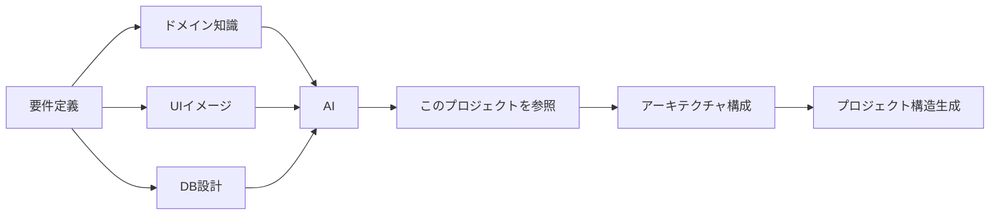
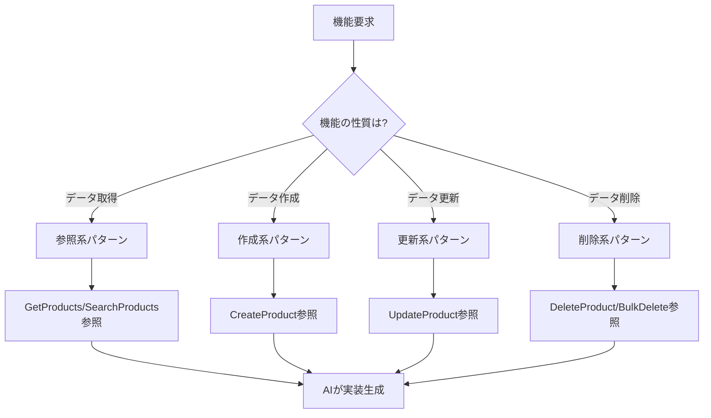

# 1. このプロジェクトについて

[← 目次に戻る](00_README.md)

---

## 🤖 AI駆動開発のための実装パターンカタログ

### このプロジェクトの真の目的

このプロジェクトは、**AI駆動開発における実装見本（パターンカタログ）**として設計されています。

従来の「ドキュメント+サンプルコード」ではなく、AIが**直接参照して実装を生成するためのリファレンス実装**です。

---

## 📖 使用シナリオ

### シナリオ1: 新規アプリケーション開発時



**AIへの指示例:**
```
「ECサイトを構築します。以下のドメインモデルを実装してください。
参考実装: VSASampleプロジェクトのアーキテクチャを使用」
```

**AIの動作:**
1. VSASampleの層構成を参照
2. Clean Architecture + CQRS + MediatRパターンを採用
3. Domainモデル、Application層、Infrastructure層を生成

---

### シナリオ2: 機能実装時（パターン参照）



**参照系機能の実装例:**

**AIへの指示:**
```
「商品を名前で検索し、価格でフィルタリングして、
ページング表示する機能を実装してください」
```

**AIの動作:**
1. `SearchProductsQuery/Handler` パターンを参照
2. フィルタリング条件をパラメータ化
3. Dapper を使った最適化クエリを生成
4. ページング処理を実装

**更新系機能の実装例:**

**AIへの指示:**
```
「商品の価格と在庫数を更新する機能を実装してください。
楽観的排他制御を含めてください」
```

**AIの動作:**
1. `UpdateProductCommand/Handler` パターンを参照
2. Versionフィールドを含めた楽観的排他制御を実装
3. `Product.ChangePrice()`, `Product.ChangeStock()` を呼び出し
4. IdempotencyKeyで重複実行を防止

---

## 🗂️ パターンの分類と構成

このプロジェクトのコードは、**技術的分類**ではなく**パターン単位**で整理されています。

### フォルダ構造の意図

```
src/ProductCatalog.Application/
  └── Features/
      └── Products/
          ├── CreateProduct/      ← 【作成パターン】
          │   ├── CreateProductCommand.cs
          │   ├── CreateProductHandler.cs
          │   └── CreateProductValidator.cs
          │
          ├── UpdateProduct/      ← 【更新パターン】
          │   ├── UpdateProductCommand.cs
          │   ├── UpdateProductHandler.cs
          │   └── UpdateProductValidator.cs
          │
          ├── DeleteProduct/      ← 【削除パターン】
          ├── BulkDeleteProducts/ ← 【一括削除パターン】
          ├── GetProducts/        ← 【一覧取得パターン】
          ├── GetProductById/     ← 【単一取得パターン】
          └── SearchProducts/     ← 【検索パターン】
```

**この構成の理由:**

✅ **機能単位で完結** - 1つのパターンに必要なファイルが全て1箇所に
✅ **AIが探しやすい** - 「更新機能」を実装したい → `UpdateProduct/` を見る
✅ **パターンの全体像が明確** - Command/Handler/Validatorの関係が見える
✅ **追加・削除が容易** - フォルダごと追加/削除すればよい

---

## 🎓 AIの学習パス（推奨順序）

### ステップ1: 基礎理解（1日目）

1. **このドキュメント** - プロジェクトの目的理解
2. [03_アーキテクチャ概要](03_アーキテクチャ概要.md) - 全体構成の把握
3. [05_パターンカタログ一覧](05_パターンカタログ一覧.md) - どんなパターンがあるか把握

### ステップ2: 層別理解（2-3日目）

1. **Domain層から** - ビジネスロジックの中核を理解
   - [11_Domain層の詳細設計](11_Domain層の詳細設計.md)
   - `src/ProductCatalog.Domain/Products/Product.cs` を読む

2. **Application層** - ユースケース実装パターンを理解
   - [10_Application層の詳細設計](10_Application層の詳細設計.md) (CQRS、Command/Query実装)
   - [08_具体例_商品管理機能](08_具体例_商品管理機能.md) (具体的な実装例)

3. **Infrastructure層** - 技術的詳細の実装を理解
   - [12_Infrastructure層の詳細設計](12_Infrastructure層の詳細設計.md)

4. **UI層** - ユーザーインタラクションを理解
   - [09_UI層の詳細設計](09_UI層の詳細設計.md)

### ステップ3: パターン別理解（4-5日目）

実際のコードを読みながら、パターンを習得:

**参照系:**
```
1. GetProducts (基本的な一覧取得)
   → src/ProductCatalog.Application/Features/Products/GetProducts/

2. GetProductById (単一取得)
   → src/ProductCatalog.Application/Features/Products/GetProductById/

3. SearchProducts (複雑な検索)
   → src/ProductCatalog.Application/Features/Products/SearchProducts/
```

**更新系:**
```
1. CreateProduct (作成)
   → src/ProductCatalog.Application/Features/Products/CreateProduct/

2. UpdateProduct (更新)
   → src/ProductCatalog.Application/Features/Products/UpdateProduct/

3. DeleteProduct (削除)
   → src/ProductCatalog.Application/Features/Products/DeleteProduct/

4. BulkDeleteProducts (一括削除)
   → src/ProductCatalog.Application/Features/Products/BulkDeleteProducts/
```

### ステップ4: 実践（6-7日目）

[19_AIへの実装ガイド](19_AIへの実装ガイド.md) を参考に:
- よくある実装ミスを確認
- パターンの組み合わせ方を学習
- 実装チェックリストで確認

---

## 🔍 パターンの探し方

### ケース1: 「〇〇機能を実装したい」

```
Q: 商品の価格を変更する機能を実装したい
A: 更新系パターン → UpdateProduct/ を参照

Q: 商品を検索して表示したい
A: 参照系パターン → SearchProducts/ を参照

Q: 複数の商品を一度に削除したい
A: 一括処理パターン → BulkDeleteProducts/ を参照
```

### ケース2: 「〇〇の技術的な実装を知りたい」

```
Q: 楽観的排他制御はどう実装する？
A: UpdateProductCommand を見る（Versionフィールド）

Q: ページング処理はどう実装する？
A: SearchProductsQuery を見る（Page/PageSize）

Q: 親子関係のエンティティはどう扱う？
A: Product.Images を見る（AddImage/RemoveImageメソッド）

Q: 状態遷移はどう制御する？
A: Product.Publish() を見る（Draft→Published）
```

### ケース3: 「〇〇のビジネスルールはどこに書く？」

```
Q: 在庫がある商品は削除できない
A: Product.Delete() 内に実装（Domain層）

Q: 公開中の商品は50%以上値下げできない
A: Product.ChangePrice() 内に実装（Domain層）

Q: 商品名は200文字以内
A: Product.ChangeName() 内に実装（Domain層）
   または Validator で検証（Application層）
```

---

## ⚙️ AIが参照すべきコンポーネント

### コード内のコメント

すべてのパターンには、以下の情報が含まれています:

```csharp
/// <summary>
/// 商品更新Command
///
/// 【パターン: 更新系Command】
///
/// 使用シナリオ:
/// - 既存データの部分的な変更が必要な場合
/// - 楽観的排他制御が必要な場合
///
/// 実装ガイド:
/// - 必ずVersionを含めて楽観的排他制御を実装
/// - 部分更新の場合は、変更するフィールドのみをパラメータに含める
/// - 冪等性キーを含めて重複実行を防止
///
/// AI実装時の注意:
/// - Handler内でEntity.ChangeXxx()メソッドを呼ぶ
/// - 直接フィールドを変更しない
/// - 変更がない場合は早期リターン
/// </summary>
public sealed record UpdateProductCommand(...) : ICommand<Result>
```

**AIはこれらのコメントを読んで:**
- いつこのパターンを使うべきか理解
- 実装時の注意点を把握
- よくあるミスを回避

---

## 🎯 このプロジェクトが目指すもの

### ゴール

**AIがこのプロジェクトだけを見れば、エンタープライズグレードのBlazorアプリケーションを実装できる**

### 含まれているもの

- ✅ 基本CRUD操作の完全な実装例
- ✅ 検索、フィルタリング、ページング
- ✅ 一括処理パターン
- ✅ 複雑なドメインモデル（集約ルート、親子関係、状態遷移）
- ✅ 横断的関心事（Logging, Validation, Caching, Transaction, Idempotency）
- ✅ SignalRによるリアルタイム更新
- ✅ 楽観的排他制御
- ✅ Outboxパターン（分散トランザクション）

### 含まれていないもの

- ❌ 認証・認可の詳細実装（基本的なRoleベース認証のみ）
- ❌ 完全なテストコード（別フェーズで追加予定）
- ❌ Inbox/Sagaパターン（将来の拡張）

---

## 📚 次に読むべきドキュメント

1. [03_アーキテクチャ概要](03_アーキテクチャ概要.md) - 全体構成の理解
2. [05_パターンカタログ一覧](05_パターンカタログ一覧.md) - 利用可能なパターンの把握
3. [19_AIへの実装ガイド](19_AIへの実装ガイド.md) - 実装時の注意点

---

**🤖 このドキュメントは、AIがこのプロジェクトを効果的に活用するために作成されています**
