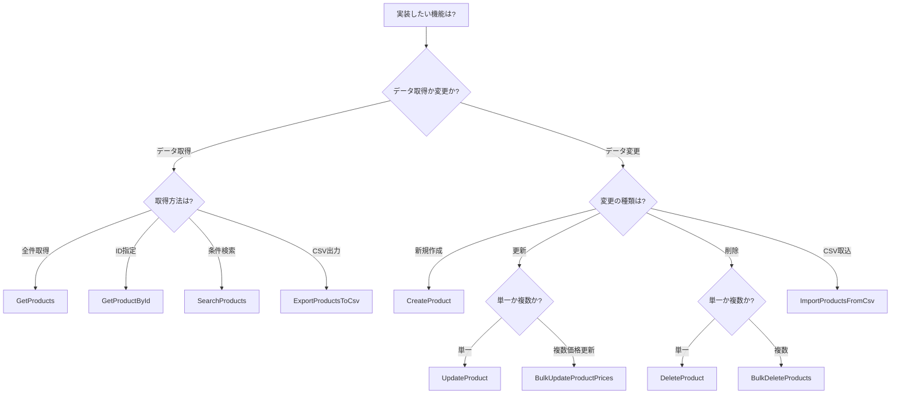

# 3. パターンカタログ一覧

[← 目次に戻る](00_README.md)

---

## 📚 このプロジェクトで提供されるパターン

このドキュメントは、AI駆動開発で参照すべきパターンの完全なインデックスです。

---

## 🗂️ パターン分類

### 1. 参照系パターン（Query）

データを取得するための読み取り専用パターン。

| パターン名 | 使用シナリオ | 複雑度 | 実装場所 |
|-----------|------------|-------|---------|
| **GetProducts** | 全商品の一覧取得 | ⭐ 簡単 | `/Features/Products/GetProducts/` |
| **GetProductById** | IDで単一商品を取得 | ⭐ 簡単 | `/Features/Products/GetProductById/` |
| **SearchProducts** | 複雑な検索、フィルタリング、ページング | ⭐⭐⭐ 複雑 | `/Features/Products/SearchProducts/` |
| **ExportProductsToCsv** | 検索結果のCSVエクスポート | ⭐⭐ 普通 | `/Features/Products/ExportProductsToCsv/` |

#### GetProducts - 一覧取得パターン

**いつ使うか:**
- 全データを取得して表示したい場合
- フィルタリングやページングが不要な場合
- キャッシュを効かせたい場合

**特徴:**
```csharp
// ✅ シンプルなQuery
public sealed record GetProductsQuery() : IQuery<Result<IEnumerable<ProductDto>>>, ICacheableQuery
{
    public string GetCacheKey() => "products-all";
    public int CacheDurationMinutes => 5;
}

// ✅ Dapperで最適化されたクエリ
public async Task<IEnumerable<ProductDto>> Handle(GetProductsQuery query, CancellationToken ct)
{
    // Readモデル（Dapper）で高速取得
    var sql = "SELECT Id, Name, Description, Price, Stock, Status FROM Products WHERE IsDeleted = 0";
    return await _connection.QueryAsync<ProductDto>(sql);
}
```

**ファイル:**
- `GetProductsQuery.cs` - Query定義
- `GetProductsHandler.cs` - 取得ロジック

---

#### GetProductById - 単一取得パターン

**いつ使うか:**
- 詳細画面で単一のエンティティを表示したい場合
- 編集画面でデータをロードしたい場合

**特徴:**
```csharp
// ✅ IDで検索
public sealed record GetProductByIdQuery(Guid ProductId)
    : IQuery<Result<ProductDetailDto>>, ICacheableQuery
{
    public string GetCacheKey() => $"product_{ProductId}";
    public int CacheDurationMinutes => 10;
}

// ✅ 関連データも含めて取得
public async Task<ProductDetailDto> Handle(GetProductByIdQuery query, CancellationToken ct)
{
    // Repository経由で集約全体を取得
    var product = await _repository.GetAsync(new ProductId(query.ProductId), ct);

    // DTOに変換（画像も含む）
    return ProductDetailDto.FromDomain(product);
}
```

**ファイル:**
- `GetProductByIdQuery.cs`
- `GetProductByIdHandler.cs`
- `ProductDetailDto.cs` - 詳細情報用DTO

---

#### SearchProducts - 検索・フィルタリング・ページングパターン

**いつ使うか:**
- ユーザーが条件を指定してデータを検索する場合
- 大量データをページング表示する場合
- 複数の条件でフィルタリングする場合

**特徴:**
```csharp
// ✅ 柔軟な検索条件
public sealed record SearchProductsQuery(
    string? NameFilter = null,        // 名前で部分一致検索
    decimal? MinPrice = null,         // 最低価格
    decimal? MaxPrice = null,         // 最高価格
    ProductStatus? Status = null,     // ステータス
    int Page = 1,                     // ページ番号（1始まり）
    int PageSize = 20,                // ページサイズ
    string OrderBy = "Name",          // ソート項目
    bool IsDescending = false         // 降順か
) : IQuery<Result<PagedResult<ProductDto>>>, ICacheableQuery;

// ✅ 動的クエリ生成
public async Task<PagedResult<ProductDto>> Handle(SearchProductsQuery query, CancellationToken ct)
{
    var sql = new StringBuilder("SELECT * FROM Products WHERE IsDeleted = 0");
    var parameters = new DynamicParameters();

    // 条件に応じてWHERE句を追加
    if (!string.IsNullOrEmpty(query.NameFilter))
    {
        sql.Append(" AND Name LIKE @NameFilter");
        parameters.Add("NameFilter", $"%{query.NameFilter}%");
    }

    if (query.MinPrice.HasValue)
    {
        sql.Append(" AND Price >= @MinPrice");
        parameters.Add("MinPrice", query.MinPrice.Value);
    }

    // ソート、ページング処理...
}
```

**ファイル:**
- `SearchProductsQuery.cs`
- `SearchProductsHandler.cs`
- `PagedResult.cs` - ページング結果を表すDTO

---

#### ExportProductsToCsv - CSVエクスポートパターン

**いつ使うか:**
- 検索結果をCSVファイルでダウンロードしたい場合
- Excel等の外部ツールでデータ分析したい場合
- データバックアップやデータ移行の準備

**特徴:**
```csharp
// ✅ 検索条件を受け取り、CSVバイナリを返す
public sealed record ExportProductsToCsvQuery(
    string? NameFilter = null,
    decimal? MinPrice = null,
    decimal? MaxPrice = null,
    ProductStatus? Status = null
) : IQuery<Result<byte[]>>;  // バイナリデータを返す

// ✅ CsvHelperでCSV生成
public async Task<Result<byte[]>> Handle(ExportProductsToCsvQuery query, CancellationToken ct)
{
    // 1. 検索条件でデータ取得（上限10,000件）
    var products = await GetProductsByFilterAsync(query, maxResults: 10000, ct);

    // 2. MemoryStreamでCSV生成
    using var memoryStream = new MemoryStream();
    using var writer = new StreamWriter(memoryStream, new UTF8Encoding(true)); // BOM付きUTF-8
    using var csv = new CsvWriter(writer, CultureInfo.GetCultureInfo("ja-JP"));

    // 3. ヘッダー書き込み
    csv.WriteField("商品ID");
    csv.WriteField("商品名");
    csv.WriteField("価格");
    csv.WriteField("在庫");
    csv.NextRecord();

    // 4. データ書き込み
    foreach (var product in products)
    {
        csv.WriteField(product.Id);
        csv.WriteField(product.Name);
        csv.WriteField(product.Price);
        csv.WriteField(product.Stock);
        csv.NextRecord();
    }

    await writer.FlushAsync();
    return Result.Success(memoryStream.ToArray());
}
```

**UI側の使用例:**
```csharp
// PageActions
public async Task ExportToCsvAsync(CancellationToken ct = default)
{
    var query = new ExportProductsToCsvQuery(
        NameFilter: _store.GetState().SearchFilter.Name,
        MinPrice: _store.GetState().SearchFilter.MinPrice,
        MaxPrice: _store.GetState().SearchFilter.MaxPrice,
        Status: _store.GetState().SearchFilter.Status
    );

    var result = await _mediator.Send(query, ct);

    if (result.IsSuccess)
    {
        // ブラウザでダウンロード
        var fileName = $"products_{DateTime.Now:yyyyMMddHHmmss}.csv";
        await _jsRuntime.InvokeVoidAsync("downloadFile", fileName, "text/csv", result.Value);
        _toast.Success("CSVファイルをダウンロードしました");
    }
}
```

**ファイル:**
- `ExportProductsToCsvQuery.cs`
- `ExportProductsToCsvHandler.cs`

---

### 2. 更新系パターン（Command）

データを変更するための書き込みパターン。

| パターン名 | 使用シナリオ | 複雑度 | 実装場所 |
|-----------|------------|-------|---------|
| **CreateProduct** | 新規商品の作成 | ⭐⭐ 普通 | `/Features/Products/CreateProduct/` |
| **UpdateProduct** | 既存商品の更新 | ⭐⭐⭐ 複雑 | `/Features/Products/UpdateProduct/` |
| **DeleteProduct** | 単一商品の削除 | ⭐⭐ 普通 | `/Features/Products/DeleteProduct/` |
| **BulkDeleteProducts** | 複数商品の一括削除 | ⭐⭐⭐ 複雑 | `/Features/Products/BulkDeleteProducts/` |
| **BulkUpdateProductPrices** | 複数商品の価格一括更新 | ⭐⭐⭐ 複雑 | `/Features/Products/BulkUpdateProductPrices/` |
| **ImportProductsFromCsv** | CSVファイルから一括インポート | ⭐⭐⭐⭐ 高度 | `/Features/Products/ImportProductsFromCsv/` |

#### CreateProduct - 作成パターン

**いつ使うか:**
- 新しいエンティティを作成する場合
- ファクトリメソッドで初期化したい場合

**特徴:**
```csharp
// ✅ 必要な情報だけをパラメータに
public sealed record CreateProductCommand(
    string Name,
    string Description,
    decimal Price,
    int InitialStock
) : ICommand<Result<Guid>>  // 作成されたIDを返す
{
    public string IdempotencyKey { get; init; } = Guid.NewGuid().ToString();
}

// ✅ ファクトリメソッド経由で作成
public async Task<Result<Guid>> Handle(CreateProductCommand command, CancellationToken ct)
{
    // Domainのファクトリメソッドで作成
    var product = Product.Create(
        command.Name,
        command.Description,
        new Money(command.Price),
        command.InitialStock
    );

    await _repository.SaveAsync(product, ct);

    return Result.Success(product.Id.Value);
}
```

**ファイル:**
- `CreateProductCommand.cs`
- `CreateProductHandler.cs`
- `CreateProductValidator.cs` - 入力検証

---

#### UpdateProduct - 更新パターン

**いつ使うか:**
- 既存データの一部または全部を変更したい場合
- 楽観的排他制御が必要な場合

**特徴:**
```csharp
// ✅ Versionで楽観的排他制御
public sealed record UpdateProductCommand(
    Guid ProductId,
    string Name,
    string Description,
    decimal Price,
    int Stock,
    long Version  // 楽観的排他制御用
) : ICommand<Result>
{
    public string IdempotencyKey { get; init; } = Guid.NewGuid().ToString();
}

// ✅ エンティティのメソッド経由で変更
public async Task<Result> Handle(UpdateProductCommand command, CancellationToken ct)
{
    var product = await _repository.GetAsync(new ProductId(command.ProductId), ct);

    if (product is null)
        return Result.Fail("商品が見つかりません");

    // Versionチェック（楽観的排他制御）
    if (product.Version != command.Version)
        return Result.Fail("他のユーザーによって更新されています。最新データを取得してください。");

    // ドメインメソッド経由で変更
    product.ChangeName(command.Name);
    product.ChangeDescription(command.Description);
    product.ChangePrice(new Money(command.Price));
    product.ChangeStock(command.Stock);

    await _repository.SaveAsync(product, ct);

    return Result.Success();
}
```

**ファイル:**
- `UpdateProductCommand.cs`
- `UpdateProductHandler.cs`
- `UpdateProductValidator.cs`

---

#### DeleteProduct - 削除パターン

**いつ使うか:**
- 単一のエンティティを削除したい場合
- 削除前にビジネスルールを検証したい場合（在庫チェックなど）

**特徴:**
```csharp
// ✅ IDのみ指定
public sealed record DeleteProductCommand(Guid ProductId) : ICommand<Result>
{
    public string IdempotencyKey { get; init; } = Guid.NewGuid().ToString();
}

// ✅ ドメインロジックで検証
public async Task<Result> Handle(DeleteProductCommand command, CancellationToken ct)
{
    var product = await _repository.GetAsync(new ProductId(command.ProductId), ct);

    if (product is null)
        return Result.Fail("商品が見つかりません");

    try
    {
        // ドメインロジックで検証（在庫がある商品は削除不可など）
        product.Delete();
    }
    catch (DomainException ex)
    {
        return Result.Fail(ex.Message);
    }

    await _repository.SaveAsync(product, ct);

    return Result.Success();
}
```

**ファイル:**
- `DeleteProductCommand.cs`
- `DeleteProductHandler.cs`
- `DeleteProductValidator.cs`

---

#### BulkDeleteProducts - 一括削除パターン

**いつ使うか:**
- 複数のエンティティを一度に削除したい場合
- UI上でチェックボックスで複数選択して削除する場合

**特徴:**
```csharp
// ✅ 複数IDを受け取る
public sealed record BulkDeleteProductsCommand(
    IEnumerable<Guid> ProductIds
) : ICommand<Result<BulkOperationResult>>
{
    public string IdempotencyKey { get; init; } = Guid.NewGuid().ToString();
}

// ✅ 各削除は個別に検証
public async Task<Result<BulkOperationResult>> Handle(BulkDeleteProductsCommand command, CancellationToken ct)
{
    var succeeded = 0;
    var failed = 0;
    var errors = new List<string>();

    foreach (var productId in command.ProductIds)
    {
        var product = await _repository.GetAsync(new ProductId(productId), ct);

        if (product is null)
        {
            failed++;
            errors.Add($"商品 {productId} が見つかりません");
            continue;
        }

        try
        {
            product.Delete();  // 各削除はビジネスルール検証を通す
            await _repository.SaveAsync(product, ct);
            succeeded++;
        }
        catch (DomainException ex)
        {
            failed++;
            errors.Add($"商品 {productId}: {ex.Message}");
        }
    }

    return Result.Success(new BulkOperationResult(succeeded, failed, errors));
}
```

**ファイル:**
- `BulkDeleteProductsCommand.cs`
- `BulkDeleteProductsHandler.cs`
- `BulkOperationResult.cs`

---

#### BulkUpdateProductPrices - 一括価格更新パターン

**いつ使うか:**
- セール時に複数商品の価格を一括変更したい場合
- 価格改定を一括で適用したい場合
- 商品グループごとの価格調整

**特徴:**
```csharp
// ✅ ProductId、新価格、Versionのリストを受け取る
public sealed record BulkUpdateProductPricesCommand(
    IReadOnlyList<ProductPriceUpdate> Updates
) : ICommand<Result<BulkOperationResult>>
{
    public string IdempotencyKey { get; init; } = Guid.NewGuid().ToString();
}

public record ProductPriceUpdate(
    Guid ProductId,
    decimal NewPrice,
    int Version  // 楽観的排他制御
);

// ✅ 各商品のビジネスルールを個別に検証
public async Task<Result<BulkOperationResult>> Handle(
    BulkUpdateProductPricesCommand command,
    CancellationToken ct)
{
    // 上限チェック（例: 100件まで）
    if (command.Updates.Count > 100)
        return Result.Fail("一度に更新できる商品は100件までです");

    var succeeded = 0;
    var failed = 0;
    var errors = new List<string>();

    foreach (var update in command.Updates)
    {
        var product = await _repository.GetAsync(new ProductId(update.ProductId), ct);

        if (product is null)
        {
            failed++;
            errors.Add($"商品 {update.ProductId} が見つかりません");
            continue;
        }

        // Versionチェック
        if (product.Version != update.Version)
        {
            failed++;
            errors.Add($"商品 {update.ProductId} は他のユーザーによって更新されています");
            continue;
        }

        try
        {
            // ドメインメソッドで価格変更（50%以上の値下げ制限などのルールを適用）
            product.ChangePrice(new Money(update.NewPrice));
            await _repository.SaveAsync(product, ct);
            succeeded++;
        }
        catch (DomainException ex)
        {
            failed++;
            errors.Add($"商品 {update.ProductId}: {ex.Message}");
        }
    }

    return Result.Success(new BulkOperationResult(succeeded, failed, errors));
}
```

**ファイル:**
- `BulkUpdateProductPricesCommand.cs`
- `BulkUpdateProductPricesHandler.cs`
- `ProductPriceUpdate.cs`

---

#### ImportProductsFromCsv - CSVインポートパターン

**いつ使うか:**
- CSVファイルから商品データを一括登録したい場合
- 外部システムからのデータ移行
- バックアップデータの復元

**特徴:**
```csharp
// ✅ Streamで受け取る（メモリ効率）
public sealed record ImportProductsFromCsvCommand(
    Stream CsvStream
) : ICommand<Result<BulkOperationResult>>
{
    public string IdempotencyKey { get; init; } = Guid.NewGuid().ToString();
}

// ✅ ストリーム処理で大量データを効率的に処理
public async Task<Result<BulkOperationResult>> Handle(
    ImportProductsFromCsvCommand command,
    CancellationToken ct)
{
    // ファイルサイズチェック（例: 10MB まで）
    if (command.CsvStream.Length > 10 * 1024 * 1024)
        return Result.Fail("ファイルサイズは10MBまでです");

    var succeeded = 0;
    var failed = 0;
    var errors = new List<string>();
    var rowNumber = 1;

    using var reader = new StreamReader(command.CsvStream, Encoding.UTF8);
    using var csv = new CsvReader(reader, CultureInfo.GetCultureInfo("ja-JP"));

    // ヘッダー行を読み飛ばす
    await csv.ReadAsync();
    csv.ReadHeader();

    // 行ごとに処理（最大1,000件）
    while (await csv.ReadAsync() && rowNumber <= 1000)
    {
        rowNumber++;

        try
        {
            // CSV行をパース
            var name = csv.GetField<string>("商品名");
            var description = csv.GetField<string>("説明");
            var price = csv.GetField<decimal>("価格");
            var stock = csv.GetField<int>("在庫");

            // バリデーション
            if (string.IsNullOrEmpty(name))
            {
                failed++;
                errors.Add($"{rowNumber}行目: 商品名は必須です");
                continue;
            }

            // ドメインファクトリで作成
            var product = Product.Create(name, description, new Money(price), stock);
            await _repository.SaveAsync(product, ct);
            succeeded++;
        }
        catch (Exception ex)
        {
            failed++;
            errors.Add($"{rowNumber}行目: {ex.Message}");
        }
    }

    if (rowNumber > 1000)
        errors.Add("1,000件を超える行は無視されました");

    return Result.Success(new BulkOperationResult(succeeded, failed, errors));
}
```

**UI側の使用例:**
```csharp
// PageActions
public async Task ImportFromCsvAsync(IBrowserFile file, CancellationToken ct = default)
{
    // ファイルサイズチェック
    if (file.Size > 10 * 1024 * 1024)
    {
        _toast.Error("ファイルサイズは10MBまでです");
        return;
    }

    await using var stream = file.OpenReadStream(maxAllowedSize: 10 * 1024 * 1024);
    var command = new ImportProductsFromCsvCommand(stream);
    var result = await _mediator.Send(command, ct);

    if (result.IsSuccess)
    {
        var bulkResult = result.Value;
        _toast.Success($"{bulkResult.Succeeded}件インポートしました");

        if (bulkResult.Failed > 0)
        {
            // エラー詳細をダイアログ表示
            await _dialog.ShowAsync("インポート結果", string.Join("\n", bulkResult.Errors));
        }

        await _store.LoadAsync(ct);  // リスト再読み込み
    }
}
```

**ファイル:**
- `ImportProductsFromCsvCommand.cs`
- `ImportProductsFromCsvHandler.cs`

---

### 3. Domain層パターン

ビジネスロジックを実装するためのパターン。

| パターン名 | 使用シナリオ | 実装場所 |
|-----------|------------|---------|
| **AggregateRoot** | 集約ルートの基底クラス | `/Domain/Common/AggregateRoot.cs` |
| **親子関係** | Product-ProductImage | `/Domain/Products/Product.cs` |
| **状態遷移** | ProductStatus管理 | `/Domain/Products/Product.cs` |
| **複雑なビジネスルール** | 価格変更制限など | `/Domain/Products/Product.cs` |

詳細は [06_Domain層パターン](06_Domain層パターン.md) を参照。

---

### 4. 横断的関心事パターン

すべてのCommand/Queryに適用される共通機能。

| パターン名 | 役割 | 実装場所 |
|-----------|-----|---------|
| **MetricsBehavior** | パフォーマンス・ビジネスメトリクス収集 | `/Infrastructure/Behaviors/` |
| **LoggingBehavior** | リクエスト/レスポンスのロギング | `/Application/Common/Behaviors/` |
| **ValidationBehavior** | FluentValidationによる入力検証 | `/Application/Common/Behaviors/` |
| **AuthorizationBehavior** | ロールベース認可 | `/Infrastructure/Behaviors/` |
| **IdempotencyBehavior** | 冪等性保証 | `/Infrastructure/Behaviors/` |
| **CachingBehavior** | クエリ結果のキャッシュ | `/Infrastructure/Behaviors/` |
| **AuditLogBehavior** | ユーザーアクション・データ変更の監査記録 | `/Infrastructure/Behaviors/` |
| **TransactionBehavior** | トランザクション管理 | `/Infrastructure/Behaviors/` |

詳細は [横断的関心事の詳細設計](../../architecture/cross-cutting-concerns.md) を参照。

---

## 🎯 パターン選択フローチャート



---

## 📖 次に読むべきドキュメント

### パターン別の詳細ガイド

- [04_基本パターン_参照系](04_基本パターン_参照系.md) - Query実装の詳細
- [05_基本パターン_更新系](05_基本パターン_更新系.md) - Command実装の詳細
- [06_Domain層パターン](06_Domain層パターン.md) - ドメインモデルの実装
- [10_AIへの実装ガイド](10_AIへの実装ガイド.md) - 実装時の注意点

---

**🤖 パターンを選択したら、該当するフォルダのコードを直接参照してください**
