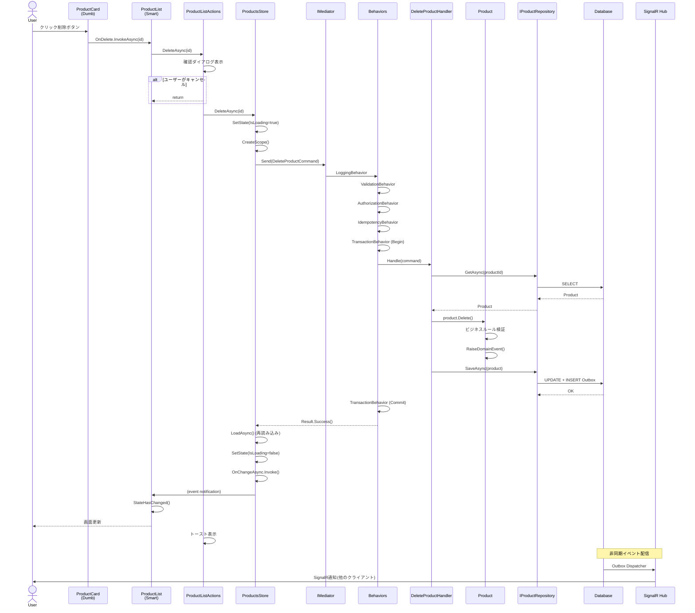

# 6. 具体例: 商品管理機能

[← 目次に戻る](00_README.md)

---

## 6. 具体例: 商品管理機能

### 6.1 ユースケース概要

**機能**: 商品一覧画面での削除処理

**要件**:
- 管理者のみが削除可能
- 在庫がある商品は削除不可
- 削除時に確認ダイアログを表示
- 削除成功時にトースト通知
- 他のユーザーの画面もリアルタイムで更新
- 二重クリック防止

### 6.2 処理フロー(削除ボタンクリック時)



### 6.3 関連クラス図

```
┌─────────────────────────────────────────────────────────────┐
│  UI Layer (Blazor Components)                               │
├─────────────────────────────────────────────────────────────┤
│                                                             │
│  ┌──────────────────┐         ┌──────────────────────┐     │
│  │ ProductCard      │         │ ProductList          │     │
│  │ (Dumb)           │───────▶ │ (Smart)              │     │
│  ├──────────────────┤         ├──────────────────────┤     │
│  │ + Product        │         │ - Store: ProductsStore│    │
│  │ + OnDelete       │         │ - Actions: Actions   │     │
│  └──────────────────┘         └────────┬─────────────┘     │
│                                         │                   │
│                          ┌──────────────▼───────────────┐   │
│                          │ ProductListActions           │   │
│                          ├──────────────────────────────┤   │
│                          │ - _store: ProductsStore      │   │
│                          │ - _confirm: IConfirmDialog   │   │
│                          │ - _toast: IToast             │   │
│                          ├──────────────────────────────┤   │
│                          │ + LoadAsync()                │   │
│                          │ + DeleteAsync(id)            │   │
│                          └──────────┬───────────────────┘   │
│                                     │                       │
│                          ┌──────────▼───────────────┐       │
│                          │ ProductsStore            │       │
│                          ├──────────────────────────┤       │
│                          │ - _state: ProductsState  │       │
│                          │ - _scopeFactory          │       │
│                          ├──────────────────────────┤       │
│                          │ + GetState()             │       │
│                          │ + LoadAsync()            │       │
│                          │ + DeleteAsync(id)        │       │
│                          │ + OnChangeAsync: event   │       │
│                          └──────────┬───────────────┘       │
│                                     │                       │
│                          ┌──────────▼───────────────┐       │
│                          │ ProductsState (record)   │       │
│                          ├──────────────────────────┤       │
│                          │ + Products: ImmutableList│       │
│                          │ + IsLoading: bool        │       │
│                          │ + ErrorMessage: string?  │       │
│                          └──────────────────────────┘       │
└─────────────────────────────────────────────────────────────┘

┌─────────────────────────────────────────────────────────────┐
│  Application Layer                                          │
├─────────────────────────────────────────────────────────────┤
│                                                             │
│  ┌──────────────────────────────────────────────┐          │
│  │ DeleteProductCommand (record)                │          │
│  ├──────────────────────────────────────────────┤          │
│  │ + ProductId: Guid                            │          │
│  │ + IdempotencyKey: string                     │          │
│  └────────────────┬─────────────────────────────┘          │
│                   │ implements ICommand<Result>            │
│                   │                                        │
│  ┌────────────────▼─────────────────────────────┐          │
│  │ DeleteProductHandler                         │          │
│  ├──────────────────────────────────────────────┤          │
│  │ - _repository: IProductRepository            │          │
│  ├──────────────────────────────────────────────┤          │
│  │ + Handle(command, ct): Task<Result>          │          │
│  └────────────────┬─────────────────────────────┘          │
│                   │                                        │
│  ┌────────────────▼─────────────────────────────┐          │
│  │ IPipelineBehavior<TRequest, TResponse>       │          │
│  ├──────────────────────────────────────────────┤          │
│  │ - LoggingBehavior                            │          │
│  │ - ValidationBehavior                         │          │
│  │ - AuthorizationBehavior                      │          │
│  │ - IdempotencyBehavior                        │          │
│  │ - TransactionBehavior                        │          │
│  └──────────────────────────────────────────────┘          │
└─────────────────────────────────────────────────────────────┘

┌─────────────────────────────────────────────────────────────┐
│  Domain Layer                                               │
├─────────────────────────────────────────────────────────────┤
│                                                             │
│  ┌──────────────────────────────────────────────┐          │
│  │ Product (Aggregate Root)                     │          │
│  ├──────────────────────────────────────────────┤          │
│  │ - _id: ProductId                             │          │
│  │ - _name: string                              │          │
│  │ - _price: Money                              │          │
│  │ - _stock: int                                │          │
│  │ - _domainEvents: List<DomainEvent>           │          │
│  ├──────────────────────────────────────────────┤          │
│  │ + Delete(): void                             │          │
│  │ + ChangeName(name): void                     │          │
│  │ - RaiseDomainEvent(event): void              │          │
│  └──────────────────────────────────────────────┘          │
│                                                             │
│  ┌──────────────────────────────────────────────┐          │
│  │ IProductRepository                           │          │
│  ├──────────────────────────────────────────────┤          │
│  │ + GetAsync(id, ct): Task<Product?>           │          │
│  │ + SaveAsync(product, ct): Task               │          │
│  └──────────────────────────────────────────────┘          │
└─────────────────────────────────────────────────────────────┘

┌─────────────────────────────────────────────────────────────┐
│  Infrastructure Layer                                       │
├─────────────────────────────────────────────────────────────┤
│                                                             │
│  ┌──────────────────────────────────────────────┐          │
│  │ EfProductRepository                          │          │
│  ├──────────────────────────────────────────────┤          │
│  │ - _context: AppDbContext                     │          │
│  ├──────────────────────────────────────────────┤          │
│  │ + GetAsync(id, ct): Task<Product?>           │          │
│  │ + SaveAsync(product, ct): Task               │          │
│  └──────────────────────────────────────────────┘          │
│                                                             │
│  ┌──────────────────────────────────────────────┐          │
│  │ AppDbContext                                 │          │
│  ├──────────────────────────────────────────────┤          │
│  │ + Products: DbSet<Product>                   │          │
│  │ + OutboxMessages: DbSet<OutboxMessage>       │          │
│  └──────────────────────────────────────────────┘          │
└─────────────────────────────────────────────────────────────┘
```

---
