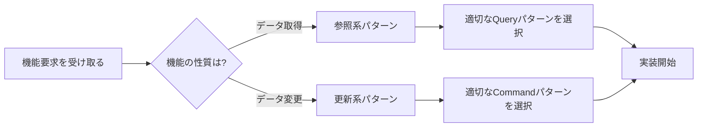
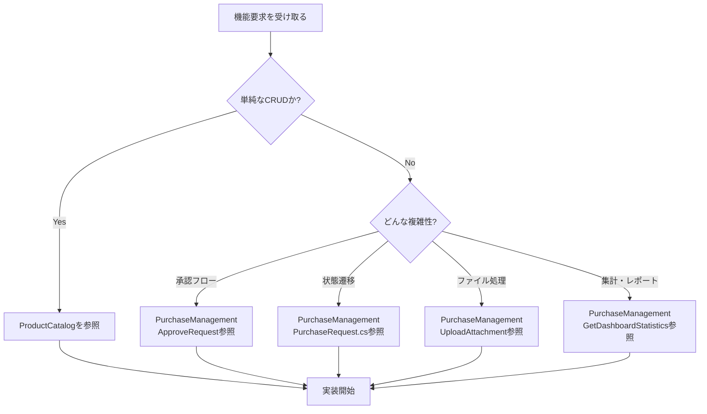

# 19. AIへの実装ガイド

[← 目次に戻る](00_README.md)

---

## 🤖 このドキュメントの目的

このガイドは、AIがこのプロジェクトを参照して**正しく実装を生成する**ための実践的な指針です。

---

## 📋 実装の基本フロー

### ステップ1: パターンを特定する



**例:**
```
ユーザー: 「商品の価格を変更する機能を実装して」
AI判断: データ変更 → 更新系パターン → UpdateProductパターンを参照
```

### ステップ2: 参照すべきファイルを特定する

**パターンが決まったら、対応する機能スライスの全ファイルを参照:**

```
src/ProductCatalog/Features/UpdateProduct/
├── Application/
│   ├── UpdateProductCommand.cs      ← Commandの定義を学ぶ
│   ├── UpdateProductHandler.cs      ← ビジネスロジックの流れを学ぶ
│   └── UpdateProductValidator.cs    ← 入力検証のパターンを学ぶ
├── Domain/
│   └── Product.cs                   ← ビジネスルールを学ぶ
├── Infrastructure/
│   └── EfProductRepository.cs       ← 永続化パターンを学ぶ
└── UI/
    └── UpdateProductPage.razor      ← UI実装パターンを学ぶ
```

### ステップ3: コード内のコメントを読む

**各ファイルには、以下の情報が含まれています:**

```csharp
/// <summary>
/// 商品更新Command
///
/// 【パターン: 更新系Command】
///
/// 使用シナリオ:                    ← いつ使うか
/// - 既存データの部分的な変更が必要な場合
/// - 楽観的排他制御が必要な場合
///
/// 実装ガイド:                      ← 実装時の注意点
/// - 必ずVersionを含めて楽観的排他制御を実装
/// - 部分更新の場合は、変更するフィールドのみをパラメータに含める
///
/// AI実装時の注意:                  ← AIが特に注意すべきこと
/// - Handler内でEntity.ChangeXxx()メソッドを呼ぶ
/// - 直接フィールドを変更しない
/// </summary>
```

**これらのコメントを必ず読んでから実装を開始してください。**

### ステップ4: パターンを新しいドメインに適用する

**例: 「注文（Order）」ドメインに適用**

```
参照: UpdateProduct/
  ↓ パターンを抽出
  ↓
適用: UpdateOrder/
  ├── UpdateOrderCommand.cs
  │   public sealed record UpdateOrderCommand(
  │       Guid OrderId,
  │       OrderStatus Status,
  │       string ShippingAddress,
  │       long Version  ← 楽観的排他制御（パターンから学習）
  │   ) : ICommand<Result>
  │   {
  │       public string IdempotencyKey { get; init; } = Guid.NewGuid().ToString();
  │       ↑ 冪等性キー（パターンから学習）
  │   }
  │
  ├── UpdateOrderHandler.cs
  │   public async Task<Result> Handle(UpdateOrderCommand command, CancellationToken ct)
  │   {
  │       var order = await _repository.GetAsync(new OrderId(command.OrderId), ct);
  │
  │       if (order.Version != command.Version)  ← パターンから学習
  │           return Result.Fail("競合が発生しました");
  │
  │       order.ChangeStatus(command.Status);    ← Domainメソッド経由（パターンから学習）
  │       order.ChangeShippingAddress(command.ShippingAddress);
  │
  │       await _repository.SaveAsync(order, ct);
  │       return Result.Success();
  │   }
  │
  └── UpdateOrderValidator.cs
      public class UpdateOrderValidator : AbstractValidator<UpdateOrderCommand>
      {
          public UpdateOrderValidator()
          {
              RuleFor(x => x.OrderId).NotEmpty();  ← パターンから学習
              RuleFor(x => x.Version).GreaterThan(0);
          }
      }
```

---

## ⚠️ よくある実装ミス（アンチパターン）

### ❌ ミス1: Handler内にビジネスロジックを書く

**悪い例:**
```csharp
public async Task<Result> Handle(UpdateProductCommand command, CancellationToken ct)
{
    var product = await _repository.GetAsync(...);

    // ❌ ビジネスルールがHandler内に！
    if (product.Status == ProductStatus.Published && command.Price < product.Price * 0.5m)
    {
        return Result.Fail("公開中の商品は50%以上値下げできません");
    }

    product.Price = command.Price;  // ❌ 直接フィールドを変更

    await _repository.SaveAsync(product, ct);
    return Result.Success();
}
```

**良い例:**
```csharp
public async Task<Result> Handle(UpdateProductCommand command, CancellationToken ct)
{
    var product = await _repository.GetAsync(...);

    try
    {
        // ✅ ドメインメソッドを呼ぶだけ
        product.ChangePrice(new Money(command.Price));
    }
    catch (DomainException ex)
    {
        // ✅ ドメイン例外をResultに変換
        return Result.Fail(ex.Message);
    }

    await _repository.SaveAsync(product, ct);
    return Result.Success();
}
```

**なぜ？**
- ビジネスルールは**Domain層**に実装する
- Handler は**オーケストレーション**のみ（取得→ドメインメソッド呼び出し→保存）

---

### ❌ ミス2: Validatorでビジネスルールを検証する

**悪い例:**
```csharp
public class UpdateProductValidator : AbstractValidator<UpdateProductCommand>
{
    public UpdateProductValidator()
    {
        RuleFor(x => x.ProductId).NotEmpty();  // ✅ OK（入力検証）

        RuleFor(x => x.Price)
            .GreaterThan(0)  // ✅ OK（入力検証）
            .Must((command, price) =>
            {
                // ❌ ビジネスルールをValidatorで検証！
                // 「在庫がある商品は価格を下げられない」などのルール
                var product = _repository.GetAsync(...).Result;
                return product.Stock == 0 || price >= product.Price;
            });
    }
}
```

**良い例:**
```csharp
public class UpdateProductValidator : AbstractValidator<UpdateProductCommand>
{
    public UpdateProductValidator()
    {
        // ✅ 入力検証のみ
        RuleFor(x => x.ProductId).NotEmpty();
        RuleFor(x => x.Price).GreaterThan(0).WithMessage("価格は0より大きい必要があります");
        RuleFor(x => x.Stock).GreaterThanOrEqualTo(0).WithMessage("在庫は0以上である必要があります");
        RuleFor(x => x.Version).GreaterThan(0);
    }
}

// ビジネスルールはDomain層で
public sealed class Product : AggregateRoot<ProductId>
{
    public void ChangePrice(Money newPrice)
    {
        // ✅ ビジネスルール
        if (_status == ProductStatus.Published)
        {
            var discountRate = 1 - (newPrice.Amount / _price.Amount);
            if (discountRate > 0.5m)
                throw new DomainException("公開中の商品は50%以上の値下げはできません");
        }

        _price = newPrice;
    }
}
```

**なぜ？**
- **Validator**: 入力値の形式チェック（null、範囲、長さなど）
- **Domain**: ビジネスルールの検証（状態に応じた制約など）

---

### ❌ ミス3: 楽観的排他制御を忘れる

**悪い例:**
```csharp
// Command定義
public sealed record UpdateProductCommand(
    Guid ProductId,
    string Name,
    decimal Price
    // ❌ Versionがない！
) : ICommand<Result>;

// Handler
public async Task<Result> Handle(UpdateProductCommand command, CancellationToken ct)
{
    var product = await _repository.GetAsync(...);

    // ❌ バージョンチェックなし
    product.ChangeName(command.Name);
    product.ChangePrice(new Money(command.Price));

    await _repository.SaveAsync(product, ct);  // ❌ 他のユーザーの変更を上書きするリスク
    return Result.Success();
}
```

**良い例:**
```csharp
// Command定義
public sealed record UpdateProductCommand(
    Guid ProductId,
    string Name,
    decimal Price,
    long Version  // ✅ バージョンを含める
) : ICommand<Result>;

// Handler
public async Task<Result> Handle(UpdateProductCommand command, CancellationToken ct)
{
    var product = await _repository.GetAsync(...);

    // ✅ バージョンチェック
    if (product.Version != command.Version)
    {
        return Result.Fail("他のユーザーによって更新されています。最新データを取得してください。");
    }

    product.ChangeName(command.Name);
    product.ChangePrice(new Money(command.Price));

    await _repository.SaveAsync(product, ct);
    return Result.Success();
}
```

---

### ❌ ミス4: IdempotencyKeyを忘れる

**悪い例:**
```csharp
// ❌ IdempotencyKeyがない
public sealed record CreateProductCommand(
    string Name,
    string Description,
    decimal Price
) : ICommand<Result<Guid>>;
```

**良い例:**
```csharp
// ✅ IdempotencyKeyを含める
public sealed record CreateProductCommand(
    string Name,
    string Description,
    decimal Price
) : ICommand<Result<Guid>>
{
    public string IdempotencyKey { get; init; } = Guid.NewGuid().ToString();
}
```

**なぜ？**
- ネットワークエラーなどでリトライされた場合の**重複実行を防止**
- IdempotencyBehaviorが自動的にチェックしてくれる

---

### ❌ ミス5: Domain層でInfrastructure依存する

**悪い例:**
```csharp
// Domain層
public sealed class Product : AggregateRoot<ProductId>
{
    private readonly IProductRepository _repository;  // ❌ Repository依存
    private readonly IEmailService _emailService;     // ❌ Infrastructure依存

    public void Delete()
    {
        if (_stock > 0)
            throw new DomainException("在庫がある商品は削除できません");

        _isDeleted = true;

        // ❌ Domain層から直接メール送信
        _emailService.SendAsync("admin@example.com", "商品が削除されました");
    }
}
```

**良い例:**
```csharp
// Domain層
public sealed class Product : AggregateRoot<ProductId>
{
    public void Delete()
    {
        if (_stock > 0)
            throw new DomainException("在庫がある商品は削除できません");

        _isDeleted = true;

        // ✅ ドメインイベントを発行するだけ
        RaiseDomainEvent(new ProductDeletedDomainEvent(Id, _name));
    }
}

// Application層
public sealed class ProductDeletedEventHandler : INotificationHandler<ProductDeletedDomainEvent>
{
    private readonly IEmailService _emailService;

    public async Task Handle(ProductDeletedDomainEvent notification, CancellationToken ct)
    {
        // ✅ Application層でメール送信
        await _emailService.SendAsync("admin@example.com", "商品が削除されました");
    }
}
```

**なぜ？**
- **Domain層は純粋にビジネスロジックのみ**
- Infrastructure依存（DB、メール、外部API）はApplication/Infrastructure層で処理

---

## 🎯 パターン別の実装チェックリスト

### 参照系（Query）の実装チェックリスト

- [ ] Queryは `IQuery<TResponse>` を実装している
- [ ] Queryはイミュータブル（`record` で定義）
- [ ] キャッシュが必要な場合、`ICacheableQuery` を実装している
- [ ] `GetCacheKey()` が一意なキーを返している
- [ ] Handlerは `IRequestHandler<TQuery, TResponse>` を実装している
- [ ] Handlerは**読み取り専用**（Repositoryの `GetAsync` のみ呼ぶ）
- [ ] 複雑なクエリはDapperで最適化している
- [ ] ページングが必要な場合、Page/PageSizeパラメータがある
- [ ] フィルタリング条件は`null許容`で、nullの場合は条件なし

**参照実装:**
- `GetProductsQuery/Handler`
- `GetProductByIdQuery/Handler`
- `SearchProductsQuery/Handler`

---

### 更新系（Command）の実装チェックリスト

#### Command定義

- [ ] Commandは `ICommand<TResponse>` を実装している
- [ ] Commandはイミュータブル（`record` で定義）
- [ ] **IdempotencyKeyプロパティ**を含めている
- [ ] 更新の場合、**Versionプロパティ**を含めている（楽観的排他制御）
- [ ] パラメータは必要最小限（不要なフィールドを含めない）

#### Validator

- [ ] Validatorは `AbstractValidator<TCommand>` を継承している
- [ ] 必須チェック（`NotEmpty`, `NotNull`）を実装している
- [ ] 範囲チェック（`GreaterThan`, `Length`）を実装している
- [ ] **ビジネスルールは含めていない**（Domain層に委譲）
- [ ] エラーメッセージが分かりやすい（`WithMessage`）

#### Handler

- [ ] Handlerは `IRequestHandler<TCommand, TResponse>` を実装している
- [ ] Repository経由でエンティティを取得している
- [ ] エンティティが見つからない場合、`Result.Fail` を返している
- [ ] 更新の場合、**Versionチェック**を実装している
- [ ] **Domainメソッド経由**でエンティティを変更している（直接フィールド変更しない）
- [ ] `DomainException` をキャッチして `Result.Fail` に変換している
- [ ] Repository経由で保存している
- [ ] 成功時は `Result.Success` を返している

**参照実装:**
- `CreateProductCommand/Handler/Validator`
- `UpdateProductCommand/Handler/Validator`
- `DeleteProductCommand/Handler/Validator`

---

### Domain層の実装チェックリスト

#### 集約ルート（AggregateRoot）

- [ ] `AggregateRoot<TId>` を継承している
- [ ] フィールドはすべて `private` で定義している
- [ ] 公開プロパティは読み取り専用（getter のみ）
- [ ] EF Core用の `private` コンストラクタがある
- [ ] ファクトリメソッド（`Create`）で初期化している
- [ ] 変更用のメソッド（`ChangeXxx`）を提供している
- [ ] メソッド内でビジネスルールを検証している
- [ ] ルール違反時は `DomainException` をスローしている
- [ ] 重要な変更時にドメインイベントを発行している（`RaiseDomainEvent`）

#### 子エンティティ

- [ ] 親集約からのみアクセス可能（`private` コレクション）
- [ ] 公開プロパティは `IReadOnlyList` で公開
- [ ] 追加/削除は親集約のメソッド経由（`AddImage`, `RemoveImage`）
- [ ] 親集約が不変条件を保護している

#### Value Object

- [ ] `ValueObject` を継承している
- [ ] すべてのフィールドがイミュータブル（`readonly`）
- [ ] コンストラクタで検証している
- [ ] 等価性比較を実装している（`GetEqualityComponents`）

**参照実装:**
- `Product.cs` - 集約ルート
- `ProductImage.cs` - 子エンティティ
- `Money.cs` - Value Object

---

## 📊 パターンの組み合わせ方

### パターン1: 作成 → 取得

```
1. CreateProductCommand で商品を作成
   ↓ 成功時に ProductId を返す
2. GetProductByIdQuery で作成した商品を取得
   ↓ 詳細情報を表示
```

### パターン2: 検索 → 更新

```
1. SearchProductsQuery で条件に合う商品を検索
   ↓ 商品リストを表示
2. ユーザーが商品を選択
   ↓
3. GetProductByIdQuery で最新データを取得
   ↓ Version を取得
4. UpdateProductCommand で更新
   ↓ Version を含めて楽観的排他制御
```

### パターン3: 状態遷移 → 通知

```
1. PublishProductCommand で商品を公開
   ↓ ProductPublishedDomainEvent が発行される
2. ProductPublishedEventHandler がイベントを処理
   ↓ SignalRで全クライアントに通知
3. UI側で自動的に再読み込み
   ↓ 最新の状態を表示
```

---

## 🔍 デバッグとトラブルシューティング

### 問題1: 「ビジネスルールがどこにあるか分からない」

**探し方:**
1. まず**Domain層のエンティティ**を確認
2. 該当するメソッド（`ChangePrice`, `Delete`など）を見る
3. そこにビジネスルールが実装されている

### 問題2: 「Validationエラーが出ない」

**確認ポイント:**
1. ValidationBehaviorが登録されているか（`Program.cs`）
2. Validatorが正しく実装されているか
3. Validatorが自動検出されるパッケージ（`FluentValidation.DependencyInjection`）が参照されているか

### 問題3: 「楽観的排他制御が動作しない」

**確認ポイント:**
1. Commandに `Version` プロパティがあるか
2. Handler内で `Version` チェックを実装しているか
3. EF Coreの構成で `RowVersion` が設定されているか

### 問題4: 「Idempotencyが動作しない」

**確認ポイント:**
1. Commandに `IdempotencyKey` プロパティがあるか
2. IdempotencyBehaviorが登録されているか
3. IdempotencyStoreが実装されているか

---

## 📚 次のステップ

実装を開始する前に、以下を確認してください:

1. [05_パターンカタログ一覧](05_パターンカタログ一覧.md) で全パターンを把握
2. [08_具体例_商品管理機能](08_具体例_商品管理機能.md) で具体的な実装例を学習
3. [10_Application層の詳細設計](10_Application層の詳細設計.md) でQuery/Command実装を学習
4. [11_Domain層の詳細設計](11_Domain層の詳細設計.md) でドメインモデルを学習
5. 実際のコードを読んで理解を深める

---

## 🏢 複雑な業務プロセスの実装例

シンプルなCRUD以外の実装が必要な場合は、**PurchaseManagement BC**を参照してください：

### いつPurchaseManagementを参照すべきか

| シナリオ | 参照実装 | 場所 |
|---------|---------|------|
| **承認ワークフロー** | SubmitPurchaseRequest, ApprovePurchaseRequest, RejectPurchaseRequest | `src/PurchaseManagement/Features/` |
| **状態遷移管理** | PurchaseRequest.cs (Draft→Submitted→Approved) | `src/PurchaseManagement/Shared/Domain/` |
| **ロールベース認可** | GetPendingApprovals, ApprovePurchaseRequest | `src/PurchaseManagement/Features/` |
| **ダッシュボード・集計** | GetDashboardStatistics | `src/PurchaseManagement/Features/` |
| **ファイルアップロード** | UploadAttachment | `src/PurchaseManagement/Features/` |

### 実装時のAI判断フロー



### 具体的な使用例

**ユーザー要求**: 「経費申請の承認機能を実装して」

**AI判断プロセス**:
1. ✅ 承認ワークフローが必要 → PurchaseManagementを参照
2. ✅ `ApprovePurchaseRequest` を参考に実装
3. ✅ `PurchaseRequest.cs` のドメインモデルで状態遷移パターンを学習
4. ✅ `GetPendingApprovals` でロールベース認可を学習

**参照すべきファイル**:
```
src/PurchaseManagement/
├── Features/
│   ├── ApprovePurchaseRequest/
│   │   ├── Application/
│   │   │   ├── ApprovePurchaseRequestCommand.cs
│   │   │   └── ApprovePurchaseRequestHandler.cs
│   ├── GetPendingApprovals/
│   │   └── Application/
│   │       └── GetPendingApprovalsHandler.cs
└── Shared/
    └── Domain/
        └── PurchaseRequest.cs  ← 状態遷移のドメインモデル
```

---

**🤖 このガイドに従えば、AIは正しくエンタープライズグレードの実装を生成できます**
