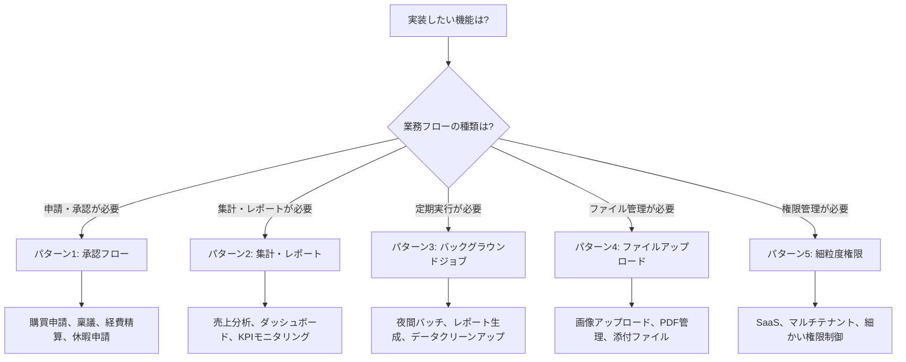

# 業務アプリ頻出パターン実装ガイド

## 📋 概要

このディレクトリには、実務の業務アプリケーションで頻繁に必要となる高度なパターンの実装ガイドが含まれています。

すべてのパターンは**Vertical Slice Architecture (VSA)** 原則に厳格に従って設計されており、
既存のVSASampleプロジェクトに直接適用可能なコード例とベストプラクティスを提供します。

---

## 📚 ドキュメント一覧

### 🔐 [TWO_FACTOR_AUTHENTICATION.md](./TWO_FACTOR_AUTHENTICATION.md)

**パターン名:** 二要素認証（2FA）

**対象読者:** 開発者全員、セキュリティエンジニア

**内容:**
- TOTP（Time-based One-Time Password）実装
- QRコード表示とリカバリーコード管理
- ログイン時の2FA検証フロー
- REST API統合
- セキュリティベストプラクティス

**主要技術:**
- ASP.NET Core Identity
- TOTP（RFC 6238準拠）
- QRCoder（QRコード生成）
- BCrypt（リカバリーコードハッシュ化）

**実装状態:** ✅ 実装済み

**読むべきタイミング:** セキュリティ要件の実装時、認証機能の拡張時

---

### 🗺️ [BUSINESS_PATTERNS_ROADMAP.md](./BUSINESS_PATTERNS_ROADMAP.md)

**対象読者:** プロジェクトマネージャー、アーキテクト、開発リード

**内容:**
- 5つの頻出パターンの概要
- 実装スケジュール（13週間）
- フェーズ別の完了基準
- 各パターンのBC構造とフォルダ構成
- VSA原則の厳格な適用方法

**読むべきタイミング:** プロジェクト開始前、実装計画時

---

### 1️⃣ [01_APPROVAL_WORKFLOW_PATTERN.md](./01_APPROVAL_WORKFLOW_PATTERN.md)

**パターン名:** 承認フロー・ワークフロー系

**解決する課題:**
- 多段階承認（1次承認→2次承認→最終承認）
- 状態遷移の明示的な定義
- 申請・承認・却下・キャンセルのビジネスロジック保護

**採用技術:**
- State Machine Pattern（状態遷移のカプセル化）
- Saga Pattern（複数段階の処理）
- Domain Event（承認完了時の通知）
- Outbox Pattern（メール通知の確実な配信）

**実装例:** 購買申請（PurchaseRequest）の承認フロー

**新規BC:** `PurchaseManagement`

**主要クラス:**
- `PurchaseRequest`（集約ルート）
- `PurchaseRequestStateMachine`（状態遷移ロジック）
- `ApprovalFlow`（承認フロー定義）
- `ApprovalStep`（承認ステップ）

**適用シナリオ:**
- 購買申請・稟議
- 経費精算
- 休暇申請
- 契約承認
- 見積承認

---

### 2️⃣ [02_AGGREGATION_REPORTING_PATTERN.md](./02_AGGREGATION_REPORTING_PATTERN.md)

**パターン名:** 集計・レポート系クエリ

**解決する課題:**
- 複雑な集計・結合クエリの最適化
- 動的な検索条件の安全な構築
- ページング・ソートの実装
- SQL Injection対策

**採用技術:**
- Dapper + Raw SQL（最適化された集計）
- Dynamic Query Builder（動的クエリ構築）
- Specification Pattern（再利用可能な条件）
- PostgreSQL Materialized View（事前集計）

**実装例:**
- 商品売上レポート
- 在庫回転率分析
- 売れ筋ランキング
- 在庫僅少商品一覧

**既存BCに追加:** `ProductCatalog`

**主要クラス:**
- `IQueryBuilder`, `PostgreSqlQueryBuilder`（動的クエリビルダー）
- `Specification<T>`（仕様パターン基底クラス）
- `ProductNameContainsSpecification`, `ProductPriceRangeSpecification`（具体的な仕様）

**適用シナリオ:**
- ダッシュボード表示
- KPIモニタリング
- 売上分析
- 顧客行動分析

---

### 3️⃣ バックグラウンドジョブ処理（パターン詳細ドキュメント未作成）

**解決する課題:**
- 夜間バッチ処理
- 定期レポート生成
- 大量データ処理
- スケジュール実行

**採用技術:**
- Hangfire（ジョブスケジューリング）
- PostgreSQL永続化
- リトライ・エラーハンドリング

**実装例:**
- 夜間商品レポート生成
- 非アクティブ商品アーカイブ
- 期限切れ画像クリーンアップ

**既存BCに追加:** `ProductCatalog`

**共通インフラ:** `Shared/Infrastructure/BackgroundJobs/`

**主要インターフェース:**
- `IBackgroundJobService`（抽象化）
- `HangfireJobService`（Hangfire実装）

**実装詳細:** [BUSINESS_PATTERNS_ROADMAP.md](./BUSINESS_PATTERNS_ROADMAP.md#-パターン3-非同期処理バッチ) を参照

---

### 4️⃣ ファイルアップロード・添付管理（パターン詳細ドキュメント未作成）

**解決する課題:**
- 画像・PDF等のファイルアップロード
- ストレージ先の抽象化（ローカル/Azure Blob/AWS S3）
- 画像リサイズ・サムネイル生成
- 署名付きURL生成

**採用技術:**
- IFileStorageService（ストレージ抽象化）
- ImageSharp（画像処理）
- Azure Blob Storage / AWS S3
- 署名付きURL（一時アクセス許可）

**実装例:**
- 商品画像アップロード
- 商品ドキュメント（PDF）アップロード
- 添付ファイルダウンロード

**既存BCに追加:** `ProductCatalog`

**共通インフラ:** `Shared/Infrastructure/Storage/`

**主要インターフェース:**
- `IFileStorageService`（ストレージ抽象化）
- `IImageProcessor`（画像処理抽象化）
- `LocalFileStorageService`, `AzureBlobStorageService`, `AwsS3StorageService`（実装）

**Product集約拡張:**
- `ProductImage`エンティティ追加
- `AddImage()`, `RemoveImage()`メソッド

**実装詳細:** [BUSINESS_PATTERNS_ROADMAP.md](./BUSINESS_PATTERNS_ROADMAP.md#-パターン4-ファイルアップロード添付管理) を参照

---

### 5️⃣ 細粒度権限・マルチテナント（パターン詳細ドキュメント未作成）

**解決する課題:**
- ロールベースからPermissionベースへ
- 細かい権限制御（例: `products:delete`）
- マルチテナントデータ分離
- テナントごとの設定管理

**採用技術:**
- Permission-based Authorization
- EF Core Global Query Filter（自動テナント分離）
- Claims-based Authentication
- ITenantContext（現在のテナント取得）

**実装例:**
- ユーザー権限割り当て
- テナント作成・管理
- テナント分離されたデータアクセス

**新規BC:** `IdentityManagement`

**共通インフラ:** `Shared/Infrastructure/Authentication/`, `Shared/Infrastructure/Authorization/`

**主要クラス:**
- `Permission`（権限エンティティ）
- `PermissionConstants`（権限定数）
- `Tenant`（テナントエンティティ）
- `ITenantContext`, `CurrentTenantService`（現在のテナント取得）
- `ITenantEntity`インターフェース（テナント分離対象エンティティ）

**AuthorizationBehavior拡張:**
```csharp
[Authorize(Permissions = "products:delete")]
public class DeleteProductCommand : ICommand { }
```

**EF Core Global Query Filter:**
```csharp
// 自動的に現在のテナントのデータのみ取得
modelBuilder.Entity<Product>()
    .HasQueryFilter(e => e.TenantId == _tenantContext.TenantId);
```

**実装詳細:** [BUSINESS_PATTERNS_ROADMAP.md](./BUSINESS_PATTERNS_ROADMAP.md#-パターン5-細粒度権限マルチテナント) を参照

---

## 🎯 パターン選択ガイド

### あなたのプロジェクトに必要なパターンは？



### 複数パターンの組み合わせ例

#### 例1: 購買申請システム

**必要なパターン:**
1. **承認フロー**（申請→承認→発注）
2. **ファイルアップロード**（見積書PDF添付）
3. **細粒度権限**（承認者のみ承認可能）
4. **集計・レポート**（購買実績レポート）

#### 例2: ECサイト管理画面

**必要なパターン:**
1. **集計・レポート**（売上分析、売れ筋ランキング）
2. **ファイルアップロード**（商品画像管理）
3. **バックグラウンドジョブ**（夜間在庫集計）

#### 例3: SaaS型プロジェクト管理ツール

**必要なパターン:**
1. **細粒度権限・マルチテナント**（テナント分離、ロール管理）
2. **ファイルアップロード**（プロジェクトドキュメント管理）
3. **集計・レポート**（プロジェクト進捗ダッシュボード）

---

## 📅 実装順序の推奨

### オプション1: 段階的実装（推奨）

**フェーズ1（4週間）:** パターン1 + パターン2
- 承認フロー + 集計・レポート
- 基本的な業務フローを構築

**フェーズ2（4週間）:** パターン3 + パターン4
- バックグラウンドジョブ + ファイルアップロード
- 周辺機能を追加

**フェーズ3（5週間）:** パターン5
- 細粒度権限・マルチテナント
- セキュリティ要件の実装

### オプション2: 並行実装（高速）

**前提条件:** 3人以上の開発チーム

**チームA（3週間）:** パターン1（承認フロー）
**チームB（2週間）:** パターン2（集計・レポート）
**チームC（2週間）:** パターン3 + パターン4（バックグラウンドジョブ + ファイルアップロード）

**統合フェーズ（3週間）:** パターン5（細粒度権限・マルチテナント）

---

## ✅ 実装前チェックリスト

すべてのパターン実装前に以下を確認してください：

### VSA原則の確認

- [ ] `src/`直下に`*.Application`, `*.Domain`等のレイヤー名プロジェクトが**存在しない**
- [ ] BCフォルダ（例: `ProductCatalog/`, `PurchaseManagement/`）が存在する
- [ ] `Features/`フォルダがBCの直下にある
- [ ] 新機能は`Features/{FeatureName}/`配下に作成する
- [ ] 機能スライス間の直接依存が**ない**

### 共通コードの配置

- [ ] BC内共通コードは`{BC}/Shared/`に配置
- [ ] グローバル共通コードは`Shared/`に配置
- [ ] 各機能は独立したスライス内で完結している

### テスト要件

- [ ] Unit Testのカバレッジ80%以上
- [ ] Integration Test実装（主要シナリオ）
- [ ] ビルドエラー・警告なし

---

## 🎓 学習パス

### 初めて業務パターンを実装する方

**ステップ1:** [BUSINESS_PATTERNS_ROADMAP.md](./BUSINESS_PATTERNS_ROADMAP.md) を読む
- 各パターンの概要を理解

**ステップ2:** [01_APPROVAL_WORKFLOW_PATTERN.md](./01_APPROVAL_WORKFLOW_PATTERN.md) を読む
- State Machine Patternの実装例を学ぶ
- Domain層の設計パターンを理解

**ステップ3:** [02_AGGREGATION_REPORTING_PATTERN.md](./02_AGGREGATION_REPORTING_PATTERN.md) を読む
- Dapper + Raw SQLの最適化手法を学ぶ
- Specification Patternを理解

**ステップ4:** 実際に1つのパターンを実装してみる
- 小さなスライスから始める
- テストを書きながら進める

### 既存プロジェクトに適用する方

**ステップ1:** 既存アーキテクチャの確認
- 現在のプロジェクトがVSAに準拠しているか確認
- 必要に応じて[VSA厳格ルール](../architecture/VSA-STRICT-RULES.md)に従ってリファクタリング

**ステップ2:** 必要なパターンを特定
- プロジェクト要件から必要なパターンを選択
- 実装順序を計画

**ステップ3:** 共通インフラから実装
- `IBackgroundJobService`, `IFileStorageService`等の抽象化を先に実装
- 各パターンの機能スライスを実装

---

## 📖 関連ドキュメント

### アーキテクチャ基礎

- [VSA厳格ルール](../architecture/VSA-STRICT-RULES.md) - VSA構造の原則
- [パターンカタログ一覧](../blazor-guide-package/docs/05_パターンカタログ一覧.md) - 既存パターン（CRUD、検索、CSV等）
- [アーキテクチャ概要](../blazor-guide-package/docs/03_アーキテクチャ概要.md) - 設計原則

### 層別設計ガイド

- [Domain層の詳細設計](../blazor-guide-package/docs/11_Domain層の詳細設計.md) - ドメインモデル設計
- [Application層の詳細設計](../blazor-guide-package/docs/10_Application層の詳細設計.md) - Command/Query実装
- [UI層の詳細設計](../blazor-guide-package/docs/09_UI層の詳細設計.md) - Store/PageActions/Component

### 実装ガイド

- [具体例: 商品管理機能](../blazor-guide-package/docs/08_具体例_商品管理機能.md) - 実装テンプレート
- [AIへの実装ガイド](../blazor-guide-package/docs/19_AIへの実装ガイド.md) - AI駆動開発のベストプラクティス

---

## 🤝 コントリビューション

新しいパターンを追加したい場合：

1. [BUSINESS_PATTERNS_ROADMAP.md](./BUSINESS_PATTERNS_ROADMAP.md)のフォーマットに従う
2. VSA原則を厳格に遵守する
3. 実装例とテストコードを含める
4. 適用シナリオを明確にする

---

## 📝 変更履歴

| 日付 | 変更内容 |
|-----|---------|
| 2025-11-17 | 二要素認証（2FA）実装ガイドを追加 |
| 2025-11-07 | 初版作成（ロードマップ + パターン1・2） |

---

**作成日:** 2025-11-07
**最終更新:** 2025-11-07
**ステータス:** ✅ 進行中（パターン3-5の詳細ドキュメント作成待ち）
